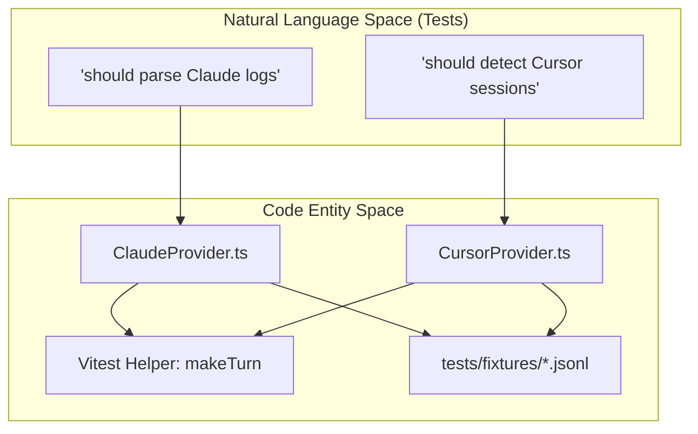
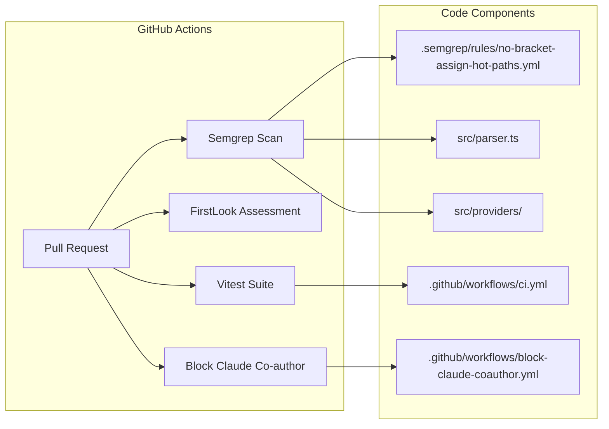

# Testing and Security

Relevant source files

The following files were used as context for generating this wiki page:

- [.github/workflows/block-claude-coauthor.yml](.github/workflows/block-claude-coauthor.yml)
- [.github/workflows/ci.yml](.github/workflows/ci.yml)
- [.github/workflows/firstlook.yml](.github/workflows/firstlook.yml)
- [.semgrep/rules/no-bracket-assign-hot-paths.yml](.semgrep/rules/no-bracket-assign-hot-paths.yml)

The CodeBurn project implements a multi-layered approach to quality assurance and system hardening. Given that the tool processes sensitive local LLM logs and interacts with the macOS file system, the infrastructure focuses on isolated integration testing and defense-in-depth against common injection and pollution vulnerabilities.

## Test Infrastructure

CodeBurn uses **Vitest** as its primary test runner, configured to handle TypeScript natively. The testing strategy emphasizes integration tests that simulate real-world provider data environments using isolated file system mocks.

### Organization and Patterns
Tests are organized by their functional domain, primarily mirroring the `src/` directory structure:
*   **Provider Tests**: Located in `tests/providers/`, these verify the parsing logic for various AI tools (Claude, Cursor, etc.) against static fixtures.
*   **Security Tests**: Located in `tests/security/`, these specifically target edge cases like path traversal or malformed log entries.
*   **Fixtures**: The `tests/fixtures/` directory contains sample `JSONL` and `SQLite` files that represent raw agent logs.

### Key Test Helpers
To maintain consistency across the suite, several helper functions are used to instantiate complex data structures:
*   `makeTurn`: Generates a mock `ParsedTurn` object for testing aggregation logic.
*   `makeProject`: Creates a mock project container to test multi-session grouping.

For details on implementing new tests or using the fake-home directory pattern, see [Test Infrastructure and Patterns](#7.1).

### Test/Code Relationship
The following diagram illustrates how the test suite interacts with the core parsing engine:

**Parsing Engine Test Flow**

Sources: [.github/workflows/ci.yml:1-28](), [tests/providers/]() (implied structure).

## Security Hardening

Security in CodeBurn is focused on protecting the user's local environment while processing untrusted or malformed log data from third-party AI agents.

### Prototype Pollution Prevention
The codebase strictly enforces the use of `Object.create(null)` for map-like objects that store data derived from external logs. This prevents attackers (or malformed logs) from overwriting built-in JavaScript object properties (e.g., `__proto__`). This is enforced via a custom Semgrep rule `no-bracket-assign-on-literal-object-map`.

### Bounded Resource Usage
To prevent Denial of Service (DoS) when reading large log files, CodeBurn implements a `MAX_SESSION_FILE_BYTES` limit (set to 128 MB). This ensures the parser does not hang or crash the system when encountering bloated session files.

### Injection Guards
*   **CSV Injection**: The `escCsv` function sanitizes output to prevent formula injection when exporting data to spreadsheet software.
*   **CLI Subprocesses**: Subprocess calls (especially in the GNOME extension and macOS app) utilize a `SafeArgPattern` to ensure shell arguments are correctly escaped and not subject to command injection.

For details on these implementations and the Semgrep rules enforcing them, see [Security Hardening](#7.2).

Sources: [.semgrep/rules/no-bracket-assign-hot-paths.yml:1-23](), [.github/workflows/ci.yml:17-27]().

## CI Pipeline

The project utilizes GitHub Actions to automate quality checks and security audits for every pull request.

### Automated Checks
*   **Semgrep**: A dedicated job runs the `no-bracket-assign-guard` using the configuration in `.semgrep/rules/no-bracket-assign-hot-paths.yml` to detect potential prototype pollution vulnerabilities in hot paths like `src/providers/` and `src/parser.ts`.
*   **FirstLook**: Uses `getagentseal/firstlook` to provide automated PR assessments, scanning for unknown risks.
*   **Co-author Blocking**: The `block-claude-coauthor.yml` workflow enforces contributor guidelines by rejecting PRs containing AI co-author trailers (e.g., `Co-authored-by: ... claude ...`). This maintains project licensing and attribution integrity.

**CI Pipeline Architecture**

Sources: [.github/workflows/ci.yml:1-28](), [.github/workflows/firstlook.yml:1-24](), [.github/workflows/block-claude-coauthor.yml:1-44](), [.semgrep/rules/no-bracket-assign-hot-paths.yml:1-23]().
