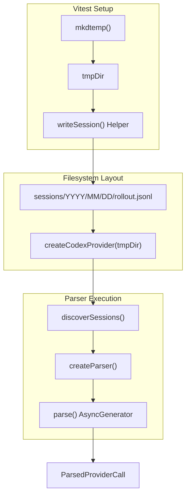
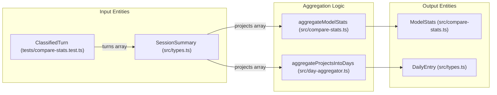

# Test Infrastructure and Patterns

<details>
<summary>Relevant source files</summary>

The following files were used as context for generating this wiki page:

- [src/codex-cache.ts](src/codex-cache.ts)
- [src/compare-stats.ts](src/compare-stats.ts)
- [src/cursor-cache.ts](src/cursor-cache.ts)
- [src/fs-utils.ts](src/fs-utils.ts)
- [src/providers/codex.ts](src/providers/codex.ts)
- [src/providers/cursor.ts](src/providers/cursor.ts)
- [tests/classifier.test.ts](tests/classifier.test.ts)
- [tests/compare-stats.test.ts](tests/compare-stats.test.ts)
- [tests/dashboard.test.ts](tests/dashboard.test.ts)
- [tests/day-aggregator.test.ts](tests/day-aggregator.test.ts)
- [tests/fs-utils.test.ts](tests/fs-utils.test.ts)
- [tests/models.test.ts](tests/models.test.ts)
- [tests/providers/codex.test.ts](tests/providers/codex.test.ts)
- [tests/providers/cursor.test.ts](tests/providers/cursor.test.ts)

</details>


CodeBurn utilizes **Vitest** as its primary testing framework, focusing on high-fidelity simulation of provider log environments and metric aggregation logic. The test suite is designed to ensure accuracy in cost calculation, session parsing, and optimization heuristics across diverse AI provider formats.

## Test Organization and File Structure

The test suite is organized to mirror the source directory structure, with specialized directories for provider parsing and security.

| Directory | Purpose |
| :--- | :--- |
| `tests/` | General logic tests for aggregators, cost models, and utilities (e.g., `day-aggregator.test.ts`, `models.test.ts`). |
| `tests/providers/` | Provider-specific parsing tests (Claude, Codex, Cursor, etc.). |
| `tests/security/` | Hardening tests for prototype pollution and CSV injection. |
| `tests/fixtures/` | Reusable session log snippets and mock filesystem structures. |

**Sources:**
- [tests/compare-stats.test.ts:4-6]()
- [tests/providers/codex.test.ts:1-7]()
- [tests/fs-utils.test.ts:6-11]()

## Testing Patterns

### 1. Fixture-Based Helper Patterns
To avoid verbose manual object creation, CodeBurn uses factory functions like `makeTurn` and `makeProject`. These helpers generate `ClassifiedTurn` and `ProjectSummary` objects with sensible defaults, allowing tests to focus on specific metrics like `editCost` or `oneShotTurns`.

```typescript
// Example usage in tests/compare-stats.test.ts
const project = makeProject([
  makeTurn('opus-4-6', 0.10, { hasEdits: true, retries: 0 }),
  makeTurn('opus-4-7', 0.20, { hasEdits: false }),
])
```

**Key Helpers:**
- `makeTurn`: Constructs a `ClassifiedTurn` with mock `assistantCalls`, usage tokens, and cost [tests/compare-stats.test.ts:8-39]().
- `makeProject`: Wraps turns into a `SessionSummary` and then into a `ProjectSummary` [tests/compare-stats.test.ts:41-67]().
- `makeSession`: Creates a `SessionSummary` with an empty category breakdown [tests/dashboard.test.ts:22-41]().
- `makeCall`: Generates a mock `ParsedApiCall` (or `assistantCall`) for aggregator testing [tests/day-aggregator.test.ts:16-39]().

**Sources:**
- [tests/compare-stats.test.ts:8-67]()
- [tests/dashboard.test.ts:22-51]()
- [tests/day-aggregator.test.ts:16-39]()

### 2. Provider Mocking and Discovery
Provider tests (e.g., `codex.test.ts`) simulate the complex directory structures used by AI tools. They use `mkdtemp` to create isolated environments where they write mock `.jsonl` or `.sqlite` files to verify discovery logic and parsing robustness.

**Data Flow: Provider Session Discovery**
Title: Provider Discovery and Parsing Simulation


**Sources:**
- [tests/providers/codex.test.ts:11-17]()
- [tests/providers/codex.test.ts:84-91]()
- [src/providers/codex.ts:129-178]()

### 3. File System Utility Testing
CodeBurn includes rigorous tests for `fs-utils.ts` to ensure memory safety when handling large session files. Tests verify that files exceeding `MAX_SESSION_FILE_BYTES` (128 MB) are skipped to prevent V8 string limit crashes, and that files above `STREAM_THRESHOLD_BYTES` (8 MB) are processed via the `readViaStream` path [src/fs-utils.ts:8-9]().

**Sources:**
- [tests/fs-utils.test.ts:32-47]()
- [src/fs-utils.ts:34-55]()

## Key Test Helpers and Utilities

### Metric Aggregation Testing
The system validates complex derived metrics such as the "One-shot rate" and "Self-correction" percentage. The `computeComparison` tests verify that the `pickWinner` logic correctly handles `higherIsBetter` flags for different metric types (e.g., higher is better for cache hits, lower is better for cost) [src/compare-stats.ts:103-171]().

**Sources:**
- [tests/compare-stats.test.ts:176-183]()
- [src/compare-stats.ts:166-171]()

### Aggregator Data Flow
This diagram bridges the Natural Language concepts (Turns, Projects) to the Code Entities used in the test suite.

Title: Metric Aggregation Data Flow


**Sources:**
- [src/compare-stats.ts:26-74]()
- [src/day-aggregator.ts:41-85]()
- [tests/compare-stats.test.ts:41-67]()

### Cache Layer Integrity
Tests for `cursor-cache.ts` and `codex-cache.ts` ensure that session parsing results are correctly persisted and invalidated based on file fingerprints (mtime and size) [src/cursor-cache.ts:26-33](). This prevents re-parsing multi-hundred-megabyte log files on every CLI invocation.

**Sources:**
- [tests/providers/cursor.test.ts:71-77]()
- [src/cursor-cache.ts:35-50]()
- [src/codex-cache.ts:59-69]()

## Regression Testing for Large Payloads
Specific tests exist to handle modern AI tool behavior, such as Codex CLI 0.128+ which embeds full system prompts in the first line of a session file, causing lines to exceed 20 KB. Tests verify that `readFirstLine` uses a bounded stream reader with `FIRST_LINE_READ_CAP` (1 MB) to handle these cases without loading the entire file [src/providers/codex.ts:80-82]().

**Sources:**
- [tests/providers/codex.test.ts:126-153]()
- [src/providers/codex.ts:82-118]()
