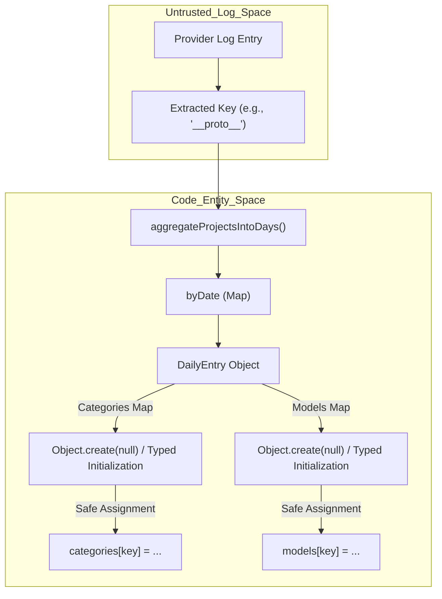
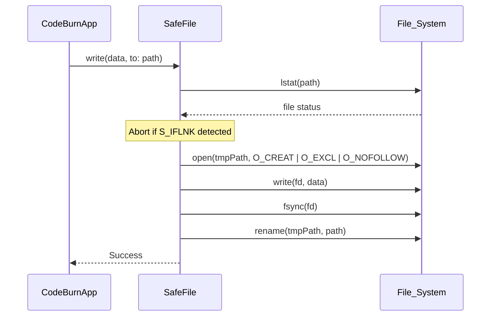

# Security Hardening

Relevant source files

The following files were used as context for generating this wiki page:

- [.github/workflows/ci.yml](.github/workflows/ci.yml)
- [.semgrep/rules/no-bracket-assign-hot-paths.yml](.semgrep/rules/no-bracket-assign-hot-paths.yml)
- [mac/Sources/CodeBurnMenubar/Security/CodeburnCLI.swift](mac/Sources/CodeBurnMenubar/Security/CodeburnCLI.swift)
- [mac/Sources/CodeBurnMenubar/Security/SafeFile.swift](mac/Sources/CodeBurnMenubar/Security/SafeFile.swift)
- [src/currency.ts](src/currency.ts)
- [src/day-aggregator.ts](src/day-aggregator.ts)
- [src/export.ts](src/export.ts)
- [src/format.ts](src/format.ts)
- [tests/export.test.ts](tests/export.test.ts)
- [tests/fixtures/security/proto-bash.jsonl](tests/fixtures/security/proto-bash.jsonl)
- [tests/fixtures/security/proto-model.jsonl](tests/fixtures/security/proto-model.jsonl)
- [tests/fixtures/security/proto-tool.jsonl](tests/fixtures/security/proto-tool.jsonl)
- [tests/security/prototype-pollution.test.ts](tests/security/prototype-pollution.test.ts)

This page documents the security measures implemented in CodeBurn to protect against common vulnerabilities when processing untrusted provider logs, exporting data, and performing file I/O. The system employs a defense-in-depth strategy combining static analysis guards, runtime input sanitization, and bounded resource consumption.

## Prototype Pollution Prevention

CodeBurn processes session logs from various AI providers where keys (such as model names, tool names, or bash commands) are used as indices in aggregation maps. If these maps are initialized as standard objects (`{}`), a malicious log entry could overwrite properties on `Object.prototype` (e.g., using `__proto__` as a key).

### Implementation Details
To mitigate this, all breakdown maps in the aggregation and parsing logic are initialized using `Object.create(null)` or managed via `Map` objects. This ensures the resulting object has no prototype and is immune to pollution via bracket assignment.

*   **Aggregation Maps**: The `aggregateProjectsIntoDays` function uses a `Map` for date-based grouping [src/day-aggregator.ts:29-32](). Internal breakdowns for categories, models, and providers are initialized safely [src/day-aggregator.ts:5-21]().
*   **Static Analysis Guard**: A custom Semgrep rule `no-bracket-assign-on-literal-object-map` is enforced in the CI pipeline to prevent the use of bracket assignment on literal objects in hot paths [/.semgrep/rules/no-bracket-assign-hot-paths.yml:2-18]().
*   **CI Enforcement**: The `semgrep` job runs on every push and pull request, scanning `src/providers/` and `src/parser.ts` to ensure no new vulnerabilities are introduced [.github/workflows/ci.yml:9-28]().

### Data Flow: Aggregation Security
The following diagram illustrates how the aggregation engine handles potentially malicious keys from provider logs.

**Aggregation Security Flow**

**Sources:** [src/day-aggregator.ts:28-94](), [tests/security/prototype-pollution.test.ts:29-77](), [/.semgrep/rules/no-bracket-assign-hot-paths.yml:1-23]()

## Bounded File Reads and FX Validation

To prevent Denial of Service (DoS) attacks via extremely large log files or corrupted cache files, CodeBurn implements strict size limits and tiered reading strategies.

*   **MAX_SESSION_FILE_BYTES**: A hard cap of 128 MB is placed on any single session file. Files exceeding this limit are skipped with a warning.
*   **FX Rate Bounds**: The currency engine implements defensive bounds on any fetched or cached exchange rate. Rates outside the range of `0.0001` to `1,000,000` are rejected to prevent malicious or malformed data from breaking downstream cost calculations [src/currency.ts:17-25]().
*   **Cache Validation**: When loading cached exchange rates, the system validates the `code`, `timestamp`, and `rate` types to ensure a tampered cache file cannot inject `Infinity` or non-numeric values [src/currency.ts:74-88]().

**Sources:** [src/currency.ts:13-25](), [src/currency.ts:74-88]()

## CSV Injection Protection

When exporting data to CSV format, CodeBurn sanitizes cell values to prevent "CSV Injection" (also known as Formula Injection). This attack occurs when a spreadsheet application (like Excel or Google Sheets) interprets a cell starting with `=`, `+`, `-`, or `@` as a formula.

### Sanitization Logic
The `escCsv` function checks the start of every string. If it matches the dangerous pattern `/^[\t\r=+\-@]/`, a single quote `'` is prepended to the value, forcing the spreadsheet to treat it as literal text [src/export.ts:8-14]().

| Original Value | Sanitized Value | Reason |
| :--- | :--- | :--- |
| `=SUM(1,2)` | `'=SUM(1,2)` | Prevents formula execution |
| `+danger-model` | `'+danger-model` | Prevents formula execution |
| `@malicious` | `'@malicious` | Prevents DDE/External link execution |
| `\tcmd` | `'\tcmd` | Prevents tab-based bypasses |

**Sources:** [src/export.ts:8-26](), [tests/export.test.ts:115-154]()

## CLI Subprocess Hardening

The macOS Menubar application and GNOME extension invoke the `codeburn` CLI as a subprocess. To prevent shell injection, these components avoid shell-mediated execution.

### SafeArgPattern (macOS)
The Swift `CodeburnCLI` utility validates the `CODEBURN_BIN` environment variable against a strict whitelist of characters (`A-Za-z0-9 ._/-`) [mac/Sources/CodeBurnMenubar/Security/CodeburnCLI.swift:11-12](). Any string containing shell metacharacters (`;`, `&`, `|`, `$`, quotes) is rejected [mac/Sources/CodeBurnMenubar/Security/CodeburnCLI.swift:25-29]().

### Implementation Features
*   **Direct Invocation**: Subprocesses are spawned using `/usr/bin/env` with arguments passed as a distinct array, bypassing `/bin/sh` or `/bin/zsh` [mac/Sources/CodeBurnMenubar/Security/CodeburnCLI.swift:35-43]().
*   **Argument Guarding**: The `--` delimiter is used to treat all subsequent tokens as arguments rather than environment assignments [mac/Sources/CodeBurnMenubar/Security/CodeburnCLI.swift:43-43]().

**Sources:** [mac/Sources/CodeBurnMenubar/Security/CodeburnCLI.swift:7-64]()

## macOS App Security: SafeFile

The Swift-based macOS menubar application uses a specialized `SafeFile` utility for all persistence operations involving configuration, currency rates, and subscription snapshots.

### Implementation Features
*   **Symlink Protection**: `SafeFile` uses `lstat` to verify that a path is not a symlink before opening it, and utilizes the `O_NOFOLLOW` flag during `open()` calls.
*   **Atomic Writes**: Data is written to a temporary file and then moved into place using `rename()`, ensuring file integrity even if the process crashes or loses power.
*   **Advisory Locking**: Coordinate access between the CLI and the Menubar app using `flock(LOCK_EX)` to prevent race conditions on shared configuration files.
*   **Read Bounds**: Reads are capped at a `defaultReadLimit` (8 MB) to prevent memory exhaustion from tampered cache files.

### Swift File I/O Safety

**Sources:** [mac/Sources/CodeBurnMenubar/Security/SafeFile.swift:1-128](), [mac/Sources/CodeBurnMenubar/Security/CodeburnCLI.swift:1-64]()
