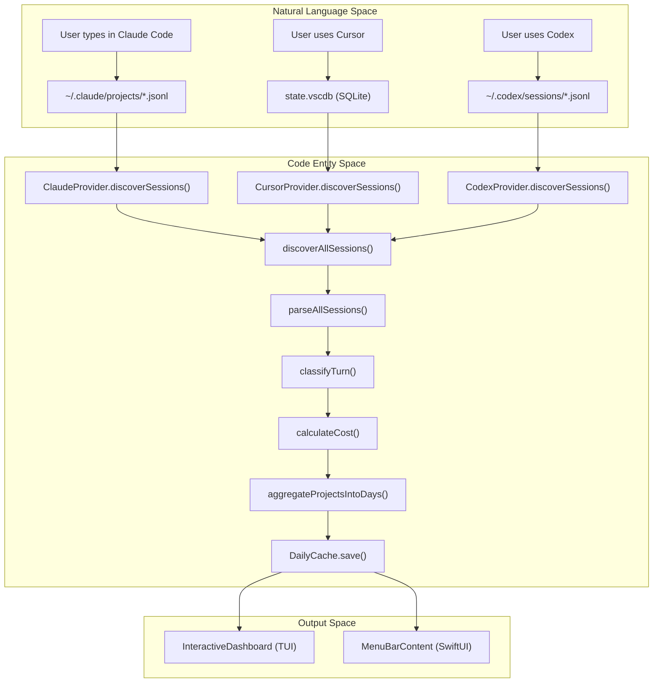
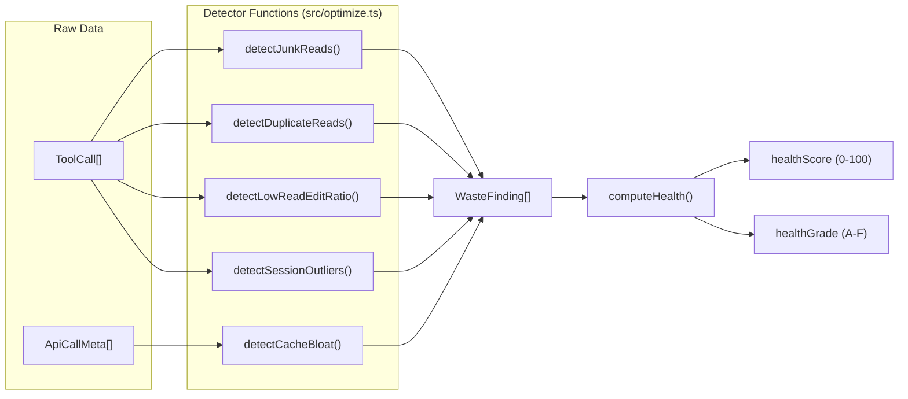

# Glossary

Relevant source files

The following files were used as context for generating this wiki page:

- [CHANGELOG.md](CHANGELOG.md)
- [README.md](README.md)
- [assets/menubar-0.8.0.png](assets/menubar-0.8.0.png)
- [package.json](package.json)
- [src/classifier.ts](src/classifier.ts)
- [src/codex-cache.ts](src/codex-cache.ts)
- [src/config.ts](src/config.ts)
- [src/context-budget.ts](src/context-budget.ts)
- [src/cursor-cache.ts](src/cursor-cache.ts)
- [src/models.ts](src/models.ts)
- [src/optimize.ts](src/optimize.ts)
- [src/parser.ts](src/parser.ts)
- [src/plan-usage.ts](src/plan-usage.ts)
- [src/plans.ts](src/plans.ts)
- [src/providers/codex.ts](src/providers/codex.ts)
- [src/providers/cursor.ts](src/providers/cursor.ts)
- [src/types.ts](src/types.ts)
- [tests/cli-plan.test.ts](tests/cli-plan.test.ts)
- [tests/optimize-fs.test.ts](tests/optimize-fs.test.ts)
- [tests/optimize.test.ts](tests/optimize.test.ts)
- [tests/plan-usage.test.ts](tests/plan-usage.test.ts)
- [tests/plans.test.ts](tests/plans.test.ts)
- [tests/providers/codex.test.ts](tests/providers/codex.test.ts)
- [tests/providers/cursor.test.ts](tests/providers/cursor.test.ts)

This glossary defines the technical domain language, codebase-specific terms, and architectural concepts used within the CodeBurn project. It serves as a reference for onboarding engineers to map natural language concepts to specific implementation details in the TypeScript and Swift layers.

## Core Domain Concepts

### Provider
A **Provider** is a plugin-based abstraction representing an AI coding tool or service that stores session data locally on disk.
*   **Implementation**: Each provider implements the `Provider` interface defined in [src/providers/types.ts:10-14]().
*   **Responsibilities**: Includes discovering session files (`discoverSessions`), parsing raw logs into a unified format (`createSessionParser`), and providing display names for models and tools.
*   **Key Files**: [src/providers/index.ts](), [src/providers/claude.ts](), [src/providers/cursor.ts](), [src/providers/codex.ts]().

### Session
A **Session** represents a single continuous interaction or "chat" between a user and an AI agent.
*   **Data Flow**: Raw files (JSONL, SQLite) are parsed into `SessionSource` objects [src/providers/types.ts:1-6]().
*   **Aggregation**: Sessions are grouped into `ProjectSummary` objects during the parsing pipeline [src/parser.ts:21-23]().

### Turn
A **Turn** is the smallest unit of interaction within a session, consisting of one user message and the subsequent assistant response (which may include multiple tool calls).
*   **Classification**: Every turn is passed through `classifyTurn` to assign a `TaskCategory` [src/classifier.ts:150-174]().
*   **Retry Logic**: The system detects "retries" within a turn by looking for patterns where an `Edit` tool is followed by a `Bash` command (presumably a test/build) and then another `Edit` [src/classifier.ts:124-144]().

### TaskCategory
A label assigned to a `Turn` to describe the nature of the work.
*   **Logic**: Uses tool-pattern matching (e.g., `Edit` tools imply `coding`) followed by keyword heuristics (e.g., "fix" implies `debugging`) [src/classifier.ts:60-94]().
*   **Labels**: Includes `coding`, `debugging`, `refactoring`, `feature`, `testing`, `exploration`, `planning`, `git`, `build/deploy`, `brainstorming`, `delegation`, `conversation`, and `general` [src/types.ts:1-21]().

---

## Technical Entities and Data Structures

### ParsedApiCall / ParsedProviderCall
The canonical internal representation of a single API interaction. This bridges the gap between raw provider logs and the CodeBurn aggregation engine.

| Property | Description | Code Pointer |
| :--- | :--- | :--- |
| `usage` | Token usage breakdown (input, output, cache) | [src/types.ts:15-15]() |
| `costUSD` | Calculated cost based on `ModelCosts` | [src/types.ts:15-15]() |
| `deduplicationKey` | Unique ID used to prevent double-counting | [src/types.ts:15-15]() |
| `bashCommands` | Array of shell commands extracted from the call | [src/types.ts:15-15]() |

### ModelCosts
A structure containing the pricing tiers for a specific LLM.
*   **Pricing Engine**: Pricing is primarily sourced from a cached version of LiteLLM's `model_prices_and_context_window.json` [src/models.ts:25-26]().
*   **Snapshot**: A built-in snapshot provides fallback data if the network is unavailable [src/models.ts:4-5]().
*   **Aliases**: Model names are normalized via `getCanonicalName` and `resolveAlias` to match pricing entries [src/models.ts:170-180]().

### WasteFinding
An object generated by the `optimize` engine representing a specific pattern of token waste.
*   **Detectors**: Functions like `detectJunkReads` (finding `node_modules` reads) or `detectCacheBloat` generate these findings [src/optimize.ts:133-140]().
*   **Fixes**: Each finding includes a `WasteAction`, which can be a `paste` (CLAUDE.md instructions), a `command` to run, or a `file-content` change [src/optimize.ts:126-130]().

---

## System Architecture Diagrams

### Data Transformation Pipeline
The following diagram bridges the **Natural Language Space** (user actions/provider logs) to the **Code Entity Space** (classes and functions).

**Sources**: [src/parser.ts:5-8](), [src/classifier.ts:150-155](), [src/models.ts:108-115](), [src/providers/codex.ts:129-132](), [src/providers/cursor.ts:62-65]().

### Optimization and Health Scoring
This diagram illustrates how the system evaluates "Waste" and "Health" from raw tool calls.

**Sources**: [src/optimize.ts:142-147](), [tests/optimize.test.ts:4-15]().

---

## Glossary Table of Abbreviations

| Abbreviation | Full Term | Context |
| :--- | :--- | :--- |
| **MCP** | Model Context Protocol | Used to detect unused servers via `detectUnusedMcp` [src/optimize.ts:56-62](). |
| **TUI** | Terminal User Interface | Refers to the React-Ink dashboard rendered in the CLI [package.json:48-50](). |
| **TTL** | Time To Live | Used for pricing data cache (24h) [src/models.ts:26-26](). |
| **FX** | Foreign Exchange | Refers to currency conversion logic using the Frankfurter API [CHANGELOG.md:40-41](). |
| **CWD** | Current Working Directory | Used to resolve project-specific sessions and sanitize project names [src/providers/codex.ts:73-75](). |
| **JSONL** | JSON Lines | The primary storage format for Claude, Codex, and OpenClaw logs [src/parser.ts:29-35](). |

---

## macOS Specific Terms

### AppStore
The centralized state container in the macOS Menubar app. It uses the Swift `@Observable` macro to trigger UI updates when data is fetched from the CLI [CHANGELOG.md:60-61]().

### DataClient
The bridge between the Swift UI and the Node.js CLI. It executes `codeburn report --format json` as a subprocess and parses the output [CHANGELOG.md:56-58]().

### CapacityEstimator
A logic engine that reverse-engineers absolute token limits from the percentage-based usage reported by the Claude API [CHANGELOG.md:90-91]().

**Sources**: [CHANGELOG.md:54-66](), [package.json:1-10]().
