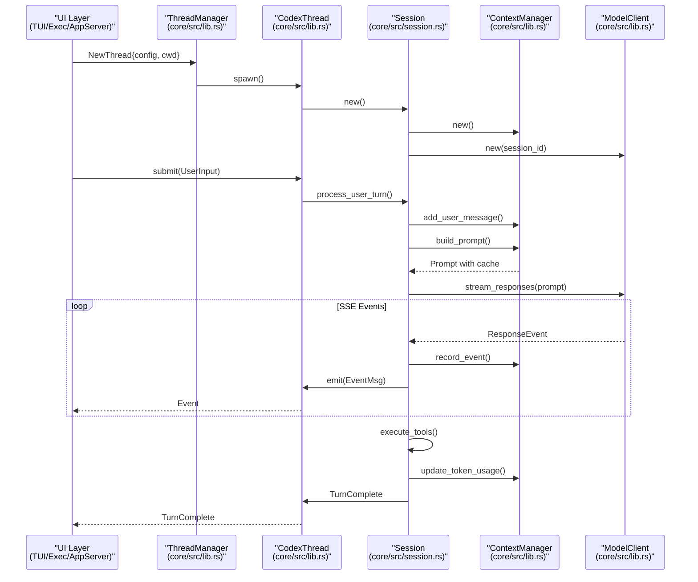

# Overview

<details>
<summary>Relevant source files</summary>

The following files were used as context for generating this wiki page:

- [.gitignore](.gitignore)
- [CHANGELOG.md](CHANGELOG.md)
- [README.md](README.md)
- [cliff.toml](cliff.toml)
- [codex-cli/package.json](codex-cli/package.json)
- [codex-rs/Cargo.lock](codex-rs/Cargo.lock)
- [codex-rs/Cargo.toml](codex-rs/Cargo.toml)
- [codex-rs/README.md](codex-rs/README.md)
- [codex-rs/cli/Cargo.toml](codex-rs/cli/Cargo.toml)
- [codex-rs/cli/src/lib.rs](codex-rs/cli/src/lib.rs)
- [codex-rs/cli/src/main.rs](codex-rs/cli/src/main.rs)
- [codex-rs/core/Cargo.toml](codex-rs/core/Cargo.toml)
- [codex-rs/core/src/lib.rs](codex-rs/core/src/lib.rs)
- [codex-rs/default.nix](codex-rs/default.nix)
- [codex-rs/exec/Cargo.toml](codex-rs/exec/Cargo.toml)
- [codex-rs/exec/src/cli.rs](codex-rs/exec/src/cli.rs)
- [codex-rs/exec/src/event_processor.rs](codex-rs/exec/src/event_processor.rs)
- [codex-rs/exec/src/lib.rs](codex-rs/exec/src/lib.rs)
- [codex-rs/responses-api-proxy/npm/package.json](codex-rs/responses-api-proxy/npm/package.json)
- [codex-rs/tui/Cargo.toml](codex-rs/tui/Cargo.toml)
- [codex-rs/tui/src/cli.rs](codex-rs/tui/src/cli.rs)
- [codex-rs/tui/src/lib.rs](codex-rs/tui/src/lib.rs)
- [flake.lock](flake.lock)
- [flake.nix](flake.nix)
- [package.json](package.json)
- [pnpm-lock.yaml](pnpm-lock.yaml)
- [pnpm-workspace.yaml](pnpm-workspace.yaml)
- [sdk/typescript/jest.config.cjs](sdk/typescript/jest.config.cjs)
- [sdk/typescript/package.json](sdk/typescript/package.json)
- [sdk/typescript/tsconfig.json](sdk/typescript/tsconfig.json)

</details>


Codex CLI is an AI coding agent from OpenAI that runs locally on your computer. It provides an interactive terminal interface, non-interactive automation modes, and IDE integration capabilities for executing coding tasks with AI assistance. The system is implemented in Rust as a Cargo workspace and supports multiple execution modes, configurable sandboxing, tool extensibility via the Model Context Protocol (MCP), and multi-agent workflows.

For detailed information about installation procedures, see [Installation and Setup](#1.1). For configuration options, see [Configuration System](#2.2). For IDE integration details, see [App Server and IDE Integration](#4.5).

## Project Purpose and Architecture

Codex is designed as a zero-dependency native executable that coordinates AI model interactions, executes tools in sandboxed environments, and manages conversation state across multiple sessions. The codebase is organized as a Rust workspace with clear separation between core business logic, user interfaces, and integration points.

### High-Level System Architecture

The diagram below maps high-level system components to their specific implementation crates and modules within the `codex-rs` workspace.

```mermaid
graph TB
    subgraph "Entry Points"
        [codex_bin] --> ["codex binary<br/>(cli/src/main.rs)"]
        [tui_entry] --> ["Interactive TUI<br/>(tui/src/lib.rs)"]
        [exec_entry] --> ["Non-Interactive Exec<br/>(exec/src/lib.rs)"]
        [app_server_entry] --> ["App Server (IDE)<br/>(app-server/src/lib.rs)"]
        [mcp_server_entry] --> ["MCP Server<br/>(mcp-server/src/lib.rs)"]
    end
    
    subgraph "Core Engine (codex-core)"
        [ThreadManager] --> ["ThreadManager<br/>(core/src/lib.rs)"]
        [CodexThread] --> ["CodexThread<br/>(core/src/lib.rs)"]
        [Session] --> ["Session (internal)<br/>(core/src/session.rs)"]
        [ContextManager] --> ["ContextManager<br/>(core/src/lib.rs)"]
        [ModelClient] --> ["ModelClient<br/>(core/src/lib.rs)"]
    end
    
    subgraph "Tool Execution"
        [ToolRouter] --> ["ToolRouter<br/>(core/src/lib.rs)"]
        [UnifiedExec] --> ["UnifiedExecProcessManager<br/>(core/src/lib.rs)"]
        [McpManager] --> ["McpManager<br/>(core/src/lib.rs)"]
        [Sandbox] --> ["Platform Sandboxes<br/>(core/src/sandboxing/)"]
    end
    
    subgraph "Configuration & State"
        [ConfigBuilder] --> ["ConfigBuilder<br/>(core/src/lib.rs)"]
        [RolloutRecorder] --> ["RolloutRecorder<br/>(core/src/lib.rs)"]
        [StateDb] --> ["SQLite StateDb<br/>(core/src/lib.rs)"]
    end
    
    [codex_bin] --> [tui_entry]
    [codex_bin] --> [exec_entry]
    [codex_bin] --> [app_server_entry]
    [codex_bin] --> [mcp_server_entry]
    
    [tui_entry] --> [ThreadManager]
    [exec_entry] --> [ThreadManager]
    [app_server_entry] --> [ThreadManager]
    
    [ThreadManager] --> [CodexThread]
    [CodexThread] --> [Session]
    [Session] --> [ContextManager]
    [Session] --> [ModelClient]
    [Session] --> [ToolRouter]
    [Session] --> [ConfigBuilder]
    
    [ToolRouter] --> [UnifiedExec]
    [ToolRouter] --> [McpManager]
    [ToolRouter] --> [Sandbox]
    
    [CodexThread] --> [RolloutRecorder]
    [ThreadManager] --> [StateDb]
```

**Sources:** [codex-rs/cli/src/main.rs:103-209](), [codex-rs/core/src/lib.rs:1-198](), [README.md:1-10]()

## Execution Modes

Codex supports several primary execution modes, each serving different use cases. All modes converge on the same core `ThreadManager` [codex-rs/core/src/lib.rs:115]() infrastructure but differ in how they present events and handle user interaction.

### Execution Mode Comparison

| Mode | Entry Point | Use Case | Session Persistence | User Interaction |
|------|-------------|----------|---------------------|------------------|
| **TUI** | `codex` (default) | Interactive development | Yes (rollout files) | Full interactive UI [codex-rs/cli/src/main.rs:114]() |
| **Exec** | `codex exec` | Automation/CI | Yes (unless ephemeral) | Non-interactive [codex-rs/cli/src/main.rs:124]() |
| **App Server** | `codex app-server` | IDE integration | Yes | JSON-RPC protocol [codex-rs/cli/src/main.rs:145]() |
| **MCP Server** | `codex mcp-server` | Tool delegation | Yes | MCP protocol (stdio) [codex-rs/cli/src/main.rs:142]() |
| **Cloud** | `codex cloud` | Remote task management | Remote | TUI/CLI for Cloud [codex-rs/cli/src/main.rs:194]() |

### Command Dispatch and Runtime Initialization

The `MultitoolCli` [codex-rs/cli/src/main.rs:103]() struct handles the routing of subcommands to their respective crates and logic.

```mermaid
graph LR
    subgraph "Installation"
        [npm] --> ["npm install -g<br/>@openai/codex"]
        [brew] --> ["brew install<br/>--cask codex"]
        [binary] --> ["GitHub Releases<br/>Platform Binaries"]
    end
    
    subgraph "Commands (cli/src/main.rs)"
        [interactive] --> ["codex<br/>(TUI)"]
        [exec] --> ["codex exec 'task'<br/>(Non-interactive)"]
        [app_server] --> ["codex app-server<br/>(JSON-RPC)"]
        [mcp_server] --> ["codex mcp-server<br/>(MCP stdio)"]
        [review] --> ["codex review<br/>(Code Review)"]
        [cloud] --> ["codex cloud<br/>(Cloud Tasks)"]
    end
    
    subgraph "Core Runtime (core/src/lib.rs)"
        [thread_mgr] --> ["ThreadManager"]
        [config_load] --> ["ConfigBuilder"]
        [auth_mgr] --> ["AuthManager"]
    end
    
    [npm] --> [interactive]
    [brew] --> [interactive]
    [binary] --> [interactive]
    
    [interactive] --> [config_load]
    [exec] --> [config_load]
    [app_server] --> [config_load]
    [mcp_server] --> [config_load]
    [review] --> [config_load]
    [cloud] --> [config_load]
    
    [config_load] --> [auth_mgr]
    [auth_mgr] --> [thread_mgr]
```

**Sources:** [codex-rs/cli/src/main.rs:120-209](), [README.md:14-40](), [codex-rs/core/src/lib.rs:115-118]()

## Core Crate Organization

The Codex workspace is organized into focused crates. The `codex-rs/Cargo.toml` [codex-rs/Cargo.toml:1-121]() file defines the workspace members.

| Crate | Path | Purpose |
|-------|------|---------|
| `codex-core` | `core/` | Core agent logic, session management, model client, tool orchestration [codex-rs/Cargo.toml:36]() |
| `codex-tui` | `tui/` | Interactive terminal UI built with Ratatui [codex-rs/Cargo.toml:83]() |
| `codex-exec` | `exec/` | Non-interactive headless CLI [codex-rs/Cargo.toml:42]() |
| `codex-cli` | `cli/` | Multitool dispatcher, subcommand routing, feature toggles [codex-rs/Cargo.toml:28]() |
| `codex-app-server` | `app-server/` | JSON-RPC server for VS Code and other IDE clients [codex-rs/Cargo.toml:11]() |
| `codex-mcp-server` | `mcp-server/` | MCP server implementation exposing Codex as tools [codex-rs/Cargo.toml:64]() |
| `codex-config` | `config/` | Configuration parsing, validation, layer merging [codex-rs/Cargo.toml:31]() |
| `codex-cloud-tasks` | `cloud-tasks/` | Interface for interacting with Codex Cloud environments [codex-rs/Cargo.toml:25]() |

**Sources:** [codex-rs/Cargo.toml:1-121]()

## Core Architecture Components

The core engine implements a layered architecture where the `ThreadManager` manages thread lifecycles, `CodexThread` coordinates session execution, and internal `Session` modules handle turn-by-turn model interactions.

### Thread and Session Lifecycle

The interaction between frontends and the core is governed by the submission of `UserInput` [codex-rs/cli/src/main.rs:85]() and the streaming of `ResponseEvent` [codex-rs/core/src/lib.rs:184]() objects.



**Sources:** [codex-rs/core/src/lib.rs:16-115](), [codex-rs/core/src/session.rs:16]()

### Key Component Responsibilities

| Component | File | Primary Responsibilities |
|-----------|------|-------------------------|
| `ThreadManager` | `core/src/lib.rs` | Thread spawning/resuming, state database interaction [codex-rs/core/src/lib.rs:115]() |
| `CodexThread` | `core/src/lib.rs` | Submission queue, event emission, task management [codex-rs/core/src/lib.rs:23]() |
| `Session` (internal) | `core/src/session.rs` | Turn orchestration, prompt building, model streaming [codex-rs/core/src/session.rs:16]() |
| `ContextManager` | `core/src/lib.rs` | Message history, token tracking, compaction triggers [codex-rs/core/src/lib.rs:36]() |
| `ModelClient` | `core/src/lib.rs` | HTTP/WebSocket transport, SSE parsing, retry logic [codex-rs/core/src/lib.rs:179]() |
| `RolloutRecorder` | `core/src/lib.rs` | Session persistence, event filtering [codex-rs/core/src/lib.rs:150]() |

**Sources:** [codex-rs/core/src/lib.rs:1-198]()

## Configuration System

Configuration is assembled from multiple layers with CLI arguments taking highest priority. The `ConfigEditsBuilder` [codex-rs/cli/src/main.rs:72]() is used to modify settings programmatically. Codex supports a layered configuration system starting from defaults up to CLI overrides.

```mermaid
graph TB
    subgraph "Configuration Sources (Priority Order)"
        [cli] --> ["CLI Arguments<br/>(codex-utils-cli)"]
        [features] --> ["Feature Toggles<br/>(codex-features)"]
        [profile] --> ["Profile Selection<br/>--profile name"]
        [env] --> ["Environment Variables<br/>(CODEX_*, OPENAI_*)"]
        [project] --> [".codex/config.toml<br/>(Project)"]
        [global] --> ["~/.codex/config.toml<br/>(Global)"]
        [defaults] --> ["Built-in Defaults<br/>(hardcoded)"]
    end
    
    subgraph "Configuration Builder"
        [builder] --> ["ConfigBuilder::build()<br/>(core/src/lib.rs)"]
    end
    
    subgraph "Final Configuration"
        [config] --> ["Config struct<br/>(core/src/lib.rs)"]
        [model_provider] --> ["ModelProviderInfo<br/>(core/src/lib.rs)"]
    end
    
    [cli] --> [builder]
    [features] --> [builder]
    [profile] --> [builder]
    [env] --> [builder]
    [project] --> [builder]
    [global] --> [builder]
    [defaults] --> [builder]
    
    [builder] --> [config]
    [config] --> [model_provider]
```

**Sources:** [codex-rs/cli/src/main.rs:105-108](), [codex-rs/core/src/lib.rs:33](), [codex-rs/core/src/lib.rs:105]()

## Session Persistence and Replay

Sessions are persisted as rollout files containing event streams. The `RolloutRecorder` [codex-rs/core/src/lib.rs:150]() manages this process. Files are stored in directories defined by `SESSIONS_SUBDIR` [codex-rs/core/src/lib.rs:152]() and `ARCHIVED_SESSIONS_SUBDIR` [codex-rs/core/src/lib.rs:147]().

**Sources:** [codex-rs/core/src/lib.rs:147-170]()
