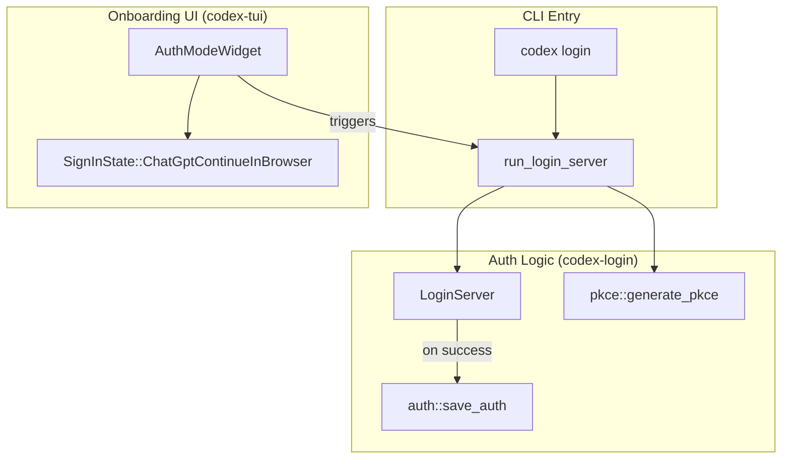

# Installation and Setup

<details>
<summary>Relevant source files</summary>

The following files were used as context for generating this wiki page:

- [.github/actions/linux-code-sign/action.yml](.github/actions/linux-code-sign/action.yml)
- [.github/actions/windows-code-sign/action.yml](.github/actions/windows-code-sign/action.yml)
- [.github/scripts/archive-release-symbols-and-strip-binaries.sh](.github/scripts/archive-release-symbols-and-strip-binaries.sh)
- [.github/workflows/ci.yml](.github/workflows/ci.yml)
- [.github/workflows/rust-ci-full.yml](.github/workflows/rust-ci-full.yml)
- [.github/workflows/rust-ci.yml](.github/workflows/rust-ci.yml)
- [.github/workflows/rust-release-argument-comment-lint.yml](.github/workflows/rust-release-argument-comment-lint.yml)
- [.github/workflows/rust-release-windows.yml](.github/workflows/rust-release-windows.yml)
- [.github/workflows/rust-release.yml](.github/workflows/rust-release.yml)
- [.github/workflows/sdk.yml](.github/workflows/sdk.yml)
- [.gitignore](.gitignore)
- [CHANGELOG.md](CHANGELOG.md)
- [README.md](README.md)
- [cliff.toml](cliff.toml)
- [codex-cli/.gitignore](codex-cli/.gitignore)
- [codex-cli/bin/codex.js](codex-cli/bin/codex.js)
- [codex-cli/package.json](codex-cli/package.json)
- [codex-cli/scripts/README.md](codex-cli/scripts/README.md)
- [codex-cli/scripts/build_npm_package.py](codex-cli/scripts/build_npm_package.py)
- [codex-rs/cli/src/login.rs](codex-rs/cli/src/login.rs)
- [codex-rs/default.nix](codex-rs/default.nix)
- [codex-rs/login/BUILD.bazel](codex-rs/login/BUILD.bazel)
- [codex-rs/login/Cargo.toml](codex-rs/login/Cargo.toml)
- [codex-rs/login/src/assets/error.html](codex-rs/login/src/assets/error.html)
- [codex-rs/login/src/lib.rs](codex-rs/login/src/lib.rs)
- [codex-rs/login/src/server.rs](codex-rs/login/src/server.rs)
- [codex-rs/login/tests/suite/login_server_e2e.rs](codex-rs/login/tests/suite/login_server_e2e.rs)
- [codex-rs/responses-api-proxy/npm/package.json](codex-rs/responses-api-proxy/npm/package.json)
- [codex-rs/tui/src/config_update.rs](codex-rs/tui/src/config_update.rs)
- [codex-rs/tui/src/onboarding/auth.rs](codex-rs/tui/src/onboarding/auth.rs)
- [codex-rs/tui/src/onboarding/mod.rs](codex-rs/tui/src/onboarding/mod.rs)
- [codex-rs/tui/src/onboarding/onboarding_screen.rs](codex-rs/tui/src/onboarding/onboarding_screen.rs)
- [codex-rs/tui/src/onboarding/trust_directory.rs](codex-rs/tui/src/onboarding/trust_directory.rs)
- [codex-rs/tui/src/onboarding/welcome.rs](codex-rs/tui/src/onboarding/welcome.rs)
- [flake.lock](flake.lock)
- [flake.nix](flake.nix)
- [package.json](package.json)
- [pnpm-lock.yaml](pnpm-lock.yaml)
- [pnpm-workspace.yaml](pnpm-workspace.yaml)
- [scripts/stage_npm_packages.py](scripts/stage_npm_packages.py)
- [sdk/typescript/jest.config.cjs](sdk/typescript/jest.config.cjs)
- [sdk/typescript/package.json](sdk/typescript/package.json)
- [sdk/typescript/tsconfig.json](sdk/typescript/tsconfig.json)

</details>


This page covers installing Codex CLI, authenticating, and performing initial configuration. Codex is a coding agent that runs locally on your computer [README.md:1](). It is distributed as a native binary through npm, Homebrew, direct download, or shell installation scripts. After installation, you must authenticate using either ChatGPT OAuth or an API key [README.md:58-62]().

## System Requirements

**Supported Platforms:**

| Operating System | Details |
|-----------------|---------|
| **macOS** | macOS 12+ (Apple Silicon/arm64 and x86_64) [README.md:47-49]() |
| **Linux** | Ubuntu 20.04+/Debian 10+ (x86_64 and arm64 via musl) [README.md:50-52]() |
| **Windows** | Windows 11 (native via PowerShell or via WSL2) [README.md:22-26]() |

**Tooling Requirements:**
* **Node.js:** >= 16 (for npm-based installation) [codex-cli/package.json:10-12]()
* **pnpm:** >= 10.33.0 (for monorepo development) [codex-cli/package.json:21]()
* **Rust:** 1.95.0 (recommended for building from source) [.github/workflows/rust-release.yml:28]()

Sources: [README.md:47-52](), [codex-cli/package.json:10-21](), [.github/workflows/rust-release.yml:28]()

## Installation Methods

### Quick Install (Mac, Linux, Windows)

Official installation scripts detect your platform and fetch the appropriate binary:

*   **Mac/Linux:** `curl -fsSL https://chatgpt.com/codex/install.sh | sh` [README.md:18-20]()
*   **Windows:** `powershell -ExecutionPolicy ByPass -c "irm https://chatgpt.com/codex/install.ps1 | iex"` [README.md:22-26]()

### npm (Recommended for JS Environments)

Install the CLI globally using npm. The `@openai/codex` package acts as a wrapper for the native binaries [codex-cli/package.json:2-8]():

```shell
npm install -g @openai/codex
```

The package defines a `codex` binary entry point that points to `bin/codex.js` [codex-cli/package.json:6-8]().

Sources: [README.md:30-33](), [codex-cli/package.json:1-9]()

### Homebrew (macOS)

On macOS, Codex is available as a Homebrew Cask:

```shell
brew install --cask codex
```

Sources: [README.md:35-38]()

### Direct Binary Download

Pre-compiled binaries are available from GitHub Releases [README.md:42-43](). Release artifacts are built for multiple targets including `aarch64-apple-darwin`, `x86_64-apple-darwin`, `x86_64-unknown-linux-musl`, and `aarch64-unknown-linux-musl` [.github/workflows/rust-release.yml:79-127]().

| Platform | Binary Name (in Archive) |
|----------|--------------------------|
| macOS Apple Silicon | `codex-aarch64-apple-darwin` [README.md:48]() |
| macOS Intel | `codex-x86_64-apple-darwin` [README.md:49]() |
| Linux x86_64 (musl) | `codex-x86_64-unknown-linux-musl` [README.md:51]() |
| Linux arm64 (musl) | `codex-aarch64-unknown-linux-musl` [README.md:52]() |

Sources: [README.md:42-56](), [.github/workflows/rust-release.yml:79-127]()

## Authentication Setup

Codex supports multiple authentication modes managed by the `AuthManager` [codex-rs/login/src/auth.rs:22]().

### Sign in with ChatGPT (OAuth)

This is the recommended method for personal use [README.md:60](). It uses a local callback server to handle the OAuth flow.

1.  **Local Server**: Running `codex login` starts a short-lived `tiny_http` server on `localhost:1455` (or `1457`) [codex-rs/login/src/server.rs:54-57]().
2.  **PKCE Flow**: The system generates PKCE codes (`generate_pkce`) and a state parameter for secure authorization [codex-rs/login/src/server.rs:141-142]().
3.  **Browser Authorization**: The CLI opens the system browser to the OpenAI issuer URL [codex-rs/login/src/server.rs:167]().
4.  **Token Storage**: Upon success, tokens are persisted to `auth.json` via `save_auth` [codex-rs/login/src/auth.rs:30]().

### API Key Authentication

For headless environments, Codex supports API keys via environment variables:
*   `OPENAI_API_KEY`: Standard OpenAI key [codex-rs/login/src/lib.rs:33]().
*   `CODEX_API_KEY`: Specific Codex override [codex-rs/login/src/lib.rs:26]().

Sources: [codex-rs/login/src/server.rs:54-167](), [codex-rs/login/src/auth.rs:22-30](), [codex-rs/login/src/lib.rs:26-33]()

## Process and Entity Mapping

**Installation Space to Code Mapping:**

```mermaid
graph LR
    subgraph "Natural Language Space"
        ["NPM Package"]
        ["Binary Archive"]
        ["Homebrew Cask"]
    end

    subgraph "Code Entity Space"
        PackageJson["codex-cli/package.json"]
        BinJS["codex-cli/bin/codex.js"]
        RustRelease["workflow: rust-release"]
        LoginServer["codex-rs/login/src/server.rs"]
    end

    ["NPM Package"] --- PackageJson
    PackageJson --- BinJS
    ["Binary Archive"] --- RustRelease
    ["Homebrew Cask"] --- RustRelease
    BinJS -- "invokes" --> LoginServer
```

Sources: [codex-cli/package.json:2-8](), [.github/workflows/rust-release.yml:11-15](), [codex-rs/login/src/server.rs:1-7]()

**Authentication Flow Logic:**



Sources: [codex-rs/login/src/server.rs:140-155](), [codex-rs/login/src/auth.rs:30](), [codex-rs/tui/src/onboarding/auth.rs:78-87](), [codex-rs/cli/src/login.rs:116-132]()

## Key Installation Takeaways

1.  **Local OAuth Server**: The `run_login_server` function binds to a local port to capture the redirect URI `http://localhost:{port}/auth/callback` [codex-rs/login/src/server.rs:140-156]().
2.  **Headless Support**: For remote machines where a browser cannot be opened, `codex login --device-auth` uses the Device Code flow [codex-rs/cli/src/login.rs:111-113]().
3.  **Multi-Platform Releases**: The release pipeline uses a matrix strategy to build for Linux (musl), macOS (Darwin), and Windows (MSVC) [.github/workflows/rust-release.yml:77-128]().
4.  **Onboarding Orchestration**: The TUI includes an `OnboardingScreen` that guides new users through `WelcomeWidget`, `AuthModeWidget`, and `TrustDirectoryWidget` [codex-rs/tui/src/onboarding/onboarding_screen.rs:56-60]().
5.  **Secure Token Storage**: Authentication data is handled by `AuthDotJson` and can be configured to use different storage modes via `AuthCredentialsStoreMode` [codex-rs/login/src/server.rs:27-41]().
