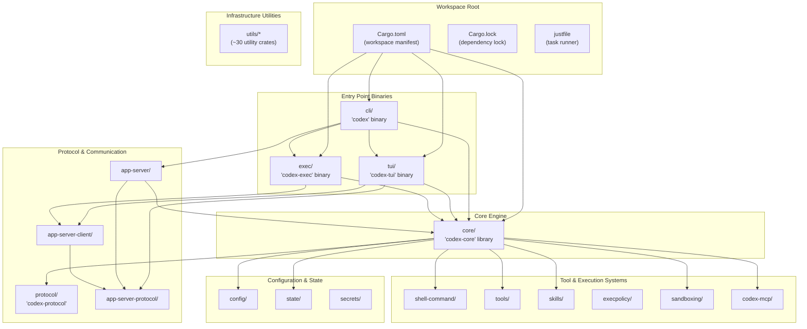
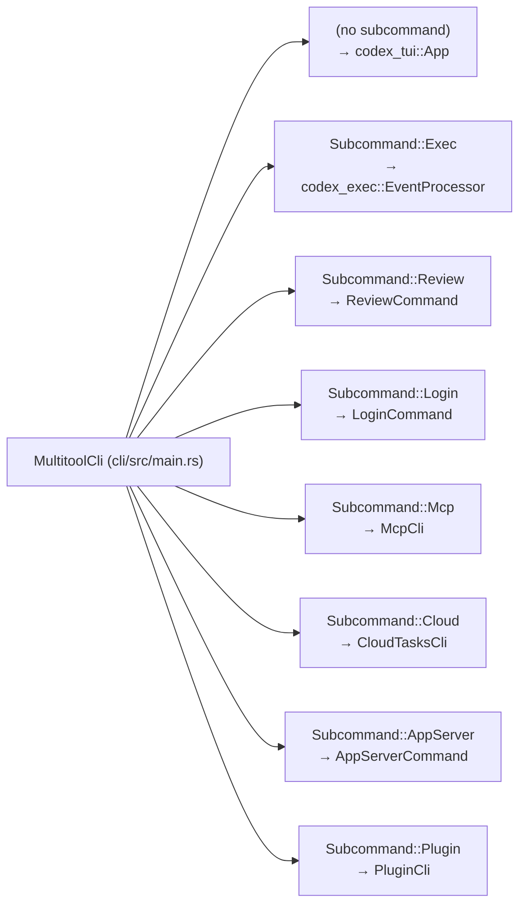
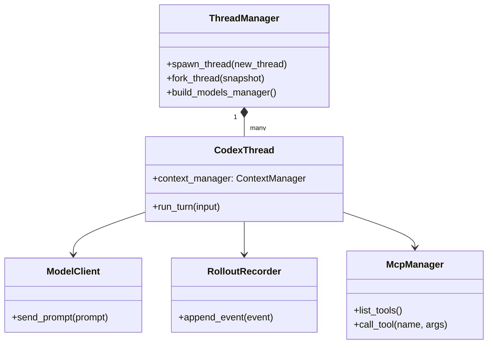

# Repository Structure

Relevant source files

The following files were used as context for generating this wiki page:

- [.bazelrc](.bazelrc)
- [.github/scripts/run-bazel-ci.sh](.github/scripts/run-bazel-ci.sh)
- [.github/scripts/run-bazel-query-ci.sh](.github/scripts/run-bazel-query-ci.sh)
- [.github/scripts/run_bazel_with_buildbuddy.py](.github/scripts/run_bazel_with_buildbuddy.py)
- [.github/scripts/rusty_v8_bazel.py](.github/scripts/rusty_v8_bazel.py)
- [.github/scripts/test_run_bazel_with_buildbuddy.py](.github/scripts/test_run_bazel_with_buildbuddy.py)
- [.github/scripts/test_rusty_v8_bazel.py](.github/scripts/test_rusty_v8_bazel.py)
- [.github/workflows/bazel.yml](.github/workflows/bazel.yml)
- [.github/workflows/rusty-v8-release.yml](.github/workflows/rusty-v8-release.yml)
- [.github/workflows/v8-canary.yml](.github/workflows/v8-canary.yml)
- [.gitignore](.gitignore)
- [AGENTS.md](AGENTS.md)
- [CHANGELOG.md](CHANGELOG.md)
- [README.md](README.md)
- [cliff.toml](cliff.toml)
- [codex-cli/package.json](codex-cli/package.json)
- [codex-rs/Cargo.lock](codex-rs/Cargo.lock)
- [codex-rs/Cargo.toml](codex-rs/Cargo.toml)
- [codex-rs/cli/Cargo.toml](codex-rs/cli/Cargo.toml)
- [codex-rs/cli/src/lib.rs](codex-rs/cli/src/lib.rs)
- [codex-rs/cli/src/main.rs](codex-rs/cli/src/main.rs)
- [codex-rs/core/Cargo.toml](codex-rs/core/Cargo.toml)
- [codex-rs/core/src/lib.rs](codex-rs/core/src/lib.rs)
- [codex-rs/default.nix](codex-rs/default.nix)
- [codex-rs/docs/bazel.md](codex-rs/docs/bazel.md)
- [codex-rs/exec/Cargo.toml](codex-rs/exec/Cargo.toml)
- [codex-rs/exec/src/cli.rs](codex-rs/exec/src/cli.rs)
- [codex-rs/exec/src/event_processor.rs](codex-rs/exec/src/event_processor.rs)
- [codex-rs/exec/src/lib.rs](codex-rs/exec/src/lib.rs)
- [codex-rs/responses-api-proxy/npm/package.json](codex-rs/responses-api-proxy/npm/package.json)
- [codex-rs/tui/Cargo.toml](codex-rs/tui/Cargo.toml)
- [codex-rs/tui/src/cli.rs](codex-rs/tui/src/cli.rs)
- [codex-rs/tui/src/lib.rs](codex-rs/tui/src/lib.rs)
- [docs/authentication.md](docs/authentication.md)
- [docs/contributing.md](docs/contributing.md)
- [docs/install.md](docs/install.md)
- [flake.lock](flake.lock)
- [flake.nix](flake.nix)
- [justfile](justfile)
- [package.json](package.json)
- [pnpm-lock.yaml](pnpm-lock.yaml)
- [pnpm-workspace.yaml](pnpm-workspace.yaml)
- [scripts/list-bazel-clippy-targets.sh](scripts/list-bazel-clippy-targets.sh)
- [sdk/typescript/jest.config.cjs](sdk/typescript/jest.config.cjs)
- [sdk/typescript/package.json](sdk/typescript/package.json)
- [sdk/typescript/tsconfig.json](sdk/typescript/tsconfig.json)

This page documents the Cargo workspace organization, key crates, and dependency relationships in the `codex-rs` repository. It also covers the top-level TypeScript/Python SDKs and the distribution infrastructure.

## Scope and Organization

The `codex-rs` repository is organized as a Cargo workspace containing over 120 member crates [codex-rs/Cargo.toml:2-121](). The workspace uses a monorepo structure where all crates share common tooling, dependencies, and build configuration through the root `Cargo.toml` manifest [codex-rs/Cargo.toml:133-218]().

The project utilizes **Bazel** for hermetic builds and testing across multiple platforms (Linux, macOS, Windows) [.github/workflows/bazel.yml:1-52](). This is supported by platform-specific patches for complex dependencies like V8 and cross-compilation toolchains [.github/workflows/bazel.yml:141-157]().

**Sources:** [codex-rs/Cargo.toml:1-218](), [.github/workflows/bazel.yml:1-157]()

---

## Workspace Structure

The workspace is defined in [codex-rs/Cargo.toml:1-121]() with a `[workspace]` section. It enforces a unified edition (2024) and license (Apache-2.0) across all members via the `[workspace.package]` section [codex-rs/Cargo.toml:124-132]().

### Workspace Component Map

The following diagram illustrates the relationship between the primary functional groups in the workspace.

**System Component Diagram**

**Sources:** [codex-rs/Cargo.toml:2-121](), [codex-rs/Cargo.toml:133-218](), [justfile:1-10]()

---

## Entry Point Crates

### CLI Multitool (`cli/`)

The `codex` binary serves as the unified entry point, routing to different execution modes via subcommands. The `MultitoolCli` struct defines the command structure [codex-rs/cli/src/main.rs:103-118]().

| Binary Name | Crate | Primary Function |
|-------------|-------|------------------|
| `codex` | `codex-cli` | Multitool dispatcher with subcommand routing [codex-rs/cli/src/main.rs:88-102]() |
| `codex-tui` | `codex-tui` | Interactive terminal UI (launched via `codex` or standalone) [codex-rs/tui/Cargo.toml:8-10]() |
| `codex-exec` | `codex-exec` | Non-interactive/headless execution [codex-rs/exec/Cargo.toml:1-5]() |

**Subcommand Dispatching:**
The CLI dispatches to subcommands such as `Exec`, `Review`, `Mcp`, `Cloud`, and `AppServer` [codex-rs/cli/src/main.rs:120-209]().

**CLI Routing Diagram**

**Sources:** [codex-rs/cli/src/main.rs:103-209](), [codex-rs/cli/Cargo.toml:1-10]()

### Interactive TUI (`tui/`)

The `codex-tui` crate provides a fullscreen terminal interface built with [Ratatui](https://ratatui.rs/) [codex-rs/tui/Cargo.toml:82-87](). 

- **Binary:** `codex-tui` ([codex-rs/tui/Cargo.toml:9]())
- **Protocol Integration:** It relies on `codex-app-server-protocol` and `codex-app-server-client` for structured communication with the agent engine [codex-rs/tui/src/lib.rs:25-31]().
- **Component Architecture:** The TUI is organized into modules such as `chatwidget`, `bottom_pane`, and `status_indicator_widget` [codex-rs/tui/src/lib.rs:115-187]().

**Sources:** [codex-rs/tui/Cargo.toml:1-167](), [codex-rs/tui/src/lib.rs:115-187]()

---

## Core Engine (`codex-core`)

The `codex-core` crate is the central library containing the business logic for sessions, model interactions, and tool orchestration.

**Core Engine Class Diagram**

### Key Modules and Exports

The root module [codex-rs/core/src/lib.rs:1-197]() re-exports primary types for workspace consumers:

| Export | Source Module | Purpose |
|--------|---------------|---------|
| `CodexThread` | [codex-rs/core/src/lib.rs:23]() | Manages a single conversation thread/turn state |
| `ThreadManager` | [codex-rs/core/src/lib.rs:115]() | Orchestrates thread lifecycle (spawn/fork/resume) |
| `ModelClient` | [codex-rs/core/src/lib.rs:179]() | Handles LLM API communication and retries |
| `RolloutRecorder` | [codex-rs/core/src/lib.rs:150]() | Handles session persistence and event logging |
| `McpManager` | [codex-rs/core/src/lib.rs:55]() | Manages Model Context Protocol server connections |
| `SkillsManager` | [codex-rs/core/src/lib.rs:89]() | Agent skill discovery and injection |

**Sources:** [codex-rs/core/src/lib.rs:1-197](), [codex-rs/core/Cargo.toml:18-120]()

---

## SDKs and External Packages

Beyond the Rust workspace, the repository contains packages for external integration:

- **TypeScript SDK (`@openai/codex-sdk`)**: Located in `sdk/typescript/`, providing a programmatic interface for Node.js environments [sdk/typescript/package.json:2]().
- **Codex CLI NPM Package (`@openai/codex`)**: Located in `codex-cli/`, this package wraps the compiled Rust binaries for distribution via npm [codex-cli/package.json:2-8]().
- **Python SDK**: Located in `sdk/python/`, containing client abstractions for Python users [codex-rs/Cargo.toml:157-158]().

**Sources:** [sdk/typescript/package.json:1-10](), [codex-cli/package.json:1-22](), [codex-rs/Cargo.toml:157-158]()

---

## Build and Distribution

The repository uses **Bazel** for high-performance, hermetic builds, particularly for cross-platform support and managing complex dependencies like V8 [.github/workflows/bazel.yml:1-18]().

- **Platform Support**: Explicitly supports `aarch64-apple-darwin`, `x86_64-unknown-linux-musl`, and `x86_64-pc-windows-gnullvm` [README.md:47-52]().
- **NPM Distribution**: The `codex-cli` package provides the `codex` command via a Node.js wrapper [codex-cli/package.json:6-8]().
- **Installation Scripts**: Official installation is handled via shell and PowerShell scripts [README.md:18-26]().
- **Development Tooling**: A root `justfile` provides standardized commands for formatting, testing, and schema generation [justfile:1-10]().

**Sources:** [.github/workflows/bazel.yml:1-157](), [README.md:14-63](), [codex-cli/package.json:1-22](), [justfile:1-10]()
