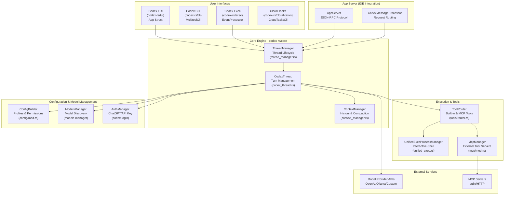
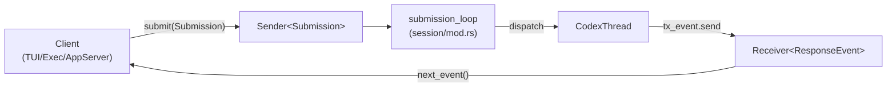
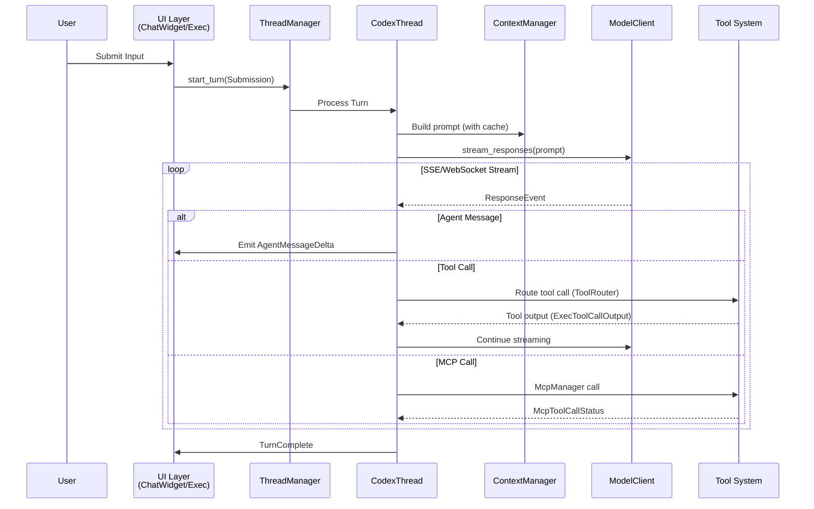
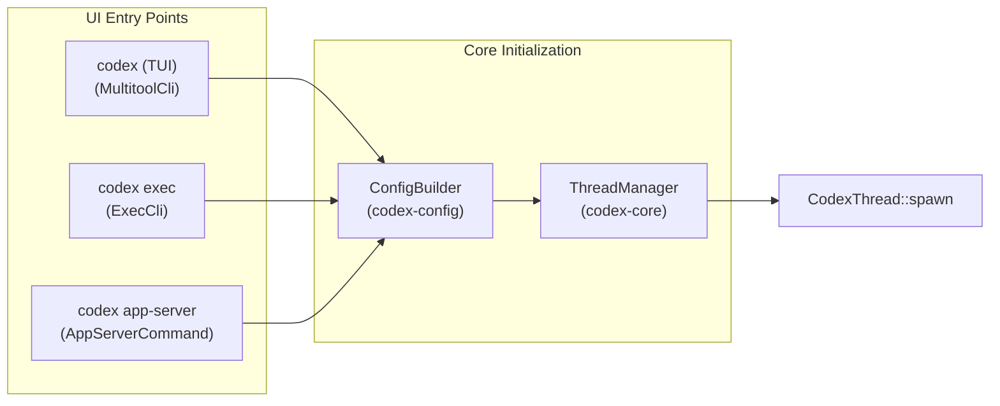
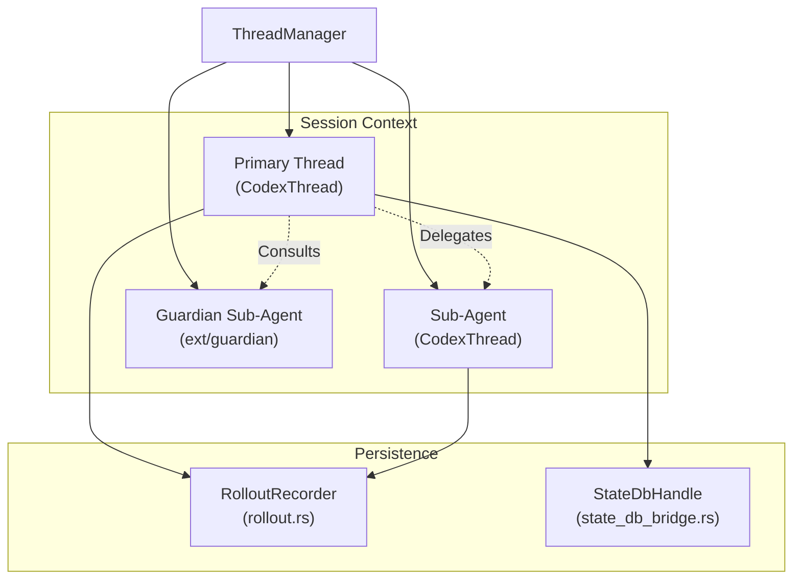
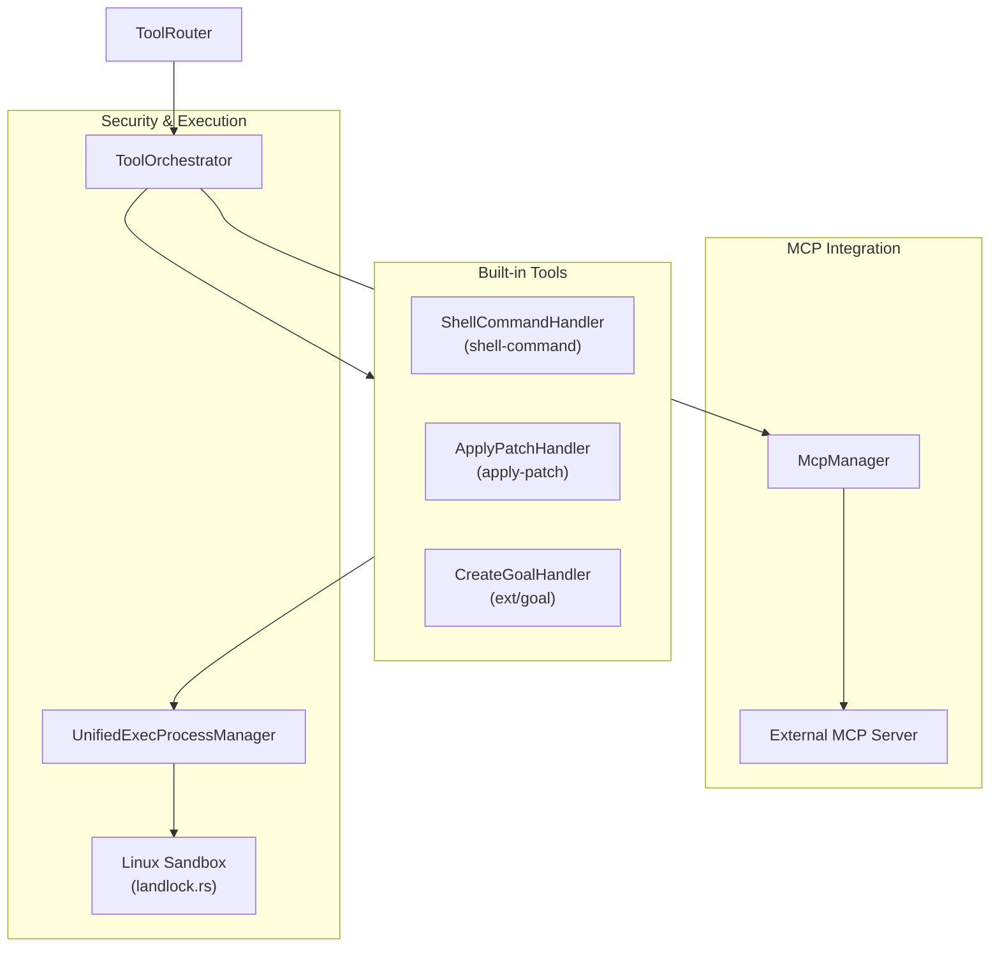

# Architecture Overview

Relevant source files

The following files were used as context for generating this wiki page:

- [codex-rs/Cargo.lock](codex-rs/Cargo.lock)
- [codex-rs/Cargo.toml](codex-rs/Cargo.toml)
- [codex-rs/app-server-protocol/schema/json/ClientRequest.json](codex-rs/app-server-protocol/schema/json/ClientRequest.json)
- [codex-rs/app-server-protocol/schema/json/ServerNotification.json](codex-rs/app-server-protocol/schema/json/ServerNotification.json)
- [codex-rs/app-server-protocol/schema/json/codex_app_server_protocol.schemas.json](codex-rs/app-server-protocol/schema/json/codex_app_server_protocol.schemas.json)
- [codex-rs/app-server-protocol/schema/json/codex_app_server_protocol.v2.schemas.json](codex-rs/app-server-protocol/schema/json/codex_app_server_protocol.v2.schemas.json)
- [codex-rs/app-server-protocol/schema/typescript/ClientRequest.ts](codex-rs/app-server-protocol/schema/typescript/ClientRequest.ts)
- [codex-rs/app-server-protocol/schema/typescript/ServerNotification.ts](codex-rs/app-server-protocol/schema/typescript/ServerNotification.ts)
- [codex-rs/app-server-protocol/schema/typescript/v2/index.ts](codex-rs/app-server-protocol/schema/typescript/v2/index.ts)
- [codex-rs/app-server-protocol/src/protocol/common.rs](codex-rs/app-server-protocol/src/protocol/common.rs)
- [codex-rs/app-server/README.md](codex-rs/app-server/README.md)
- [codex-rs/app-server/src/bespoke_event_handling.rs](codex-rs/app-server/src/bespoke_event_handling.rs)
- [codex-rs/cli/Cargo.toml](codex-rs/cli/Cargo.toml)
- [codex-rs/cli/src/lib.rs](codex-rs/cli/src/lib.rs)
- [codex-rs/cli/src/main.rs](codex-rs/cli/src/main.rs)
- [codex-rs/core/Cargo.toml](codex-rs/core/Cargo.toml)
- [codex-rs/core/src/codex_thread.rs](codex-rs/core/src/codex_thread.rs)
- [codex-rs/core/src/lib.rs](codex-rs/core/src/lib.rs)
- [codex-rs/core/src/session/handlers.rs](codex-rs/core/src/session/handlers.rs)
- [codex-rs/core/src/session/mod.rs](codex-rs/core/src/session/mod.rs)
- [codex-rs/core/src/session/review.rs](codex-rs/core/src/session/review.rs)
- [codex-rs/core/src/session/session.rs](codex-rs/core/src/session/session.rs)
- [codex-rs/core/src/session/tests.rs](codex-rs/core/src/session/tests.rs)
- [codex-rs/core/src/session/turn.rs](codex-rs/core/src/session/turn.rs)
- [codex-rs/core/src/session/turn_context.rs](codex-rs/core/src/session/turn_context.rs)
- [codex-rs/core/src/state/mod.rs](codex-rs/core/src/state/mod.rs)
- [codex-rs/core/src/state/turn.rs](codex-rs/core/src/state/turn.rs)
- [codex-rs/core/src/tasks/compact.rs](codex-rs/core/src/tasks/compact.rs)
- [codex-rs/core/src/tasks/mod.rs](codex-rs/core/src/tasks/mod.rs)
- [codex-rs/core/src/tasks/regular.rs](codex-rs/core/src/tasks/regular.rs)
- [codex-rs/core/src/tasks/review.rs](codex-rs/core/src/tasks/review.rs)
- [codex-rs/core/tests/suite/codex_delegate.rs](codex-rs/core/tests/suite/codex_delegate.rs)
- [codex-rs/exec/Cargo.toml](codex-rs/exec/Cargo.toml)
- [codex-rs/exec/src/cli.rs](codex-rs/exec/src/cli.rs)
- [codex-rs/exec/src/event_processor.rs](codex-rs/exec/src/event_processor.rs)
- [codex-rs/exec/src/lib.rs](codex-rs/exec/src/lib.rs)
- [codex-rs/tools/src/tool_config.rs](codex-rs/tools/src/tool_config.rs)
- [codex-rs/tools/src/tool_config_tests.rs](codex-rs/tools/src/tool_config_tests.rs)
- [codex-rs/tui/Cargo.toml](codex-rs/tui/Cargo.toml)
- [codex-rs/tui/src/cli.rs](codex-rs/tui/src/cli.rs)
- [codex-rs/tui/src/lib.rs](codex-rs/tui/src/lib.rs)

Codex is an AI coding agent that supports multiple execution modes (TUI, CLI, IDE integrations, web interface) all powered by a shared core engine. The system uses a queue-based submission/event protocol to enable asynchronous, interruptible workflows.

## System Organization

The architecture is organized into several major functional areas:

1.  **User Interfaces** – TUI (`codex-rs/tui`), CLI exec mode (`codex-rs/exec`), IDE app-server (`codex-rs/app-server`), and cloud task interfaces (`codex-rs/cloud-tasks`).
2.  **Core Engine** – Session management, turn execution, and event processing (`codex-rs/core`).
3.  **Execution & Tools** – Built-in and MCP tools with approval workflows and sandboxing (`codex-rs/tools`, `codex-rs/codex-mcp`).
4.  **Configuration & Model Management** – Hierarchical config, profiles, model metadata, and authentication (`codex-rs/config`, `codex-rs/models-manager`, `codex-rs/login`).
5.  **External Services** – Model provider APIs, MCP servers, and cloud backend.
6.  **App Server** – JSON-RPC protocol for IDE integrations (`codex-rs/app-server-protocol`).

The core design pattern is an **asynchronous submission/event queue**: user operations are submitted as `Submission` messages [codex-rs/core/src/session/tests.rs:127-127]() containing an `Op`, the agent processes them, and results stream back as `ResponseEvent` items [codex-rs/core/src/lib.rs:184-184](). This enables cancellation, interruption, and streaming UX across all interfaces.

Sources: [codex-rs/core/src/lib.rs:1-198](), [codex-rs/Cargo.toml:1-121](), [codex-rs/app-server/README.md:20-30](), [codex-rs/core/src/session/tests.rs:127-127]()

---

## Complete System Overview

The diagram below shows how all major subsystems connect. User interfaces submit operations to the core engine, which coordinates model API calls, tool execution, and state persistence.

**Diagram: Complete System Architecture**

**Analysis**: The system supports multiple entry points (TUI, CLI, AppServer), all converging on the `ThreadManager` [codex-rs/core/src/lib.rs:115-115](). The `ThreadManager` coordinates multiple active `CodexThread` instances [codex-rs/core/src/lib.rs:23-23](). Turn execution logic is encapsulated in `CodexThread` [codex-rs/core/src/codex_thread.rs:1-50](). Tools are routed via `ToolRouter` [codex-rs/core/src/session/tests.rs:71-71]() to either built-in implementations or external `McpServers` via the `McpManager` [codex-rs/core/src/lib.rs:55-55]().

Sources: [codex-rs/core/src/lib.rs:23-23](), [codex-rs/core/src/lib.rs:115-115](), [codex-rs/core/src/lib.rs:55-55](), [codex-rs/app-server/README.md:66-73](), [codex-rs/core/src/session/tests.rs:71-71]()

---

## Submission/Event Queue Pattern

The core engine uses an asynchronous queue-based protocol. Clients submit operations and receive events.

**Diagram: Submission and Event Flow**

**Key Protocol Types**:

*   **`Submission`**: Wraps an operation with unique IDs and trace context [codex-rs/core/src/session/tests.rs:127-127]().
*   **`Op`**: Operation variants including `UserInput`, `Interrupt`, and `SteerInput` [codex-rs/core/src/session/mod.rs:1-100]().
*   **`ResponseEvent`**: The primary event type emitted during turn execution, capturing model deltas and tool lifecycle [codex-rs/core/src/lib.rs:184-184]().
*   **`ServerNotification`**: The notification type for the JSON-RPC app-server [codex-rs/app-server-protocol/src/protocol/common.rs:1-100]().

The `ThreadManager` manages the lifecycle of these sessions and their underlying communication channels [codex-rs/core/src/lib.rs:115-116]().

Sources: [codex-rs/core/src/lib.rs:184-184](), [codex-rs/core/src/session/tests.rs:127-127](), [codex-rs/core/src/lib.rs:115-116]()

---

## Request/Response Flow

The turn execution logic manages the transition from natural language input to code-level tool execution and model response streaming.

**Diagram: User Turn Execution Flow**

**Analysis**: The `CodexThread` manages the lifecycle of a single turn [codex-rs/core/src/lib.rs:23-25](). It interacts with `ContextManager` [codex-rs/core/src/lib.rs:36-36]() to build the `Prompt` [codex-rs/core/src/lib.rs:183-183](), which is then sent to the `ModelClient` [codex-rs/core/src/lib.rs:179-179](). As chunks arrive from the model API, they are translated into `ResponseEvent` items [codex-rs/core/src/lib.rs:184-184](). Tool calls are handled by the tool system, often returning `ExecToolCallOutput` [codex-rs/core/src/session/tests.rs:40-40]().

Sources: [codex-rs/core/src/lib.rs:23-25](), [codex-rs/core/src/lib.rs:179-184](), [codex-rs/core/src/session/tests.rs:40-40](), [codex-rs/app-server/README.md:79-82]()

---

## Execution Modes and Entry Points

Codex supports multiple execution modes, each with different entry points. All modes converge on the `ThreadManager` for thread lifecycle management.

**Diagram: Execution Modes and Entry Points**

### Execution Mode Summary

| Mode | Entry Point | Primary Use Case | Event Processing |
| :--- | :--- | :--- | :--- |
| **TUI** | `MultitoolCli` [codex-rs/cli/src/main.rs:103]() | Interactive terminal sessions | `App` struct handles UI loop [codex-rs/tui/src/lib.rs:20-20]() |
| **Exec** | `ExecCli` [codex-rs/cli/src/main.rs:124]() | CI/CD, scripts, non-interactive | `EventProcessor` handles output [codex-rs/exec/src/lib.rs:157-157]() |
| **App Server** | `AppServerCommand` [codex-rs/cli/src/main.rs:145]() | IDE extensions (VS Code, Cursor) | `codex-app-server` JSON-RPC bridge [codex-rs/app-server/README.md:1-3]() |
| **MCP Server** | `McpServerCommand` [codex-rs/cli/src/main.rs:142]() | Codex as a tool for other agents | Exposes Codex as tools [codex-rs/cli/src/main.rs:142-142]() |

Sources: [codex-rs/cli/src/main.rs:103-145](), [codex-rs/tui/src/lib.rs:20-20](), [codex-rs/exec/src/lib.rs:157-157](), [codex-rs/app-server/README.md:1-3]()

---

## Multi-Agent and Persistence

Codex supports multi-agent workflows through thread management and ensures durability via a rollout persistence system.

**Diagram: Multi-Agent Thread Architecture**

**Analysis**: The `ThreadManager` maintains active threads [codex-rs/core/src/lib.rs:115-115](). Each thread is a `CodexThread` instance [codex-rs/core/src/lib.rs:23-23](). Guardian sub-agents (referenced in `codex-rs/core/src/guardian.rs`) are used for internal analysis and tool approval [codex-rs/core/src/lib.rs:43-43](). All thread events are persisted via the `RolloutRecorder` to JSONL files [codex-rs/core/src/lib.rs:150-150](), while metadata is managed through a `StateDbHandle` [codex-rs/core/src/lib.rs:140-140]().

Sources: [codex-rs/core/src/lib.rs:23-23](), [codex-rs/core/src/lib.rs:115-115](), [codex-rs/core/src/lib.rs:140-150](), [codex-rs/core/src/lib.rs:43-43]()

---

## Tool Ecosystem and MCP Integration

The tool system is extensible, supporting both built-in shell/patch tools and external servers via the Model Context Protocol (MCP).

**Diagram: Tool System Architecture**

**Analysis**: The `ToolRouter` [codex-rs/core/src/session/tests.rs:71-71]() dispatches tool calls. Built-in shell tools use the `UnifiedExecProcessManager` [codex-rs/core/src/lib.rs:102-102](). External tools are accessed via the `McpManager`, which handles the lifecycle of external MCP servers [codex-rs/core/src/lib.rs:55-55](). Security is enforced via sandboxing, such as `spawn_command_under_linux_sandbox` [codex-rs/core/src/lib.rs:48-48]().

Sources: [codex-rs/core/src/lib.rs:48-55](), [codex-rs/core/src/lib.rs:102-102](), [codex-rs/core/src/session/tests.rs:71-71](), [codex-rs/app-server/README.md:22-23]()
