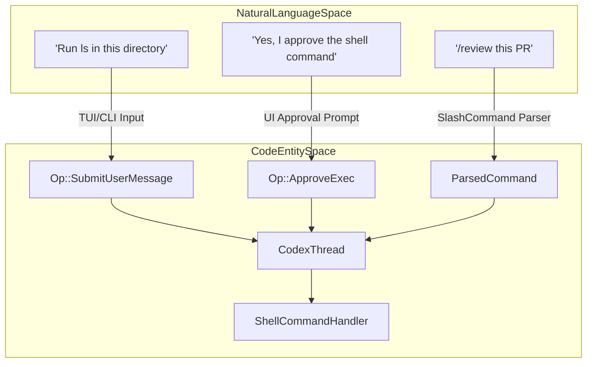
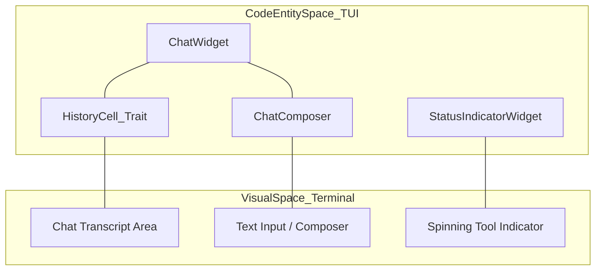
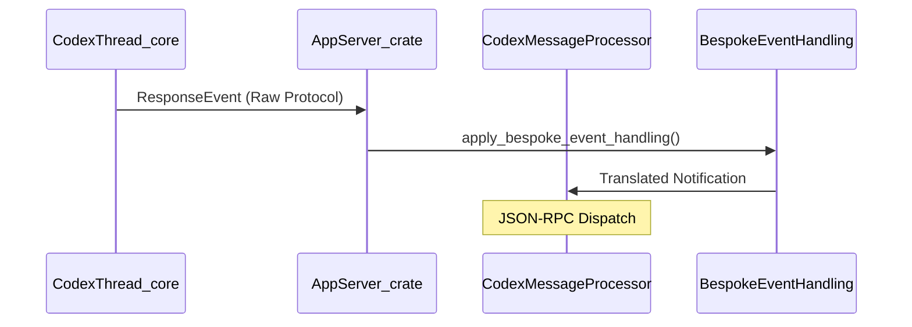

# Glossary

Relevant source files

The following files were used as context for generating this wiki page:

- [codex-rs/Cargo.lock](codex-rs/Cargo.lock)
- [codex-rs/Cargo.toml](codex-rs/Cargo.toml)
- [codex-rs/app-server-protocol/schema/json/ClientRequest.json](codex-rs/app-server-protocol/schema/json/ClientRequest.json)
- [codex-rs/app-server-protocol/schema/json/ServerNotification.json](codex-rs/app-server-protocol/schema/json/ServerNotification.json)
- [codex-rs/app-server-protocol/schema/json/codex_app_server_protocol.schemas.json](codex-rs/app-server-protocol/schema/json/codex_app_server_protocol.schemas.json)
- [codex-rs/app-server-protocol/schema/json/codex_app_server_protocol.v2.schemas.json](codex-rs/app-server-protocol/schema/json/codex_app_server_protocol.v2.schemas.json)
- [codex-rs/app-server-protocol/schema/typescript/ClientRequest.ts](codex-rs/app-server-protocol/schema/typescript/ClientRequest.ts)
- [codex-rs/app-server-protocol/schema/typescript/ServerNotification.ts](codex-rs/app-server-protocol/schema/typescript/ServerNotification.ts)
- [codex-rs/app-server-protocol/schema/typescript/v2/index.ts](codex-rs/app-server-protocol/schema/typescript/v2/index.ts)
- [codex-rs/app-server-protocol/src/protocol/common.rs](codex-rs/app-server-protocol/src/protocol/common.rs)
- [codex-rs/app-server/README.md](codex-rs/app-server/README.md)
- [codex-rs/app-server/src/bespoke_event_handling.rs](codex-rs/app-server/src/bespoke_event_handling.rs)
- [codex-rs/cli/Cargo.toml](codex-rs/cli/Cargo.toml)
- [codex-rs/cli/src/lib.rs](codex-rs/cli/src/lib.rs)
- [codex-rs/cli/src/main.rs](codex-rs/cli/src/main.rs)
- [codex-rs/config/src/config_toml.rs](codex-rs/config/src/config_toml.rs)
- [codex-rs/config/src/profile_toml.rs](codex-rs/config/src/profile_toml.rs)
- [codex-rs/config/src/schema.rs](codex-rs/config/src/schema.rs)
- [codex-rs/core-api/src/lib.rs](codex-rs/core-api/src/lib.rs)
- [codex-rs/core/Cargo.toml](codex-rs/core/Cargo.toml)
- [codex-rs/core/config.schema.json](codex-rs/core/config.schema.json)
- [codex-rs/core/src/agent/control.rs](codex-rs/core/src/agent/control.rs)
- [codex-rs/core/src/agent/control_tests.rs](codex-rs/core/src/agent/control_tests.rs)
- [codex-rs/core/src/codex_delegate.rs](codex-rs/core/src/codex_delegate.rs)
- [codex-rs/core/src/codex_thread.rs](codex-rs/core/src/codex_thread.rs)
- [codex-rs/core/src/config/config_tests.rs](codex-rs/core/src/config/config_tests.rs)
- [codex-rs/core/src/config/mod.rs](codex-rs/core/src/config/mod.rs)
- [codex-rs/core/src/lib.rs](codex-rs/core/src/lib.rs)
- [codex-rs/core/src/prompt_debug.rs](codex-rs/core/src/prompt_debug.rs)
- [codex-rs/core/src/session/config_lock.rs](codex-rs/core/src/session/config_lock.rs)
- [codex-rs/core/src/session/handlers.rs](codex-rs/core/src/session/handlers.rs)
- [codex-rs/core/src/session/mod.rs](codex-rs/core/src/session/mod.rs)
- [codex-rs/core/src/session/review.rs](codex-rs/core/src/session/review.rs)
- [codex-rs/core/src/session/session.rs](codex-rs/core/src/session/session.rs)
- [codex-rs/core/src/session/tests.rs](codex-rs/core/src/session/tests.rs)
- [codex-rs/core/src/session/tests/guardian_tests.rs](codex-rs/core/src/session/tests/guardian_tests.rs)
- [codex-rs/core/src/session/turn.rs](codex-rs/core/src/session/turn.rs)
- [codex-rs/core/src/session/turn_context.rs](codex-rs/core/src/session/turn_context.rs)
- [codex-rs/core/src/state/mod.rs](codex-rs/core/src/state/mod.rs)
- [codex-rs/core/src/state/service.rs](codex-rs/core/src/state/service.rs)
- [codex-rs/core/src/state/turn.rs](codex-rs/core/src/state/turn.rs)
- [codex-rs/core/src/tasks/compact.rs](codex-rs/core/src/tasks/compact.rs)
- [codex-rs/core/src/tasks/mod.rs](codex-rs/core/src/tasks/mod.rs)
- [codex-rs/core/src/tasks/regular.rs](codex-rs/core/src/tasks/regular.rs)
- [codex-rs/core/src/tasks/review.rs](codex-rs/core/src/tasks/review.rs)
- [codex-rs/core/src/thread_manager.rs](codex-rs/core/src/thread_manager.rs)
- [codex-rs/core/src/thread_manager_tests.rs](codex-rs/core/src/thread_manager_tests.rs)
- [codex-rs/core/src/tools/events.rs](codex-rs/core/src/tools/events.rs)
- [codex-rs/core/src/tools/handlers/apply_patch.rs](codex-rs/core/src/tools/handlers/apply_patch.rs)
- [codex-rs/core/src/tools/handlers/multi_agents_spec.rs](codex-rs/core/src/tools/handlers/multi_agents_spec.rs)
- [codex-rs/core/src/tools/handlers/multi_agents_spec_tests.rs](codex-rs/core/src/tools/handlers/multi_agents_spec_tests.rs)
- [codex-rs/core/src/tools/handlers/multi_agents_tests.rs](codex-rs/core/src/tools/handlers/multi_agents_tests.rs)
- [codex-rs/core/src/tools/handlers/multi_agents_v2.rs](codex-rs/core/src/tools/handlers/multi_agents_v2.rs)
- [codex-rs/core/src/tools/handlers/multi_agents_v2/message_tool.rs](codex-rs/core/src/tools/handlers/multi_agents_v2/message_tool.rs)
- [codex-rs/core/src/tools/handlers/shell.rs](codex-rs/core/src/tools/handlers/shell.rs)
- [codex-rs/core/src/tools/handlers/unified_exec.rs](codex-rs/core/src/tools/handlers/unified_exec.rs)
- [codex-rs/core/src/tools/handlers/view_image.rs](codex-rs/core/src/tools/handlers/view_image.rs)
- [codex-rs/core/src/tools/network_approval.rs](codex-rs/core/src/tools/network_approval.rs)
- [codex-rs/core/src/tools/orchestrator.rs](codex-rs/core/src/tools/orchestrator.rs)
- [codex-rs/core/src/tools/runtimes/apply_patch.rs](codex-rs/core/src/tools/runtimes/apply_patch.rs)
- [codex-rs/core/src/tools/runtimes/mod.rs](codex-rs/core/src/tools/runtimes/mod.rs)
- [codex-rs/core/src/tools/runtimes/mod_tests.rs](codex-rs/core/src/tools/runtimes/mod_tests.rs)
- [codex-rs/core/src/tools/runtimes/shell.rs](codex-rs/core/src/tools/runtimes/shell.rs)
- [codex-rs/core/src/tools/runtimes/unified_exec.rs](codex-rs/core/src/tools/runtimes/unified_exec.rs)
- [codex-rs/core/src/tools/sandboxing.rs](codex-rs/core/src/tools/sandboxing.rs)
- [codex-rs/core/src/turn_diff_tracker.rs](codex-rs/core/src/turn_diff_tracker.rs)
- [codex-rs/core/src/turn_diff_tracker_tests.rs](codex-rs/core/src/turn_diff_tracker_tests.rs)
- [codex-rs/core/src/unified_exec/mod.rs](codex-rs/core/src/unified_exec/mod.rs)
- [codex-rs/core/src/unified_exec/process_manager.rs](codex-rs/core/src/unified_exec/process_manager.rs)
- [codex-rs/core/tests/suite/codex_delegate.rs](codex-rs/core/tests/suite/codex_delegate.rs)
- [codex-rs/core/tests/suite/unified_exec.rs](codex-rs/core/tests/suite/unified_exec.rs)
- [codex-rs/exec/Cargo.toml](codex-rs/exec/Cargo.toml)
- [codex-rs/exec/src/cli.rs](codex-rs/exec/src/cli.rs)
- [codex-rs/exec/src/event_processor.rs](codex-rs/exec/src/event_processor.rs)
- [codex-rs/exec/src/lib.rs](codex-rs/exec/src/lib.rs)
- [codex-rs/features/src/feature_configs.rs](codex-rs/features/src/feature_configs.rs)
- [codex-rs/features/src/lib.rs](codex-rs/features/src/lib.rs)
- [codex-rs/features/src/tests.rs](codex-rs/features/src/tests.rs)
- [codex-rs/rollout-trace/README.md](codex-rs/rollout-trace/README.md)
- [codex-rs/rollout-trace/src/tool_dispatch.rs](codex-rs/rollout-trace/src/tool_dispatch.rs)
- [codex-rs/thread-manager-sample/src/main.rs](codex-rs/thread-manager-sample/src/main.rs)
- [codex-rs/tools/src/tool_config.rs](codex-rs/tools/src/tool_config.rs)
- [codex-rs/tools/src/tool_config_tests.rs](codex-rs/tools/src/tool_config_tests.rs)
- [codex-rs/tui/Cargo.toml](codex-rs/tui/Cargo.toml)
- [codex-rs/tui/src/cli.rs](codex-rs/tui/src/cli.rs)
- [codex-rs/tui/src/lib.rs](codex-rs/tui/src/lib.rs)

This page defines codebase-specific terms, jargon, and abbreviations used throughout the Codex system. It serves as a technical reference for onboarding engineers to understand the mapping between conceptual system components and their concrete implementations in Rust.

## Core System Entities

### Codex
The top-level agent engine that manages the lifecycle of a session. It coordinates model interactions, tool execution, and state persistence.
*   **Implementation**: While `Codex` is a conceptual term for the system, `CodexThread` is the primary handle for managing individual conversation logic and turn execution [codex-rs/core/src/codex_thread.rs:21-23]().
*   **Data Flow**: It processes model interactions via `ModelClient` [codex-rs/core/src/lib.rs:179-179]() and emits events via `ResponseEvent` streams [codex-rs/core/src/lib.rs:184-184]().

### Thread
A logical conversation container within a session. A single Codex session can manage multiple threads (e.g., a primary chat thread and sub-agent threads for review or research).
*   **Implementation**: Managed by `ThreadManager` in [codex-rs/core/src/thread_manager.rs:115-115]().
*   **Identification**: Referenced by `ThreadId` which is a unique identifier for a conversation branch [codex-rs/protocol/src/protocol.rs:18-18]().

### Turn
A single exchange in a conversation, starting from a user message (or agent trigger) and ending when the agent stops generating or requires user input.
*   **Context**: The `TurnContext` struct encapsulates the environment, prompt, and overrides for a specific turn [codex-rs/core/src/session/turn_context.rs:24-24]().
*   **Lifecycle**: A turn's execution is handled by `Turn` and tracked through `TurnState` [codex-rs/core/src/session/turn.rs:10-20]().

### Op (Operation)
The primitive command unit sent to the core engine. Operations include submitting messages, approving tool calls, or switching threads.
*   **Implementation**: `enum Op` defines the set of available user actions [codex-rs/protocol/src/protocol.rs:129-130]().

### EventMsg / ResponseEvent
The primary communication mechanism from the core engine to frontends (TUI/App Server). It encapsulates incremental updates like token streaming, tool starts, and errors.
*   **Implementation**: `ResponseEvent` is the core-api equivalent used to signal state changes asynchronously [codex-rs/core/src/lib.rs:184-184]().

---

## Architectural Mapping: Natural Language to Code

The following diagrams bridge high-level user concepts to the specific code entities that handle them.

**User Interaction to Code Entity Mapping**

Sources: [codex-rs/protocol/src/protocol.rs:126-134](), [codex-rs/core/src/codex_thread.rs:21-23](), [codex-rs/core/src/tools/handlers/shell.rs:1-10]()

**TUI Visual Space to Code Structure**

Sources: [codex-rs/tui/src/chatwidget.rs:1-10](), [codex-rs/tui/src/history_cell.rs:143-143](), [codex-rs/tui/src/status_indicator_widget.rs:187-187]()

---

## Technical Terms & Jargon

| Term | Definition | Code Pointer |
| :--- | :--- | :--- |
| **Active Cell** | In the TUI, the currently streaming or mutating transcript unit (e.g., a live tool output). | [codex-rs/tui/src/chatwidget.rs:6-10]() |
| **Bespoke Event** | Custom handling logic in the App Server to translate core events into specific JSON-RPC notifications for IDEs. | [codex-rs/app-server/src/bespoke_event_handling.rs:1-10]() |
| **Compaction** | The process of summarizing old conversation history to stay within model context limits. | [codex-rs/core/src/lib.rs:195-195]() |
| **Elicitation** | A request for the user to provide specific configuration or credentials (often for MCP servers). | [codex-rs/protocol/src/protocol.rs:19-19]() |
| **Guardian** | A specialized sub-agent that reviews proposed tool calls for security risks before execution. | [codex-rs/core/src/lib.rs:43-43]() |
| **History Cell** | A trait for renderable units in the TUI transcript. | [codex-rs/tui/src/history_cell.rs:143-143]() |
| **MCP** | Model Context Protocol; allows Codex to connect to external tool servers. | [codex-rs/core/src/lib.rs:49-49]() |
| **Rollout** | A persistent file format (`.codex-rollout`) that records every event in a session for replay and state recovery. | [codex-rs/core/src/lib.rs:133-133]() |
| **Sandbox** | Platform-specific isolation (Landlock, Seatbelt, Windows Token) for executing untrusted code. | [codex-rs/core/src/lib.rs:82-82]() |
| **Skill** | A packaged set of tools or instructions loaded from the `.codex/skills` directory. | [codex-rs/core/src/lib.rs:85-89]() |
| **App Server** | The JSON-RPC interface powering IDE extensions and external frontends. | [codex-rs/app-server/README.md:1-10]() |

---

## Data Flow: Event Processing

The system uses a reactive pattern where the Core engine streams events that are consumed and rendered by various frontends.

**Event Translation Pipeline**

Sources: [codex-rs/app-server/src/bespoke_event_handling.rs:1-10](), [codex-rs/core/src/codex_thread.rs:21-23]()

---

## Configuration Jargon

*   **Config Layer**: A single source of truth in the hierarchy (e.g., `config.toml`, CLI flags, or environment variables). Managed by `ConfigLayerSource` [codex-rs/core/src/config/mod.rs:12-12]().
*   **Constrained**: A wrapper type used in configuration to ensure values meet specific validation criteria. [codex-rs/core/src/config/mod.rs:149-149]().
*   **Managed Features**: Runtime-toggled capabilities (feature flags) defined in the `codex-features` crate [codex-rs/core/src/config/mod.rs:156-156]().
*   **Personality**: A configuration setting that adjusts the agent's tone and instruction set (e.g., "concise" vs "helpful") [codex-rs/core/src/config/mod.rs:84-84]().
*   **Permission Profile**: A set of granted capabilities (filesystem, network) applied to a session [codex-rs/core/src/config/mod.rs:96-96]().
*   **Alt Screen Mode**: Controls whether the TUI uses the terminal's alternate screen buffer [codex-rs/core/src/config/mod.rs:81-81]().

Sources: [codex-rs/core/src/config/mod.rs:1-160](), [codex-rs/protocol/src/protocol.rs:1-105](), [codex-rs/tui/src/lib.rs:1-80]()
