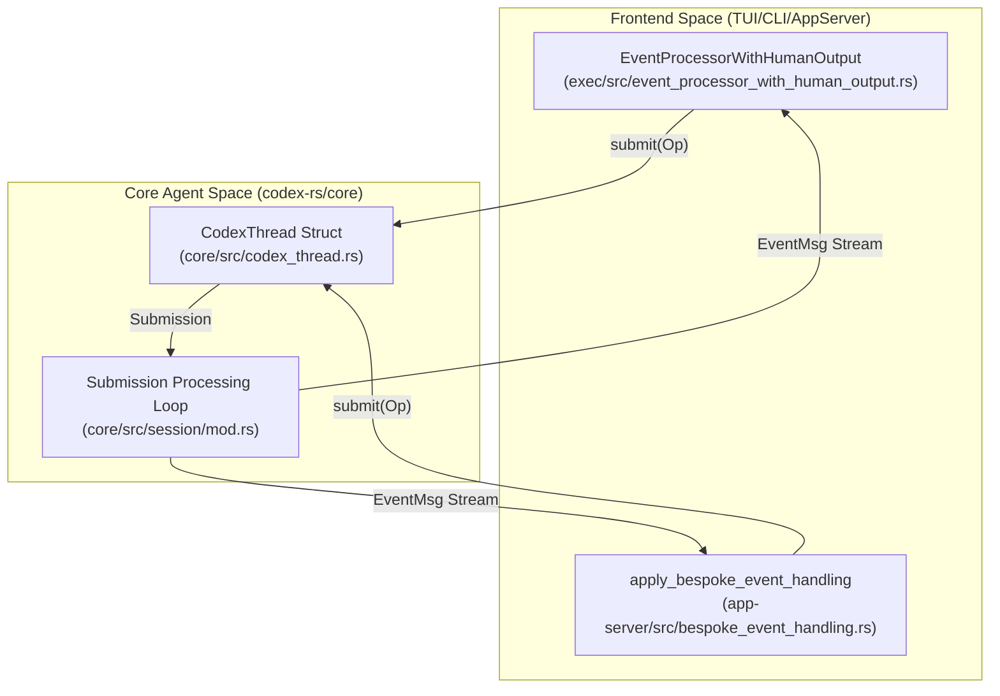
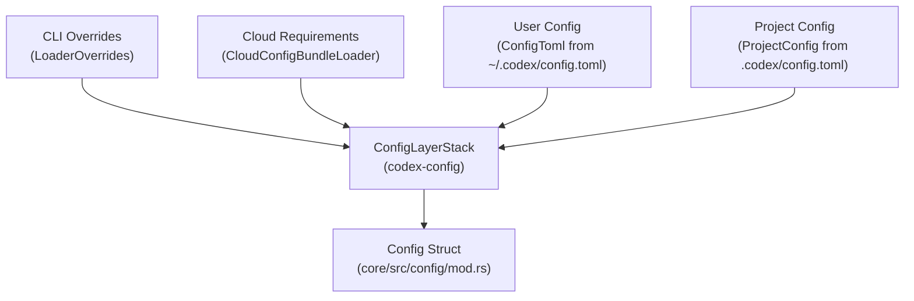
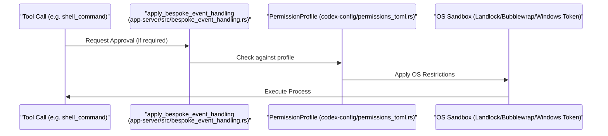

# Core Concepts

Relevant source files

The following files were used as context for generating this wiki page:

- [codex-rs/app-server-protocol/schema/json/ClientRequest.json](codex-rs/app-server-protocol/schema/json/ClientRequest.json)
- [codex-rs/app-server-protocol/schema/json/ServerNotification.json](codex-rs/app-server-protocol/schema/json/ServerNotification.json)
- [codex-rs/app-server-protocol/schema/json/codex_app_server_protocol.schemas.json](codex-rs/app-server-protocol/schema/json/codex_app_server_protocol.schemas.json)
- [codex-rs/app-server-protocol/schema/json/codex_app_server_protocol.v2.schemas.json](codex-rs/app-server-protocol/schema/json/codex_app_server_protocol.v2.schemas.json)
- [codex-rs/app-server-protocol/schema/json/v2/RawResponseItemCompletedNotification.json](codex-rs/app-server-protocol/schema/json/v2/RawResponseItemCompletedNotification.json)
- [codex-rs/app-server-protocol/schema/json/v2/ThreadForkParams.json](codex-rs/app-server-protocol/schema/json/v2/ThreadForkParams.json)
- [codex-rs/app-server-protocol/schema/json/v2/ThreadResumeParams.json](codex-rs/app-server-protocol/schema/json/v2/ThreadResumeParams.json)
- [codex-rs/app-server-protocol/schema/json/v2/ThreadStartParams.json](codex-rs/app-server-protocol/schema/json/v2/ThreadStartParams.json)
- [codex-rs/app-server-protocol/schema/json/v2/TurnStartParams.json](codex-rs/app-server-protocol/schema/json/v2/TurnStartParams.json)
- [codex-rs/app-server-protocol/schema/typescript/ClientRequest.ts](codex-rs/app-server-protocol/schema/typescript/ClientRequest.ts)
- [codex-rs/app-server-protocol/schema/typescript/ResponseItem.ts](codex-rs/app-server-protocol/schema/typescript/ResponseItem.ts)
- [codex-rs/app-server-protocol/schema/typescript/ServerNotification.ts](codex-rs/app-server-protocol/schema/typescript/ServerNotification.ts)
- [codex-rs/app-server-protocol/schema/typescript/v2/ThreadForkParams.ts](codex-rs/app-server-protocol/schema/typescript/v2/ThreadForkParams.ts)
- [codex-rs/app-server-protocol/schema/typescript/v2/ThreadResumeParams.ts](codex-rs/app-server-protocol/schema/typescript/v2/ThreadResumeParams.ts)
- [codex-rs/app-server-protocol/schema/typescript/v2/ThreadStartParams.ts](codex-rs/app-server-protocol/schema/typescript/v2/ThreadStartParams.ts)
- [codex-rs/app-server-protocol/schema/typescript/v2/index.ts](codex-rs/app-server-protocol/schema/typescript/v2/index.ts)
- [codex-rs/app-server-protocol/src/protocol/common.rs](codex-rs/app-server-protocol/src/protocol/common.rs)
- [codex-rs/app-server/README.md](codex-rs/app-server/README.md)
- [codex-rs/app-server/src/bespoke_event_handling.rs](codex-rs/app-server/src/bespoke_event_handling.rs)
- [codex-rs/config/src/config_toml.rs](codex-rs/config/src/config_toml.rs)
- [codex-rs/config/src/profile_toml.rs](codex-rs/config/src/profile_toml.rs)
- [codex-rs/config/src/schema.rs](codex-rs/config/src/schema.rs)
- [codex-rs/core-api/src/lib.rs](codex-rs/core-api/src/lib.rs)
- [codex-rs/core/config.schema.json](codex-rs/core/config.schema.json)
- [codex-rs/core/src/config/config_tests.rs](codex-rs/core/src/config/config_tests.rs)
- [codex-rs/core/src/config/mod.rs](codex-rs/core/src/config/mod.rs)
- [codex-rs/core/src/session/config_lock.rs](codex-rs/core/src/session/config_lock.rs)
- [codex-rs/features/src/feature_configs.rs](codex-rs/features/src/feature_configs.rs)
- [codex-rs/features/src/lib.rs](codex-rs/features/src/lib.rs)
- [codex-rs/features/src/tests.rs](codex-rs/features/src/tests.rs)
- [codex-rs/protocol/src/models.rs](codex-rs/protocol/src/models.rs)
- [codex-rs/thread-manager-sample/src/main.rs](codex-rs/thread-manager-sample/src/main.rs)
- [codex-rs/utils/image/src/error.rs](codex-rs/utils/image/src/error.rs)
- [codex-rs/utils/image/src/image_tests.rs](codex-rs/utils/image/src/image_tests.rs)
- [codex-rs/utils/image/src/lib.rs](codex-rs/utils/image/src/lib.rs)

This page documents the fundamental architectural patterns and systems that form the foundation of the Codex codebase. These concepts are invariant across all execution modes (TUI, CLI, IDE integration, or MCP server) and provide the core abstractions for session management, configuration, and security.

For detailed information about specific subsystems built on these concepts, see:
- [Protocol Layer (Submission/Event System)](#2.1) — Document the `Op` submission queue and `Event` stream pattern that coordinates async communication between the core and all frontends.
- [Configuration System](#2.2) — Explain the layered configuration system (CLI args → env vars → `config.toml` → defaults) and `ConfigBuilder`.
- [Feature Flags](#2.3) — Document the feature flag system, lifecycle stages (`UnderDevelopment`/`Experimental`/`Stable`/`Deprecated`), and runtime toggles.
- [Sandbox and Approval Policies](#2.4) — Explain sandbox modes (`ReadOnly`/`WorkspaceWrite`/`DangerFullAccess`), approval policies, and permission profiles.

---

## The Submission/Event Protocol

Codex uses a **Submission Queue (SQ) / Event Queue (EQ)** pattern to asynchronously communicate between user interfaces (frontends) and the agent engine (core). This architecture ensures that the core can process long-running model turns and tool executions without blocking the UI.

### Architecture Overview

Frontends interact with a session by submitting operations (`Op`), which are then processed. Events flow back to the UI via the `Event` stream, containing an `EventMsg` payload. In the `app-server`, these are translated via `apply_bespoke_event_handling` [codex-rs/app-server/src/bespoke_event_handling.rs:1-1]() into JSON-RPC notifications like `TurnStartedNotification` [codex-rs/app-server/src/bespoke_event_handling.rs:81-81]().

**Sources:** [codex-rs/app-server/src/bespoke_event_handling.rs:95-98](), [codex-rs/features/src/lib.rs:7-8]()

### Submission and Event Types

| Symbol | Type | Purpose |
|--------|------|---------|
| `Op` | `enum` | Operations like `UserInput`, `Interrupt`, or `OverrideTurnContext` [codex-rs/app-server/src/bespoke_event_handling.rs:99-99](). |
| `EventMsg` | `enum` | Payloads like `TurnStarted`, `AgentMessageDelta`, or `SessionConfigured` [codex-rs/protocol/src/protocol.rs:97-97](). |
| `Event` | `struct` | Wraps an `EventMsg` with metadata [codex-rs/protocol/src/protocol.rs:96-96](). |

**Sources:** [codex-rs/app-server/src/bespoke_event_handling.rs:95-98](), [codex-rs/features/src/lib.rs:7-9]()

---

## Configuration System

Codex uses a **layered configuration system** where settings from multiple sources are merged. The system supports local project overrides and organizational requirements.

### Configuration Layer Hierarchy

Configuration is built from several sources managed by `ConfigLayerStack` [codex-rs/core/src/config/mod.rs:13-13](). The system supports profiles via `ProfileV2Name` [codex-rs/core/src/config/mod.rs:22-22]() and pins values using `Constrained<T>` [codex-rs/core/src/config/mod.rs:149-149]().

**Sources:** [codex-rs/core/src/config/mod.rs:11-15](), [codex-rs/core/src/config/mod.rs:25-30](), [codex-rs/core/src/config/mod.rs:148-152]()

### Constraint Validation and Locking
Organizational policies are enforced via `ConfigRequirements` [codex-rs/core/src/config/mod.rs:15-15](). The system tracks whether a value is pinned by policy or overridable using `ConstrainedWithSource` [codex-rs/core/src/config/mod.rs:17-17](). Codex supports a `ConfigLockfileToml` [codex-rs/core/src/config/mod.rs:27-27]() to ensure session reproducibility.

**Sources:** [codex-rs/core/src/config/mod.rs:14-16](), [codex-rs/core/src/config/mod.rs:26-27](), [codex-rs/core/src/config/mod.rs:145-148]()

---

## Feature Flag System

Codex uses a **staged feature flag system** defined in `codex-features` to manage experimental functionality.

### Feature Definition and Lifecycle

Features progress through lifecycle stages defined in the `Stage` enum [codex-rs/features/src/lib.rs:31-46]().

| Stage | Visibility | Description |
|-------|-----------|-------------|
| `UnderDevelopment` | Hidden | Not ready for external use [codex-rs/features/src/lib.rs:33-33](). |
| `Experimental` | Opt-in | Available via `/experimental` menu [codex-rs/features/src/lib.rs:35-39](). |
| `Stable` | Default | General availability [codex-rs/features/src/lib.rs:41-41](). |
| `Deprecated` | Opt-out | Scheduled for removal [codex-rs/features/src/lib.rs:43-43](). |

**Sources:** [codex-rs/features/src/lib.rs:28-45](), [codex-rs/features/src/lib.rs:77-184]()

### Runtime Toggles
The `Feature` enum [codex-rs/features/src/lib.rs:78-78]() defines specific flags like `CodeMode` [codex-rs/features/src/lib.rs:87-87](), `UnifiedExec` [codex-rs/features/src/lib.rs:91-91](), and `NetworkProxy` [codex-rs/features/src/lib.rs:135-135](). These are resolved into an effective feature set at runtime.

**Sources:** [codex-rs/features/src/lib.rs:77-184]()

---

## Sandbox and Approval Policies

Codex provides **layered security controls** to protect the host environment during tool execution.

### Approval Policy
The `ApprovalsReviewer` [codex-rs/core/src/config/mod.rs:39-39]() determines who approval requests are routed to.
- `user`: Human operator [codex-rs/core/config.schema.json:186-186]().
- `auto_review`: Risk-based decision framework using a sub-agent [codex-rs/core/config.schema.json:187-187]().

**Sources:** [codex-rs/core/config.schema.json:183-191](), [codex-rs/core/src/config/mod.rs:39-39]()

### Sandbox Policy
The `SandboxPolicy` [codex-rs/core/src/config/mod.rs:104-104]() defines filesystem and network restrictions, derived from a `PermissionProfile` [codex-rs/core/src/config/mod.rs:96-96]().

| Policy Component | Type | Purpose |
|------------------|------|---------|
| `FileSystemSandboxPolicy` | `struct` | Defines paths and access modes [codex-rs/core/src/config/mod.rs:100-100](). |
| `NetworkSandboxPolicy` | `struct` | Controls network access [codex-rs/core/src/config/mod.rs:101-101](). |
| `SandboxMode` | `enum` | High-level modes like `ReadOnly` [codex-rs/core/src/config/mod.rs:87-87](). |

**Sources:** [codex-rs/core/src/config/mod.rs:86-104](), [codex-rs/core/src/config/config_tests.rs:164-178]()

### Tool Execution Flow

Tools are checked against the `PermissionProfile`. The `app-server` handles these requests via `CommandExecutionRequestApprovalParams` [codex-rs/app-server/src/bespoke_event_handling.rs:19-19]().

**Sources:** [codex-rs/app-server/src/bespoke_event_handling.rs:124-135](), [codex-rs/core/src/config/mod.rs:154-155](), [codex-rs/core/src/config/config_tests.rs:171-180]()

---

## Core Data Structures

| Symbol | Location | Role |
|--------|----------|------|
| `ConfigToml` | [codex-rs/core/src/config/mod.rs:28-28]() | Primary schema for `config.toml`. |
| `ConfigEditsBuilder` | [codex-rs/core/src/config/mod.rs:4-4]() | Helper for configuration mutations. |
| `PermissionProfile` | [codex-rs/core/src/config/mod.rs:96-96]() | Collection of sandbox and network permissions. |
| `Feature` | [codex-rs/features/src/lib.rs:78-78]() | Enum defining system feature flags. |
| `AuthMode` | [codex-rs/app-server-protocol/src/protocol/common.rs:21-49]() | Defines authentication methods (ApiKey, Chatgpt, etc). |

**Sources:** [codex-rs/core/src/config/mod.rs](), [codex-rs/features/src/lib.rs](), [codex-rs/app-server-protocol/src/protocol/common.rs]()
