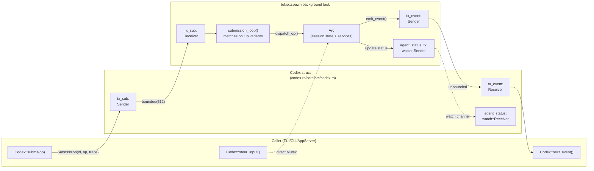
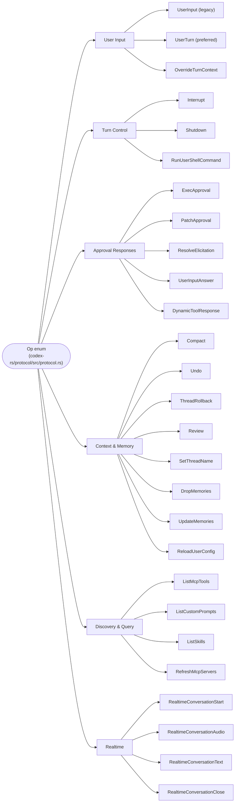
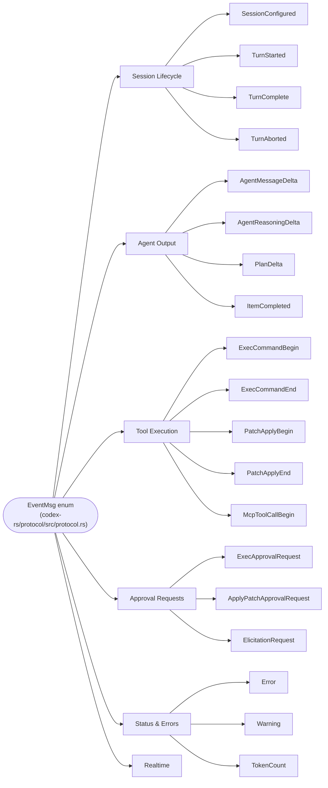
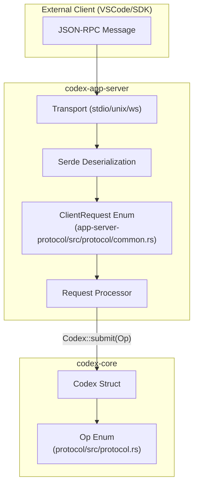
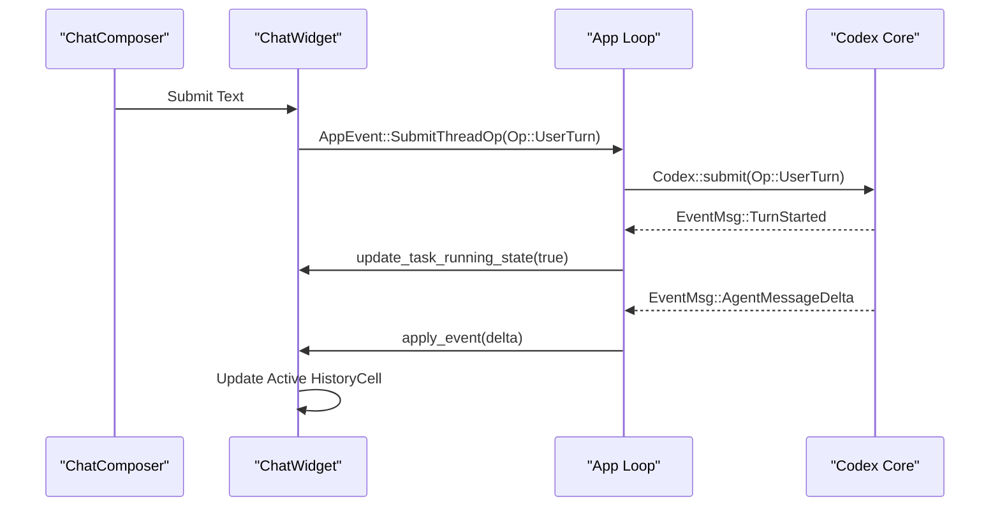

# Protocol Layer (Submission/Event System)

<details>
<summary>Relevant source files</summary>

The following files were used as context for generating this wiki page:

- [codex-rs/app-server-protocol/Cargo.toml](codex-rs/app-server-protocol/Cargo.toml)
- [codex-rs/app-server-protocol/schema/json/ClientRequest.json](codex-rs/app-server-protocol/schema/json/ClientRequest.json)
- [codex-rs/app-server-protocol/schema/json/ServerNotification.json](codex-rs/app-server-protocol/schema/json/ServerNotification.json)
- [codex-rs/app-server-protocol/schema/json/codex_app_server_protocol.schemas.json](codex-rs/app-server-protocol/schema/json/codex_app_server_protocol.schemas.json)
- [codex-rs/app-server-protocol/schema/json/codex_app_server_protocol.v2.schemas.json](codex-rs/app-server-protocol/schema/json/codex_app_server_protocol.v2.schemas.json)
- [codex-rs/app-server-protocol/schema/json/v2/CommandExecParams.json](codex-rs/app-server-protocol/schema/json/v2/CommandExecParams.json)
- [codex-rs/app-server-protocol/schema/json/v2/RawResponseItemCompletedNotification.json](codex-rs/app-server-protocol/schema/json/v2/RawResponseItemCompletedNotification.json)
- [codex-rs/app-server-protocol/schema/json/v2/ThreadForkParams.json](codex-rs/app-server-protocol/schema/json/v2/ThreadForkParams.json)
- [codex-rs/app-server-protocol/schema/json/v2/ThreadResumeParams.json](codex-rs/app-server-protocol/schema/json/v2/ThreadResumeParams.json)
- [codex-rs/app-server-protocol/schema/json/v2/ThreadStartParams.json](codex-rs/app-server-protocol/schema/json/v2/ThreadStartParams.json)
- [codex-rs/app-server-protocol/schema/json/v2/TurnStartParams.json](codex-rs/app-server-protocol/schema/json/v2/TurnStartParams.json)
- [codex-rs/app-server-protocol/schema/typescript/ClientRequest.ts](codex-rs/app-server-protocol/schema/typescript/ClientRequest.ts)
- [codex-rs/app-server-protocol/schema/typescript/ResponseItem.ts](codex-rs/app-server-protocol/schema/typescript/ResponseItem.ts)
- [codex-rs/app-server-protocol/schema/typescript/ServerNotification.ts](codex-rs/app-server-protocol/schema/typescript/ServerNotification.ts)
- [codex-rs/app-server-protocol/schema/typescript/v2/CommandExecParams.ts](codex-rs/app-server-protocol/schema/typescript/v2/CommandExecParams.ts)
- [codex-rs/app-server-protocol/schema/typescript/v2/ThreadForkParams.ts](codex-rs/app-server-protocol/schema/typescript/v2/ThreadForkParams.ts)
- [codex-rs/app-server-protocol/schema/typescript/v2/ThreadResumeParams.ts](codex-rs/app-server-protocol/schema/typescript/v2/ThreadResumeParams.ts)
- [codex-rs/app-server-protocol/schema/typescript/v2/ThreadStartParams.ts](codex-rs/app-server-protocol/schema/typescript/v2/ThreadStartParams.ts)
- [codex-rs/app-server-protocol/schema/typescript/v2/index.ts](codex-rs/app-server-protocol/schema/typescript/v2/index.ts)
- [codex-rs/app-server-protocol/src/lib.rs](codex-rs/app-server-protocol/src/lib.rs)
- [codex-rs/app-server-protocol/src/protocol/common.rs](codex-rs/app-server-protocol/src/protocol/common.rs)
- [codex-rs/app-server-protocol/src/protocol/mappers.rs](codex-rs/app-server-protocol/src/protocol/mappers.rs)
- [codex-rs/app-server-protocol/src/protocol/mod.rs](codex-rs/app-server-protocol/src/protocol/mod.rs)
- [codex-rs/app-server-protocol/src/protocol/v1.rs](codex-rs/app-server-protocol/src/protocol/v1.rs)
- [codex-rs/app-server/README.md](codex-rs/app-server/README.md)
- [codex-rs/app-server/src/bespoke_event_handling.rs](codex-rs/app-server/src/bespoke_event_handling.rs)
- [codex-rs/app-server/src/request_processors/initialize_processor.rs](codex-rs/app-server/src/request_processors/initialize_processor.rs)
- [codex-rs/app-server/tests/suite/v2/command_exec.rs](codex-rs/app-server/tests/suite/v2/command_exec.rs)
- [codex-rs/app-server/tests/suite/v2/connection_handling_websocket_unix.rs](codex-rs/app-server/tests/suite/v2/connection_handling_websocket_unix.rs)
- [codex-rs/app-server/tests/suite/v2/initialize.rs](codex-rs/app-server/tests/suite/v2/initialize.rs)
- [codex-rs/app-server/tests/suite/v2/thread_name_websocket.rs](codex-rs/app-server/tests/suite/v2/thread_name_websocket.rs)
- [codex-rs/protocol/src/models.rs](codex-rs/protocol/src/models.rs)
- [codex-rs/utils/image/src/error.rs](codex-rs/utils/image/src/error.rs)
- [codex-rs/utils/image/src/image_tests.rs](codex-rs/utils/image/src/image_tests.rs)
- [codex-rs/utils/image/src/lib.rs](codex-rs/utils/image/src/lib.rs)

</details>


## Purpose and Scope

This page documents the core communication protocol used between all user-facing interfaces and the `codex-core` agent: the `Submission`/`Event` queue pair, the `Op` and `EventMsg` enums that define every operation and notification, and the `Codex` struct's `submit`/`next_event` interface.

The protocol is defined in the `codex-protocol` crate ([codex-rs/protocol/src/protocol.rs]()) and implemented by the `Codex` struct in `codex-core`. Every client—the TUI, the headless exec mode, the app server, and the MCP server—talks to the agent exclusively through this interface.

- For how the agent uses this protocol internally to manage turns and session state, see **3.1 Codex Interface and Session Lifecycle**.
- For sandbox and approval policy types (`SandboxPolicy`, `AskForApproval`) that appear as `Op` fields, see **2.4 Sandbox and Approval Policies**.
- For how the TUI translates `EventMsg` into rendered history cells, see **4.1.2 ChatWidget and Conversation Display**.
- For how the app server translates `EventMsg` into JSON-RPC notifications, see **4.5.3 Event Translation and Streaming**.

Sources: [codex-rs/protocol/src/protocol.rs:1-5]()

---

## Core Abstractions

### `Submission` and `Op`

A `Submission` is the envelope placed on the submission queue. It pairs a unique correlation ID with an operation and optional distributed trace context [codex-rs/protocol/src/protocol.rs:125-133]().

```rust
pub struct Submission {
    /// Unique id for this Submission to correlate with Events
    pub id: String,
    /// Payload
    pub op: Op,
    /// Optional W3C trace carrier propagated across async submission handoffs.
    pub trace: Option<W3cTraceContext>,
}
```

The `trace` field enables distributed tracing across async submission handoffs. When present, it carries `traceparent` and `tracestate` headers for OpenTelemetry integration [codex-rs/protocol/src/protocol.rs:135-143]().

Sources: [codex-rs/protocol/src/protocol.rs:125-143]()

`Op` is a non-exhaustive enum covering every action a client can request, such as starting a turn, approving a tool call, or requesting a code review [codex-rs/protocol/src/protocol.rs:181-479]().

### `Event` and `EventMsg`

An `Event` is the envelope placed on the event queue. The `id` field echoes the `Submission.id` that triggered the event (where applicable) [codex-rs/protocol/src/protocol.rs:555-560]().

```rust
pub struct Event {
    pub id: String,
    pub msg: EventMsg,
}
```

`EventMsg` is the tagged union of every notification the agent can emit, including streaming message deltas, tool execution status, and approval requests [codex-rs/protocol/src/protocol.rs:563-1081]().

---

## The Async Queue Model

The protocol is implemented as a **Submission Queue / Event Queue** (SQ/EQ) pattern [codex-rs/protocol/src/protocol.rs:3-4]() backed by `async-channel` channels. This decouples callers from the agent's internal execution model.

**Queue Architecture: `Codex` struct, channels, and background task**



Sources: [codex-rs/protocol/src/protocol.rs:3-4](), [codex-rs/protocol/src/protocol.rs:125-133]()

| Channel | Type | Capacity | Direction | Purpose |
|---|---|---|---|---|
| Submission queue | `async_channel::bounded` | 512 | Caller → Session | Bounded to prevent memory pressure |
| Event queue | `async_channel::unbounded` | Unlimited | Session → Caller | Unbounded to never block agent execution |
| Agent status | `tokio::sync::watch` | 1 (latest value) | Session → Caller | Broadcast current agent status |

---

## `Codex` Interface

The `Codex` struct is the primary handle to a live agent session. 

| Method | Signature | Description |
|---|---|---|
| `spawn` | `async fn spawn(...)` | Creates the session, spawns `submission_loop`. |
| `submit` | `async fn submit(&self, op: Op)` | Wraps `op` in a `Submission` with a UUID v7 ID, sends it to the queue. |
| `submit_with_id` | `async fn submit_with_id(&self, submission: Submission)` | Submits a pre-formed `Submission`, allowing custom IDs for correlation [codex-rs/protocol/src/protocol.rs:125](). |
| `next_event` | `async fn next_event(&self)` | Awaits and returns the next event from the agent [codex-rs/protocol/src/protocol.rs:555](). |

Sources: [codex-rs/protocol/src/protocol.rs:125-133](), [codex-rs/protocol/src/protocol.rs:555-560]()

---

## Op Variants Reference

**`Op` enum taxonomy**



Sources: [codex-rs/protocol/src/protocol.rs:181-479]()

### Key Op Variants

| Variant | Key Fields | Notes |
|---|---|---|
| `UserInput` | `items`, `environments` | Legacy input variant used for session initialization [codex-rs/protocol/src/protocol.rs:185-196](). |
| `UserTurn` | `items`, `cwd`, `sandbox_policy`, `model` | Primary entry point for starting an agent turn [codex-rs/protocol/src/protocol.rs:198-216](). |
| `Interrupt` | — | Aborts the current turn [codex-rs/protocol/src/protocol.rs:242](). |
| `ExecApproval` | `id`, `decision` | Responds to a shell command approval request [codex-rs/protocol/src/protocol.rs:260-264](). |
| `PatchApproval` | `id`, `decision` | Responds to a file patch approval request [codex-rs/protocol/src/protocol.rs:266-270](). |

---

## EventMsg Variants Reference

**`EventMsg` enum taxonomy**



Sources: [codex-rs/protocol/src/protocol.rs:563-1081]()

### Key EventMsg Variants

| Variant | Key Fields | Notes |
|---|---|---|
| `TurnStarted` | `TurnStartedEvent` | Signals the beginning of a turn [codex-rs/protocol/src/protocol.rs:577](). |
| `AgentMessageDelta` | `AgentMessageDeltaEvent` | Streaming assistant text chunk [codex-rs/protocol/src/protocol.rs:608](). |
| `ExecCommandBegin` | `ExecCommandBeginEvent` | Shell command execution started [codex-rs/protocol/src/protocol.rs:664](). |
| `ExecApprovalRequest` | `ExecApprovalRequestEvent` | Agent is waiting for user approval to run a command [codex-rs/protocol/src/protocol.rs:821](). |
| `TurnComplete` | `TurnCompleteEvent` | Turn finished; contains final usage and text [codex-rs/protocol/src/protocol.rs:589](). |

---

## App Server Protocol (v2)

The `codex-app-server` exposes this protocol via JSON-RPC 2.0 messages [codex-rs/app-server/README.md:22](). It translates core `EventMsg` variants into bespoke server notifications [codex-rs/app-server/src/bespoke_event_handling.rs:135-150]().

### Request/Response Mapping

The app server defines a `ClientRequest` enum that wraps core operations into a JSON-RPC compatible structure [codex-rs/app-server-protocol/src/protocol/common.rs:176-189](). This is generated using `client_request_definitions!` macro [codex-rs/app-server-protocol/src/protocol/common.rs:181-189]().

**App-Server Request Routing Architecture**



Sources: [codex-rs/app-server/README.md:22-30](), [codex-rs/app-server-protocol/src/protocol/common.rs:176-189](), [codex-rs/app-server/src/bespoke_event_handling.rs:87-99]()

| App Server Method | Core Op | Notes |
|---|---|---|
| `thread/start` | `UserInput` | Initializes a new thread session [codex-rs/app-server/README.md:77](). |
| `turn/start` | `UserTurn` | Starts a conversation turn [codex-rs/app-server/README.md:79](). |
| `turn/interrupt` | `Interrupt` | Aborts the active turn [codex-rs/app-server/README.md:81](). |

### Event Translation

The `apply_bespoke_event_handling` function in `codex-app-server` coordinates the conversion of core events into `ServerNotification` payloads [codex-rs/app-server/src/bespoke_event_handling.rs:135-150]().

- **Streaming:** `AgentMessageDelta` is converted to `AgentMessageDeltaNotification` [codex-rs/app-server-protocol/schema/json/codex_app_server_protocol.v2.schemas.json:243-267]().
- **Approvals:** `ExecApprovalRequest` is translated into `CommandExecutionRequestApprovalParams` to prompt the user in the UI [codex-rs/app-server/src/bespoke_event_handling.rs:18-22]().
- **Rate Limits:** The server broadcasts `AccountRateLimitsUpdatedNotification` when usage limits change [codex-rs/app-server-protocol/src/protocol/v2.rs:14-16]().

Sources: [codex-rs/app-server/src/bespoke_event_handling.rs:1-150](), [codex-rs/app-server-protocol/src/protocol/common.rs:161-189](), [codex-rs/app-server/README.md:64-82]()

---

## TUI Event Coordination

The TUI uses an internal `AppEvent` bus to coordinate actions between the `ChatWidget`, `ChatComposer`, and the top-level `App` loop.



- **Submission:** When a user submits text, the `ChatComposer` handles the input buffer and triggers submission through the `ChatWidget`.
- **Status Tracking:** The TUI tracks `agent_turn_running` state to drive spinners and interrupt hints.
- **History Sync:** Slash commands are staged in local history before being dispatched as core `Op` variants.

Sources: [codex-rs/app-server/README.md:79-81](), [codex-rs/app-server/src/bespoke_event_handling.rs:135-150]()
