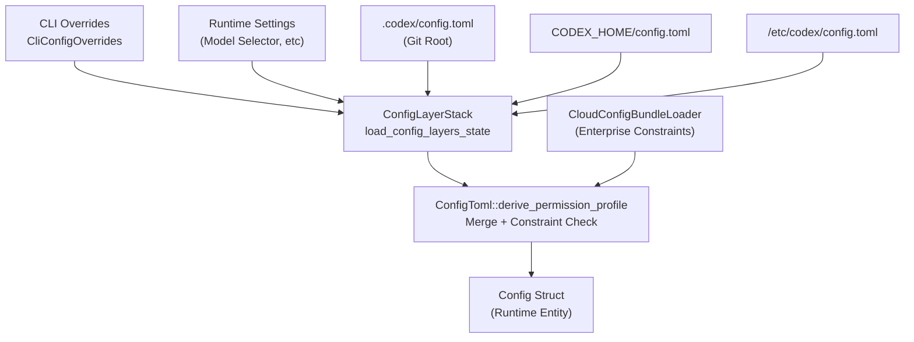
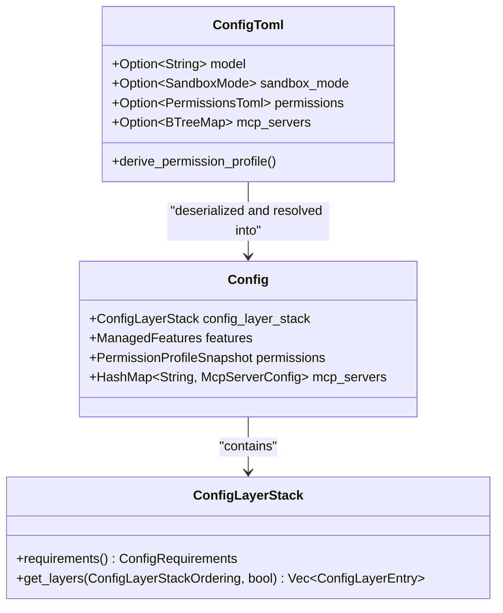
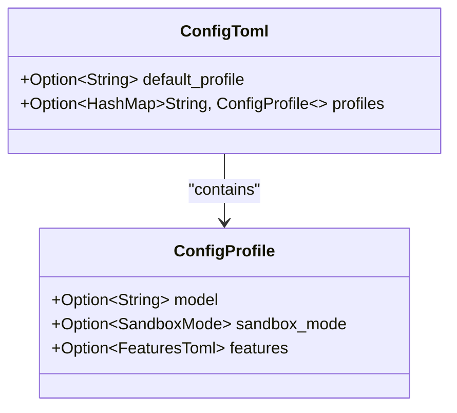
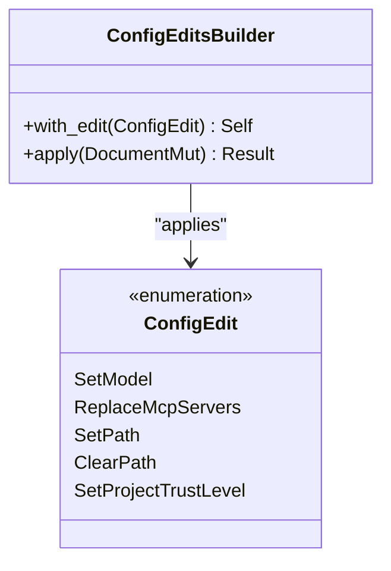

# Configuration System

<details>
<summary>Relevant source files</summary>

The following files were used as context for generating this wiki page:

- [codex-rs/app-server-protocol/schema/json/v2/ConfigRequirementsReadResponse.json](codex-rs/app-server-protocol/schema/json/v2/ConfigRequirementsReadResponse.json)
- [codex-rs/app-server-protocol/schema/typescript/v2/ConfigRequirements.ts](codex-rs/app-server-protocol/schema/typescript/v2/ConfigRequirements.ts)
- [codex-rs/app-server-protocol/src/protocol/v2/config.rs](codex-rs/app-server-protocol/src/protocol/v2/config.rs)
- [codex-rs/app-server-protocol/src/protocol/v2/tests.rs](codex-rs/app-server-protocol/src/protocol/v2/tests.rs)
- [codex-rs/app-server/src/config_manager.rs](codex-rs/app-server/src/config_manager.rs)
- [codex-rs/app-server/src/config_manager_service.rs](codex-rs/app-server/src/config_manager_service.rs)
- [codex-rs/app-server/src/config_manager_service_tests.rs](codex-rs/app-server/src/config_manager_service_tests.rs)
- [codex-rs/app-server/src/request_processors/config_processor.rs](codex-rs/app-server/src/request_processors/config_processor.rs)
- [codex-rs/cli/src/mcp_cmd.rs](codex-rs/cli/src/mcp_cmd.rs)
- [codex-rs/cli/tests/mcp_add_remove.rs](codex-rs/cli/tests/mcp_add_remove.rs)
- [codex-rs/cli/tests/mcp_list.rs](codex-rs/cli/tests/mcp_list.rs)
- [codex-rs/config/src/config_requirements.rs](codex-rs/config/src/config_requirements.rs)
- [codex-rs/config/src/config_toml.rs](codex-rs/config/src/config_toml.rs)
- [codex-rs/config/src/lib.rs](codex-rs/config/src/lib.rs)
- [codex-rs/config/src/loader/mod.rs](codex-rs/config/src/loader/mod.rs)
- [codex-rs/config/src/loader/tests.rs](codex-rs/config/src/loader/tests.rs)
- [codex-rs/config/src/profile_toml.rs](codex-rs/config/src/profile_toml.rs)
- [codex-rs/config/src/schema.rs](codex-rs/config/src/schema.rs)
- [codex-rs/config/src/state.rs](codex-rs/config/src/state.rs)
- [codex-rs/config/src/types.rs](codex-rs/config/src/types.rs)
- [codex-rs/config/src/types_tests.rs](codex-rs/config/src/types_tests.rs)
- [codex-rs/core-api/src/lib.rs](codex-rs/core-api/src/lib.rs)
- [codex-rs/core/config.schema.json](codex-rs/core/config.schema.json)
- [codex-rs/core/src/config/config_loader_tests.rs](codex-rs/core/src/config/config_loader_tests.rs)
- [codex-rs/core/src/config/config_tests.rs](codex-rs/core/src/config/config_tests.rs)
- [codex-rs/core/src/config/mod.rs](codex-rs/core/src/config/mod.rs)
- [codex-rs/core/src/session/config_lock.rs](codex-rs/core/src/session/config_lock.rs)
- [codex-rs/core/tests/suite/remote_env.rs](codex-rs/core/tests/suite/remote_env.rs)
- [codex-rs/exec-server/src/environment_path.rs](codex-rs/exec-server/src/environment_path.rs)
- [codex-rs/exec-server/src/fs_helper.rs](codex-rs/exec-server/src/fs_helper.rs)
- [codex-rs/exec-server/src/fs_sandbox.rs](codex-rs/exec-server/src/fs_sandbox.rs)
- [codex-rs/exec-server/src/local_file_system.rs](codex-rs/exec-server/src/local_file_system.rs)
- [codex-rs/exec-server/src/remote_file_system.rs](codex-rs/exec-server/src/remote_file_system.rs)
- [codex-rs/exec-server/src/sandboxed_file_system.rs](codex-rs/exec-server/src/sandboxed_file_system.rs)
- [codex-rs/exec-server/src/server/file_system_handler.rs](codex-rs/exec-server/src/server/file_system_handler.rs)
- [codex-rs/exec-server/tests/file_system.rs](codex-rs/exec-server/tests/file_system.rs)
- [codex-rs/features/src/feature_configs.rs](codex-rs/features/src/feature_configs.rs)
- [codex-rs/features/src/lib.rs](codex-rs/features/src/lib.rs)
- [codex-rs/features/src/tests.rs](codex-rs/features/src/tests.rs)
- [codex-rs/thread-manager-sample/src/main.rs](codex-rs/thread-manager-sample/src/main.rs)
- [codex-rs/tui/src/debug_config.rs](codex-rs/tui/src/debug_config.rs)
- [docs/config.md](docs/config.md)
- [docs/example-config.md](docs/example-config.md)
- [docs/skills.md](docs/skills.md)
- [docs/slash_commands.md](docs/slash_commands.md)

</details>


## Purpose and Scope

The Configuration System manages all runtime settings for Codex, including model selection, sandbox policies, feature flags, MCP server connections, and permission profiles. It implements a layered configuration model where settings from multiple sources (CLI arguments, environment variables, project files, global files, and built-in defaults) are merged with well-defined precedence rules.

For feature flag management specifically, see [Feature Flags](2.3). For sandbox execution policies, see [Sandbox and Approval Policies](2.4).

---

## Configuration Architecture

### Configuration Sources and Precedence

Configuration is assembled from multiple layers, each with decreasing precedence. The system resolves these layers to form a single effective configuration at runtime.

| Priority | Layer | Source | Scope |
|----------|-------|--------|-------|
| 1 | Runtime/CLI | `--config` flags, model selector in UI, CLI overrides | Per-invocation [codex-rs/core/src/config/mod.rs:145-149]() |
| 2 | Repo | `$(git rev-parse --show-toplevel)/.codex/config.toml` | Repository [codex-rs/core/src/config/mod.rs:11-13]() |
| 3 | Tree | Parent directories searching for `./.codex/config.toml` | Directory Tree [codex-rs/core/src/config/mod.rs:11-13]() |
| 4 | CWD | `${PWD}/config.toml` | Local [codex-rs/core/src/config/mod.rs:11-13]() |
| 5 | User | `${CODEX_HOME}/config.toml` | User Global [codex-rs/core/src/config/mod.rs:11-13]() |
| 6 | System | `/etc/codex/config.toml` (Unix) or `%ProgramData%` | Machine [codex-rs/core/src/config/mod.rs:11-13]() |
| 7 | Admin | Managed preferences (macOS profiles) | Managed [codex-rs/core/src/config/mod.rs:11-13]() |

Sources: [codex-rs/core/src/config/mod.rs:11-18](), [codex-rs/core/src/config/config_tests.rs:171-186]()

### Configuration Layer Merging

The `ConfigLayerStack` merges TOML values from all sources where higher-priority layers override lower-priority ones.



**Diagram: Configuration Layer Merging Flow**

The system validates the merged configuration against `requirements.toml` or cloud-hosted requirements (for Enterprise/Business users) using `CloudConfigBundleLoader` [codex-rs/core/src/config/mod.rs:10-15](). Cloud requirements ensure workspace-managed policies are enforced by constraining allowed values for sandbox modes, approval policies, and features [codex-rs/config/src/config_requirements.rs:144-165]().

Sources: [codex-rs/core/src/config/mod.rs:10-18](), [codex-rs/core/src/config/config_tests.rs:171-186](), [codex-rs/config/src/config_requirements.rs:144-165]()

---

## Config Loading Process

### Data Flow and Entities

The configuration process transforms raw TOML data into structured, validated Rust entities used by the core agent.



**Diagram: Config Entities Relationship**

### Build Process

The configuration loading orchestrates several steps:

1.  **Resolve Paths**: Determine `codex_home` and `cwd`. Relative paths in overrides are resolved against the `cwd` [codex-rs/core/src/config/config_tests.rs:177-187]().
2.  **Load Layers**: Call `load_config_layers_state()` to read all configuration files into a `ConfigLayerStack` [codex-rs/core/src/config/mod.rs:34-34]().
3.  **Deserialize**: Convert merged TOML into `ConfigToml`. The system uses `AbsolutePathBuf` to ensure paths in TOML (like `AgentRoleToml.config_file`) are resolved correctly [codex-rs/core/config.schema.json:12-19]().
4.  **Apply Constraints**: Validate against `ConfigRequirements` (e.g., `allowed_sandbox_modes` or `allowed_web_search_modes`) [codex-rs/core/src/config/mod.rs:14-15](), [codex-rs/tui/src/debug_config.rs:120-148]().
5.  **Construct Config**: Build the final `Config` object, including initialized `ManagedFeatures` and `ModelsManagerConfig` [codex-rs/core/src/config/mod.rs:79-141]().

Sources: [codex-rs/core/src/config/mod.rs:10-36](), [codex-rs/core/src/config/config_tests.rs:171-186](), [codex-rs/core/config.schema.json:1-100](), [codex-rs/tui/src/debug_config.rs:60-202]()

---

## The Config Struct

### Primary Fields

The `Config` struct (often referred to via the `codex_core::config` module) is the source of truth for all components at runtime.

| Field Category | Key Fields | Description |
|----------------|-----------|-------------|
| **Provenance** | `config_layer_stack` | The full stack of sources used to build the config [codex-rs/core/src/config/mod.rs:12](). |
| **Model** | `model`, `model_provider` | Primary LLM selection and provider info [codex-rs/config/src/config_toml.rs:140-146](). |
| **Permissions** | `permissions` | Sandbox policies and approval requirements resolved into a `PermissionProfileSnapshot` [codex-rs/core/src/config/mod.rs:159](). |
| **Features** | `features` | Centralized feature flag state (`ManagedFeatures`) [codex-rs/core/src/config/mod.rs:153](). |
| **Tools** | `mcp_servers` | External tool configuration and MCP server registry [codex-rs/config/src/config_toml.rs:17-17](). |
| **Memories** | `memories` | Configuration for the memory system [codex-rs/config/src/config_toml.rs:18-18](). |

Sources: [codex-rs/core/src/config/mod.rs:10-159](), [codex-rs/config/src/config_toml.rs:17-200]()

---

## Configuration Profiles

### Profile Definition

Configuration profiles group related settings that can be activated together via the `profiles` table in `config.toml`.



**Diagram: Configuration Profile Structure**

Profile settings allow switching between different environments (e.g., a "dev" profile with local models vs a "prod" profile with cloud models) [codex-rs/config/src/config_toml.rs:9-9](). Profiles are resolved using `ProfileV2Name` [codex-rs/core/src/config/mod.rs:21]().

Sources: [codex-rs/config/src/config_toml.rs:9-10](), [codex-rs/config/src/profile_toml.rs:1-36](), [codex-rs/core/src/config/mod.rs:21]()

---

## MCP Server Configuration

### MCP Server Definition

MCP servers are defined in the `[mcp_servers]` table. Each entry specifies a transport (Stdio or StreamableHttp) and tool-specific settings [codex-rs/config/src/config_toml.rs:17-17]().

```toml
[mcp_servers.docs]
transport = { type = "stdio", command = "docs-server", args = [] }
supports_parallel_tool_calls = true
default_tools_approval_mode = "approve"

[mcp_servers.docs.tools.search]
approval_mode = "prompt"
```

Sources: [codex-rs/core/src/config/config_tests.rs:113-162](), [codex-rs/cli/src/mcp_cmd.rs:9-12]()

### MCP CLI and Editing

The `McpCli` (accessible via `codex mcp`) manages MCP servers. Subcommands like `add`, `remove`, `login`, and `logout` use `ConfigEditsBuilder` to persist changes to the global `config.toml` [codex-rs/cli/src/mcp_cmd.rs:34-41]().

Sources: [codex-rs/cli/src/mcp_cmd.rs:34-41](), [codex-rs/core/src/config/mod.rs:3-3]()

---

## Configuration Editing and Persistence

### ConfigEdit Operations

The `ConfigEditsBuilder` handles programmatic updates to `config.toml`, ensuring that formatting is preserved using `toml_edit` [codex-rs/core/src/config/edit.rs:19-23]().



**Diagram: Configuration Editing Architecture**

Discrete mutations include updating the model, service tier, personality, and acknowledging various system notices [codex-rs/core/src/config/edit.rs:31-77](). Atomic writes are performed via `write_atomically` to prevent file corruption [codex-rs/core/src/config/edit.rs:2-2]().

Sources: [codex-rs/core/src/config/edit.rs:1-77](), [codex-rs/core/src/config/config_tests.rs:3-6]()

---

## Cloud Requirements

For Business and Enterprise users, Codex can fetch requirements from a cloud-managed bundle [codex-rs/core/src/config/mod.rs:10-10]().

*   **Requirements Stack**: Admins can enforce top-level constraints in `requirements.toml` that override user-level `config.toml` [docs/config.md:9-15]().
*   **Lifecycle Hooks**: Managed hooks can be enforced by setting `allow_managed_hooks_only = true` in requirements [docs/config.md:11-13]().
*   **Constraint Logic**: Values are validated using `ConstrainedWithSource<T>`, which tracks both the allowed value range and the `RequirementSource` (e.g., `SystemRequirementsToml` or `EnterpriseManaged`) [codex-rs/config/src/config_requirements.rs:26-50]().

Sources: [codex-rs/core/src/config/mod.rs:10-15](), [docs/config.md:9-15](), [codex-rs/config/src/config_requirements.rs:26-165]()

---

## Configuration File Locations

| File | Purpose |
|------|---------|
| `~/.codex/config.toml` | Global user configuration [codex-rs/config/src/config_toml.rs:136-139](). |
| `.codex/config.toml` | Project-specific overrides [codex-rs/core/src/config/config_tests.rs:7-14](). |
| `config.schema.json` | JSON Schema for validation and IDE support [codex-rs/core/config.schema.json:1-10](). |
| `requirements.toml` | Admin-enforced constraints and managed hooks [docs/config.md:11-15](). |

Sources: [codex-rs/config/src/config_toml.rs:136-139](), [codex-rs/core/src/config/config_tests.rs:7-14](), [codex-rs/core/config.schema.json:1-10](), [docs/config.md:11-15]()
