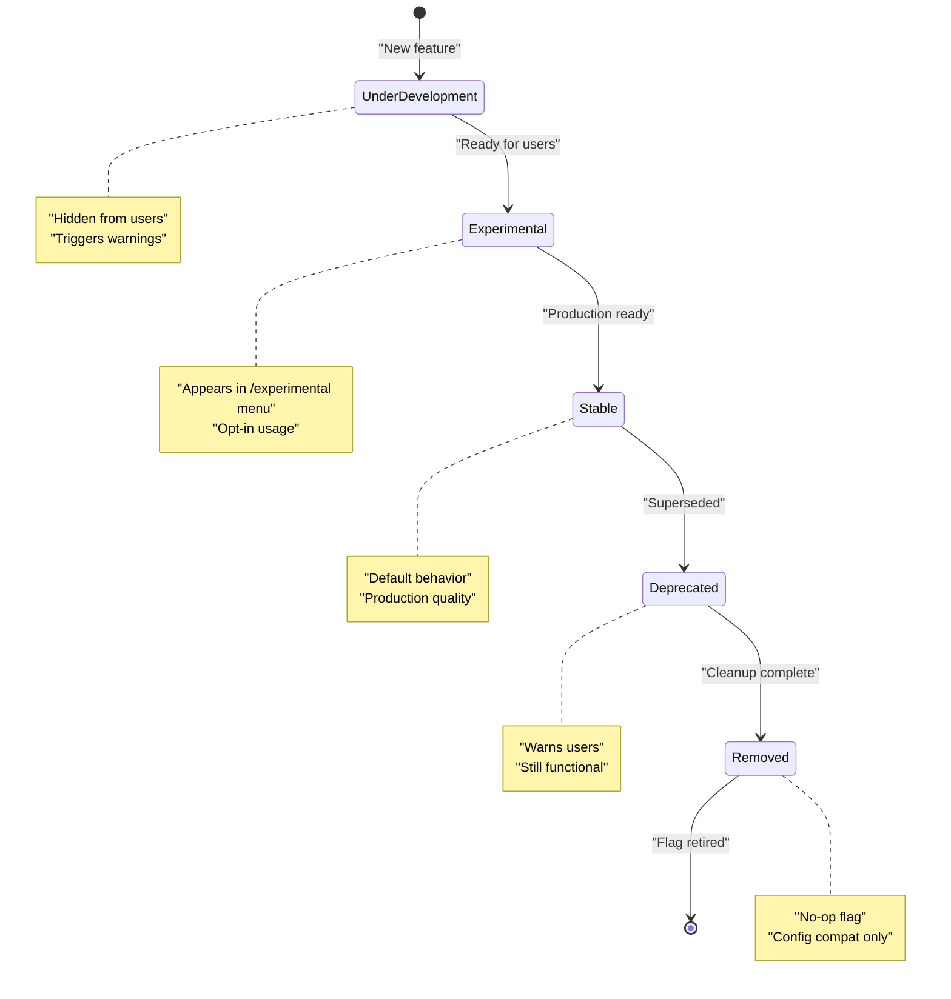
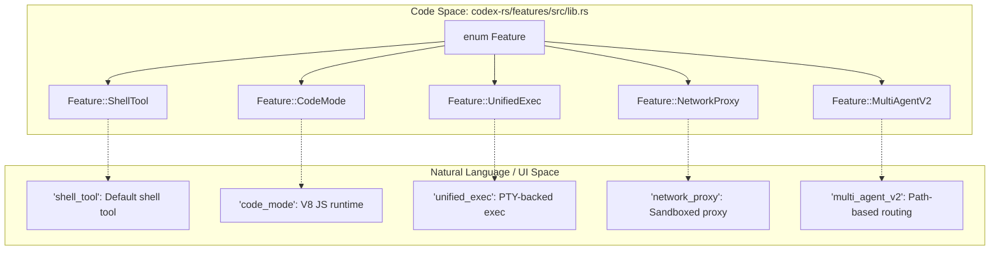
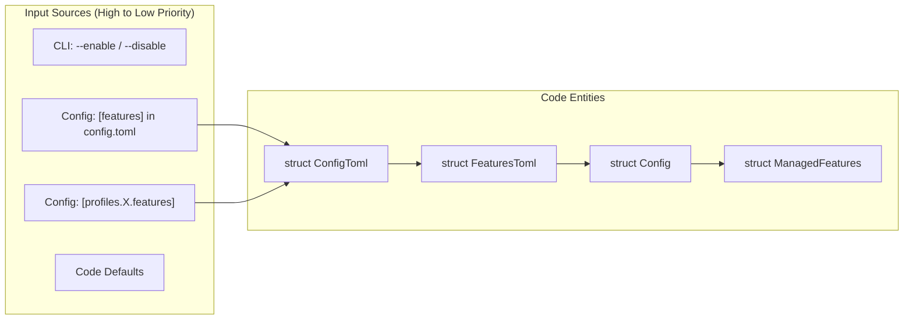

# Feature Flags

Relevant source files

The following files were used as context for generating this wiki page:

- [codex-rs/config/src/config_toml.rs](codex-rs/config/src/config_toml.rs)
- [codex-rs/config/src/profile_toml.rs](codex-rs/config/src/profile_toml.rs)
- [codex-rs/config/src/schema.rs](codex-rs/config/src/schema.rs)
- [codex-rs/core-api/src/lib.rs](codex-rs/core-api/src/lib.rs)
- [codex-rs/core/config.schema.json](codex-rs/core/config.schema.json)
- [codex-rs/core/src/config/config_tests.rs](codex-rs/core/src/config/config_tests.rs)
- [codex-rs/core/src/config/mod.rs](codex-rs/core/src/config/mod.rs)
- [codex-rs/core/src/session/config_lock.rs](codex-rs/core/src/session/config_lock.rs)
- [codex-rs/features/src/feature_configs.rs](codex-rs/features/src/feature_configs.rs)
- [codex-rs/features/src/lib.rs](codex-rs/features/src/lib.rs)
- [codex-rs/features/src/tests.rs](codex-rs/features/src/tests.rs)
- [codex-rs/thread-manager-sample/src/main.rs](codex-rs/thread-manager-sample/src/main.rs)

This document describes the feature flag system used throughout Codex to gate experimental, optional, and platform-specific functionality. Feature flags enable progressive feature rollout through well-defined lifecycle stages and provide users with fine-grained control over which capabilities are active in their sessions.

For information about configuring individual features, see the [Configuration System (2.2)]().

---

## Overview

The feature flag system centralizes toggles for experimental and optional behavior across the codebase. Instead of scattering boolean configuration fields throughout multiple modules, Codex defines features in a centralized registry with consistent metadata including lifecycle stage, default state, and canonical key.

Features are managed through the `Features` struct [codex-rs/features/src/lib.rs:66-66](), which maintains an enabled set and tracks legacy usage patterns for deprecation warnings. The system supports multiple configuration sources with well-defined precedence, automatic dependency resolution, and graceful handling of deprecated feature keys via `LegacyFeatureToggles` [codex-rs/features/src/lib.rs:26-26]().

**Sources:** [codex-rs/features/src/lib.rs:1-76]()

---

## Feature Lifecycle Stages

Each feature progresses through a defined lifecycle, represented by the `Stage` enum [codex-rs/features/src/lib.rs:31-46](). The stage determines visibility, stability guarantees, and user-facing presentation.

### Feature Lifecycle State Machine
Title: Feature Flag Lifecycle Stages

### Stage Definitions

| Stage | Visibility | Default State | Purpose |
|-------|-----------|---------------|---------|
| `UnderDevelopment` | Internal only | `false` | Features still under development, not ready for external use [codex-rs/features/src/lib.rs:33-33](). |
| `Experimental` | `/experimental` menu | `false` | Experimental features made available through the UI [codex-rs/features/src/lib.rs:35-39](). |
| `Stable` | Standard config | Varies | Stable features; flag kept for ad-hoc toggling [codex-rs/features/src/lib.rs:41-41](). |
| `Deprecated` | Standard config | `false` | Feature should no longer be used [codex-rs/features/src/lib.rs:43-43](). |
| `Removed` | Config compat | `false` | Useless flag kept for backward compatibility [codex-rs/features/src/lib.rs:45-45](). |

**Sources:** [codex-rs/features/src/lib.rs:29-74]()

---

## Feature Registry

All features are defined in the `Feature` enum [codex-rs/features/src/lib.rs:78-223](). This registry maps internal logic to user-facing keys.

### Code Entity Mapping: Feature Registry
Title: Mapping Feature Enums to Registry Metadata

### Feature Definitions

The registry includes a wide variety of capabilities:
- **Stable Tools**: `ShellTool` [codex-rs/features/src/lib.rs:81-81](), `CodexHooks` [codex-rs/features/src/lib.rs:83-83]().
- **Execution & Sandboxing**: `CodeMode` [codex-rs/features/src/lib.rs:87-87](), `UnifiedExec` [codex-rs/features/src/lib.rs:91-91](), `NetworkProxy` [codex-rs/features/src/lib.rs:135-135](), `UseLegacyLandlock` [codex-rs/features/src/lib.rs:117-119]().
- **Agent Orchestration**: `MultiAgentV2` [codex-rs/features/src/lib.rs:139-139](), `GuardianApproval` [codex-rs/features/src/tests.rs:128-133]().
- **External Connectors**: `Apps` [codex-rs/features/src/lib.rs:143-143](), `EnableMcpApps` [codex-rs/features/src/lib.rs:145-145](), `Plugins` [codex-rs/features/src/lib.rs:157-157]().

**Sources:** [codex-rs/features/src/lib.rs:76-223](), [codex-rs/features/src/tests.rs:128-133]()

---

## Configuration Sources and Precedence

Features are integrated into the primary configuration system. The `ConfigToml` struct includes a `features` field which holds a `FeaturesToml` [codex-rs/config/src/config_toml.rs:201-201]().

### Data Flow: Feature Toggle Merging
Title: Feature Flag Configuration Precedence

### Configuration Examples

**Features table in `config.toml`:**
The `FeaturesToml` struct [codex-rs/features/src/lib.rs:67-67]() allows users to enable/disable specific keys. It also supports complex feature-specific configuration blocks via `FeatureToml::Config` [codex-rs/core/src/session/config_lock.rs:150-150]().

**Cloud-Managed Requirements:**
The system can load `FeatureRequirementsToml` [codex-rs/core/src/config/mod.rs:18-18]() which enforces specific feature states regardless of user preference, often used for enterprise security policies like forcing `NetworkProxy`.

**Sources:** [codex-rs/config/src/config_toml.rs:139-201](), [codex-rs/core/src/config/mod.rs:10-27](), [codex-rs/core/src/session/config_lock.rs:144-155]()

---

## Runtime Feature Detection

During a session, feature state is materialized into the `Config` and accessed via the `features.enabled(Feature::...)` pattern [codex-rs/core/src/session/config_lock.rs:149-149]().

### Dependency Resolution
The system handles dependencies between flags. For instance, `CodeModeOnly` automatically requires `CodeMode` during normalization [codex-rs/features/src/tests.rs:118-125]().

### Feature-Specific Configurations
Some features require complex structured data defined in `feature_configs.rs`:
- **`NetworkProxyConfigToml`**: Configures domain permissions, proxy URLs, and SOCKS5 modes [codex-rs/features/src/feature_configs.rs:82-107]().
- **`MultiAgentV2ConfigToml`**: Configures routing, timeouts, and usage hints for sub-agents [codex-rs/features/src/feature_configs.rs:29-59]().
- **`CodeModeConfigToml`**: Configures the V8 execution environment and tool exclusions [codex-rs/features/src/feature_configs.rs:9-15]().

**Sources:** [codex-rs/features/src/feature_configs.rs:9-117](), [codex-rs/features/src/tests.rs:118-125](), [codex-rs/core/src/session/config_lock.rs:148-155]()

---

## Legacy Feature Support

The feature system maintains backwards compatibility for renamed or restructured feature keys.

### Common Legacy Aliases
| Legacy Key | Current Feature | Context |
|-----------|-----------------|---------|
| `apply_patch_freeform` | `Feature::ApplyPatchFreeform` | Removed/Deprecated [codex-rs/features/src/tests.rs:70-77](). |
| `use_legacy_landlock` | `Feature::UseLegacyLandlock` | Deprecated Linux sandbox fallback [codex-rs/features/src/tests.rs:46-49](). |
| `terminal_resize_reflow` | `Feature::TerminalResizeReflow` | Experimental but enabled by default [codex-rs/features/src/tests.rs:164-174](). |
| `tool_search` | `Feature::ToolSearch` | Removed compatibility flag; now always enabled [codex-rs/features/src/lib.rs:149-149](). |

**Sources:** [codex-rs/features/src/tests.rs:46-77, 164-174](), [codex-rs/features/src/lib.rs:149-149]()

---

## Experimental Menu Integration

Features in the `Experimental` stage are surfaced to users via the `/experimental` menu in the TUI.

- **`experimental_menu_name()`**: Returns the display name for the UI [codex-rs/features/src/lib.rs:49-54]().
- **`experimental_menu_description()`**: Returns help text for the user [codex-rs/features/src/lib.rs:56-63]().
- **`experimental_announcement()`**: Optional text shown when the feature is first toggled [codex-rs/features/src/lib.rs:65-73]().

**Sources:** [codex-rs/features/src/lib.rs:48-74]()

---

## Config Locking and Replay

Feature states are a critical part of the session contract and are persisted in the `ConfigLockfileToml` [codex-rs/core/src/session/config_lock.rs:72-77]().

When a session is replayed or validated, the `materialize_resolved_enabled` function [codex-rs/core/src/session/config_lock.rs:146-146]() ensures that the features active during the original run are restored, preventing drift when legacy keys or defaults change.

**Sources:** [codex-rs/core/src/session/config_lock.rs:71-167]()
