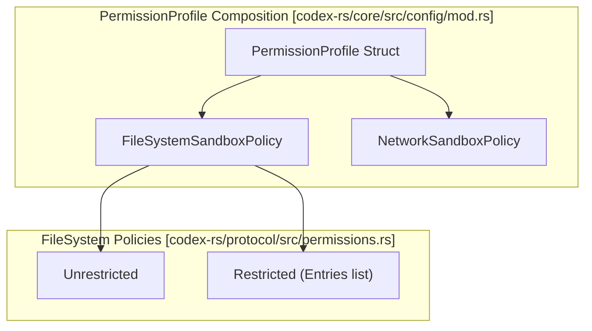
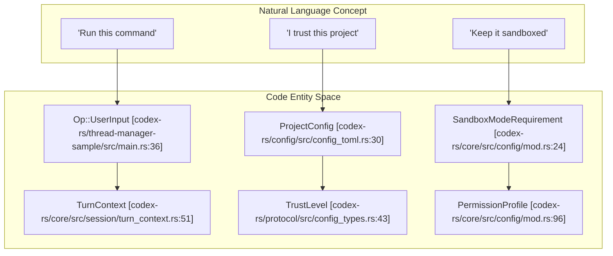

# Sandbox and Approval Policies

<details>
<summary>Relevant source files</summary>

The following files were used as context for generating this wiki page:

- [codex-rs/config/Cargo.toml](codex-rs/config/Cargo.toml)
- [codex-rs/config/src/config_toml.rs](codex-rs/config/src/config_toml.rs)
- [codex-rs/config/src/permissions_toml.rs](codex-rs/config/src/permissions_toml.rs)
- [codex-rs/config/src/profile_toml.rs](codex-rs/config/src/profile_toml.rs)
- [codex-rs/config/src/schema.rs](codex-rs/config/src/schema.rs)
- [codex-rs/core-api/src/lib.rs](codex-rs/core-api/src/lib.rs)
- [codex-rs/core/config.schema.json](codex-rs/core/config.schema.json)
- [codex-rs/core/src/config/config_tests.rs](codex-rs/core/src/config/config_tests.rs)
- [codex-rs/core/src/config/mod.rs](codex-rs/core/src/config/mod.rs)
- [codex-rs/core/src/config/permissions.rs](codex-rs/core/src/config/permissions.rs)
- [codex-rs/core/src/config/permissions_tests.rs](codex-rs/core/src/config/permissions_tests.rs)
- [codex-rs/core/src/exec_policy.rs](codex-rs/core/src/exec_policy.rs)
- [codex-rs/core/src/exec_policy_tests.rs](codex-rs/core/src/exec_policy_tests.rs)
- [codex-rs/core/src/exec_policy_windows_tests.rs](codex-rs/core/src/exec_policy_windows_tests.rs)
- [codex-rs/core/src/network_proxy_loader.rs](codex-rs/core/src/network_proxy_loader.rs)
- [codex-rs/core/src/session/config_lock.rs](codex-rs/core/src/session/config_lock.rs)
- [codex-rs/core/src/tools/runtimes/shell/unix_escalation.rs](codex-rs/core/src/tools/runtimes/shell/unix_escalation.rs)
- [codex-rs/core/src/tools/runtimes/shell/unix_escalation_tests.rs](codex-rs/core/src/tools/runtimes/shell/unix_escalation_tests.rs)
- [codex-rs/core/tests/common/zsh_fork.rs](codex-rs/core/tests/common/zsh_fork.rs)
- [codex-rs/core/tests/suite/approvals.rs](codex-rs/core/tests/suite/approvals.rs)
- [codex-rs/core/tests/suite/exec_policy.rs](codex-rs/core/tests/suite/exec_policy.rs)
- [codex-rs/core/tests/suite/skill_approval.rs](codex-rs/core/tests/suite/skill_approval.rs)
- [codex-rs/core/tests/suite/unified_exec_zsh_fork_approvals.rs](codex-rs/core/tests/suite/unified_exec_zsh_fork_approvals.rs)
- [codex-rs/features/src/feature_configs.rs](codex-rs/features/src/feature_configs.rs)
- [codex-rs/features/src/lib.rs](codex-rs/features/src/lib.rs)
- [codex-rs/features/src/tests.rs](codex-rs/features/src/tests.rs)
- [codex-rs/protocol/src/permissions.rs](codex-rs/protocol/src/permissions.rs)
- [codex-rs/thread-manager-sample/src/main.rs](codex-rs/thread-manager-sample/src/main.rs)

</details>


This document explains the security mechanisms that control tool execution in Codex. **Sandbox Policies** determine filesystem and network access restrictions for shell commands and other tools, while **Approval Policies** determine when the user must explicitly authorize an action before execution. These systems work together to provide graduated trust levels from fully sandboxed read-only access to unrestricted execution.

## Overview of Security Policies

Codex uses two orthogonal policy systems that are set per-turn and control different aspects of tool execution:

| Policy Type | Purpose | Code Entity |
|------------|---------|----------------|
| `PermissionProfile` | Controls filesystem write access, network access, and execution environment | `codex_protocol::models::PermissionProfile` [codex-rs/core/src/config/mod.rs:96]() |
| `AskForApproval` | Controls when user approval is required before executing commands | `codex_protocol::protocol::AskForApproval` [codex-rs/core/src/config/mod.rs:102]() |

The `TurnContext` struct (and its corresponding `Permissions` container) encapsulates the effective security state for a single turn of an agent thread.

**Sources:** [codex-rs/core/src/config/mod.rs:87-104](), [codex-rs/core/config.schema.json:101-148](), [codex-rs/thread-manager-sample/src/main.rs:177-180]()

## Sandbox Policy System

### Policy Variants and Profiles

The system utilizes a granular `PermissionProfile` system. Built-in profiles provide standardized security levels that map to legacy sandbox modes:

| Profile Name | Mode | Description |
|--------------|-----------------|-------------|
| `BUILT_IN_READ_ONLY_PROFILE` | `ReadOnly` | Full disk read, no writes, no network [codex-rs/core/src/config/mod.rs:122]() |
| `BUILT_IN_WORKSPACE_PROFILE` | `WorkspaceWrite` | Full disk read, writes restricted to workspace/temp, optional network [codex-rs/core/src/config/mod.rs:123]() |
| `DANGER_FULL_ACCESS` | `DangerFullAccess` | No restrictions; full disk and network access [codex-rs/core/src/config/config_tests.rs:76]() |



**Sources:** [codex-rs/core/src/config/mod.rs:122-130](), [codex-rs/core/src/config/config_tests.rs:75-87](), [codex-rs/core/src/config/permissions.rs:119-125]()

### Managed Network and Proxy
For sandboxed sessions, Codex can start a managed network proxy. This is controlled by the `NetworkProxy` feature flag and configured via `NetworkProxyConfigToml` [codex-rs/features/src/lib.rs:135](). The system supports both HTTP and SOCKS5 proxy modes to enforce domain-based allow/deny lists for tools.

**Sources:** [codex-rs/features/src/lib.rs:134-135](), [codex-rs/features/src/feature_configs.rs:21-24](), [codex-rs/core/src/config/mod.rs:124-135]()

## Approval Policy System

### Policy Variants

The `AskForApproval` enum determines when user intervention is required. It supports a `Granular` mode to independently toggle different categories of prompts [codex-rs/core/src/exec_policy.rs:175-198]().

```mermaid
graph TB
    subgraph "AskForApproval Evaluation [codex-rs/core/src/exec_policy.rs]"
        Input["Command / Tool Call"]
        Policy{AskForApproval variant?}
        
        Granular["GranularApprovalConfig"]
        RulesCheck{"allows_rules_approval?"}
        SandboxCheck{"allows_sandbox_approval?"}
        
        Never["Never"]
        Reject["Reject with PROMPT_CONFLICT_REASON"]
        
        AskUser["Ask user / Auto-Review"]
    end
    
    Input --> Policy
    Policy -->|Granular| Granular
    Granular --> RulesCheck
    Granular --> SandboxCheck
    
    RulesCheck -->|False| Reject
    SandboxCheck -->|False| Reject
    
    Policy -->|Never| Never
    Never --> Reject
    
    RulesCheck -->|True| AskUser
end
```

**Sources:** [codex-rs/core/src/exec_policy.rs:174-197](), [codex-rs/core/src/tools/runtimes/shell/unix_escalation.rs:80-85]()

### Execution Policy Rules
Codex supports a rule-based execution policy defined in `.rules` files. The system checks if a command matches any prefix rules or heuristics before execution [codex-rs/core/src/exec_policy.rs:161-166]().

*   **Banned Prefixes:** The system maintains a list of `BANNED_PREFIX_SUGGESTIONS` (e.g., `sudo`, `python -c`, `bash -lc`) that are flagged for review if they attempt to bypass the shell bridge [codex-rs/core/src/exec_policy.rs:52-99]().
*   **Command Origin:** `ExecPolicyCommandOrigin` distinguishes between generic heuristics and PowerShell-specific heuristics for Windows command tokens [codex-rs/core/src/exec_policy.rs:109-118]().

**Sources:** [codex-rs/core/src/exec_policy.rs:43-136](), [codex-rs/core/src/exec_policy_tests.rs:194-213]()

## Implementation Details

### Multi-Layered Configuration
Security policies are resolved through a layered configuration stack (`ConfigLayerStack`). This includes user settings (`config.toml`), project-specific rules, and cloud-enforced requirements [codex-rs/core/src/config/mod.rs:12-18]().

### Approval Reviewers
When an approval is required, the `ApprovalsReviewer` setting determines the routing [codex-rs/config/src/config_toml.rs:164]():
- `user`: Traditional interactive prompt in the TUI or IDE.
- `auto_review` (formerly `guardian_subagent`): Uses a sub-agent to gather context and apply a risk-based decision framework [codex-rs/core/config.schema.json:183-191]().

**Sources:** [codex-rs/core/src/config/mod.rs:39](), [codex-rs/config/src/config_toml.rs:161-168](), [codex-rs/core/config.schema.json:183-191]()

### Mapping Natural Language to Code Entities

This diagram maps high-level security concepts to specific code entities and data structures used during policy resolution.



**Sources:** [codex-rs/core/src/config/mod.rs:22-43](), [codex-rs/config/src/config_toml.rs:135-194](), [codex-rs/thread-manager-sample/src/main.rs:11-64]()

## Platform-Specific Implementation

### Linux (Bubblewrap & Landlock)
On Linux, Codex defaults to **Bubblewrap** (`bwrap`) for isolation. 
- **Filesystem**: Read-only by default, with explicit writable roots provided via the `PermissionProfile`.
- **Network**: Isolated via network namespaces unless explicitly permitted.
- **Fallback**: The `UseLegacyLandlock` feature flag allows falling back to the Landlock-based sandbox if Bubblewrap is unavailable or unsupported on the host kernel [codex-rs/features/src/lib.rs:114-119]().

### Windows (Restricted Tokens)
On Windows, sandboxing uses restricted access tokens and private desktops [codex-rs/core/src/config/mod.rs:8-10]().
- **Sandbox Levels**: Configured via `WindowsSandboxLevel` (e.g., `None`, `Low`, `Medium`) [codex-rs/protocol/src/config_types.rs:94]().
- **Private Desktops**: Optional isolation of UI elements and window handles via `resolve_windows_sandbox_private_desktop` [codex-rs/core/src/config/mod.rs:10]().

**Sources:** [codex-rs/core/src/config/mod.rs:7-10](), [codex-rs/features/src/lib.rs:114-119](), [codex-rs/core/src/exec_policy.rs:113-118]()
