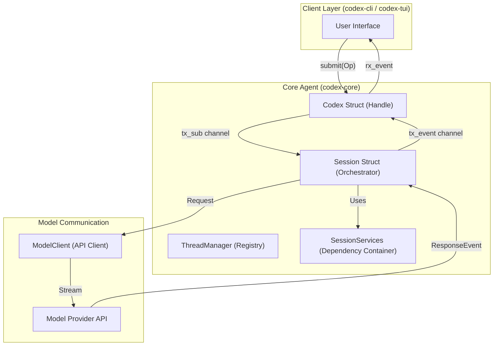

# Core Agent System (codex-core)

<details>
<summary>Relevant source files</summary>

The following files were used as context for generating this wiki page:

- [codex-rs/Cargo.lock](codex-rs/Cargo.lock)
- [codex-rs/Cargo.toml](codex-rs/Cargo.toml)
- [codex-rs/cli/Cargo.toml](codex-rs/cli/Cargo.toml)
- [codex-rs/cli/src/lib.rs](codex-rs/cli/src/lib.rs)
- [codex-rs/cli/src/main.rs](codex-rs/cli/src/main.rs)
- [codex-rs/core/Cargo.toml](codex-rs/core/Cargo.toml)
- [codex-rs/core/src/codex_thread.rs](codex-rs/core/src/codex_thread.rs)
- [codex-rs/core/src/lib.rs](codex-rs/core/src/lib.rs)
- [codex-rs/core/src/session/handlers.rs](codex-rs/core/src/session/handlers.rs)
- [codex-rs/core/src/session/mod.rs](codex-rs/core/src/session/mod.rs)
- [codex-rs/core/src/session/review.rs](codex-rs/core/src/session/review.rs)
- [codex-rs/core/src/session/session.rs](codex-rs/core/src/session/session.rs)
- [codex-rs/core/src/session/tests.rs](codex-rs/core/src/session/tests.rs)
- [codex-rs/core/src/session/turn.rs](codex-rs/core/src/session/turn.rs)
- [codex-rs/core/src/session/turn_context.rs](codex-rs/core/src/session/turn_context.rs)
- [codex-rs/core/src/state/mod.rs](codex-rs/core/src/state/mod.rs)
- [codex-rs/core/src/state/turn.rs](codex-rs/core/src/state/turn.rs)
- [codex-rs/core/src/tasks/compact.rs](codex-rs/core/src/tasks/compact.rs)
- [codex-rs/core/src/tasks/mod.rs](codex-rs/core/src/tasks/mod.rs)
- [codex-rs/core/src/tasks/regular.rs](codex-rs/core/src/tasks/regular.rs)
- [codex-rs/core/src/tasks/review.rs](codex-rs/core/src/tasks/review.rs)
- [codex-rs/core/tests/suite/codex_delegate.rs](codex-rs/core/tests/suite/codex_delegate.rs)
- [codex-rs/exec/Cargo.toml](codex-rs/exec/Cargo.toml)
- [codex-rs/exec/src/cli.rs](codex-rs/exec/src/cli.rs)
- [codex-rs/exec/src/event_processor.rs](codex-rs/exec/src/event_processor.rs)
- [codex-rs/exec/src/lib.rs](codex-rs/exec/src/lib.rs)
- [codex-rs/tools/src/tool_config.rs](codex-rs/tools/src/tool_config.rs)
- [codex-rs/tools/src/tool_config_tests.rs](codex-rs/tools/src/tool_config_tests.rs)
- [codex-rs/tui/Cargo.toml](codex-rs/tui/Cargo.toml)
- [codex-rs/tui/src/cli.rs](codex-rs/tui/src/cli.rs)
- [codex-rs/tui/src/lib.rs](codex-rs/tui/src/lib.rs)

</details>


The Core Agent System is the central orchestration layer of Codex, responsible for managing conversation turns, coordinating model API interactions, and maintaining session state. This document covers the fundamental architecture, execution flow, and key abstractions that power the Codex agent.

For information about specific user interfaces that interact with this system, see [User Interfaces](#4). For details about tool execution and approval workflows, see [Tool System](#5). For configuration and permissions, see [Sandbox and Approval Policies](#2.4).

## Architecture Overview

The Core Agent System implements a **Submission Queue / Event Queue** pattern for asynchronous communication between user interfaces and the agent. Users submit operations (such as user prompts or approval answers) through the `Codex` interface, and the agent emits events through a stream as work progresses.

### Submission/Event Pattern



**Sources:** [codex-rs/core/src/session/mod.rs:148-154](), [codex-rs/core/src/session/session.rs:21-41](), [codex-rs/core/src/state/mod.rs:1-10]()

### Key Components

| Component | Purpose | Location |
|-----------|---------|----------|
| `Codex` | Public API handle for a thread, holding IO channels (`tx_sub`, `rx_event`) and status. | [codex-rs/core/src/session/mod.rs:148-154]() |
| `Session` | Internal orchestrator that manages the state machine, active turns, and tool execution. | [codex-rs/core/src/session/mod.rs:42-42]() |
| `TurnContext` | Immutable context required for a single turn, including auth, model info, and features. | [codex-rs/core/src/session/turn_context.rs:55-106]() |
| `SessionTask` | Trait for async tasks driving a session turn (Regular, Review, Compact). | [codex-rs/core/src/tasks/mod.rs:208-224]() |
| `ThreadManager` | Responsible for creating threads and maintaining them in memory. | [codex-rs/core/src/core/src/lib.rs:109-118]() |
| `CodexThread` | Representation of a conversation thread within the core. | [codex-rs/core/src/codex_thread.rs:23-23]() |

**Sources:** [codex-rs/core/src/session/mod.rs:42-154](), [codex-rs/core/src/session/turn_context.rs:55-106](), [codex-rs/core/src/tasks/mod.rs:208-224](), [codex-rs/core/src/lib.rs:109-118]()

## Session Lifecycle

The `Codex` handle represents a single conversation thread. Sessions are managed via the `ThreadManager`, which handles spawning new threads or resuming from persistent rollouts.

```mermaid
stateDiagram-v2
    [*] --> StartThread: ThreadManager::start_thread()
    StartThread --> SessionInit: Session::new()
    SessionInit --> Idle: Session loop starts
    Idle --> ActiveTurn: Submission::UserInput
    ActiveTurn --> RunningTask: SessionTask::run()
    RunningTask --> ToolExecution: ToolRouter::handle()
    ToolExecution --> RunningTask: ToolOutput
    RunningTask --> Idle: TurnCompleteEvent
    Idle --> Terminated: CancellationToken triggered
    Terminated --> [*]
```

**Sources:** [codex-rs/core/src/session/session.rs:21-41](), [codex-rs/core/src/tasks/mod.rs:208-224](), [codex-rs/core/src/lib.rs:112-115]()

### Multi-Agent Coordination

Codex supports a multi-agent architecture where a primary session can delegate work to specialized sub-agents via `AgentControl`.

- **ReviewTask**: Specialized task that spawns a sub-agent conversation to analyze findings or perform safety reviews [codex-rs/core/src/tasks/review.rs:41-92]().
- **AgentControl**: Provides the capability to spawn new agents and manages the inter-agent communication layer [codex-rs/core/src/session/mod.rs:13-16]().
- **Sub-Agent Configuration**: Sub-agents can be notified using specific message formats to maintain context [codex-rs/core/src/session/mod.rs:38-38]().

**Sources:** [codex-rs/core/src/tasks/review.rs:41-92](), [codex-rs/core/src/session/mod.rs:13-38]()

## Model Client and API Communication

The `ModelClient` manages the lifecycle of model provider interactions. It creates a `ModelClientSession` per turn to stream responses.

- **Pre-Sampling Compaction**: Before a turn starts, the system checks if the thread exceeds token limits and runs `run_pre_sampling_compact` if necessary [codex-rs/core/src/session/turn.rs:149-155]().
- **Model Discovery**: `SharedModelsManager` handles fetching and caching available model information [codex-rs/core/src/tasks/mod.rs:39-39]().

**Sources:** [codex-rs/core/src/session/turn.rs:149-155](), [codex-rs/core/src/tasks/mod.rs:39-39]()

## Turn Execution and Prompt Construction

Every interaction in Codex is processed within a turn loop driven by a `SessionTask`.

### Turn Execution Flow
1. **Input Handling**: The session receives a `TurnInput` and initializes a `TurnContext` [codex-rs/core/src/session/turn.rs:135-142]().
2. **Context Injection**: Skills and plugins are injected into the prompt based on the current configuration and user mentions [codex-rs/core/src/session/turn.rs:7-37]().
3. **Sampling Loop**: `run_turn` enters a loop where the model emits `ResponseEvent` items (text or tool calls) [codex-rs/core/src/session/turn.rs:135-142]().
4. **Tool Execution**: Function calls are routed through the `ToolRouter` and results are fed back into the next sampling request [codex-rs/core/src/session/turn.rs:54-58]().

**Sources:** [codex-rs/core/src/session/turn.rs:7-142]()

### State and Persistence
- **Session State**: Tracks conversation history and active tasks like `ActiveTurn` [codex-rs/core/src/tasks/mod.rs:31-35]().
- **Rollout Persistence**: Sessions are backed by a `RolloutRecorder` which ensures that items are persisted to the state database [codex-rs/core/src/lib.rs:147-158]().
- **Token Usage**: Token counts are tracked per turn and recorded in telemetry via `TURN_TOKEN_USAGE_METRIC` [codex-rs/core/src/tasks/mod.rs:44-49]().

**Sources:** [codex-rs/core/src/tasks/mod.rs:31-49](), [codex-rs/core/src/lib.rs:147-158]()

## Core Subsystems

The following child pages cover major subsystems in detail:

- **[Codex Interface and Session Lifecycle](#3.1)**: Explains the `Codex` struct, submission loop, and thread management [codex-rs/core/src/session/mod.rs]().
- **[Model Client and API Communication](#3.2)**: Documents `ModelClient`, transport selection, and communication logic [codex-rs/core/src/lib.rs:179-180]().
- **[Turn Execution and Prompt Construction](#3.3)**: Explains turn context and prompt building [codex-rs/core/src/session/turn_context.rs]().
- **[Event Processing and State Management](#3.4)**: Documents `SessionState` and event emission [codex-rs/core/src/state/mod.rs]().
- **[Conversation History Management](#3.5)**: Explains history lifecycle and `ResponseItem` storage [codex-rs/core/src/session/mod.rs:107]().
- **[Thread Management and Multi-Agent](#3.6)**: Documents `ThreadManager` and sub-agent spawning [codex-rs/core/src/lib.rs:109-118]().
- **[Session Tasks and Turn State](#3.7)**: Explains the `SessionTask` trait and `TurnState` [codex-rs/core/src/tasks/mod.rs]().
- **[Models Manager](#3.8)**: Documents model discovery via `SharedModelsManager` [codex-rs/core/src/tasks/mod.rs:39]().
- **[Memories System](#3.9)**: Documents conversation memory extraction and injection [codex-rs/core/src/tasks/mod.rs:133-150]().
- **[Realtime Conversation](#3.10)**: Explains low-latency WebSocket/WebRTC interactions [codex-rs/core/src/session/mod.rs:37]().
- **[Hooks System](#3.11)**: Documents the Claude-style hooks engine for pre/post-tool execution [codex-rs/core/src/session/mod.rs:61-62]().
- **[Network Proxy](#3.12)**: Documents the `NetworkProxy` for sandboxed sessions [codex-rs/core/src/session/mod.rs:72-74]().
- **[Goal Extension and State Runtime](#3.13)**: Documents the goal tracking system and SQLite-backed runtime [codex-rs/core/src/lib.rs:139-141]().

**Sources:** [codex-rs/core/src/session/mod.rs](), [codex-rs/core/src/tasks/mod.rs](), [codex-rs/core/src/lib.rs]()
