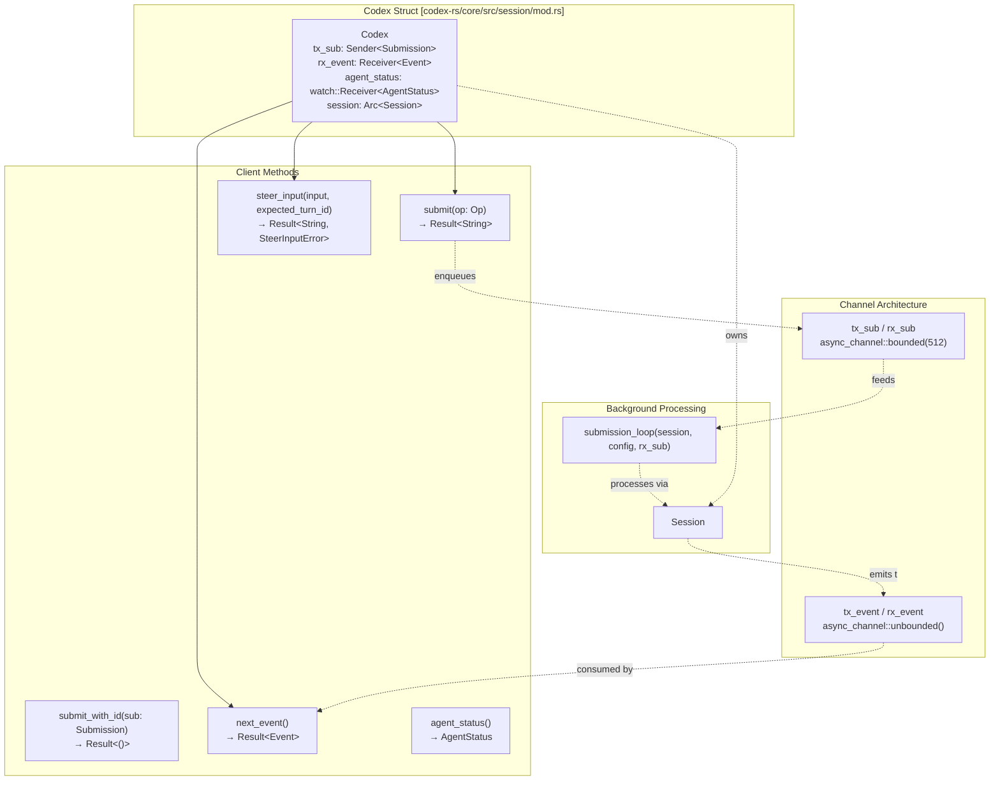
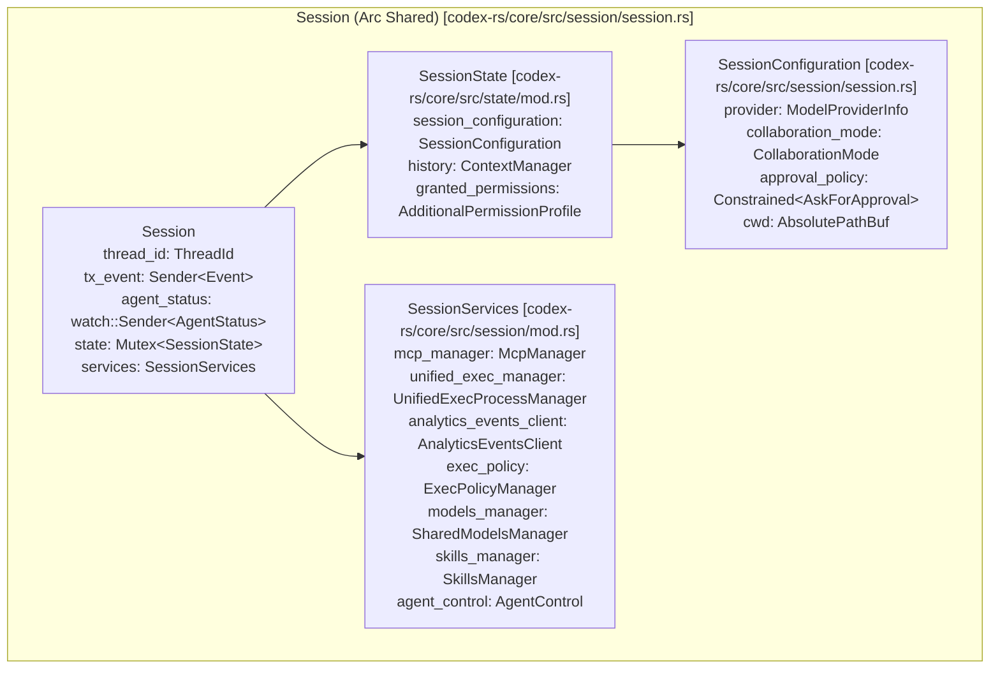
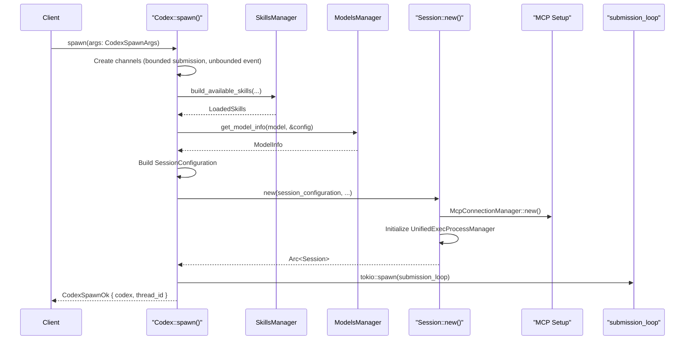
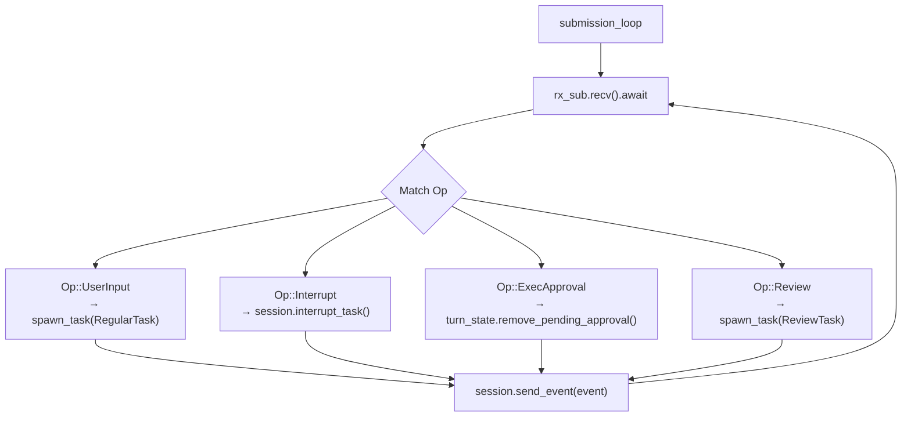

# Codex Interface and Session Lifecycle

Relevant source files

The following files were used as context for generating this wiki page:

- [codex-rs/core/src/agent/control.rs](codex-rs/core/src/agent/control.rs)
- [codex-rs/core/src/agent/control_tests.rs](codex-rs/core/src/agent/control_tests.rs)
- [codex-rs/core/src/codex_delegate.rs](codex-rs/core/src/codex_delegate.rs)
- [codex-rs/core/src/codex_thread.rs](codex-rs/core/src/codex_thread.rs)
- [codex-rs/core/src/prompt_debug.rs](codex-rs/core/src/prompt_debug.rs)
- [codex-rs/core/src/session/handlers.rs](codex-rs/core/src/session/handlers.rs)
- [codex-rs/core/src/session/mod.rs](codex-rs/core/src/session/mod.rs)
- [codex-rs/core/src/session/review.rs](codex-rs/core/src/session/review.rs)
- [codex-rs/core/src/session/session.rs](codex-rs/core/src/session/session.rs)
- [codex-rs/core/src/session/tests.rs](codex-rs/core/src/session/tests.rs)
- [codex-rs/core/src/session/tests/guardian_tests.rs](codex-rs/core/src/session/tests/guardian_tests.rs)
- [codex-rs/core/src/session/turn.rs](codex-rs/core/src/session/turn.rs)
- [codex-rs/core/src/session/turn_context.rs](codex-rs/core/src/session/turn_context.rs)
- [codex-rs/core/src/state/mod.rs](codex-rs/core/src/state/mod.rs)
- [codex-rs/core/src/state/service.rs](codex-rs/core/src/state/service.rs)
- [codex-rs/core/src/state/turn.rs](codex-rs/core/src/state/turn.rs)
- [codex-rs/core/src/tasks/compact.rs](codex-rs/core/src/tasks/compact.rs)
- [codex-rs/core/src/tasks/mod.rs](codex-rs/core/src/tasks/mod.rs)
- [codex-rs/core/src/tasks/regular.rs](codex-rs/core/src/tasks/regular.rs)
- [codex-rs/core/src/tasks/review.rs](codex-rs/core/src/tasks/review.rs)
- [codex-rs/core/src/thread_manager.rs](codex-rs/core/src/thread_manager.rs)
- [codex-rs/core/src/thread_manager_tests.rs](codex-rs/core/src/thread_manager_tests.rs)
- [codex-rs/core/src/tools/handlers/multi_agents_spec.rs](codex-rs/core/src/tools/handlers/multi_agents_spec.rs)
- [codex-rs/core/src/tools/handlers/multi_agents_spec_tests.rs](codex-rs/core/src/tools/handlers/multi_agents_spec_tests.rs)
- [codex-rs/core/src/tools/handlers/multi_agents_tests.rs](codex-rs/core/src/tools/handlers/multi_agents_tests.rs)
- [codex-rs/core/src/tools/handlers/multi_agents_v2.rs](codex-rs/core/src/tools/handlers/multi_agents_v2.rs)
- [codex-rs/core/src/tools/handlers/multi_agents_v2/message_tool.rs](codex-rs/core/src/tools/handlers/multi_agents_v2/message_tool.rs)
- [codex-rs/core/tests/suite/codex_delegate.rs](codex-rs/core/tests/suite/codex_delegate.rs)
- [codex-rs/rollout-trace/README.md](codex-rs/rollout-trace/README.md)
- [codex-rs/rollout-trace/src/tool_dispatch.rs](codex-rs/rollout-trace/src/tool_dispatch.rs)
- [codex-rs/tools/src/tool_config.rs](codex-rs/tools/src/tool_config.rs)
- [codex-rs/tools/src/tool_config_tests.rs](codex-rs/tools/src/tool_config_tests.rs)

This document describes the core interface for interacting with the Codex agent system and the complete lifecycle of a session from initialization through execution to shutdown. The `Codex` struct provides the public API for all user interfaces, while the `Session` manages the agent's execution context, state, and services.

## Core Components

### The Codex Public API

The `Codex` struct serves as the high-level interface to the Codex system, implementing a queue-pair pattern where clients submit operations and receive events asynchronously. It encapsulates the communication channels and the shared session state.

### Codex Public API Structure

**Key Responsibilities:**
- **Operation Submission**: `submit()` generates a unique submission ID and enqueues a `Submission` to the `tx_sub` channel [codex-rs/core/src/session/mod.rs:1044-1065]().
- **Event Consumption**: `next_event()` retrieves processed `Event` items from the `rx_event` receiver, blocking until available [codex-rs/core/src/session/mod.rs:1003-1005]().
- **Status Tracking**: The `agent_status` field is a `watch::Receiver<AgentStatus>` that provides real-time updates on whether the agent is idle, working, or stalled [codex-rs/core/src/session/mod.rs:983-985]().
- **Steer Input**: `steer_input()` allows users to provide feedback or corrections while a turn is still in progress [codex-rs/core/src/session/mod.rs:1067-1097]().

Sources: [codex-rs/core/src/session/mod.rs:967-1110](), [codex-rs/core/src/session/session.rs:21-43]()

### Session Architecture

The `Session` struct represents the core agent context, managing all state, services, and execution resources required for a single conversation thread.

### Session Structure

The `Session` coordinates all agent activities:
- **Mutable State**: `Mutex<SessionState>` protects the conversation history managed by `ContextManager`, token usage tracking, and granted permissions [codex-rs/core/src/session/session.rs:29-29]().
- **Session Configuration**: A snapshot of settings including model provider, sandbox policies, and working directory captured at initialization [codex-rs/core/src/session/session.rs:46-110]().
- **Session Services**: Shared infrastructure components defined in `SessionServices` like the `McpConnectionManager` for tool discovery, `UnifiedExecProcessManager` for process management, and `AgentControl` for multi-agent coordination [codex-rs/core/src/session/session.rs:42-42]().

Sources: [codex-rs/core/src/session/session.rs:21-43](), [codex-rs/core/src/session/session.rs:46-110]()

## Session Lifecycle Management

### Spawn, Resume, and Fork

The lifecycle of a thread begins with one of three entry points managed by the `ThreadManager` [codex-rs/core/src/thread_manager.rs:171-172]():

1.  **Spawn**: Creates a new `Codex` instance from scratch using `Codex::spawn` [codex-rs/core/src/session/mod.rs:1450-1455]().
2.  **Resume**: Restores a thread from persisted history in `ThreadStore` [codex-rs/core/src/thread_manager.rs:45-45]().
3.  **Fork**: Creates a new thread by cloning a specific point in an existing thread's history, often used for sub-agents or "what-if" scenarios [codex-rs/core/src/thread_manager.rs:128-147]().

### Initialization Sequence

**Initialization Stages:**
1.  **Skills Loading**: `SkillsManager` loads enabled skills for the working directory using `build_available_skills` [codex-rs/core/src/session/mod.rs:18-18]().
2.  **Model Resolution**: Retrieves model metadata (context window, capabilities) via `SharedModelsManager` [codex-rs/core/src/session/mod.rs:71-71]().
3.  **Rollout Persistence**: The session initializes a `RolloutRecorder` or connects to a `ThreadStore` to persist events [codex-rs/core/src/session/mod.rs:132-142]().
4.  **Submission Loop**: An asynchronous task is spawned to process `Submission` items from the queue [codex-rs/core/src/session/mod.rs:158-158]().

Sources: [codex-rs/core/src/session/mod.rs:1450-1700](), [codex-rs/core/src/session/session.rs:46-110](), [codex-rs/core/src/thread_manager.rs:171-172]()

## The Op/Event Communication Pattern

Codex uses a submission queue (SQ) / event queue (EQ) pattern to asynchronously communicate between the user interface and the agent.

### Submission Operations (`Op`)
Operations are requests from the user to the agent [codex-rs/core/src/codex_thread.rs:26-26]():
-   `UserInput`: Submit a new message or instruction with specific turn context [codex-rs/core/src/session/handlers.rs:129-144]().
-   `InterAgentCommunication`: Send messages between agents in a multi-agent session [codex-rs/core/src/agent/control.rs:166-170]().
-   `ExecApproval` / `ApplyPatchApproval`: Respond to permission requests [codex-rs/core/src/codex_delegate.rs:8-11]().
-   `Review`: Submit a request for a code review sub-agent [codex-rs/core/src/tasks/review.rs:58-58]().

### Event Messages (`EventMsg`)
Events are emitted by the agent to notify the client of state changes or model output [codex-rs/core/src/session/turn.rs:90-95]():
-   `AgentMessageContentDelta`: Streaming chunks of assistant text [codex-rs/core/src/session/turn.rs:90-90]().
-   `TurnStarted`: Notification that a new turn has begun [codex-rs/core/src/session/turn.rs:135-135]().
-   `TurnComplete`: Final event for a turn, including token usage [codex-rs/core/src/tasks/mod.rs:52-52]().

Sources: [codex-rs/core/src/session/handlers.rs:112-200](), [codex-rs/core/src/tasks/mod.rs:1-60](), [codex-rs/core/src/codex_delegate.rs:1-50]()

## Session Execution Runtime

### The Submission Loop
The `submission_loop` processes operations sequentially to ensure state consistency. It manages `ActiveTurn` state, which tracks currently running `SessionTask` instances [codex-rs/core/src/session/session.rs:39-39]().

### Task Management and Sub-Agents
Codex uses `SessionTask` to encapsulate different workflows like regular chat, reviews, or history compaction [codex-rs/core/src/tasks/mod.rs:208-220]().

-   **Regular Tasks**: Managed by `RegularTask`, which drives the main model interaction loop [codex-rs/core/src/tasks/regular.rs:58-58]().
-   **Review Tasks**: Managed by `ReviewTask`, which spawns a "one-shot" sub-agent with specialized instructions and captures its output [codex-rs/core/src/tasks/review.rs:42-50]().
-   **Compact Tasks**: Managed by `CompactTask`, used for summarizing history to fit within context windows [codex-rs/core/src/tasks/compact.rs:57-57]().
-   **Task Lifecycle**: Tasks are executed in `SessionTask::run` and can be aborted via `SessionTask::abort` [codex-rs/core/src/tasks/mod.rs:216-222]().
-   **Multi-Agent Delegation**: Sub-agents are launched via `run_codex_thread_interactive`, which creates a temporary execution context and handles parent-child event forwarding [codex-rs/core/src/codex_delegate.rs:68-77]().

Sources: [codex-rs/core/src/tasks/mod.rs:199-222](), [codex-rs/core/src/tasks/review.rs:33-50](), [codex-rs/core/src/codex_delegate.rs:68-156]()
