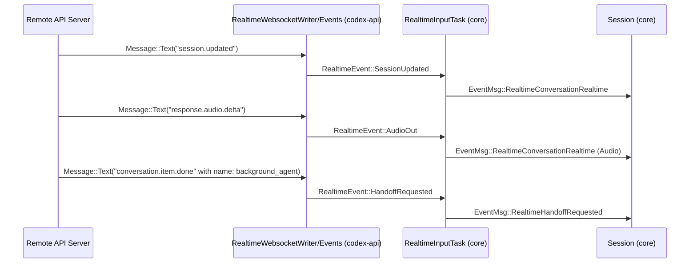
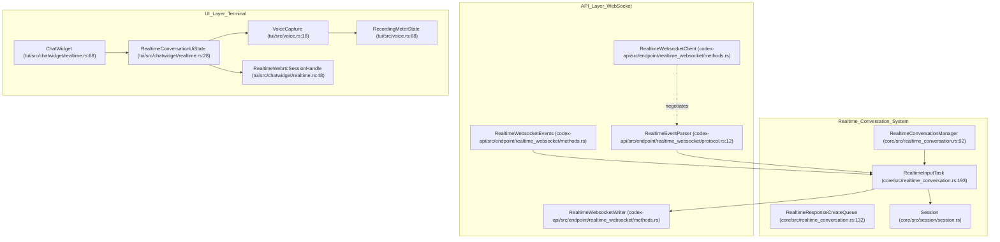

# Realtime Conversation

<details>
<summary>Relevant source files</summary>

The following files were used as context for generating this wiki page:

- [codex-rs/app-server/tests/suite/v2/experimental_api.rs](codex-rs/app-server/tests/suite/v2/experimental_api.rs)
- [codex-rs/app-server/tests/suite/v2/realtime_conversation.rs](codex-rs/app-server/tests/suite/v2/realtime_conversation.rs)
- [codex-rs/codex-api/src/endpoint/realtime_websocket/methods.rs](codex-rs/codex-api/src/endpoint/realtime_websocket/methods.rs)
- [codex-rs/codex-api/src/endpoint/realtime_websocket/methods_common.rs](codex-rs/codex-api/src/endpoint/realtime_websocket/methods_common.rs)
- [codex-rs/codex-api/src/endpoint/realtime_websocket/methods_v1.rs](codex-rs/codex-api/src/endpoint/realtime_websocket/methods_v1.rs)
- [codex-rs/codex-api/src/endpoint/realtime_websocket/methods_v2.rs](codex-rs/codex-api/src/endpoint/realtime_websocket/methods_v2.rs)
- [codex-rs/codex-api/src/endpoint/realtime_websocket/mod.rs](codex-rs/codex-api/src/endpoint/realtime_websocket/mod.rs)
- [codex-rs/codex-api/src/endpoint/realtime_websocket/protocol.rs](codex-rs/codex-api/src/endpoint/realtime_websocket/protocol.rs)
- [codex-rs/codex-api/src/endpoint/realtime_websocket/protocol_v1.rs](codex-rs/codex-api/src/endpoint/realtime_websocket/protocol_v1.rs)
- [codex-rs/codex-api/src/endpoint/realtime_websocket/protocol_v2.rs](codex-rs/codex-api/src/endpoint/realtime_websocket/protocol_v2.rs)
- [codex-rs/codex-api/tests/realtime_websocket_e2e.rs](codex-rs/codex-api/tests/realtime_websocket_e2e.rs)
- [codex-rs/core/src/realtime_conversation.rs](codex-rs/core/src/realtime_conversation.rs)
- [codex-rs/core/src/realtime_conversation_tests.rs](codex-rs/core/src/realtime_conversation_tests.rs)
- [codex-rs/core/tests/suite/realtime_conversation.rs](codex-rs/core/tests/suite/realtime_conversation.rs)
- [codex-rs/tui/src/audio_device.rs](codex-rs/tui/src/audio_device.rs)
- [codex-rs/tui/src/chatwidget/realtime.rs](codex-rs/tui/src/chatwidget/realtime.rs)
- [codex-rs/tui/src/voice.rs](codex-rs/tui/src/voice.rs)

</details>


The Realtime Conversation system provides a low-latency, bidirectional interface for audio and text interactions. It enables the Codex AI agent to participate in interactive voice-based sessions with streaming audio input/output, server-side voice activity detection (VAD), and coordinated handoffs between the realtime voice model and the core agent reasoning system. The system supports both WebSocket-based communication and WebRTC for macOS-native low-latency audio/text interaction.

---

## System Architecture

The realtime conversation subsystem is architected as an asynchronous producer-consumer model bridging the WebSocket/WebRTC transports with internal session logic.

### Data Flow and Task Management

At the core is the `RealtimeConversationManager` struct, which manages the session state and spawns principal async tasks [codex-rs/core/src/realtime_conversation.rs:92-94]():

- **Input Task (`RealtimeInputTask`)**: Maintains the WebSocket connection lifecycle, reads server events, and writes outbound messages including audio frames, user text, and session control events [codex-rs/core/src/realtime_conversation.rs:193-203]().
- **Fanout Task**: Broadcasts incoming events from the websocket to internal subscribers and translates events into protocol-level messages consumed by the core session system.

These components coordinate through async channels for message passing and use an event parser selectable by protocol version (V1 or V2).

```mermaid
graph TD
    subgraph "codex-core (Code Entity Space)"
        RCM["RealtimeConversationManager (core/src/realtime_conversation.rs:92)"]
        RIT["RealtimeInputTask (core/src/realtime_conversation.rs:193)"]
        SESSION["Session (core/src/session/session.rs)"]
    end

    subgraph "codex-api (Protocol Layer)"
        RWClient["RealtimeWebsocketClient (codex-api/src/endpoint/realtime_websocket/methods.rs)"]
        RWWriter["RealtimeWebsocketWriter (codex-api/src/endpoint/realtime_websocket/methods.rs)"]
        RWEvents["RealtimeWebsocketEvents (codex-api/src/endpoint/realtime_websocket/methods.rs)"]
    end

    SESSION -->|Op::RealtimeConversationStart| RCM
    RCM -->|connect()| RWClient
    RWClient -->|returns| RWWriter
    RWClient -->|returns| RWEvents
    RIT -->|send()| RWWriter
    RWEvents -->|receive()| RIT
    RIT -->|EventMsg| SESSION
```

**Sources:** [codex-rs/core/src/realtime_conversation.rs:92-94](), [codex-rs/core/src/realtime_conversation.rs:193-203](), [codex-rs/codex-api/src/endpoint/realtime_websocket/methods.rs:1-46]()

---

## Protocol Versions

Codex supports multiple realtime protocol versions, abstracted by the `RealtimeEventParser` enum [codex-rs/codex-api/src/endpoint/realtime_websocket/protocol.rs:12-15](). The two primary versions are:

| Feature                   | V1 (Quicksilver)                               | V2 (Realtime)                                           |
|---------------------------|------------------------------------------------|--------------------------------------------------------|
| **Session Type**          | `Quicksilver`                                  | `Realtime`                                             |
| **Default Model**         | `gpt-realtime-1.5`                             | `gpt-realtime-1.5`                                     |
| **Turn Detection**        | None (Client-side)                             | `ServerVad` (server-side VAD)                          |
| **Tools Support**         | Not supported                                  | `background_agent` tool for asynchronous handoff       |
| **Output Modality**       | Audio only                                     | Audio and Text                                         |

- **V1 (Quicksilver)** uses a simpler protocol suited for quick audio interactions without turn detection or tool handoff. It is selected via `RealtimeEventParser::V1` [codex-rs/codex-api/src/endpoint/realtime_websocket/protocol.rs:13]().
- **V2 (Realtime)** extends support with server-side turn detection (`ServerVad`), bidirectional audio and text modalities, and tool-based handoffs to delegate complex tasks to background agents [codex-rs/codex-api/src/endpoint/realtime_websocket/methods_v2.rs:71-133]().

**Sources:** [codex-rs/codex-api/src/endpoint/realtime_websocket/protocol.rs:12-15](), [codex-rs/codex-api/src/endpoint/realtime_websocket/protocol.rs:73-77](), [codex-rs/codex-api/src/endpoint/realtime_websocket/methods_v2.rs:33-37](), [codex-rs/codex-api/src/endpoint/realtime_websocket/protocol_v2.rs:24-79]()

---

## Session Lifecycle

The realtime session lifecycle consists of the following stages:

### 1. Initialization
A realtime session starts when `ConversationStartParams` is submitted. The system prepares a "startup context" via `build_realtime_startup_context` [codex-rs/core/src/realtime_conversation.rs:2](). This context is capped by `REALTIME_STARTUP_CONTEXT_TOKEN_BUDGET` (5,300 tokens) to avoid overloading the model [codex-rs/core/src/realtime_conversation.rs:67]().

### 2. Connection Handling
- The `RealtimeWebsocketClient` opens a connection to the provider.
- `WsStream` manages the low-level `WebSocketStream`, handling `Ping`/`Pong` frames to keep the connection alive [codex-rs/codex-api/src/endpoint/realtime_websocket/methods.rs:109-117]().
- Incoming textual messages are parsed into `RealtimeEvent` structs using version-specific logic in `parse_realtime_event_v1` or `parse_realtime_event_v2` [codex-rs/codex-api/src/endpoint/realtime_websocket/protocol.rs:220-228]().

### 3. Audio Streaming
- **Client to Server**: Audio is transmitted as Base64-encoded PCM samples via `InputAudioBufferAppend` messages [codex-rs/codex-api/src/endpoint/realtime_websocket/protocol.rs:37-38]().
- **Server to Client**: Audio output is received as `AudioOut` events [codex-rs/codex-api/src/endpoint/realtime_websocket/protocol_v2.rs:96-125](). The system defaults to a 24kHz sample rate [codex-rs/tui/src/voice.rs:15]().

### 4. Interactive Handoff
In V2, complex user requests can be delegated to a background agent via the `background_agent` tool [codex-rs/codex-api/src/endpoint/realtime_websocket/methods_v2.rs:33-34]().
- The server signals delegation through `HandoffRequested` events [codex-rs/codex-api/src/endpoint/realtime_websocket/protocol_v2.rs:142-166]().
- When a handoff is complete, the background agent provides the result, acknowledged with a standard completion message [codex-rs/core/src/realtime_conversation.rs:73-74]().

---

## Event Translation Map

The following sequence diagram describes the translation of incoming WebSocket events into internal protocol messages:



**Sources:** [codex-rs/codex-api/src/endpoint/realtime_websocket/protocol_v2.rs:24-79](), [codex-rs/core/src/realtime_conversation.rs:193-203]()

---

## WebRTC Integration

To support macOS-native realtime audio/text interaction with lower latency, Codex integrates a WebRTC transport via the `codex-realtime-webrtc` crate [codex-rs/tui/src/chatwidget/realtime.rs:10-12]().

- The `ChatWidget` manages WebRTC sessions through `RealtimeConversationUiTransport::Webrtc` [codex-rs/tui/src/chatwidget/realtime.rs:47-49]().
- When starting a WebRTC session, the TUI triggers an SDP offer task via `start_realtime_webrtc_offer_task` [codex-rs/tui/src/chatwidget/realtime.rs:103]().
- Audio is handled locally via `VoiceCapture` for input and `RealtimeAudioPlayer` for output [codex-rs/tui/src/chatwidget/realtime.rs:38-40]().

**Sources:** [codex-rs/tui/src/chatwidget/realtime.rs:43-50](), [codex-rs/tui/src/chatwidget/realtime.rs:100-105]()

---

## Implementation Details

### RealtimeInputTask
The `RealtimeInputTask` multiplexes over multiple channels using `tokio::select!`:
- `user_text_rx`: Sends user text as `conversation.item.create` [codex-rs/core/src/realtime_conversation.rs:196]().
- `audio_rx`: Sends raw audio as `input_audio_buffer.append` [codex-rs/core/src/realtime_conversation.rs:198]().
- `events`: Receives parsed events from the WebSocket [codex-rs/core/src/realtime_conversation.rs:195]().

### RealtimeResponseCreateQueue
This helper manages the creation of model response streams [codex-rs/core/src/realtime_conversation.rs:132](). It prevents overlapping responses by deferring `response.create` requests if `active_default_response` is true [codex-rs/core/src/realtime_conversation.rs:144-147]().

### UI State and Voice Capture
- `RealtimeConversationUiState`: Tracks phases like `Inactive`, `Starting`, `Active`, and `Stopping` [codex-rs/tui/src/chatwidget/realtime.rs:19-25]().
- `VoiceCapture`: Uses `cpal` to capture microphone input, resample to 24kHz, and encode to Base64 [codex-rs/tui/src/voice.rs:18-50]().
- `RecordingMeterState`: Computes a Braille-based level meter for visual feedback [codex-rs/tui/src/voice.rs:68-125]().

**Sources:** [codex-rs/core/src/realtime_conversation.rs:132-191](), [codex-rs/tui/src/chatwidget/realtime.rs:19-41](), [codex-rs/tui/src/voice.rs:87-125]()

---

## Glossary of Key Code Entities



**Sources:** [codex-rs/core/src/realtime_conversation.rs:92](), [codex-rs/codex-api/src/endpoint/realtime_websocket/methods.rs:1-46](), [codex-rs/tui/src/chatwidget/realtime.rs:28](), [codex-rs/tui/src/voice.rs:18]()
