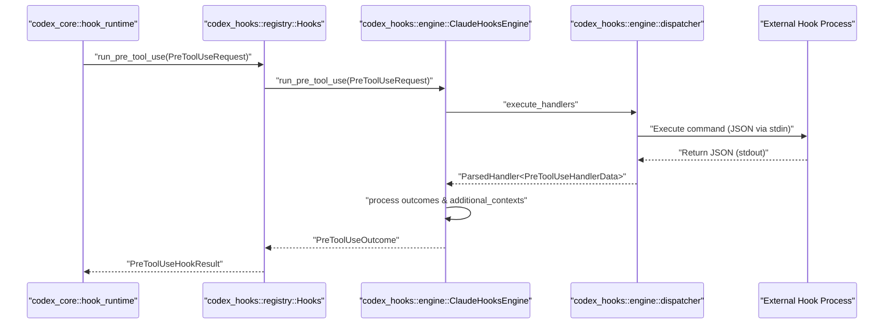
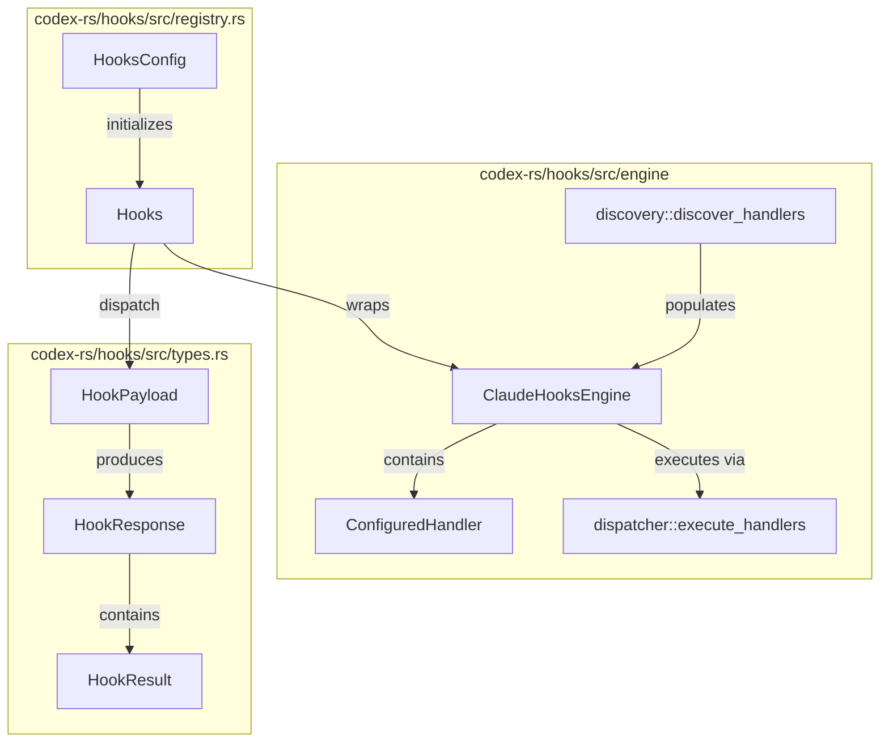

# Hooks System

Relevant source files

The following files were used as context for generating this wiki page:

- [codex-rs/app-server-protocol/schema/json/v2/HookCompletedNotification.json](codex-rs/app-server-protocol/schema/json/v2/HookCompletedNotification.json)
- [codex-rs/app-server-protocol/schema/json/v2/HookStartedNotification.json](codex-rs/app-server-protocol/schema/json/v2/HookStartedNotification.json)
- [codex-rs/core/src/hook_runtime.rs](codex-rs/core/src/hook_runtime.rs)
- [codex-rs/core/tests/suite/hooks.rs](codex-rs/core/tests/suite/hooks.rs)
- [codex-rs/hooks/schema/generated/permission-request.command.input.schema.json](codex-rs/hooks/schema/generated/permission-request.command.input.schema.json)
- [codex-rs/hooks/schema/generated/permission-request.command.output.schema.json](codex-rs/hooks/schema/generated/permission-request.command.output.schema.json)
- [codex-rs/hooks/schema/generated/post-compact.command.input.schema.json](codex-rs/hooks/schema/generated/post-compact.command.input.schema.json)
- [codex-rs/hooks/schema/generated/post-tool-use.command.input.schema.json](codex-rs/hooks/schema/generated/post-tool-use.command.input.schema.json)
- [codex-rs/hooks/schema/generated/post-tool-use.command.output.schema.json](codex-rs/hooks/schema/generated/post-tool-use.command.output.schema.json)
- [codex-rs/hooks/schema/generated/pre-compact.command.input.schema.json](codex-rs/hooks/schema/generated/pre-compact.command.input.schema.json)
- [codex-rs/hooks/schema/generated/pre-tool-use.command.input.schema.json](codex-rs/hooks/schema/generated/pre-tool-use.command.input.schema.json)
- [codex-rs/hooks/schema/generated/pre-tool-use.command.output.schema.json](codex-rs/hooks/schema/generated/pre-tool-use.command.output.schema.json)
- [codex-rs/hooks/schema/generated/session-start.command.output.schema.json](codex-rs/hooks/schema/generated/session-start.command.output.schema.json)
- [codex-rs/hooks/schema/generated/subagent-start.command.output.schema.json](codex-rs/hooks/schema/generated/subagent-start.command.output.schema.json)
- [codex-rs/hooks/schema/generated/user-prompt-submit.command.input.schema.json](codex-rs/hooks/schema/generated/user-prompt-submit.command.input.schema.json)
- [codex-rs/hooks/schema/generated/user-prompt-submit.command.output.schema.json](codex-rs/hooks/schema/generated/user-prompt-submit.command.output.schema.json)
- [codex-rs/hooks/src/engine/discovery.rs](codex-rs/hooks/src/engine/discovery.rs)
- [codex-rs/hooks/src/engine/dispatcher.rs](codex-rs/hooks/src/engine/dispatcher.rs)
- [codex-rs/hooks/src/engine/mod.rs](codex-rs/hooks/src/engine/mod.rs)
- [codex-rs/hooks/src/engine/mod_tests.rs](codex-rs/hooks/src/engine/mod_tests.rs)
- [codex-rs/hooks/src/engine/output_parser.rs](codex-rs/hooks/src/engine/output_parser.rs)
- [codex-rs/hooks/src/events/common.rs](codex-rs/hooks/src/events/common.rs)
- [codex-rs/hooks/src/events/compact.rs](codex-rs/hooks/src/events/compact.rs)
- [codex-rs/hooks/src/events/permission_request.rs](codex-rs/hooks/src/events/permission_request.rs)
- [codex-rs/hooks/src/events/post_tool_use.rs](codex-rs/hooks/src/events/post_tool_use.rs)
- [codex-rs/hooks/src/events/pre_tool_use.rs](codex-rs/hooks/src/events/pre_tool_use.rs)
- [codex-rs/hooks/src/events/session_start.rs](codex-rs/hooks/src/events/session_start.rs)
- [codex-rs/hooks/src/events/stop.rs](codex-rs/hooks/src/events/stop.rs)
- [codex-rs/hooks/src/events/user_prompt_submit.rs](codex-rs/hooks/src/events/user_prompt_submit.rs)
- [codex-rs/hooks/src/legacy_notify.rs](codex-rs/hooks/src/legacy_notify.rs)
- [codex-rs/hooks/src/lib.rs](codex-rs/hooks/src/lib.rs)
- [codex-rs/hooks/src/registry.rs](codex-rs/hooks/src/registry.rs)
- [codex-rs/hooks/src/schema.rs](codex-rs/hooks/src/schema.rs)
- [codex-rs/hooks/src/types.rs](codex-rs/hooks/src/types.rs)

The Hooks System is a Claude-style engine designed to intercept and augment the agent's lifecycle. It provides a structured way to execute custom logic at critical boundaries, such as before/after tool use, at the start/stop of a session, or upon user prompt submission. While the hooks engine handles lifecycle interception, it works in tandem with the core agent system to enforce safety and provide contextual feedback.

## Overview and Purpose

The system allows the Codex core to decouple side-effects and external notifications from the primary execution loop. Hooks can be used for logging, auditing, notifying external systems, or injecting additional context into the model's history. The implementation is centered in the `codex-hooks` crate and integrated into the `codex-core` tool execution and session lifecycle.

### Key Capabilities
*   **Interception**: Hooks can inspect operations before they are executed, such as `run_pre_tool_use` which runs before tool dispatch [codex-rs/hooks/src/engine/mod.rs:183-189]().
*   **Augmentation**: Hooks can return `additional_contexts` that are recorded into the session history [codex-rs/hooks/src/engine/mod.rs:177-179]().
*   **Decision Making**: Hooks can block operations (e.g., `PreToolUseOutcome` can signal a block) or provide specific permission decisions [codex-rs/hooks/src/engine/mod.rs:11-12](), [codex-rs/hooks/src/engine/mod.rs:193-198]().
*   **Discovery**: The system automatically discovers hooks from local configuration, project-level `.codex` folders, and installed plugins [codex-rs/hooks/src/engine/discovery.rs:62-67]().

Sources: [codex-rs/hooks/src/engine/mod.rs:107-206](), [codex-rs/hooks/src/engine/discovery.rs:62-67]().

---

## Hook Event Types

The system defines several event names that appear in configuration and JSON payloads [codex-rs/hooks/src/lib.rs:19-30]().

| Event Type | Description |
| :--- | :--- |
| `SessionStart` | Triggered when a new session or thread is initialized [codex-rs/hooks/src/lib.rs:25](). |
| `UserPromptSubmit` | Triggered immediately after a user submits a prompt but before model processing [codex-rs/hooks/src/lib.rs:26](). |
| `PreToolUse` | Triggered before a tool is executed; can block execution or rewrite input [codex-rs/hooks/src/lib.rs:20](). |
| `PostToolUse` | Triggered after a tool execution has completed; can provide feedback [codex-rs/hooks/src/lib.rs:22](). |
| `PermissionRequest`| Triggered when a tool requires explicit user or system approval [codex-rs/hooks/src/lib.rs:21](). |
| `Stop` | Triggered when the agent finishes a turn or is interrupted [codex-rs/hooks/src/lib.rs:29](). |
| `PreCompact` / `PostCompact` | Triggered during conversation history compaction [codex-rs/hooks/src/lib.rs:23-24](). |
| `SubagentStart` / `SubagentStop` | Triggered when sub-agents (like Reviewers) are created or destroyed [codex-rs/hooks/src/lib.rs:27-28](). |

Sources: [codex-rs/hooks/src/lib.rs:19-30](), [codex-rs/hooks/src/engine/mod.rs:64-77]().

---

## Architecture and Discovery

The `ClaudeHooksEngine` serves as the central dispatcher for hook logic. It is initialized via `HooksConfig` which contains feature flags, config layers, and plugin sources [codex-rs/hooks/src/registry.rs:30-39](), [codex-rs/hooks/src/engine/mod.rs:100-105]().

### Discovery Pipeline
The `discovery::discover_handlers` function scans the configuration stack (User, Project, System layers) and plugin sources to identify available hook scripts [codex-rs/hooks/src/engine/discovery.rs:62-82](). These are converted into `ConfiguredHandler` instances which include the command to run, timeouts, and regex matchers [codex-rs/hooks/src/engine/mod.rs:42-52]().

### Hook Execution Sequence
The following diagram illustrates how a tool execution event flows through the core and interacts with the hook engine.

**Hook Dispatch Sequence**

Sources: [codex-rs/hooks/src/registry.rs:145-147](), [codex-rs/hooks/src/engine/mod.rs:183-191](), [codex-rs/hooks/src/engine/dispatcher.rs:1-20](), [codex-rs/core/src/hook_runtime.rs:162-194]().

### Code Entity Mapping: Discovery to Dispatch
This diagram maps the natural language concepts of "Discovery" and "Dispatch" to the specific Rust entities in the `codex-hooks` crate.

**Discovery and Dispatch Mapping**

Sources: [codex-rs/hooks/src/registry.rs:30-82](), [codex-rs/hooks/src/engine/mod.rs:100-138](), [codex-rs/hooks/src/types.rs:62-81]().

---

## Configuration and Trust

Hooks are defined in `config.toml` or `hooks.json` files. Each handler can specify a `matcher` (regex) to limit its execution to specific tools or events [codex-rs/hooks/src/engine/mod.rs:44]().

### Matcher Logic
The `matches_matcher` function determines if a hook should run based on the `tool_name` or `matcher_aliases` [codex-rs/hooks/src/events/common.rs:129-144]().
*   **Exact Match**: `Bash` matches only the Bash tool [codex-rs/hooks/src/events/common.rs:206]().
*   **Pipe Alternatives**: `Edit|Write` matches either tool [codex-rs/hooks/src/events/common.rs:197-202]().
*   **Regex**: `^mcp__.*` matches all MCP tools [codex-rs/hooks/src/events/common.rs:220]().

### Trust System
Hooks must be "trusted" to execute unless `bypass_hook_trust` is enabled [codex-rs/hooks/src/engine/mod.rs:110](). The trust status is tracked via `HookTrustStatus` [codex-rs/hooks/src/engine/mod.rs:96]().
*   **Managed Hooks**: Hooks delivered via system-level requirements or MDM are automatically trusted if configured in `managed_hooks` [codex-rs/hooks/src/engine/discovery.rs:178-200]().
*   **User Hooks**: Require explicit trust markers in the configuration [codex-rs/hooks/src/engine/discovery.rs:114]().

Sources: [codex-rs/hooks/src/engine/mod.rs:42-97](), [codex-rs/hooks/src/engine/discovery.rs:51-210](), [codex-rs/hooks/src/events/common.rs:129-165]().

---

## Implementation Details

### Handling Hook Outcomes
Each hook event has a corresponding `Outcome` struct (e.g., `PreToolUseOutcome`, `SessionStartOutcome`). These structs aggregate:
*   **Decision**: Whether to block, allow, or continue [codex-rs/hooks/src/engine/mod.rs:15-22]().
*   **Additional Contexts**: Text fragments to be injected into the agent's prompt [codex-rs/hooks/src/engine/mod.rs:177-180]().
*   **Input Rewriting**: `PreToolUse` hooks can return `updated_input` to modify the arguments passed to a tool [codex-rs/hooks/src/events/pre_tool_use.rs:43](). If multiple hooks provide updates, the one that finished last wins [codex-rs/hooks/src/events/pre_tool_use.rs:148-162]().

### Runtime Integration (codex-core)
The `hook_runtime.rs` module in `codex-core` bridges the agent's turn execution with the hooks engine.
*   **Session Start**: `run_pending_session_start_hooks` executes hooks when a thread is initialized or a sub-agent is spawned [codex-rs/core/src/hook_runtime.rs:102-155]().
*   **Pre-Tool Use**: `run_pre_tool_use_hooks` is called before every tool execution. If a hook blocks, the tool is not run, and the block reason is returned to the model [codex-rs/core/src/hook_runtime.rs:162-205]().

### Output Spilling
If a hook returns large amounts of text in `additional_contexts`, the `HookOutputSpiller` may move this data to temporary files to avoid bloating memory or protocol messages [codex-rs/hooks/src/engine/mod.rs:104](), [codex-rs/hooks/src/engine/mod.rs:177-179]().

### Hooks Discovery from Configuration
The discovery pipeline respects the `ConfigLayerStack` and specifically checks for `ManagedHooksRequirementsToml` within the requirements layer [codex-rs/hooks/src/engine/discovery.rs:178-180](). This ensures that enterprise-managed hooks take precedence and can enforce `allow_managed_hooks_only` policies [codex-rs/hooks/src/engine/discovery.rs:73-82]().

Sources: [codex-rs/hooks/src/engine/mod.rs:104-180](), [codex-rs/core/src/hook_runtime.rs:102-205](), [codex-rs/hooks/src/events/pre_tool_use.rs:148-162](), [codex-rs/hooks/src/engine/discovery.rs:73-180]().
