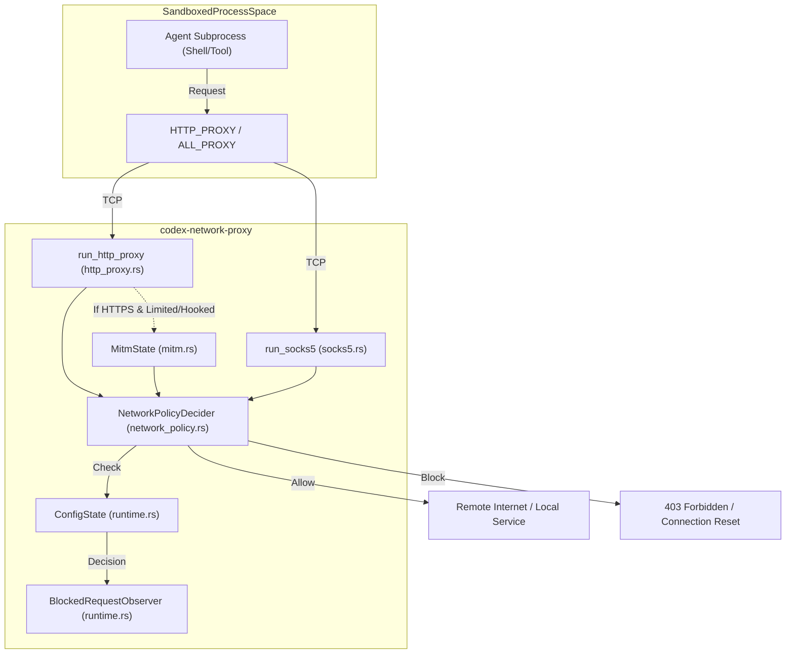
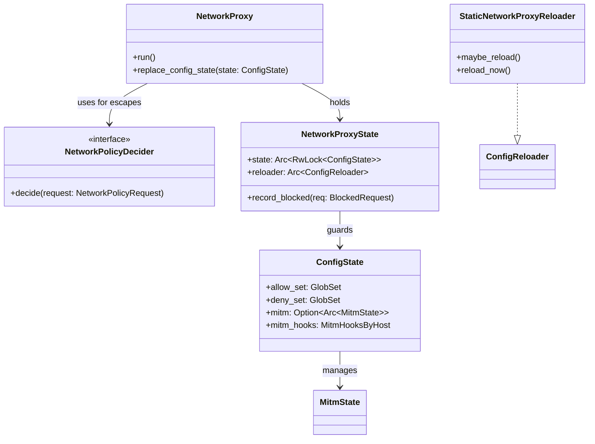

# Network Proxy

<details>
<summary>Relevant source files</summary>

The following files were used as context for generating this wiki page:

- [codex-rs/config/Cargo.toml](codex-rs/config/Cargo.toml)
- [codex-rs/config/src/permissions_toml.rs](codex-rs/config/src/permissions_toml.rs)
- [codex-rs/core/src/config/network_proxy_spec.rs](codex-rs/core/src/config/network_proxy_spec.rs)
- [codex-rs/core/src/config/permissions.rs](codex-rs/core/src/config/permissions.rs)
- [codex-rs/core/src/config/permissions_tests.rs](codex-rs/core/src/config/permissions_tests.rs)
- [codex-rs/core/src/network_proxy_loader.rs](codex-rs/core/src/network_proxy_loader.rs)
- [codex-rs/network-proxy/Cargo.toml](codex-rs/network-proxy/Cargo.toml)
- [codex-rs/network-proxy/README.md](codex-rs/network-proxy/README.md)
- [codex-rs/network-proxy/src/config.rs](codex-rs/network-proxy/src/config.rs)
- [codex-rs/network-proxy/src/http_proxy.rs](codex-rs/network-proxy/src/http_proxy.rs)
- [codex-rs/network-proxy/src/lib.rs](codex-rs/network-proxy/src/lib.rs)
- [codex-rs/network-proxy/src/mitm.rs](codex-rs/network-proxy/src/mitm.rs)
- [codex-rs/network-proxy/src/mitm_tests.rs](codex-rs/network-proxy/src/mitm_tests.rs)
- [codex-rs/network-proxy/src/network_policy.rs](codex-rs/network-proxy/src/network_policy.rs)
- [codex-rs/network-proxy/src/policy.rs](codex-rs/network-proxy/src/policy.rs)
- [codex-rs/network-proxy/src/proxy.rs](codex-rs/network-proxy/src/proxy.rs)
- [codex-rs/network-proxy/src/reasons.rs](codex-rs/network-proxy/src/reasons.rs)
- [codex-rs/network-proxy/src/responses.rs](codex-rs/network-proxy/src/responses.rs)
- [codex-rs/network-proxy/src/runtime.rs](codex-rs/network-proxy/src/runtime.rs)
- [codex-rs/network-proxy/src/socks5.rs](codex-rs/network-proxy/src/socks5.rs)
- [codex-rs/network-proxy/src/state.rs](codex-rs/network-proxy/src/state.rs)
- [codex-rs/protocol/src/permissions.rs](codex-rs/protocol/src/permissions.rs)

</details>


The `codex-network-proxy` crate is a local network policy enforcement engine designed to sandbox agent processes. It acts as a gatekeeper for all outbound network traffic initiated by tools or shell commands within the Codex environment. By providing both HTTP and SOCKS5 proxy interfaces, it ensures that sandboxed processes comply with the security constraints defined in the active [Permissions Profile](2.4. Sandbox and Approval Policies).

## Overview and Purpose

The proxy serves three primary functions:
1.  **Policy Enforcement**: Implements an allow/deny model for hostnames and IP addresses [codex-rs/network-proxy/README.md:50-53]().
2.  **Traffic Isolation**: Clamps network listeners to loopback by default to prevent unauthorized external access to the proxy itself [codex-rs/network-proxy/README.md:32-34]().
3.  **Auditing**: Emits structured OpenTelemetry (OTEL) events for every policy decision and tracks violations in a `BlockedRequest` buffer [codex-rs/network-proxy/src/runtime.rs:90-104]().

### Key Capabilities
*   **Proxy Modes**: Supports `Full` (read/write) and `Limited` (read-only) network modes [codex-rs/network-proxy/src/runtime.rs:60-65]().
*   **MITM Termination**: Optional Man-in-the-Middle (MITM) capability to inspect HTTPS `CONNECT` tunnels and enforce method-level policies (e.g., blocking `POST` in limited mode) [codex-rs/network-proxy/README.md:36-37]().
*   **MITM Hooks**: Allows fine-grained manipulation of HTTPS traffic, such as stripping or injecting headers (e.g., adding authentication tokens) based on host and path matches [codex-rs/network-proxy/src/lib.rs:29-33]().
*   **Unix Socket Proxying**: (macOS-only) Supports proxying to local unix sockets via the `x-unix-socket` header [codex-rs/network-proxy/README.md:72-75]().

---

## Architecture and Data Flow

The proxy is typically managed by `codex-core`, which initializes the proxy using `NetworkProxySpec` derived from the session's configuration [codex-rs/core/src/config/network_proxy_spec.rs:24-30]().

### System Architecture Diagram
This diagram shows how a sandboxed process interacts with the proxy and how the proxy validates requests against the `ConfigState`.

Title: Network Proxy Data Flow

Sources: [codex-rs/network-proxy/src/proxy.rs:167-210](), [codex-rs/network-proxy/src/http_proxy.rs:86-103](), [codex-rs/network-proxy/src/runtime.rs:206-211](), [codex-rs/network-proxy/src/socks5.rs:63-78]()

---

## Configuration and Policy

The proxy configuration is nested within the `permissions` table of `config.toml`. Policies are compiled into `GlobSet` structures for high-performance matching during initialization in `build_config_state` [codex-rs/network-proxy/src/state.rs:64-94]().

### Policy Configuration Example
```toml
[permissions.workspace.network]
enabled = true
mode = "limited"  # Only GET/HEAD/OPTIONS allowed
mitm = true       # Required for method enforcement on HTTPS
allow_local_binding = false

[permissions.workspace.network.domains]
"*.openai.com" = "allow"
"github.com" = "allow"
"malicious.site" = "deny"

[[permissions.workspace.network.mitm_hooks]]
host = "api.github.com"
matcher = { methods = ["POST"], path_prefixes = ["/repos/openai/"] }
actions = { strip_request_headers = ["authorization"] }
```
Sources: [codex-rs/network-proxy/README.md:18-75](), [codex-rs/network-proxy/src/config.rs:121-146]()

### Policy Logic
The policy evaluation determines the fate of a request based on the following hierarchy:
1.  **Denylist**: If the host matches a pattern in the `deny_set`, it is immediately blocked with `HostBlockReason::Denied` [codex-rs/network-proxy/src/runtime.rs:61-65]().
2.  **Allowlist**: If the host matches the `allow_set`, it is allowed [codex-rs/network-proxy/src/runtime.rs:84-87]().
3.  **Local Protection**: If `allow_local_binding` is false, any request resolving to a non-public IP is blocked even if allowlisted by hostname [codex-rs/network-proxy/README.md:41-44]().
4.  **Method Guard**: In `Limited` mode, non-safe methods (POST, PUT, DELETE) are blocked unless a MITM hook explicitly allows them [codex-rs/network-proxy/src/socks5.rs:104-108]().

---

## Implementation Details

### Core Entities and Classes

| Entity | File Path | Role |
| :--- | :--- | :--- |
| `NetworkProxy` | [codex-rs/network-proxy/src/proxy.rs:219]() | Main handle for the proxy server; manages listener lifecycles. |
| `ConfigState` | [codex-rs/network-proxy/src/runtime.rs:160]() | Contains the compiled `GlobSet` for allow/deny rules, MITM state, and hook configs. |
| `NetworkPolicyDecider` | [codex-rs/network-proxy/src/lib.rs:36]() | Trait for custom logic to override allowlist misses (used for approval flows). |
| `NetworkProxyBuilder` | [codex-rs/network-proxy/src/proxy.rs:95]() | Builder for initializing `NetworkProxy` with specific listeners and policies. |
| `BlockedRequest` | [codex-rs/network-proxy/src/runtime.rs:90]() | Struct representing a policy violation, used for auditing and UI notifications. |
| `NetworkProxyState` | [codex-rs/network-proxy/src/runtime.rs:206]() | Thread-safe shared state holding the `ConfigState` and `ConfigReloader`. |

### Integration with Core System
`codex-core` uses `NetworkProxySpec` to initialize the proxy based on the layered configuration system [codex-rs/core/src/config/network_proxy_spec.rs:24-30](). This includes enforcing trusted constraints from system/managed layers [codex-rs/core/src/config/network_proxy_spec.rs:111-120]().

Title: Code Entity Relationship: Core to Proxy

Sources: [codex-rs/core/src/config/network_proxy_spec.rs:51-74](), [codex-rs/network-proxy/src/proxy.rs:219-230](), [codex-rs/network-proxy/src/runtime.rs:160-169](), [codex-rs/network-proxy/src/runtime.rs:206-211]()

---

## Proxy Modes and MITM

### Limited Mode
In `NetworkMode::Limited`, the proxy enforces a read-only policy. Only `GET`, `HEAD`, and `OPTIONS` methods are permitted [codex-rs/network-proxy/README.md:110-112](). SOCKS5 UDP and non-HTTPS SOCKS5 TCP are blocked in limited mode [codex-rs/network-proxy/src/socks5.rs:104-107](). For HTTPS traffic, this requires `mitm = true` because the proxy cannot see the HTTP method inside an encrypted `CONNECT` tunnel without terminating the TLS connection [codex-rs/network-proxy/src/http_proxy.rs:130-141]().

### MITM Implementation
The MITM system uses `rustls` via the `codex-utils-rustls-provider` crate to ensure a valid crypto provider is present [codex-rs/network-proxy/src/http_proxy.rs:120]().
*   **Termination**: The proxy terminates upgraded CONNECT streams when MITM is enabled or hooks are configured [codex-rs/network-proxy/src/http_proxy.rs:130-141]().
*   **Hook Evaluation**: Before forwarding a request, the proxy evaluates `mitm_hooks` to determine if headers should be injected or the request modified [codex-rs/network-proxy/src/runtime.rs:165]().

---

## Runtime Management

### Startup Sequence
1.  **Resolution**: `NetworkProxySpec::from_config_and_constraints` merges the user's configuration with constraints [codex-rs/core/src/config/network_proxy_spec.rs:89-121]().
2.  **Binding**: `NetworkProxyBuilder::build()` reserves loopback ports. On Windows, it clamps to specific loopback addresses [codex-rs/network-proxy/src/proxy.rs:181-192](); on other platforms, it uses ephemeral ports [codex-rs/network-proxy/src/proxy.rs:194-195]().
3.  **Execution**: `run_http_proxy` and `run_socks5` begin serving traffic on the reserved listeners [codex-rs/network-proxy/src/http_proxy.rs:86-103](), [codex-rs/network-proxy/src/socks5.rs:63-78]().

### Dynamic Reloading
The proxy supports dynamic policy updates without restarting the listeners via `NetworkProxy::replace_config_state` [codex-rs/network-proxy/src/proxy.rs:263](). The `NetworkProxySpec` in `codex-core` can trigger these updates when sandbox policies or exec policies change [codex-rs/core/src/config/network_proxy_spec.rs:180-192]().

Sources: [codex-rs/core/src/config/network_proxy_spec.rs:123-152](), [codex-rs/network-proxy/src/proxy.rs:263-270](), [codex-rs/network-proxy/src/runtime.rs:172-181]()
