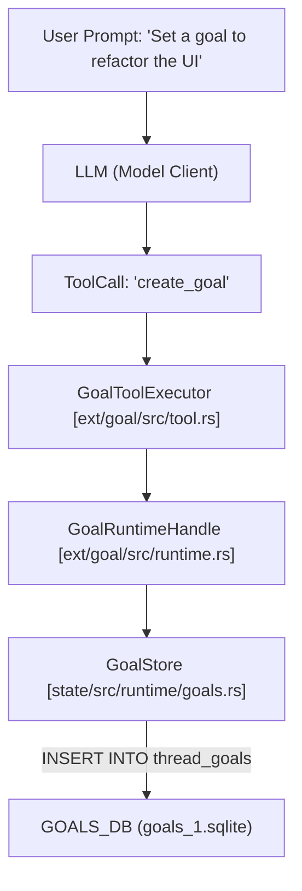
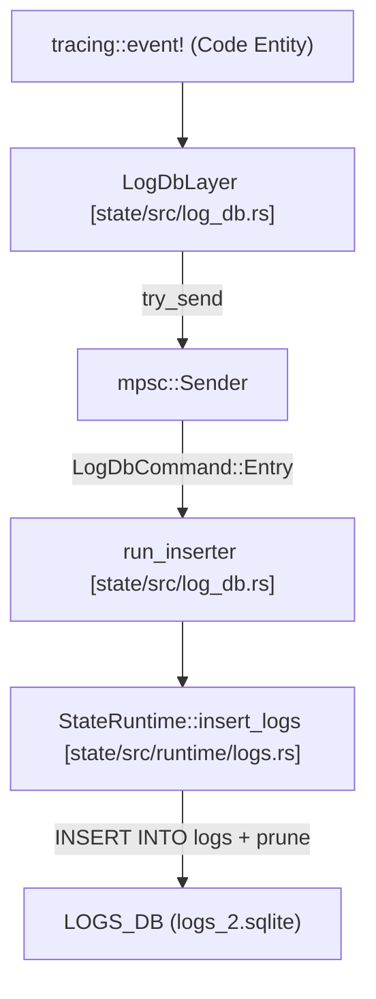

# Goal Extension and State Runtime

Relevant source files

The following files were used as context for generating this wiki page:

- [codex-rs/cli/src/state_db_recovery.rs](codex-rs/cli/src/state_db_recovery.rs)
- [codex-rs/core/tests/suite/sqlite_state.rs](codex-rs/core/tests/suite/sqlite_state.rs)
- [codex-rs/ext/goal/BUILD.bazel](codex-rs/ext/goal/BUILD.bazel)
- [codex-rs/ext/goal/Cargo.toml](codex-rs/ext/goal/Cargo.toml)
- [codex-rs/ext/goal/src/accounting.rs](codex-rs/ext/goal/src/accounting.rs)
- [codex-rs/ext/goal/src/api.rs](codex-rs/ext/goal/src/api.rs)
- [codex-rs/ext/goal/src/extension.rs](codex-rs/ext/goal/src/extension.rs)
- [codex-rs/ext/goal/src/lib.rs](codex-rs/ext/goal/src/lib.rs)
- [codex-rs/ext/goal/src/runtime.rs](codex-rs/ext/goal/src/runtime.rs)
- [codex-rs/ext/goal/src/spec.rs](codex-rs/ext/goal/src/spec.rs)
- [codex-rs/ext/goal/src/steering.rs](codex-rs/ext/goal/src/steering.rs)
- [codex-rs/ext/goal/src/tool.rs](codex-rs/ext/goal/src/tool.rs)
- [codex-rs/ext/goal/templates/goals/budget_limit.md](codex-rs/ext/goal/templates/goals/budget_limit.md)
- [codex-rs/ext/goal/templates/goals/continuation.md](codex-rs/ext/goal/templates/goals/continuation.md)
- [codex-rs/ext/goal/templates/goals/objective_updated.md](codex-rs/ext/goal/templates/goals/objective_updated.md)
- [codex-rs/ext/goal/tests/goal_extension_backend.rs](codex-rs/ext/goal/tests/goal_extension_backend.rs)
- [codex-rs/rollout/src/metadata.rs](codex-rs/rollout/src/metadata.rs)
- [codex-rs/rollout/src/state_db.rs](codex-rs/rollout/src/state_db.rs)
- [codex-rs/rollout/src/state_db_tests.rs](codex-rs/rollout/src/state_db_tests.rs)
- [codex-rs/state/Cargo.toml](codex-rs/state/Cargo.toml)
- [codex-rs/state/migrations/0002_logs.sql](codex-rs/state/migrations/0002_logs.sql)
- [codex-rs/state/migrations/0010_logs_process_id.sql](codex-rs/state/migrations/0010_logs_process_id.sql)
- [codex-rs/state/migrations/0023_drop_logs.sql](codex-rs/state/migrations/0023_drop_logs.sql)
- [codex-rs/state/src/bin/logs_client.rs](codex-rs/state/src/bin/logs_client.rs)
- [codex-rs/state/src/lib.rs](codex-rs/state/src/lib.rs)
- [codex-rs/state/src/log_db.rs](codex-rs/state/src/log_db.rs)
- [codex-rs/state/src/log_db_filter_tests.rs](codex-rs/state/src/log_db_filter_tests.rs)
- [codex-rs/state/src/model/log.rs](codex-rs/state/src/model/log.rs)
- [codex-rs/state/src/model/memories.rs](codex-rs/state/src/model/memories.rs)
- [codex-rs/state/src/model/mod.rs](codex-rs/state/src/model/mod.rs)
- [codex-rs/state/src/model/thread_metadata.rs](codex-rs/state/src/model/thread_metadata.rs)
- [codex-rs/state/src/runtime.rs](codex-rs/state/src/runtime.rs)
- [codex-rs/state/src/runtime/agent_jobs.rs](codex-rs/state/src/runtime/agent_jobs.rs)
- [codex-rs/state/src/runtime/backfill.rs](codex-rs/state/src/runtime/backfill.rs)
- [codex-rs/state/src/runtime/goals.rs](codex-rs/state/src/runtime/goals.rs)
- [codex-rs/state/src/runtime/logs.rs](codex-rs/state/src/runtime/logs.rs)
- [codex-rs/state/src/runtime/memories.rs](codex-rs/state/src/runtime/memories.rs)
- [codex-rs/state/src/runtime/threads.rs](codex-rs/state/src/runtime/threads.rs)
- [codex-rs/thread-store/src/local/update_thread_metadata.rs](codex-rs/thread-store/src/local/update_thread_metadata.rs)
- [codex-rs/thread-store/src/thread_metadata_sync.rs](codex-rs/thread-store/src/thread_metadata_sync.rs)
- [codex-rs/tui/src/startup_error.rs](codex-rs/tui/src/startup_error.rs)

The Goal Extension and State Runtime systems provide a persistent mechanism for tracking high-level objectives, token budgets, and long-term state across Codex sessions. The `ext/goal` crate manages the logic for goal steering and accounting, while `codex-state` provides the SQLite-backed storage layer for goals, logs, memories, agent jobs, and remote control enrollment.

## State Runtime (codex-state)

The `StateRuntime` is the primary entry point for interacting with the system's persistent storage. It manages four distinct SQLite database files to minimize lock contention and organize data by lifecycle and purpose [codex-rs/state/src/runtime.rs:109-141]().

### Database Architecture
| Database | Filename | Purpose |
| :--- | :--- | :--- |
| **State DB** | `state_5.sqlite` | Thread metadata, agent jobs, and rollout tracking [codex-rs/state/src/runtime.rs:109-115](). |
| **Logs DB** | `logs_2.sqlite` | Tracing events and process-level logs [codex-rs/state/src/runtime.rs:117-123](). |
| **Goals DB** | `goals_1.sqlite` | Persistent thread goals and accounting data [codex-rs/state/src/runtime.rs:125-131](). |
| **Memories DB** | `memories_1.sqlite` | Extracted memory fragments and consolidation state [codex-rs/state/src/runtime.rs:133-139](). |

### State Storage and Lifecycle
The runtime is initialized via `StateRuntime::init`, which opens the pools and applies migrations for all four databases [codex-rs/state/src/runtime.rs:160-173]().

*   **Log Management**: The `LogsDB` uses a partitioning strategy to cap log storage at 10 MiB or 1,000 rows per thread (or per process for threadless logs) [codex-rs/state/src/runtime.rs:91-92](). Pruning occurs automatically after batch inserts via `prune_logs_after_insert` [codex-rs/state/src/runtime/logs.rs:44-46]().
*   **Memory Store**: Manages two-stage memory extraction. `MemoryStore` claims "stale" threads for stage-1 extraction based on `updated_at_ms` and `memory_mode` [codex-rs/state/src/runtime/memories.rs:133-152]().
*   **Agent Jobs**: Tracks background tasks (like memory consolidation) via `AgentJob` and `AgentJobItem` records [codex-rs/state/src/runtime.rs:1-7]().
*   **Remote Control**: Stores `RemoteControlEnrollmentRecord` for managing enrollment state [codex-rs/state/src/runtime.rs:82]().

**Sources:** [codex-rs/state/src/runtime.rs:1-160](), [codex-rs/state/src/runtime/logs.rs:1-100](), [codex-rs/state/src/runtime/memories.rs:1-166](), [codex-rs/state/src/lib.rs:87-90]()

---

## Goal Extension (ext/goal)

The `GoalExtension` implements the `ThreadLifecycleContributor` and `TurnLifecycleContributor` traits to hook into the core agent's execution loop [codex-rs/ext/goal/src/extension.rs:98-176](). It provides "steering" by injecting prompts when goals are updated, resumed, or near budget limits.

### Goal Accounting and Steering
Goals track `tokens_used` and `time_used_seconds` against a `token_budget` [codex-rs/state/src/runtime/goals.rs:52-54]().

1.  **Thread Initialization**: During `on_thread_start`, the extension initializes `GoalAccountingState` and registers a `GoalRuntimeHandle` [codex-rs/ext/goal/src/extension.rs:113-135]().
2.  **Turn Start**: During `on_turn_start`, it captures the baseline token usage and marks the turn ID in the accounting state [codex-rs/ext/goal/src/extension.rs:197-210]().
3.  **Steering Injection**: If a goal is active, it may inject a `continuation_steering_item` or `objective_updated_steering_item` into the model's context to keep the agent focused [codex-rs/ext/goal/src/steering.rs:37-47]().
4.  **Budget Enforcement**: When a budget is reached, the goal status transitions to `BudgetLimited`, and a `budget_limit_steering_item` prompt is injected to inform the model [codex-rs/ext/goal/src/steering.rs:80-99]().

### Goal Tools
The extension exposes tools to the model for managing its own objectives:
*   `create_goal`: Initializes a new objective and budget for the thread [codex-rs/ext/goal/tests/goal_extension_backend.rs:54-62]().
*   `update_goal`: Modifies the current objective or status (e.g., marking as `complete`) [codex-rs/ext/goal/src/extension.rs:44]().

**Sources:** [codex-rs/ext/goal/src/extension.rs:1-210](), [codex-rs/ext/goal/src/runtime.rs:1-100](), [codex-rs/ext/goal/src/steering.rs:1-54](), [codex-rs/state/src/runtime/goals.rs:183-211]()

---

## Data Flow: Natural Language to Code Entity Space

The following diagrams illustrate how user actions and system events translate into code entities and database persistence.

### Goal Creation Flow

**Sources:** [codex-rs/ext/goal/src/tool.rs:1-50](), [codex-rs/ext/goal/src/runtime.rs:81-104](), [codex-rs/state/src/runtime/goals.rs:125-147]()

### Log Ingestion Flow
This diagram shows how system logs move from code-level tracing events to the SQLite runtime.

**Sources:** [codex-rs/state/src/log_db.rs:112-140](), [codex-rs/state/src/runtime/logs.rs:11-47]()

---

## Key Structures and Functions

### Goal Management (ext/goal)
| Entity | Location | Role |
| :--- | :--- | :--- |
| `GoalAccountingState` | [codex-rs/ext/goal/src/accounting.rs]() | In-memory state tracking current turn ID and token baselines. |
| `GoalRuntimeHandle` | [codex-rs/ext/goal/src/runtime.rs:24-26]() | Extension-side handle for managing goal lifecycle, steering, and accounting. |
| `GoalService` | [codex-rs/ext/goal/src/api.rs]() | Global service for registering and looking up `GoalRuntimeHandle` instances. |
| `GoalUpdate` | [codex-rs/state/src/runtime/goals.rs:20-25]() | Structure defining updates to objective, status, or budget. |

### Storage Models (codex-state)
| Struct | Location | Description |
| :--- | :--- | :--- |
| `ThreadGoal` | [codex-rs/state/src/lib.rs:49]() | The protocol representation of a goal (objective, status, budget). |
| `LogEntry` | [codex-rs/state/src/model/log.rs:5-17]() | In-memory log record before persistence. |
| `LogRow` | [codex-rs/state/src/model/log.rs:20-31]() | Database row representation for queried logs. |
| `Stage1Output` | [codex-rs/state/src/model/memories.rs]() | Results of the first phase of memory extraction. |

### Core Logic Functions
*   **`StateRuntime::init`**: Opens and migrates `STATE_DB`, `LOGS_DB`, `GOALS_DB`, and `MEMORIES_DB` [codex-rs/state/src/runtime.rs:184-230]().
*   **`GoalStore::update_thread_goal`**: Executes the SQL logic for updating goal status and enforcing budget limits [codex-rs/state/src/runtime/goals.rs:183-211]().
*   **`MemoryStore::claim_stage1_jobs_for_startup`**: Identifies threads requiring memory extraction during system boot based on age and activity [codex-rs/state/src/runtime/memories.rs:148-170]().
*   **`LogDbLayer::start`**: Initializes the background inserter and returns a tracing `Layer` [codex-rs/state/src/log_db.rs:113-128]().

**Sources:** [codex-rs/state/src/runtime.rs:1-160](), [codex-rs/ext/goal/src/runtime.rs:1-150](), [codex-rs/state/src/runtime/goals.rs:1-200]()
