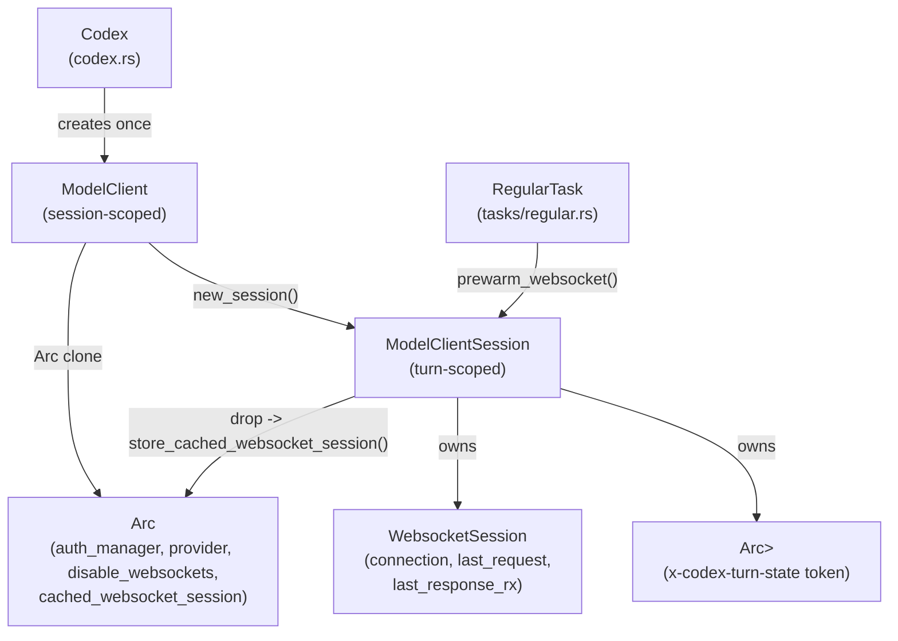
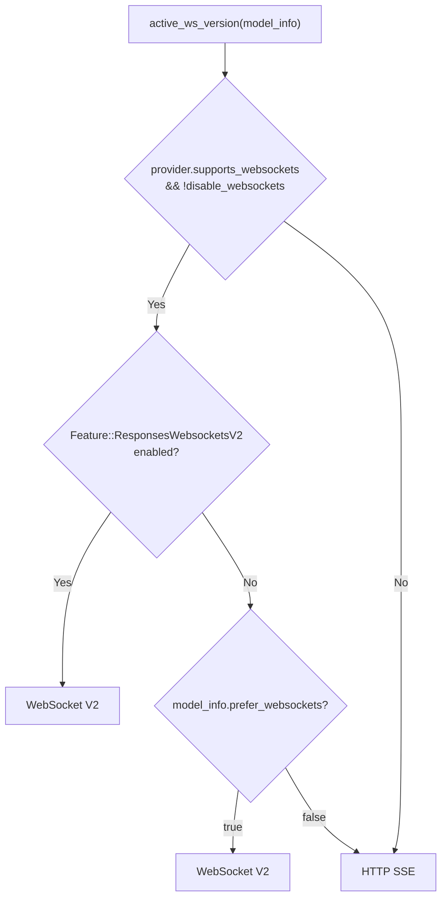
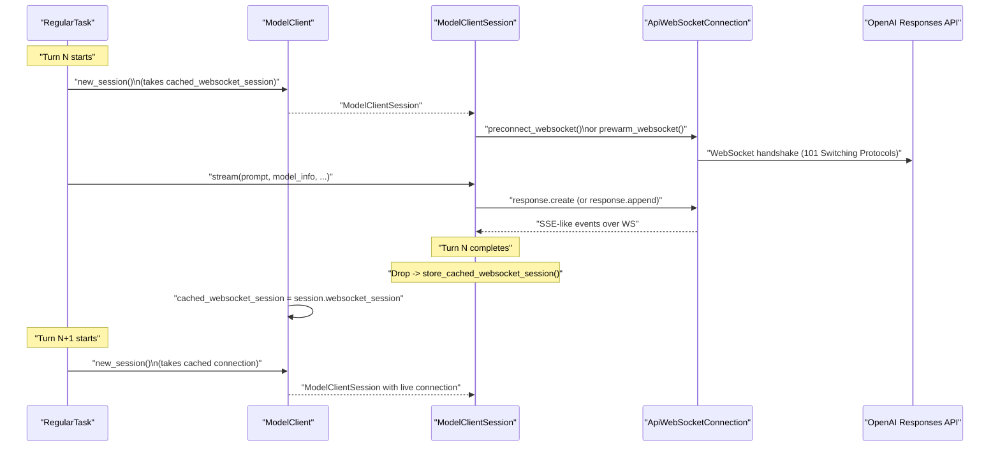
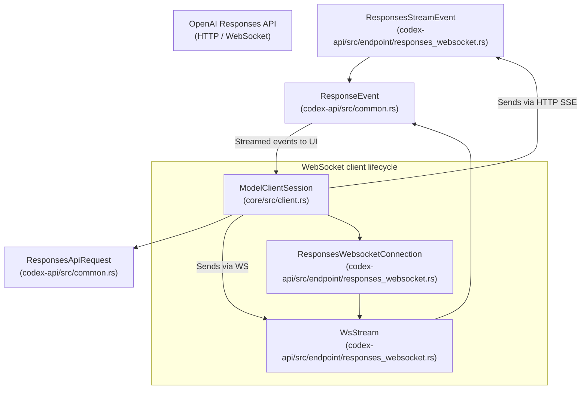

# Model Client and API Communication

<details>
<summary>Relevant source files</summary>

The following files were used as context for generating this wiki page:

- [codex-rs/app-server/tests/common/models_cache.rs](codex-rs/app-server/tests/common/models_cache.rs)
- [codex-rs/app-server/tests/suite/v2/client_metadata.rs](codex-rs/app-server/tests/suite/v2/client_metadata.rs)
- [codex-rs/codex-api/src/common.rs](codex-rs/codex-api/src/common.rs)
- [codex-rs/codex-api/src/endpoint/responses_websocket.rs](codex-rs/codex-api/src/endpoint/responses_websocket.rs)
- [codex-rs/codex-api/src/lib.rs](codex-rs/codex-api/src/lib.rs)
- [codex-rs/codex-api/src/sse/responses.rs](codex-rs/codex-api/src/sse/responses.rs)
- [codex-rs/codex-api/tests/models_integration.rs](codex-rs/codex-api/tests/models_integration.rs)
- [codex-rs/core/src/client.rs](codex-rs/core/src/client.rs)
- [codex-rs/core/src/client_common.rs](codex-rs/core/src/client_common.rs)
- [codex-rs/core/src/sandbox_tags.rs](codex-rs/core/src/sandbox_tags.rs)
- [codex-rs/core/src/sandbox_tags_tests.rs](codex-rs/core/src/sandbox_tags_tests.rs)
- [codex-rs/core/src/turn_metadata.rs](codex-rs/core/src/turn_metadata.rs)
- [codex-rs/core/src/turn_metadata_tests.rs](codex-rs/core/src/turn_metadata_tests.rs)
- [codex-rs/core/tests/common/responses.rs](codex-rs/core/tests/common/responses.rs)
- [codex-rs/core/tests/responses_headers.rs](codex-rs/core/tests/responses_headers.rs)
- [codex-rs/core/tests/suite/client.rs](codex-rs/core/tests/suite/client.rs)
- [codex-rs/core/tests/suite/client_websockets.rs](codex-rs/core/tests/suite/client_websockets.rs)
- [codex-rs/core/tests/suite/model_switching.rs](codex-rs/core/tests/suite/model_switching.rs)
- [codex-rs/core/tests/suite/models_cache_ttl.rs](codex-rs/core/tests/suite/models_cache_ttl.rs)
- [codex-rs/core/tests/suite/personality.rs](codex-rs/core/tests/suite/personality.rs)
- [codex-rs/core/tests/suite/remote_models.rs](codex-rs/core/tests/suite/remote_models.rs)
- [codex-rs/core/tests/suite/rmcp_client.rs](codex-rs/core/tests/suite/rmcp_client.rs)
- [codex-rs/core/tests/suite/spawn_agent_description.rs](codex-rs/core/tests/suite/spawn_agent_description.rs)
- [codex-rs/core/tests/suite/truncation.rs](codex-rs/core/tests/suite/truncation.rs)
- [codex-rs/core/tests/suite/user_shell_cmd.rs](codex-rs/core/tests/suite/user_shell_cmd.rs)
- [codex-rs/core/tests/suite/view_image.rs](codex-rs/core/tests/suite/view_image.rs)
- [codex-rs/models-manager/src/model_info.rs](codex-rs/models-manager/src/model_info.rs)
- [codex-rs/protocol/src/openai_models.rs](codex-rs/protocol/src/openai_models.rs)

</details>


This page documents how the `codex-core` crate constructs and sends requests to model provider APIs. It covers the design and implementation of `ModelClient` (session-scoped) and `ModelClientSession` (turn-scoped), discusses transport selection between WebSocket and HTTP SSE, connection reuse strategies, sticky-routing tokens, prewarm mechanisms, and fallback retry logic.

For complementary information on prompt construction and event processing, see the pages [Turn Execution and Prompt Construction (3.3)]() and [Event Processing and State Management (3.4)]().

---

## Key Types

| Type                   | Scope             | File                          | Role                                                                |
|------------------------|-------------------|-------------------------------|-------------------------------------------------------------------|
| `ModelClient`          | Session           | `core/src/client.rs`           | Shared config, auth, transport fallback state                      |
| `ModelClientState`     | Session (inner)   | `core/src/client.rs`           | `Arc`-shared internal state behind `ModelClient`                  |
| `ModelClientSession`   | Turn              | `core/src/client.rs`           | Streaming client per turn, manages WS connection and sticky token  |
| `WebsocketSession`     | Turn (inner)      | `core/src/client.rs`           | Live WS connection state and last request for append operations    |
| `Prompt`               | Turn              | `core/src/client_common.rs`    | API request payload assembled each turn                            |
| `ResponsesApiRequest`  | Wire (HTTP/WS)    | `codex-api/src/common.rs` | Serialized JSON request format for Responses API                  |
| `ResponseEvent`        | Stream item       | `codex-api/src/common.rs` | Parsed incremental events from SSE or WS stream                   |
| `ResponseStream`       | Stream            | `core/src/client_common.rs`    | Wrapped asynchronous stream of `ResponseEvent`                     |

Sources: [codex-rs/core/src/client.rs:146-212](), [codex-rs/core/src/client_common.rs:17-38](), [codex-rs/core/src/client_common.rs:128-133](), [codex-rs/codex-api/src/common.rs:1-2]()

---

## Ownership and Lifetime Diagram

**Type lifetimes and ownership relationships**



This diagram shows that the `ModelClient` is created once per Codex session and internally shares `ModelClientState` via an `Arc`. Each turn creates a `ModelClientSession`, which has ownership over both the active WebSocket session and turn-scoped sticky-routing state. The session drop returns the WebSocket connection back to the shared cache for reuse in later turns.

Sources: [codex-rs/core/src/client.rs:146-212](), [codex-rs/core/src/client.rs:499-505]()

---

## `ModelClient`: Session-Scoped State

`ModelClient` is the top-level API client holding configuration and state stable across the entire Codex session. It is cheap to clone because it internally wraps `Arc<ModelClientState>` [codex-rs/core/src/client.rs:169-173]().

Key fields inside `ModelClientState`:

- **`auth_manager: Option<Arc<AuthManager>>`**  
  Handles authentication flow and token management for the selected model provider, e.g., OpenAI or custom providers [codex-rs/core/src/client.rs:162]().

- **`conversation_id: ThreadId`**  
  Uniquely identifies the conversation, included in the `session_id` header and other metadata headers on API requests [codex-rs/core/src/client.rs:152]().

- **`provider: SharedModelProvider`**  
  Contains provider metadata such as base URL, supported wire API (Responses API), retry limits, and headers [codex-rs/core/src/client.rs:155]().

- **`session_source: SessionSource`**  
  Encodes the source of the session (e.g., "review" subagent), used for the `x-openai-subagent` HTTP header [codex-rs/core/src/client.rs:157]().

- **`disable_websockets: AtomicBool`**  
  Controls permanent fallback to HTTP SSE transport when WebSocket fails or is disabled [codex-rs/core/src/client.rs:164]().

- **`cached_websocket_session: StdMutex<Option<WebsocketSession>>`**  
  A pool of size 1 caching an open WebSocket connection to be reused across turns and reduce handshake overhead [codex-rs/core/src/client.rs:165]().

The constructor `ModelClient::new()` creates `ModelClientState` by assembling these fields from session configuration and authentication [codex-rs/core/src/client.rs:222-258]().

`ModelClient::new_session()` creates a fresh per-turn scoped `ModelClientSession`. It atomically takes ownership of the cached WebSocket connection if one exists. Otherwise, the session starts without a preexisting WS connection [codex-rs/core/src/client.rs:260-288]().

Sources: [codex-rs/core/src/client.rs:146-288]()

---

## `ModelClientSession`: Turn-Scoped State

A `ModelClientSession` lives exactly for the duration of a single Codex turn. It is responsible for streaming one or more payloads for that turn over HTTP or WebSocket.

**Fields:**

| Field           | Type                    | Purpose                                                        |
|-----------------|-------------------------|----------------------------------------------------------------|
| `client`        | `ModelClient`            | Shared session-scoped client with persistent state             |
| `websocket_session` | `Option<WebsocketSession>` | Optional live WS connection, last request, and completion token |
| `turn_state`    | `Arc<OnceLock<String>>`  | Sticky routing token stored in the `x-codex-turn-state` header  |

The `WebsocketSession` struct holds:

- `connection: ApiWebSocketConnection` — the active WS stream [codex-rs/core/src/client.rs:205]().
- `last_request: Option<ResponsesApiRequest>` — last full request sent to calculate incremental updates [codex-rs/core/src/client.rs:206]().
- `last_response_rx: Option<oneshot::Receiver<LastResponse>>` — the completion token receiver channel for the last response [codex-rs/core/src/client.rs:207]().

The `ModelClientSession`’s key lifecycle responsibility is to save the `WebsocketSession` back into the shared cache on drop, enabling efficient reuse of existing WebSocket connections [codex-rs/core/src/client.rs:499-505]().

Sources: [codex-rs/core/src/client.rs:191-212](), [codex-rs/core/src/client.rs:499-505]()

---

## Transport Selection Logic

The transport method for streaming requests depends on the provider capabilities, feature flags, and client-side configuration. This is encapsulated in `ModelClient::active_ws_version()` which returns an enum indicating the transport to use [codex-rs/core/src/client.rs:401-413]().

**Transport decision flow:**



- If the model provider does not support WebSocket, or WebSockets are disabled by the client fallback state, fallback to HTTP SSE transport [codex-rs/core/src/client.rs:403]().
- If the Codex feature flag `ResponsesWebsocketsV2` is enabled, use the v2 WebSocket transport [codex-rs/core/src/client.rs:408]().
- Otherwise, respect the model’s own preference (`model_info.prefer_websockets`) for WebSocket or HTTP [codex-rs/core/src/client.rs:410]().

Sources: [codex-rs/core/src/client.rs:401-413](), [codex-rs/core/src/client.rs:149-164]()

---

## WebSocket Connection Lifecycle Across Turns

**Sequence: Opening, reusing, and closing the WebSocket connection**



- The `RegularTask` (the Codex turn runner) starts a new turn by calling `ModelClient::new_session()`.
- This call grabs the cached open WS connection if available [codex-rs/core/src/client.rs:271]().
- The session optionally preconnects or prewarms the WS connection before streaming the prompt [codex-rs/core/src/client.rs:735]().
- During streaming, the session sends either a full `response.create` or an incremental update `response.append` [codex-rs/core/src/client.rs:658]().
- When the turn completes, dropping the session saves the WS connection back to the cache for reuse in the next turn [codex-rs/core/src/client.rs:499-505]().

Sources: [codex-rs/core/src/client.rs:260-290](), [codex-rs/core/src/client.rs:499-505](), [codex-rs/core/src/client.rs:735-777]()

---

## Sticky Routing with `x-codex-turn-state`

Codex implements sticky routing on a per-turn basis using the `x-codex-turn-state` header.

- The server returns a sticky token in the `x-codex-turn-state` response header during the stream response [codex-rs/codex-api/src/endpoint/responses_websocket.rs:155]().
- The client caches this token in a `Arc<OnceLock<String>>` (`turn_state` in `ModelClientSession`) [codex-rs/core/src/client.rs:194]().
- Subsequent requests within the same turn send this token back in the `x-codex-turn-state` request header to enable backend affinity [codex-rs/core/src/client.rs:596]().

**Relevant header constants:**

| Constant                     | Header value                     | Definition location                  |
|------------------------------|---------------------------------|------------------------------------|
| `X_CODEX_TURN_STATE_HEADER`  | `"x-codex-turn-state"`           | `core/src/client.rs:135`            |
| `X_CODEX_TURN_METADATA_HEADER`| `"x-codex-turn-metadata"`       | `core/src/client.rs:136`            |
| `OPENAI_BETA_HEADER`          | `"OpenAI-Beta"`                  | `core/src/client.rs:133`            |
| `RESPONSES_WEBSOCKETS_V2_BETA_HEADER_VALUE` | `"responses_websockets=2026-02-06"` | `core/src/client.rs:147`  |

Sources: [codex-rs/core/src/client.rs:133-147](), [codex-rs/codex-api/src/endpoint/responses_websocket.rs:155]()

---

## Request Construction

`ModelClientSession::build_responses_request()` builds the `ResponsesApiRequest` struct used for all Requests API calls [codex-rs/core/src/client.rs:517-582]().

Request components:

| Field              | Populated from                                   | Notes                                                             |
|--------------------|-------------------------------------------------|------------------------------------------------------------------|
| `model`            | `model_info.slug`                                | Model identifier used in all requests                            |
| `instructions`     | `prompt.base_instructions`                       | Base instructions and system context                            |
| `input`            | `prompt.get_formatted_input()`                    | Flattened, reformatted input items including previous output    |
| `tools`            | `create_tools_json_for_responses_api(&prompt.tools)` | Serialized tool specs to model                                |
| `parallel_tool_calls` | `prompt.parallel_tool_calls`                    | Whether parallel invocation of tools is allowed                  |
| `reasoning`        | Composed from reasoning config (`effort` and `summary`) | Optional reasoning parameters                                    |
| `stream`           | `true`                                            | Request streaming mode                                           |
| `text`             | `TextControls` with verbosity or response schema| Controls verbosity or JSON schema output                         |

Sources: [codex-rs/core/src/client.rs:517-582](), [codex-rs/core/src/client_common.rs:57-87]()

---

## Prewarm Mechanics

To reduce latency caused by WebSocket handshake and backend cold starts, Codex implements two distinct types of WebSocket connection prewarm:

### 1. Connection Prewarm

- `ModelClientSession::preconnect_websocket()` opens a WebSocket handshake and holds the connection open, without sending any request payload [codex-rs/core/src/client.rs:735-777]().

### 2. Request Prewarm (v2 only)

- `ModelClientSession::prewarm_websocket()` sends a `response.create` request with `generate=false` flag [codex-rs/core/src/client.rs:700-734]().

The server responds with an initial `response_id` but no content generation. This primes backend caches for faster subsequent streaming on the same connection by reusing the `previous_response_id`.

Sources: [codex-rs/core/src/client.rs:700-777]()

---

## Incremental Append of Input Items

Within a single Codex turn, tool call outputs are returned incrementally to the model by sending only the delta input items using the HTTP/WS Requests API’s `previous_response_id` field.

`ModelClientSession::prepare_websocket_request()` handles building either:

- A full `response.create` request for the first chunk, or
- An incremental update `response.create` specifying `previous_response_id` and the delta `input` for subsequent chunks within the turn [codex-rs/core/src/client.rs:658-698]().

The function `get_incremental_items(last_request, new_request)` computes the delta input items by verifying that the new request’s input is a proper extension of the old input [codex-rs/core/src/client.rs:610-646]().

Sources: [codex-rs/core/src/client.rs:610-698]()

---

## HTTP SSE Fallback and Retry Logic

WebSocket fallback is a *session-scoped* permanent state.

When WebSocket usage fails critically (e.g., handshake error, stream retries exhausted), `ModelClientSession::activate_http_fallback()` sets `disable_websockets` to `true` atomically on the shared `ModelClientState` [codex-rs/core/src/client.rs:508-515]().

- This suppresses all subsequent WebSocket attempts by switching transport to HTTP SSE.
- WebSocket fallback is *sticky* for the entire Codex session.

Fallback triggers:

- Failed WebSocket handshake or transport error during connect [codex-rs/core/src/client.rs:428-435]().

Sources: [codex-rs/core/src/client.rs:508-515](), [codex-rs/core/src/client.rs:428-435]()

---

## Unary API Calls (Non-Streaming)

Besides streaming responses, `ModelClient` supports unary API calls used by background tasks such as conversation history compaction and memory summarization:

| Method                        | Purpose                                                | Uses API Client          | Endpoint                         |
|-------------------------------|-------------------------------------------------------|-------------------------|---------------------------------|
| `compact_conversation_history` | Invoked by compaction subsystem to trim conversation history | `ApiCompactClient`      | `/responses/compact`          |
| `summarize_memories`           | Invoked by memory pipeline to summarize collected memories | `ApiMemoriesClient`      | `/memories/trace_summarize`  |

These methods use an HTTP-based `ReqwestTransport` client, build the appropriate request struct, and handle API errors via `map_api_error` [codex-rs/core/src/client.rs:289-393]().

Sources: [codex-rs/core/src/client.rs:289-393]()

---

## Bridging Natural Language Space to Code Entity Space

### Model Client and Turn Interaction Mapping

```mermaid
graph TD
  NLSession["Codex Session (Natural Language)"]
  NLTurn["Agent Turn / Interaction"]

  MC["ModelClient\n(core/src/client.rs)"]
  MCS["ModelClientSession\n(core/src/client.rs)"]
  WSConn["WebsocketSession\n(core/src/client.rs)"]
  Prompt["Prompt object\n(core/src/client_common.rs)"]
  ResponseStream["ResponseStream\n(core/src/client_common.rs)"]

  NLSession --> MC
  MC -->|new_session()| MCS
  MCS -->|owns| WSConn
  MCS -->|build_responses_request(prompt)| Prompt
  MCS -->|stream(...)| ResponseStream

  Note[Note: ModelClient is session-scoped;\nModelClientSession is per turn.]
```

Sources: [codex-rs/core/src/client.rs:146-212](), [codex-rs/core/src/client_common.rs:17-38]()

### Transport Layer and API Wire Format Mapping



Sources: [codex-rs/codex-api/src/endpoint/responses_websocket.rs:51-148](), [codex-rs/core/src/client.rs:191-212]()
