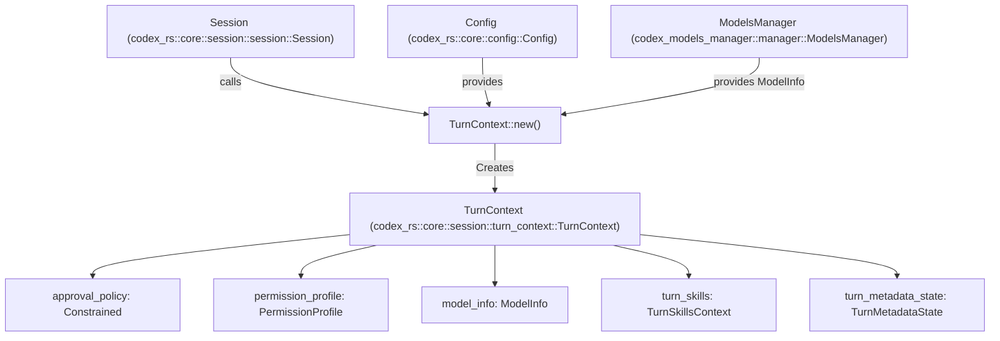
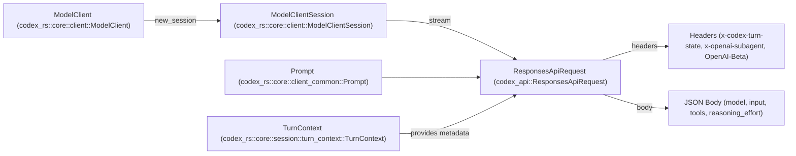

# Turn Execution and Prompt Construction

Relevant source files

The following files were used as context for generating this wiki page:

- [codex-rs/app-server/tests/suite/v2/client_metadata.rs](codex-rs/app-server/tests/suite/v2/client_metadata.rs)
- [codex-rs/codex-api/src/common.rs](codex-rs/codex-api/src/common.rs)
- [codex-rs/codex-api/src/endpoint/responses_websocket.rs](codex-rs/codex-api/src/endpoint/responses_websocket.rs)
- [codex-rs/codex-api/src/lib.rs](codex-rs/codex-api/src/lib.rs)
- [codex-rs/codex-api/src/sse/responses.rs](codex-rs/codex-api/src/sse/responses.rs)
- [codex-rs/core/src/client.rs](codex-rs/core/src/client.rs)
- [codex-rs/core/src/client_common.rs](codex-rs/core/src/client_common.rs)
- [codex-rs/core/src/codex_thread.rs](codex-rs/core/src/codex_thread.rs)
- [codex-rs/core/src/context_manager/updates.rs](codex-rs/core/src/context_manager/updates.rs)
- [codex-rs/core/src/sandbox_tags.rs](codex-rs/core/src/sandbox_tags.rs)
- [codex-rs/core/src/sandbox_tags_tests.rs](codex-rs/core/src/sandbox_tags_tests.rs)
- [codex-rs/core/src/session/handlers.rs](codex-rs/core/src/session/handlers.rs)
- [codex-rs/core/src/session/mod.rs](codex-rs/core/src/session/mod.rs)
- [codex-rs/core/src/session/review.rs](codex-rs/core/src/session/review.rs)
- [codex-rs/core/src/session/session.rs](codex-rs/core/src/session/session.rs)
- [codex-rs/core/src/session/tests.rs](codex-rs/core/src/session/tests.rs)
- [codex-rs/core/src/session/turn.rs](codex-rs/core/src/session/turn.rs)
- [codex-rs/core/src/session/turn_context.rs](codex-rs/core/src/session/turn_context.rs)
- [codex-rs/core/src/state/mod.rs](codex-rs/core/src/state/mod.rs)
- [codex-rs/core/src/state/turn.rs](codex-rs/core/src/state/turn.rs)
- [codex-rs/core/src/tasks/compact.rs](codex-rs/core/src/tasks/compact.rs)
- [codex-rs/core/src/tasks/mod.rs](codex-rs/core/src/tasks/mod.rs)
- [codex-rs/core/src/tasks/regular.rs](codex-rs/core/src/tasks/regular.rs)
- [codex-rs/core/src/tasks/review.rs](codex-rs/core/src/tasks/review.rs)
- [codex-rs/core/src/turn_metadata.rs](codex-rs/core/src/turn_metadata.rs)
- [codex-rs/core/src/turn_metadata_tests.rs](codex-rs/core/src/turn_metadata_tests.rs)
- [codex-rs/core/tests/common/Cargo.toml](codex-rs/core/tests/common/Cargo.toml)
- [codex-rs/core/tests/common/lib.rs](codex-rs/core/tests/common/lib.rs)
- [codex-rs/core/tests/common/responses.rs](codex-rs/core/tests/common/responses.rs)
- [codex-rs/core/tests/responses_headers.rs](codex-rs/core/tests/responses_headers.rs)
- [codex-rs/core/tests/suite/client.rs](codex-rs/core/tests/suite/client.rs)
- [codex-rs/core/tests/suite/client_websockets.rs](codex-rs/core/tests/suite/client_websockets.rs)
- [codex-rs/core/tests/suite/codex_delegate.rs](codex-rs/core/tests/suite/codex_delegate.rs)
- [codex-rs/core/tests/suite/collaboration_instructions.rs](codex-rs/core/tests/suite/collaboration_instructions.rs)
- [codex-rs/core/tests/suite/fork_thread.rs](codex-rs/core/tests/suite/fork_thread.rs)
- [codex-rs/core/tests/suite/override_updates.rs](codex-rs/core/tests/suite/override_updates.rs)
- [codex-rs/core/tests/suite/permissions_messages.rs](codex-rs/core/tests/suite/permissions_messages.rs)
- [codex-rs/core/tests/suite/prompt_caching.rs](codex-rs/core/tests/suite/prompt_caching.rs)
- [codex-rs/core/tests/suite/stream_error_allows_next_turn.rs](codex-rs/core/tests/suite/stream_error_allows_next_turn.rs)
- [codex-rs/core/tests/suite/stream_no_completed.rs](codex-rs/core/tests/suite/stream_no_completed.rs)
- [codex-rs/mcp-server/tests/common/Cargo.toml](codex-rs/mcp-server/tests/common/Cargo.toml)
- [codex-rs/mcp-server/tests/common/lib.rs](codex-rs/mcp-server/tests/common/lib.rs)
- [codex-rs/tools/src/tool_config.rs](codex-rs/tools/src/tool_config.rs)
- [codex-rs/tools/src/tool_config_tests.rs](codex-rs/tools/src/tool_config_tests.rs)

This document describes how Codex constructs and executes a single conversational turn. It covers the construction and use of the `TurnContext` struct, the assembly of prompt inputs including cached prefixes and instructions, and how API request options and authentication headers are built. The page also outlines mechanisms for turn execution via specific tasks, history management, and sub-agent executions.

For broader lifecycle understanding, see [3.1 Codex Interface and Session Lifecycle](), [3.2 Model Client and API Communication](), and [3.4 Event Processing and State Management]().

---

## TurnContext: Per-Turn Configuration

Each conversational turn in Codex is represented by a `TurnContext` object, which encapsulates all turn-scoped configuration, policies, metadata, and state. This isolation ensures that per-turn settings (e.g., model parameters, sandbox policies, approval rules) do not leak or interfere with adjacent turns, facilitating concurrency, retries, and consistent prompt construction.

### Key Fields and Roles

| Field Category | Key Fields | Description |
| ----------- | -------- | ----------- |
| **Identity and Routing** | `sub_id`, `session_source`, `trace_id` | Unique turn identifier, source (e.g. CLI, TUI), and W3C trace context [codex-rs/core/src/session/turn_context.rs:58-70](). |
| **Model and Provider** | `model_info`, `provider`, `reasoning_effort`, `reasoning_summary` | Model capability and provider-specific configuration, reasoning controls [codex-rs/core/src/session/turn_context.rs:63-69](). |
| **Approval and Security** | `approval_policy`, `sandbox_policy`, `permission_profile`, `network` | Policies for execution approval and sandbox access control [codex-rs/core/src/session/turn_context.rs:88-90](). |
| **Instructions and Personality** | `developer_instructions`, `user_instructions`, `compact_prompt`, `personality` | System prompts, developer/user instructions, personality schemas [codex-rs/core/src/session/turn_context.rs:82-87](). |
| **Environment** | `environments`, `timezone`, `current_date` | Multi-environment selections (e.g. SSH vs Local) and temporal context [codex-rs/core/src/session/turn_context.rs:73-80](). |
| **Tools** | `dynamic_tools` | Dynamic tool additions from MCP servers [codex-rs/core/src/session/turn_context.rs:101](). |
| **Metadata and State** | `turn_metadata_state`, `turn_timing_state`, `turn_skills` | Background git metadata, timing metrics, and turn-scoped skill context [codex-rs/core/src/session/turn_context.rs:102-105](). |

### TurnContext Data Flow

Title: TurnContext Construction and Dependencies

**Sources:** [codex-rs/core/src/session/turn_context.rs:57-108](), [codex-rs/core/src/session/session.rs:23-44]()

---

## Turn Execution via SessionTasks

Turn execution is abstracted into `SessionTask` implementations. Each task encapsulates a specific workflow (e.g., a regular chat turn, a review, or history compaction).

### SessionTask Lifecycle
1.  **Kind Identification:** The task identifies its type via `kind()` (e.g., `TaskKind::Regular`, `TaskKind::Review`, `TaskKind::Compact`) [codex-rs/core/src/tasks/mod.rs:211]().
2.  **Execution:** The `run()` method drives the core logic, streaming events via the `SessionTaskContext` and `TurnContext` [codex-rs/core/src/tasks/mod.rs:216-224]().
3.  **Cancellation:** Tasks monitor a `CancellationToken` to handle graceful interruptions and model aborts [codex-rs/core/src/tasks/mod.rs:216]().

### Task Variants and Logic
-   **RegularTask:** The standard loop for user interaction, handling tool calls and model responses [codex-rs/core/src/tasks/mod.rs:58]().
-   **ReviewTask:** Spawns a sub-agent conversation with a specialized review prompt to analyze code changes or PRs [codex-rs/core/src/tasks/mod.rs:59]().
-   **CompactTask:** Triggers a summarization turn to reduce history size when context limits are approached [codex-rs/core/src/tasks/mod.rs:57]().
-   **UserShellCommandTask:** Handles direct execution of user shell commands within the agent's environment [codex-rs/core/src/tasks/mod.rs:61]().

**Sources:** [codex-rs/core/src/tasks/mod.rs:208-224](), [codex-rs/core/src/tasks/mod.rs:57-62]()

---

## Prompt Construction and History Management

The `Prompt` struct manages the transcript of thread history and prepares it for model consumption by aggregating instructions, tools, and conversation items.

### History Preparation
-   **Normalization:** History items are formatted to ensure consistency, such as handling encrypted inter-agent communication [codex-rs/core/src/client_common.rs:58-75]().
-   **Image Detail Stripping:** For "lite" requests, image detail levels are stripped to reduce token usage [codex-rs/core/src/client_common.rs:77-86]().
-   **Token Usage Tracking:** Codex tracks token usage facts (input, output, reasoning) to determine when compaction is necessary [codex-rs/core/src/tasks/mod.rs:37-49]().

### Prompt Structure
The `Prompt` struct encapsulates the final payload:
-   **Input:** Conversation context input items [codex-rs/core/src/client_common.rs:22]().
-   **Tools:** Model-visible `ToolSpec` objects, including MCP tools [codex-rs/core/src/client_common.rs:26]().
-   **Base Instructions:** Core system instructions [codex-rs/core/src/client_common.rs:31]().
-   **Personality:** Optionally specify the model's persona (e.g. from `Personality` config) [codex-rs/core/src/client_common.rs:34]().
-   **Output Schema:** JSON schema constraints for structured output [codex-rs/core/src/client_common.rs:37-40]().

**Sources:** [codex-rs/core/src/client_common.rs:19-55](), [codex-rs/core/src/session/turn.rs:135-160](), [codex-rs/core/src/tasks/mod.rs:37-49]()

---

## Compaction Mechanisms

Codex employs strategies for history compaction when the context window is saturated.

### Pre-Sampling Compaction
Before a turn begins, `run_pre_sampling_compact` checks if history needs summarization [codex-rs/core/src/session/turn.rs:149]().

### Local vs Remote Compaction
-   **Inline/Local:** Uses the model itself to summarize history via a specialized task [codex-rs/core/src/session/turn.rs:14]().
-   **Remote:** For supported providers, Codex delegates compaction to a remote endpoint (`/responses/compact`) [codex-rs/core/src/client.rs:151](). Implementation is selected via `should_use_remote_compact_task` [codex-rs/core/src/session/turn.rs:15]().

**Sources:** [codex-rs/core/src/session/turn.rs:13-17](), [codex-rs/core/src/session/turn.rs:149-155](), [codex-rs/core/src/client.rs:150-154]()

---

## Request Options and Authentication

The `ModelClient` and `ModelClientSession` manage the physical construction of the API request, including headers and affinity.

### Affinity and Headers
-   **Sticky Routing:** The `x-codex-turn-state` header is used for sticky routing across turns to ensure consistent backend affinity [codex-rs/core/src/client.rs:13-14](), [codex-rs/core/src/client.rs:135]().
-   **Sub-agent Identification:** Requests from sub-agents (like Review or Guardian) include the `x-openai-subagent` header [codex-rs/core/src/client.rs:140]().
-   **Trace Context:** W3C trace context is propagated via headers for observability [codex-rs/core/src/client.rs:71-72](), [codex-rs/core/src/client.rs:137-138]().
-   **Beta Features:** Versioning headers like `OpenAI-Beta` enable specific features such as WebSocket-based responses (`responses_websockets=2026-02-06`) [codex-rs/core/src/client.rs:133](), [codex-rs/core/src/client.rs:147]().

### Request Construction Diagram

Title: API Request Assembly from Prompt and TurnContext

**Sources:** [codex-rs/core/src/client.rs:1-24](), [codex-rs/core/src/client.rs:133-149](), [codex-rs/core/src/session/turn_context.rs:57-108]()
