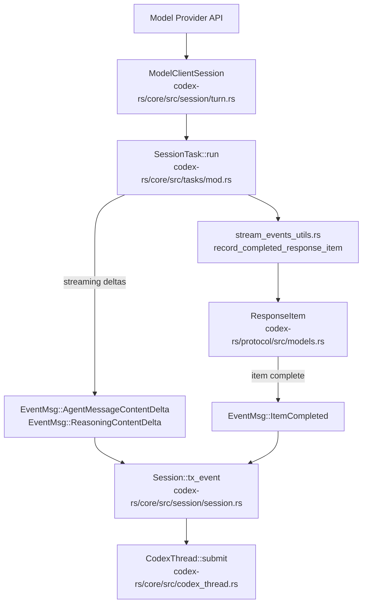
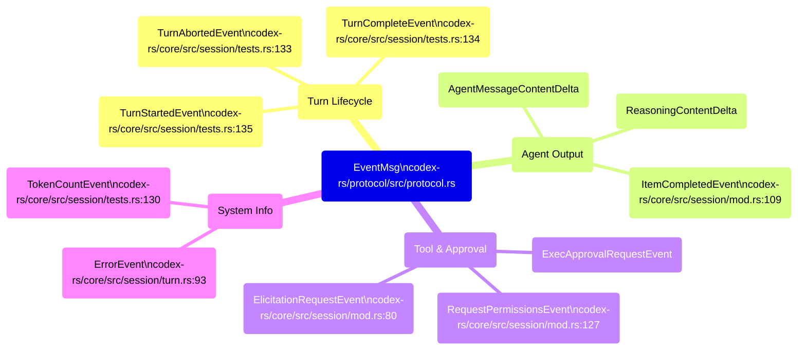
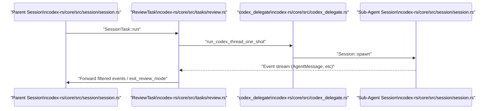

# Event Processing and State Management

Relevant source files

The following files were used as context for generating this wiki page:

- [codex-rs/app-server/tests/suite/v2/imagegen_extension.rs](codex-rs/app-server/tests/suite/v2/imagegen_extension.rs)
- [codex-rs/core/src/codex_thread.rs](codex-rs/core/src/codex_thread.rs)
- [codex-rs/core/src/context/contextual_user_message.rs](codex-rs/core/src/context/contextual_user_message.rs)
- [codex-rs/core/src/context/contextual_user_message_tests.rs](codex-rs/core/src/context/contextual_user_message_tests.rs)
- [codex-rs/core/src/context/internal_model_context.rs](codex-rs/core/src/context/internal_model_context.rs)
- [codex-rs/core/src/context/mod.rs](codex-rs/core/src/context/mod.rs)
- [codex-rs/core/src/event_mapping.rs](codex-rs/core/src/event_mapping.rs)
- [codex-rs/core/src/event_mapping_tests.rs](codex-rs/core/src/event_mapping_tests.rs)
- [codex-rs/core/src/session/handlers.rs](codex-rs/core/src/session/handlers.rs)
- [codex-rs/core/src/session/mod.rs](codex-rs/core/src/session/mod.rs)
- [codex-rs/core/src/session/review.rs](codex-rs/core/src/session/review.rs)
- [codex-rs/core/src/session/session.rs](codex-rs/core/src/session/session.rs)
- [codex-rs/core/src/session/tests.rs](codex-rs/core/src/session/tests.rs)
- [codex-rs/core/src/session/turn.rs](codex-rs/core/src/session/turn.rs)
- [codex-rs/core/src/session/turn_context.rs](codex-rs/core/src/session/turn_context.rs)
- [codex-rs/core/src/session/turn_tests.rs](codex-rs/core/src/session/turn_tests.rs)
- [codex-rs/core/src/state/mod.rs](codex-rs/core/src/state/mod.rs)
- [codex-rs/core/src/state/turn.rs](codex-rs/core/src/state/turn.rs)
- [codex-rs/core/src/stream_events_utils.rs](codex-rs/core/src/stream_events_utils.rs)
- [codex-rs/core/src/stream_events_utils_tests.rs](codex-rs/core/src/stream_events_utils_tests.rs)
- [codex-rs/core/src/tasks/compact.rs](codex-rs/core/src/tasks/compact.rs)
- [codex-rs/core/src/tasks/mod.rs](codex-rs/core/src/tasks/mod.rs)
- [codex-rs/core/src/tasks/regular.rs](codex-rs/core/src/tasks/regular.rs)
- [codex-rs/core/src/tasks/review.rs](codex-rs/core/src/tasks/review.rs)
- [codex-rs/core/tests/suite/codex_delegate.rs](codex-rs/core/tests/suite/codex_delegate.rs)
- [codex-rs/core/tests/suite/image_rollout.rs](codex-rs/core/tests/suite/image_rollout.rs)
- [codex-rs/core/tests/suite/json_result.rs](codex-rs/core/tests/suite/json_result.rs)
- [codex-rs/core/tests/suite/skills.rs](codex-rs/core/tests/suite/skills.rs)
- [codex-rs/core/tests/suite/tool_parallelism.rs](codex-rs/core/tests/suite/tool_parallelism.rs)
- [codex-rs/ext/image-generation/Cargo.toml](codex-rs/ext/image-generation/Cargo.toml)
- [codex-rs/ext/image-generation/imagegen_description.md](codex-rs/ext/image-generation/imagegen_description.md)
- [codex-rs/ext/image-generation/src/extension.rs](codex-rs/ext/image-generation/src/extension.rs)
- [codex-rs/ext/image-generation/src/tests.rs](codex-rs/ext/image-generation/src/tests.rs)
- [codex-rs/ext/image-generation/src/tool.rs](codex-rs/ext/image-generation/src/tool.rs)
- [codex-rs/tools/src/tool_config.rs](codex-rs/tools/src/tool_config.rs)
- [codex-rs/tools/src/tool_config_tests.rs](codex-rs/tools/src/tool_config_tests.rs)

This page documents how the core agent system maps raw API streaming events into protocol-level `EventMsg` variants, how session state accumulates and updates per-turn data (token usage, rate limits, MCP tool selection, conversation history), and how those updates flow from the end of each turn back into the session for subsequent turns.

For the `Op` submission side of the protocol (how messages get *into* the session), see **2.1 Protocol Layer (Submission/Event System)**. For conversation history representation and truncation, see **3.5 Conversation History Management**. For how `RegularTask` assembles the prompt before streaming begins, see **3.3 Turn Execution and Prompt Construction**.

---

## Event Processing Pipeline

When a turn runs, the model provider streams raw deltas. The turn runner—primarily implementations of the `SessionTask` trait—consumes these events and maps them to protocol-level outputs. The `Codex` struct manages the submission loop and event emission via `tx_event` [codex-rs/core/src/session/session.rs:26-26]().

**API Response-to-EventMsg Pipeline**

Sources: [codex-rs/core/src/session/session.rs:26-26](), [codex-rs/core/src/codex_thread.rs:188-190](), [codex-rs/core/src/stream_events_utils.rs:191-203](), [codex-rs/core/src/session/turn.rs:143-144]()

### Turn Item Processing and Persistence

Finalization of model output items occurs through utilities that bridge the streaming turn state and persistent session history.
*   **History Recording**: `record_completed_response_item` persists items into the session's conversation history via `record_conversation_items` [codex-rs/core/src/stream_events_utils.rs:191-212]().
*   **Image Generation**: If the model produces an image, `persist_image_generation_item` handles saving the artifact to the `codex_home` directory and updating the item with the saved path [codex-rs/core/src/stream_events_utils.rs:130-166]().
*   **Citations**: The system parses assistant output for memory citations using `strip_hidden_assistant_markup_and_parse_memory_citation` [codex-rs/core/src/stream_events_utils.rs:79-93]().

Sources: [codex-rs/core/src/stream_events_utils.rs:79-212]()

---

## EventMsg Variant Taxonomy

`EventMsg` is the main discriminated union representing all observable state changes. It is defined in the protocol crate and translated from internal `ResponseEvent` types during turn execution.

**EventMsg Variant Groups**

Sources: [codex-rs/core/src/session/tests.rs:130-135](), [codex-rs/core/src/session/mod.rs:80-127](), [codex-rs/core/src/session/turn.rs:93-99]()

Key event payloads defined in the session management logic:

| Event | Payload Context |
| :--- | :--- |
| `TurnStartedEvent` | Signals the beginning of a model interaction turn [codex-rs/core/src/session/tests.rs:135](). |
| `TurnCompleteEvent` | Contains final status and token usage for the turn [codex-rs/core/src/session/tests.rs:134](). |
| `TurnAbortedEvent` | Includes a `TurnAbortReason` (e.g., UserInterrupt, Error) [codex-rs/core/src/session/mod.rs:118](). |
| `TokenCountEvent` | Reports incremental token consumption for the session [codex-rs/core/src/session/tests.rs:130](). |

Sources: [codex-rs/core/src/session/tests.rs:130-135](), [codex-rs/core/src/session/mod.rs:109-127]()

---

## Session State and Lifecycle Management

The `Session` struct acts as the primary container for agent state during its lifetime.

### Session Configuration and State
`Session` tracks persistent and ephemeral data [codex-rs/core/src/session/session.rs:23-44]():
*   **`agent_status`**: A `watch::Sender` that broadcasts the current status (e.g., Idle, Running, Thinking) [codex-rs/core/src/session/session.rs:27-27]().
*   **`active_turn`**: A `Mutex<Option<ActiveTurn>>` protecting the state of the currently executing task and turn metadata [codex-rs/core/src/session/session.rs:39-39]().
*   **`input_queue`**: Buffers incoming `Op` submissions to be processed by the session loop [codex-rs/core/src/session/session.rs:40-40]().
*   **`state`**: A `Mutex<SessionState>` containing the core `SessionConfiguration` [codex-rs/core/src/session/session.rs:29-29]().

### ActiveTurn and TurnState
The `ActiveTurn` struct manages the lifecycle of a single model turn [codex-rs/core/src/state/turn.rs:30-33]():
*   **`RunningTask`**: Encapsulates the async task handle and cancellation token for the active workflow [codex-rs/core/src/state/turn.rs:72-83]().
*   **`TurnState`**: Holds mutable turn-scoped state such as `pending_approvals`, `pending_request_permissions`, and `token_usage_at_turn_start` [codex-rs/core/src/state/turn.rs:87-100]().

Sources: [codex-rs/core/src/session/session.rs:23-44](), [codex-rs/core/src/state/turn.rs:30-100]()

---

## State Synchronization and Multi-Agent Flow

The system coordinates sub-agents (like Reviewers) by spawning independent threads that report back to the parent session.

**Sub-Agent Spawn and Event Routing (Reviewer Example)**

Sources: [codex-rs/core/src/tasks/review.rs:51-88](), [codex-rs/core/src/tasks/review.rs:124-139](), [codex-rs/core/src/session/session.rs:23-44]()

### Thread Settings Synchronization
When thread settings are updated (e.g., changing models or approval policies), the `update_thread_settings` handler applies the changes to the `SessionState` and emits a `ThreadSettingsApplied` event [codex-rs/core/src/session/handlers.rs:91-105](). This ensures that the model and UI are synchronized regarding the current execution constraints.

### Turn Environment Management
Turn-specific context, including the working directory (`cwd`) and environment selection, is managed via `TurnContext` [codex-rs/core/src/session/turn_context.rs:57-108](). The `TurnEnvironment` struct tracks the specific `Environment` and path used for a turn, which is critical for resolving relative paths in tool calls [codex-rs/core/src/session/turn_context.rs:39-44]().

Sources: [codex-rs/core/src/session/handlers.rs:91-180](), [codex-rs/core/src/session/turn_context.rs:39-108]()
