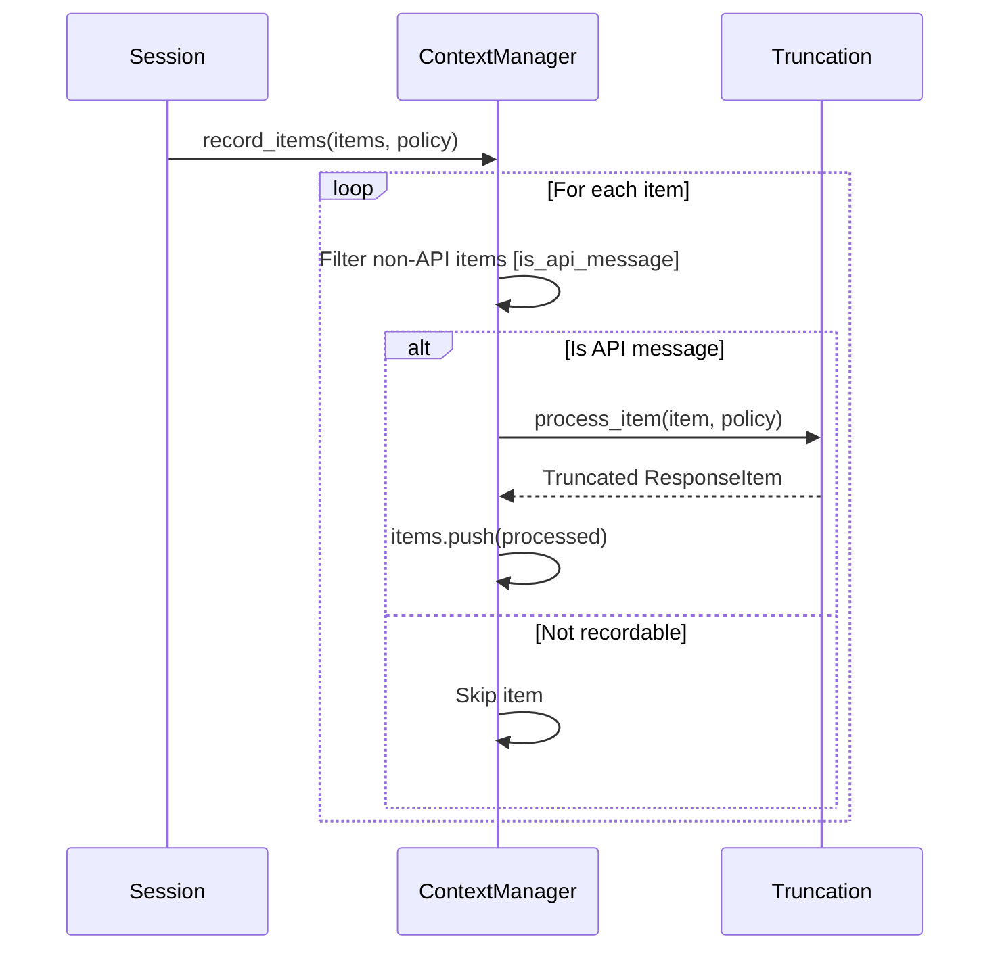
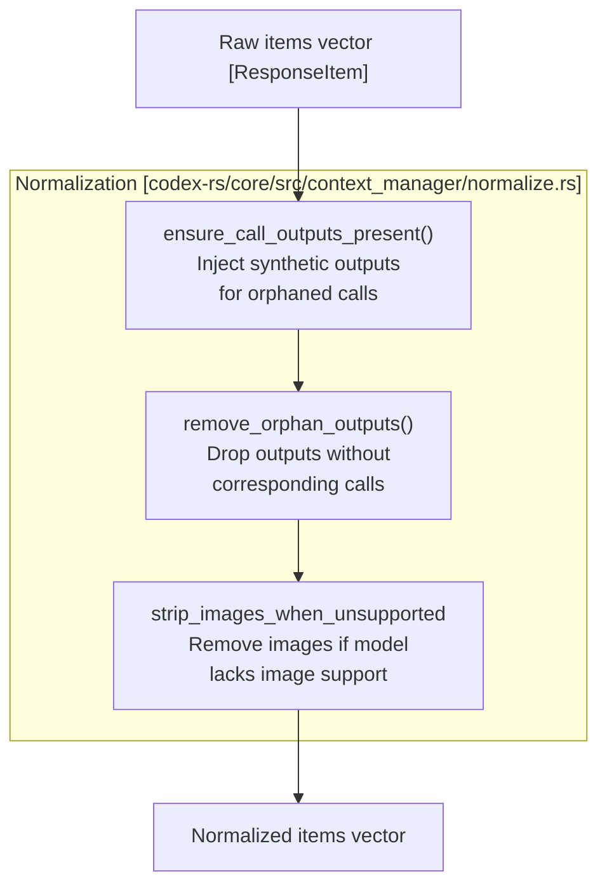

# Conversation History Management

<details>
<summary>Relevant source files</summary>

The following files were used as context for generating this wiki page:

- [codex-rs/analytics/Cargo.toml](codex-rs/analytics/Cargo.toml)
- [codex-rs/analytics/src/analytics_client_tests.rs](codex-rs/analytics/src/analytics_client_tests.rs)
- [codex-rs/analytics/src/client.rs](codex-rs/analytics/src/client.rs)
- [codex-rs/analytics/src/events.rs](codex-rs/analytics/src/events.rs)
- [codex-rs/analytics/src/facts.rs](codex-rs/analytics/src/facts.rs)
- [codex-rs/analytics/src/lib.rs](codex-rs/analytics/src/lib.rs)
- [codex-rs/analytics/src/reducer.rs](codex-rs/analytics/src/reducer.rs)
- [codex-rs/core/src/compact.rs](codex-rs/core/src/compact.rs)
- [codex-rs/core/src/compact_remote.rs](codex-rs/core/src/compact_remote.rs)
- [codex-rs/core/src/compact_remote_v2.rs](codex-rs/core/src/compact_remote_v2.rs)
- [codex-rs/core/src/context/environment_context.rs](codex-rs/core/src/context/environment_context.rs)
- [codex-rs/core/src/context/environment_context_tests.rs](codex-rs/core/src/context/environment_context_tests.rs)
- [codex-rs/core/src/context_manager/history.rs](codex-rs/core/src/context_manager/history.rs)
- [codex-rs/core/src/context_manager/history_tests.rs](codex-rs/core/src/context_manager/history_tests.rs)
- [codex-rs/core/src/context_manager/mod.rs](codex-rs/core/src/context_manager/mod.rs)
- [codex-rs/core/src/context_manager/normalize.rs](codex-rs/core/src/context_manager/normalize.rs)
- [codex-rs/core/src/session/rollout_reconstruction_tests.rs](codex-rs/core/src/session/rollout_reconstruction_tests.rs)
- [codex-rs/core/tests/suite/compact.rs](codex-rs/core/tests/suite/compact.rs)
- [codex-rs/core/tests/suite/compact_remote.rs](codex-rs/core/tests/suite/compact_remote.rs)
- [codex-rs/core/tests/suite/compact_resume_fork.rs](codex-rs/core/tests/suite/compact_resume_fork.rs)
- [codex-rs/core/tests/suite/resume_warning.rs](codex-rs/core/tests/suite/resume_warning.rs)
- [codex-rs/core/tests/suite/review.rs](codex-rs/core/tests/suite/review.rs)
- [codex-rs/rollout-trace/src/protocol_event.rs](codex-rs/rollout-trace/src/protocol_event.rs)
- [codex-rs/rollout/src/list.rs](codex-rs/rollout/src/list.rs)
- [codex-rs/rollout/src/policy.rs](codex-rs/rollout/src/policy.rs)
- [codex-rs/rollout/src/recorder.rs](codex-rs/rollout/src/recorder.rs)
- [codex-rs/rollout/src/recorder_tests.rs](codex-rs/rollout/src/recorder_tests.rs)
- [codex-rs/state/src/extract.rs](codex-rs/state/src/extract.rs)
- [codex-rs/thread-store/src/local/archive_thread.rs](codex-rs/thread-store/src/local/archive_thread.rs)
- [codex-rs/thread-store/src/local/list_threads.rs](codex-rs/thread-store/src/local/list_threads.rs)
- [codex-rs/thread-store/src/local/test_support.rs](codex-rs/thread-store/src/local/test_support.rs)
- [codex-rs/thread-store/src/local/unarchive_thread.rs](codex-rs/thread-store/src/local/unarchive_thread.rs)
- [codex-rs/tui/src/chatwidget/snapshots/codex_tui__chatwidget__tests__image_generation_call_history_snapshot.snap](codex-rs/tui/src/chatwidget/snapshots/codex_tui__chatwidget__tests__image_generation_call_history_snapshot.snap)

</details>


This document explains how Codex maintains and manipulates the conversation history that forms the model's context window. It covers the `ContextManager` data structure, item recording and normalization, token estimation, and history lifecycle management.

For details on **summarizing and compacting** conversation history when context limits are approached, see [History Compaction System](#3.5.1). For information on **persisting history to disk** and replaying it during session resumption, see [Rollout Persistence and Replay](#3.5.2).

---

## Overview

The conversation history manager is responsible for:

- Storing `ResponseItem` entries (user messages, assistant messages, tool calls, tool outputs, reasoning items) [codex-rs/core/src/context_manager/history.rs:33-36]().
- Normalizing history to maintain invariants, such as ensuring every tool call has a corresponding output [codex-rs/core/src/context_manager/history.rs:111-114]().
- Tracking token usage from API responses and estimating tokens for locally-added items [codex-rs/core/src/context_manager/history.rs:39-39]().
- Preparing history for prompt construction by filtering and transforming items [codex-rs/core/src/context_manager/history.rs:111-114]().
- Supporting history modification operations like removal, replacement, and compaction [codex-rs/core/src/context_manager/history.rs:157-172]().

The primary entry point is the `ContextManager` struct, which is utilized by the `Session` to manage the transcript of a thread [codex-rs/core/src/context_manager/history.rs:34-34]().

**Sources:** [codex-rs/core/src/context_manager/history.rs:33-51](), [codex-rs/core/src/context_manager/history.rs:111-114]()

---

## ContextManager Structure

The `ContextManager` serves as the bridge between high-level session state and the low-level `ResponseItem` storage used for API communication.

```mermaid
graph TB
    subgraph "ContextManager [codex-rs/core/src/context_manager/history.rs]"
        Items["items: Vec<ResponseItem><br/>(oldest to newest)"]
        TokenInfo["token_info: Option<TokenUsageInfo><br/>API-reported usage"]
        RefContext["reference_context_item:<br/>Option<TurnContextItem><br/>Baseline for settings diffs"]
    end
    
    subgraph "Core Operations"
        Record["record_items()<br/>Add items with truncation"]
        Normalize["normalize_history()<br/>Ensure invariants"]
        ForPrompt["for_prompt()<br/>Prepare for API"]
        Estimate["estimate_token_count()<br/>Local estimation"]
    end
    
    subgraph "Modification Operations"
        RemoveFirst["remove_first_item()"]
        Replace["replace()"]
    end
    
    Items --> Record
    Items --> Normalize
    Items --> ForPrompt
    Items --> Estimate
    Items --> RemoveFirst
    Items --> Replace
    
    TokenInfo --> Estimate
    RefContext -.-> "Used for<br/>settings diffing"
```

**ContextManager Fields**

| Field | Type | Purpose |
|-------|------|---------|
| `items` | `Vec<ResponseItem>` | Ordered history from oldest to newest [codex-rs/core/src/context_manager/history.rs:36-36]() |
| `token_info` | `Option<TokenUsageInfo>` | Last API-reported token usage [codex-rs/core/src/context_manager/history.rs:39-39]() |
| `reference_context_item` | `Option<TurnContextItem>` | Baseline for detecting settings changes [codex-rs/core/src/context_manager/history.rs:50-50]() |

The `items` vector maintains chronological order. Items at index 0 are oldest; items at the end are most recent [codex-rs/core/src/context_manager/history.rs:35-36]().

**Sources:** [codex-rs/core/src/context_manager/history.rs:33-51](), [codex-rs/core/src/context_manager/history.rs:157-172]()

---

## Recording Items into History

Items flow into the history manager through the `record_items` method, which accepts an iterator of items and a `TruncationPolicy` [codex-rs/core/src/context_manager/history.rs:91-95]().

### Item Filtering and Truncation

Only items that contribute to model context are recorded. Messages with roles `"user"`, `"assistant"`, and `"developer"` are typically retained. The recording logic skips items that are not suitable for the API via `is_api_message` [codex-rs/core/src/context_manager/history.rs:98-100]().

Tool outputs are processed during recording using `truncate_function_output_items_with_policy` to prevent excessive context usage [codex-rs/core/src/context_manager/history.rs:26-27]().



**Sources:** [codex-rs/core/src/context_manager/history.rs:91-105](), [codex-rs/core/src/context_manager/history.rs:111-114]()

---

## History Normalization

Before history is sent to the model API, `normalize_history` enforces several invariants to ensure the model receives a valid sequence of messages [codex-rs/core/src/context_manager/history.rs:112-112]().



### Invariant: Call/Output Pairing

Every tool call must have a corresponding output. If a call is missing its output, synthetic items may be inserted to maintain the protocol's structure. Conversely, orphaned outputs without calls are removed via `remove_orphan_outputs`.

When removing items from history, the system uses `normalize::remove_corresponding_for` to ensure that removing a tool call also removes its output to keep invariants intact [codex-rs/core/src/context_manager/history.rs:165-165]().

**Sources:** [codex-rs/core/src/context_manager/history.rs:157-167](), [codex-rs/core/src/context_manager/normalize.rs:1-150]()

---

## Preparing History for Prompts

The `for_prompt` method transforms the internal history representation into the final vector sent to the model API [codex-rs/core/src/context_manager/history.rs:111-114]():

1. **Normalization**: Runs `normalize_history` to enforce invariants [codex-rs/core/src/context_manager/history.rs:112-112]().
2. **Modality Handling**: Images are stripped if the target model's `input_modalities` do not include `InputModality::Image` [codex-rs/core/src/context_manager/history.rs:111-113]().

This ensures the model receives a clean, valid transcript matching its capabilities.

**Sources:** [codex-rs/core/src/context_manager/history.rs:111-114]()

---

## Token Usage Tracking

Token usage is tracked using a combination of API-reported usage and local estimation to provide real-time feedback before a turn completes [codex-rs/core/src/context_manager/history.rs:39-39]().

### Local Token Estimation

Token estimation uses byte-based heuristics from truncation helpers [codex-rs/core/src/context_manager/history.rs:132-132](). This provides a coarse lower bound for items added since the last successful API response.

The `estimate_token_count` method calculates the sum of base instructions and individual item tokens [codex-rs/core/src/context_manager/history.rs:132-140]().

**Sources:** [codex-rs/core/src/context_manager/history.rs:132-156](), [codex-rs/core/src/context_manager/history.rs:39-39]()

---

## History Modification Operations

### Removing Items

| Method | Description |
|--------|-------------|
| `remove_first_item()` | Removes the oldest item and its paired counterpart [codex-rs/core/src/context_manager/history.rs:157-167]() |

The `remove_first_item` method removes the oldest entry (index 0) and uses `normalize::remove_corresponding_for` to ensure data integrity [codex-rs/core/src/context_manager/history.rs:161-165]().

**Sources:** [codex-rs/core/src/context_manager/history.rs:157-167]()

### Reference Context Item

The `reference_context_item` stores a snapshot of `TurnContextItem` used for diffing and producing model-visible settings update items [codex-rs/core/src/context_manager/history.rs:40-51]().

- **Baseline**: It acts as the baseline for the next regular model turn [codex-rs/core/src/context_manager/history.rs:43-44]().
- **Reinjection**: When this is `None`, the system treats the next turn as having no baseline and emits a full reinjection of context state [codex-rs/core/src/context_manager/history.rs:46-47]().

**Sources:** [codex-rs/core/src/context_manager/history.rs:40-51](), [codex-rs/core/src/context_manager/history.rs:73-79]()
