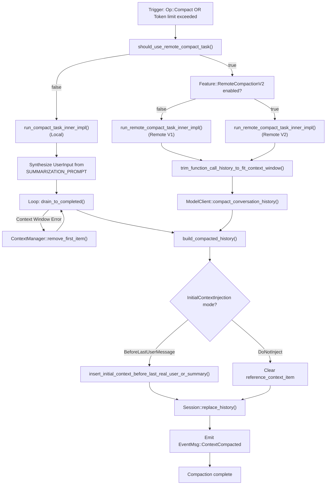
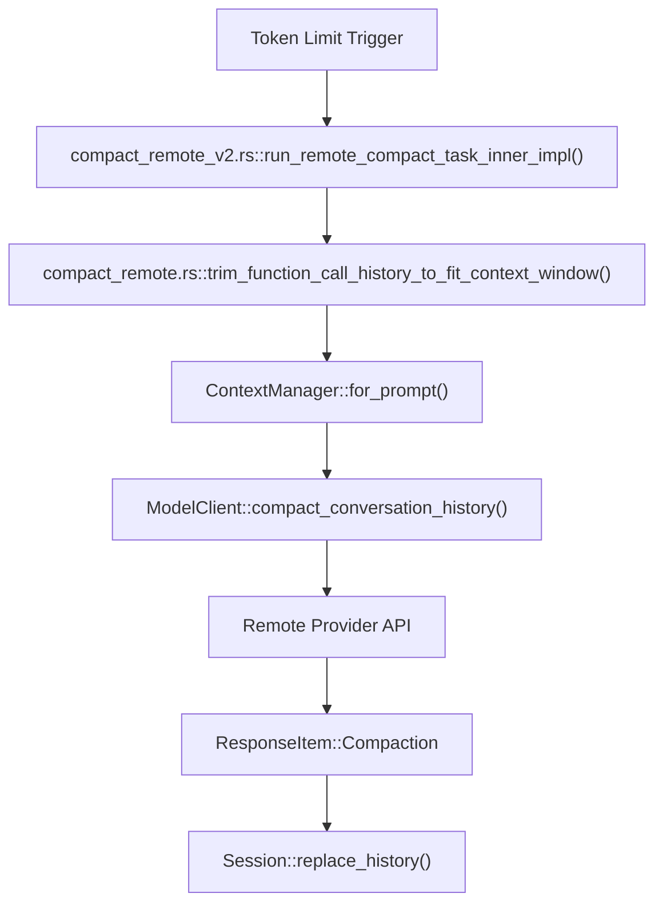

# History Compaction System

Relevant source files

The following files were used as context for generating this wiki page:

- [codex-rs/analytics/Cargo.toml](codex-rs/analytics/Cargo.toml)
- [codex-rs/analytics/src/analytics_client_tests.rs](codex-rs/analytics/src/analytics_client_tests.rs)
- [codex-rs/analytics/src/client.rs](codex-rs/analytics/src/client.rs)
- [codex-rs/analytics/src/events.rs](codex-rs/analytics/src/events.rs)
- [codex-rs/analytics/src/facts.rs](codex-rs/analytics/src/facts.rs)
- [codex-rs/analytics/src/lib.rs](codex-rs/analytics/src/lib.rs)
- [codex-rs/analytics/src/reducer.rs](codex-rs/analytics/src/reducer.rs)
- [codex-rs/core/src/compact.rs](codex-rs/core/src/compact.rs)
- [codex-rs/core/src/compact_remote.rs](codex-rs/core/src/compact_remote.rs)
- [codex-rs/core/src/compact_remote_v2.rs](codex-rs/core/src/compact_remote_v2.rs)
- [codex-rs/core/src/context/environment_context.rs](codex-rs/core/src/context/environment_context.rs)
- [codex-rs/core/src/context/environment_context_tests.rs](codex-rs/core/src/context/environment_context_tests.rs)
- [codex-rs/core/src/context_manager/history.rs](codex-rs/core/src/context_manager/history.rs)
- [codex-rs/core/src/context_manager/history_tests.rs](codex-rs/core/src/context_manager/history_tests.rs)
- [codex-rs/core/src/context_manager/mod.rs](codex-rs/core/src/context_manager/mod.rs)
- [codex-rs/core/src/context_manager/normalize.rs](codex-rs/core/src/context_manager/normalize.rs)
- [codex-rs/core/src/session/rollout_reconstruction_tests.rs](codex-rs/core/src/session/rollout_reconstruction_tests.rs)
- [codex-rs/core/tests/suite/compact.rs](codex-rs/core/tests/suite/compact.rs)
- [codex-rs/core/tests/suite/compact_remote.rs](codex-rs/core/tests/suite/compact_remote.rs)
- [codex-rs/core/tests/suite/compact_resume_fork.rs](codex-rs/core/tests/suite/compact_resume_fork.rs)
- [codex-rs/core/tests/suite/resume_warning.rs](codex-rs/core/tests/suite/resume_warning.rs)
- [codex-rs/core/tests/suite/review.rs](codex-rs/core/tests/suite/review.rs)
- [codex-rs/rollout-trace/src/protocol_event.rs](codex-rs/rollout-trace/src/protocol_event.rs)
- [codex-rs/rollout/src/list.rs](codex-rs/rollout/src/list.rs)
- [codex-rs/rollout/src/policy.rs](codex-rs/rollout/src/policy.rs)
- [codex-rs/rollout/src/recorder.rs](codex-rs/rollout/src/recorder.rs)
- [codex-rs/rollout/src/recorder_tests.rs](codex-rs/rollout/src/recorder_tests.rs)
- [codex-rs/state/src/extract.rs](codex-rs/state/src/extract.rs)
- [codex-rs/thread-store/src/local/archive_thread.rs](codex-rs/thread-store/src/local/archive_thread.rs)
- [codex-rs/thread-store/src/local/list_threads.rs](codex-rs/thread-store/src/local/list_threads.rs)
- [codex-rs/thread-store/src/local/test_support.rs](codex-rs/thread-store/src/local/test_support.rs)
- [codex-rs/thread-store/src/local/unarchive_thread.rs](codex-rs/thread-store/src/local/unarchive_thread.rs)
- [codex-rs/tui/src/chatwidget/snapshots/codex_tui__chatwidget__tests__image_generation_call_history_snapshot.snap](codex-rs/tui/src/chatwidget/snapshots/codex_tui__chatwidget__tests__image_generation_call_history_snapshot.snap)

## Purpose and Scope

The History Compaction System manages conversation history size by replacing older messages with summaries when context limits approach. It supports both manual user-triggered compaction (`Op::Compact`) and automatic compaction triggered by token usage thresholds. [codex-rs/core/src/compact.rs:69-94](), [codex-rs/core/src/compact.rs:96-119]()

The system features three primary implementations:
- **Local compaction:** Uses a predefined summarization prompt and runs within the client session, generating a summary assistant message via a standard inference turn. [codex-rs/core/src/compact.rs:170-225]()
- **Remote compaction (v1):** Utilizes a specialized model provider endpoint that returns a pre-compacted history directly. [codex-rs/core/src/compact_remote.rs:138-197]()
- **Remote compaction (v2):** An optimized version supporting streaming responses and enhanced retry logic for large context windows. [codex-rs/core/src/compact_remote_v2.rs:160-220]()

This page details the compaction workflows, summarization prompts, and strategies for reinjecting initial context after history has been truncated.

**Sources:** [codex-rs/core/src/compact.rs:1-48](), [codex-rs/core/src/compact_remote_v2.rs:48-53]()

---

## Compaction Types

### Local vs Remote Compaction

| Aspect               | Local Compaction                          | Remote Compaction (v1 & v2)                        |
|----------------------|------------------------------------------|----------------------------------------|
| **Provider support**  | Standard providers                      | Providers where `supports_remote_compaction()` is true [codex-rs/core/src/compact.rs:65-67]() |
| **Implementation**   | `compact.rs::run_compact_task()` [codex-rs/core/src/compact.rs:96-119]() | `compact_remote_v2.rs::run_remote_compact_task()` [codex-rs/core/src/compact_remote_v2.rs:75-98]() |
| **Mechanism**        | Injects `SUMMARIZATION_PROMPT` as a user-message input [codex-rs/core/src/compact.rs:76-81]() | Calls `compact_conversation_history()` on the model client [codex-rs/core/src/compact_remote.rs:188-197]() |
| **Output**           | Assistant reply used as the summary [codex-rs/core/src/compact.rs:222-225]() | Server returns a `ResponseItem::Compaction` [codex-rs/core/src/compact_remote.rs:31-32]() |
| **Retry Logic**      | Manual retry with backoff on failure [codex-rs/core/src/compact.rs:194-208]() | V2 uses `MAX_REMOTE_COMPACTION_V2_STREAM_RETRIES` (2) [codex-rs/core/src/compact_remote_v2.rs:53]() |

**Sources:** [codex-rs/core/src/compact.rs:65-119](), [codex-rs/core/src/compact_remote.rs:41-82](), [codex-rs/core/src/compact_remote_v2.rs:48-53]()

---

## Compaction Decision Flow

The system routes compaction based on model provider capabilities and the trigger context (auto vs manual).

### Execution Logic Diagram

**Sources:** [codex-rs/core/src/compact.rs:170-225](), [codex-rs/core/src/compact_remote.rs:138-197](), [codex-rs/core/src/compact_remote_v2.rs:100-158](), [codex-rs/core/src/compact.rs:365-380](), [codex-rs/core/src/context_manager/history.rs:165-175]()

---

## Trigger Conditions

### Manual Compaction
Triggered when a user explicitly submits an `Op::Compact` (e.g., via a slash command in the TUI).
- **Workflow:** Calls `run_compact_task` which emits a `TurnStarted` event and proceeds with `run_compact_task_inner`. [codex-rs/core/src/compact.rs:96-119]()
- **Warning:** A standard warning message notifies the user that multiple compactions can degrade model accuracy. [codex-rs/core/tests/suite/compact.rs:93-94]()
- **Injection:** Uses `InitialContextInjection::DoNotInject`. [codex-rs/core/src/compact.rs:113]()

### Automatic Compaction (Mid-Turn)
Triggered when token usage exceeds limits during a regular turn execution.
- **Trigger:** `run_inline_auto_compact_task` or `run_inline_remote_auto_compact_task`. [codex-rs/core/src/compact.rs:69-75](), [codex-rs/core/src/compact_remote_v2.rs:55-62]()
- **Mode:** Typically uses `InitialContextInjection::BeforeLastUserMessage` to ensure the model sees the summary immediately followed by the pending user request. [codex-rs/core/src/compact.rs:61]()

**Sources:** [codex-rs/core/src/compact.rs:60-119](), [codex-rs/core/tests/suite/compact.rs:93-94]()

---

## Local Compaction Process

### Summarization Prompt
Local compaction relies on templates to instruct the model to summarize the preceding conversation.
- `SUMMARIZATION_PROMPT`: The core instructions for the summarization turn. [codex-rs/core/src/compact.rs:47]()
- `SUMMARY_PREFIX`: A standardized header added to the summary to signal its nature to the model in future turns. [codex-rs/core/src/compact.rs:48]()

### Execution Loop
The local task executes within `run_compact_task_inner_impl`. It initializes a `ModelClientSession` and enters a retry loop. If the summarization request fails due to the context window being full, it calls `history.remove_first_item()` to discard the oldest message and retries until the summarization prompt fits. [codex-rs/core/src/compact.rs:170-208]()

**Sources:** [codex-rs/core/src/compact.rs:47-48](), [codex-rs/core/src/compact.rs:170-208](), [codex-rs/core/src/context_manager/history.rs:157-167]()

---

## Remote Compaction Process

### History Trimming
Remote endpoints often have strict input limits. Before calling the remote API, the system trims tool calls and reasoning items using `trim_function_call_history_to_fit_context_window`. [codex-rs/core/src/compact_remote.rs:183-188]()

This function removes "Codex-generated" items (tool calls, reasoning) from the oldest part of the history until the estimated token count is within the model's context window. [codex-rs/core/src/compact_remote.rs:293-323]()

### Retained Message Budget (V2)
The V2 implementation mirrors server-side logic by maintaining a `RETAINED_MESSAGE_TOKEN_BUDGET` of 64,000 tokens for messages kept alongside the summary. [codex-rs/core/src/compact_remote_v2.rs:49]()

**Sources:** [codex-rs/core/src/compact_remote.rs:183-188](), [codex-rs/core/src/compact_remote.rs:293-323](), [codex-rs/core/src/compact_remote_v2.rs:49-53]()

---

## Context Reinjection Strategies

The `InitialContextInjection` enum determines how the "Initial Context" (system instructions, environment state, settings) is restored after the history is rewritten. [codex-rs/core/src/compact.rs:60-64]()

| Mode | Behavior | Use Case |
| :--- | :--- | :--- |
| `BeforeLastUserMessage` | Injects context immediately before the last user message in the new history via `insert_initial_context_before_last_real_user_or_summary`. [codex-rs/core/src/compact.rs:62](), [codex-rs/core/src/compact.rs:472-497]() | Mid-turn auto-compaction where the current user prompt must follow the summary. |
| `DoNotInject` | Clears `reference_context_item` in `ContextManager`. [codex-rs/core/src/compact.rs:63]() | Standalone manual compaction; the next regular turn will reinject context as a fresh baseline. |

**Sources:** [codex-rs/core/src/compact.rs:60-64](), [codex-rs/core/src/compact.rs:472-497](), [codex-rs/core/src/context_manager/history.rs:73-75]()

---

## Bridging Natural Language to Code Entities

### Local Compaction Data Flow

```mermaid
graph LR
    User["Natural Language Prompt / Token Limit"] --> Session["Session::run_turn()"]
    Session --> CompactRS["compact.rs::run_compact_task_inner_impl()"]
    CompactRS --> ContextMgr["ContextManager::record_items(SUMMARIZATION_PROMPT)"]
    ContextMgr --> Client["ModelClientSession::drain_to_completed()"]
    Client --> LLM["LLM Generates Summary Text"]
    LLM --> Build["compact.rs::build_compacted_history()"]
    Build --> History["Session::replace_history()"]
```

**Sources:** [codex-rs/core/src/compact.rs:170-225](), [codex-rs/core/src/context_manager/history.rs:91-105]()

### Remote Compaction Data Flow

**Sources:** [codex-rs/core/src/compact_remote.rs:162-221](), [codex-rs/core/src/compact_remote_v2.rs:177-237](), [codex-rs/core/src/context_manager/history.rs:111-114]()

---

## History Replacement Logic

When compaction concludes, the session history is updated to reflect the new, smaller history.
1. `build_compacted_history` constructs a new vector of `ResponseItem`. [codex-rs/core/src/compact.rs:392-402]()
2. It preserves recent user messages (up to `COMPACT_USER_MESSAGE_MAX_TOKENS`, which is 20,000 tokens) to maintain immediate conversational context. [codex-rs/core/src/compact.rs:49](), [codex-rs/core/src/compact.rs:415-437]()
3. The summary is inserted as a `ResponseItem::Compaction` (for remote) or a prefixed assistant message (for local). [codex-rs/core/src/compact.rs:442-452]()
4. `Session::replace_history` updates the internal `ContextManager`, incrementing the `history_version` and resetting the `reference_context_item` if required. [codex-rs/core/src/context_manager/history.rs:38](), [codex-rs/core/src/context_manager/history.rs:73-75]()

**Sources:** [codex-rs/core/src/compact.rs:49](), [codex-rs/core/src/compact.rs:392-464](), [codex-rs/core/src/context_manager/history.rs:33-51]()
