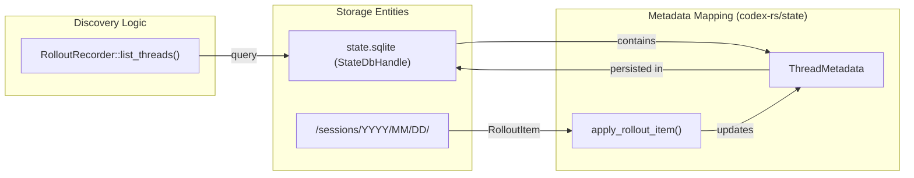

# Rollout Persistence and Replay

<details>
<summary>Relevant source files</summary>

The following files were used as context for generating this wiki page:

- [codex-rs/app-server/src/request_processors/thread_processor_tests.rs](codex-rs/app-server/src/request_processors/thread_processor_tests.rs)
- [codex-rs/app-server/tests/suite/conversation_summary.rs](codex-rs/app-server/tests/suite/conversation_summary.rs)
- [codex-rs/app-server/tests/suite/v2/remote_thread_store.rs](codex-rs/app-server/tests/suite/v2/remote_thread_store.rs)
- [codex-rs/app-server/tests/suite/v2/thread_read.rs](codex-rs/app-server/tests/suite/v2/thread_read.rs)
- [codex-rs/app-server/tests/suite/v2/thread_unarchive.rs](codex-rs/app-server/tests/suite/v2/thread_unarchive.rs)
- [codex-rs/core/src/context/environment_context.rs](codex-rs/core/src/context/environment_context.rs)
- [codex-rs/core/src/context/environment_context_tests.rs](codex-rs/core/src/context/environment_context_tests.rs)
- [codex-rs/core/src/context_manager/history.rs](codex-rs/core/src/context_manager/history.rs)
- [codex-rs/core/src/context_manager/history_tests.rs](codex-rs/core/src/context_manager/history_tests.rs)
- [codex-rs/core/src/context_manager/mod.rs](codex-rs/core/src/context_manager/mod.rs)
- [codex-rs/core/src/context_manager/normalize.rs](codex-rs/core/src/context_manager/normalize.rs)
- [codex-rs/core/src/session/rollout_reconstruction_tests.rs](codex-rs/core/src/session/rollout_reconstruction_tests.rs)
- [codex-rs/core/tests/suite/resume_warning.rs](codex-rs/core/tests/suite/resume_warning.rs)
- [codex-rs/rollout-trace/src/protocol_event.rs](codex-rs/rollout-trace/src/protocol_event.rs)
- [codex-rs/rollout/Cargo.toml](codex-rs/rollout/Cargo.toml)
- [codex-rs/rollout/src/compression.rs](codex-rs/rollout/src/compression.rs)
- [codex-rs/rollout/src/compression_tests.rs](codex-rs/rollout/src/compression_tests.rs)
- [codex-rs/rollout/src/lib.rs](codex-rs/rollout/src/lib.rs)
- [codex-rs/rollout/src/list.rs](codex-rs/rollout/src/list.rs)
- [codex-rs/rollout/src/policy.rs](codex-rs/rollout/src/policy.rs)
- [codex-rs/rollout/src/recorder.rs](codex-rs/rollout/src/recorder.rs)
- [codex-rs/rollout/src/recorder_tests.rs](codex-rs/rollout/src/recorder_tests.rs)
- [codex-rs/rollout/src/search.rs](codex-rs/rollout/src/search.rs)
- [codex-rs/state/src/extract.rs](codex-rs/state/src/extract.rs)
- [codex-rs/thread-store/src/in_memory.rs](codex-rs/thread-store/src/in_memory.rs)
- [codex-rs/thread-store/src/lib.rs](codex-rs/thread-store/src/lib.rs)
- [codex-rs/thread-store/src/local/archive_thread.rs](codex-rs/thread-store/src/local/archive_thread.rs)
- [codex-rs/thread-store/src/local/helpers.rs](codex-rs/thread-store/src/local/helpers.rs)
- [codex-rs/thread-store/src/local/list_threads.rs](codex-rs/thread-store/src/local/list_threads.rs)
- [codex-rs/thread-store/src/local/mod.rs](codex-rs/thread-store/src/local/mod.rs)
- [codex-rs/thread-store/src/local/read_thread.rs](codex-rs/thread-store/src/local/read_thread.rs)
- [codex-rs/thread-store/src/local/search_threads.rs](codex-rs/thread-store/src/local/search_threads.rs)
- [codex-rs/thread-store/src/local/test_support.rs](codex-rs/thread-store/src/local/test_support.rs)
- [codex-rs/thread-store/src/local/unarchive_thread.rs](codex-rs/thread-store/src/local/unarchive_thread.rs)
- [codex-rs/thread-store/src/store.rs](codex-rs/thread-store/src/store.rs)
- [codex-rs/thread-store/src/types.rs](codex-rs/thread-store/src/types.rs)
- [codex-rs/tui/src/chatwidget/snapshots/codex_tui__chatwidget__tests__image_generation_call_history_snapshot.snap](codex-rs/tui/src/chatwidget/snapshots/codex_tui__chatwidget__tests__image_generation_call_history_snapshot.snap)

</details>


## Purpose and Scope

This document describes Codex's rollout persistence system, which records conversation history and session metadata to disk in JSONL format. Rollout files enable thread resumption, allow inspection of conversation state for debugging, and provide a durable audit trail of agent interactions. The system uses a background recorder for asynchronous filesystem writes and a SQLite-backed index for fast thread discovery and rich metadata querying.

The rollout crate (`codex-rs/rollout/`) provides the core recording logic, while `codex-rs/state/` handles metadata extraction and SQLite integration. This page also covers the `rollout-trace` crate, which provides diagnostic bundles for offline session analysis.

---

## Rollout File Format

Codex persists conversation state to **rollout files**: newline-delimited JSON files where each line contains a `RolloutLine` wrapping a `RolloutItem`. These files are stored in a hierarchical date-based structure under the sessions directory, typically `~/.codex/sessions/YYYY/MM/DD/rollout-TIMESTAMP-UUID.jsonl` [[codex-rs/rollout/src/recorder.rs:66-73]]().

### RolloutLine Structure

Each line in a rollout file follows this structure:

```rust
pub struct RolloutLine {
    pub timestamp: String, // RFC3339 formatted
    pub item: RolloutItem,
}
```
The `RolloutLine` type wraps a `RolloutItem` and adds a UTC timestamp for each persisted event [[codex-rs/rollout/src/recorder.rs:58-60]]().

### Compression and Materialization
To save space, cold rollout files are compressed using Zstandard (`.zst`) by a background worker [[codex-rs/rollout/src/compression.rs:24-31]](). The system provides transparent access through `open_rollout_line_reader`, which handles both plain and compressed formats [[codex-rs/rollout/src/compression.rs:47-58]](). If a session is resumed, a compressed rollout is automatically materialized back to plain `.jsonl` to allow for appends [[codex-rs/rollout/src/compression.rs:67-72]]().

---

## RolloutItem Types

The `RolloutItem` enum defines the high-level categories of data persisted to rollout files:

| Item Type | Description | Key Behavior |
|-----------|-------------|--------------|
| `ResponseItem` | Raw model responses and tool calls | Contains `role`, `content` (text/tool calls), and tool outputs [[codex-rs/rollout/src/policy.rs:30-45]](). |
| `EventMsg` | Protocol-level events | Includes `UserMessage`, `AgentMessage`, `TokenCount`, and lifecycle events [[codex-rs/rollout/src/policy.rs:76-95]](). |
| `SessionMeta` | Session-level metadata | `id`, `source`, `cwd`, `model_provider`, and `cli_version` [[codex-rs/state/src/extract.rs:45-71]](). |
| `TurnContext` | Snapshot of turn settings | Captures `model`, `approval_policy`, and `sandbox_policy` for that specific turn [[codex-rs/state/src/extract.rs:73-82]](). |
| `Compacted` | Summary items | Stores items from history compaction tasks [[codex-rs/state/src/extract.rs:25-25]](). |

**Sources:** [[codex-rs/state/src/extract.rs:20-26]](), [[codex-rs/rollout/src/policy.rs:5-15]]()

---

## Rollout Persistence Filters

Not all events generated during a session are persisted to disk. Persistence is controlled by logic in `policy.rs` [[codex-rs/rollout/src/policy.rs:6-15]]().

*   **Persisted Items**: Essential conversation markers such as `UserMessage`, `AgentMessage`, `AgentReasoning`, `TokenCount`, and `TurnComplete` are always recorded [[codex-rs/rollout/src/policy.rs:77-95]]().
*   **Filtered Items**: Transient UI events or internal streaming deltas (e.g., `AgentMessageContentDelta`, `PlanDelta`, `ReasoningContentDelta`) are excluded to prevent rollout bloat [[codex-rs/rollout/src/policy.rs:149-152]]().
*   **Memory Filters**: A specialized filter `should_persist_response_item_for_memories` excludes `developer` messages from the memory extraction pipeline [[codex-rs/rollout/src/policy.rs:53-55]]().

The `is_persisted_rollout_item` function acts as the gatekeeper for live session recording [[codex-rs/rollout/src/policy.rs:6-15]]().

---

## RolloutRecorder Architecture

The `RolloutRecorder` manages the asynchronous writing of items to the filesystem. It uses a background `RolloutWriterTask` to handle I/O, ensuring that the main agent loop is not blocked by disk latency [[codex-rs/rollout/src/recorder.rs:75-79]]().

### Background Writing and Commands
The recorder communicates with the background task via a `RolloutCmd` channel [[codex-rs/rollout/src/recorder.rs:76-76]](). Supported commands include:
- `AddItems(Vec<RolloutItem>)`: Buffers new items for writing [[codex-rs/rollout/src/recorder.rs:99-99]]().
- `Persist`: Forces immediate write and returns an acknowledgement [[codex-rs/rollout/src/recorder.rs:100-102]]().
- `Flush`: Ensures all prior writes are processed [[codex-rs/rollout/src/recorder.rs:104-106]]().
- `Shutdown`: Gracefully closes the writer task [[codex-rs/rollout/src/recorder.rs:107-109]]().

### Diagram: Rollout Writing Data Flow
```mermaid
graph TB
    subgraph "Core Agent Space"
        ContextManager["ContextManager"]
        CodexCore["codex_core"]
    end

    subgraph "Rollout Crate (codex-rs/rollout)"
        Recorder["RolloutRecorder"]
        CmdChannel["mpsc::Sender<RolloutCmd>"]
        WriterTask["RolloutWriterTask (tokio::task)"]
    end

    subgraph "Disk Storage"
        Disk[("sessions/YYYY/MM/DD/*.jsonl")]
    end

    CodexCore -->|record_items()| ContextManager
    CodexCore -->|persist| Recorder
    Recorder -->|AddItems| CmdChannel
    CmdChannel --> WriterTask
    WriterTask -->|write_all()| Disk
```
**Sources:** [[codex-rs/rollout/src/recorder.rs:75-110]](), [[codex-rs/core/src/context_manager/history.rs:91-105]]()

---

## Session Metadata and Indexing

Codex uses a SQLite database as the primary query layer for session history and discovery.

### Metadata Extraction
The `apply_rollout_item` function extracts searchable attributes from rollout items to populate `ThreadMetadata` [[codex-rs/state/src/extract.rs:15-30]]().
- **Title**: Derived from the first `UserMessage` [[codex-rs/state/src/extract.rs:97-101]]().
- **Token Usage**: Updated from `TokenCount` events [[codex-rs/state/src/extract.rs:86-90]]().
- **Git Context**: Captures `git_sha`, `git_branch`, and `git_origin_url` from `SessionMeta` [[codex-rs/state/src/extract.rs:66-70]]().
- **Goals**: Thread objectives are extracted from `ThreadGoalUpdated` events [[codex-rs/state/src/extract.rs:104-109]]().

### StateRuntime and Backfill
The `state_db::init` function performs a backfill by scanning rollout files to ensure the SQLite index is consistent with the filesystem [[codex-rs/rollout/src/recorder_tests.rs:130-142]](). `RolloutRecorder::list_threads` provides the logic for querying these sessions with keyset pagination and filtering by `cwd_filters` or `search_term` [[codex-rs/rollout/src/recorder.rs:215-227]]().

### Diagram: Metadata Discovery and Storage

**Sources:** [[codex-rs/state/src/extract.rs:15-112]](), [[codex-rs/rollout/src/recorder.rs:215-227]](), [[codex-rs/rollout/src/recorder_tests.rs:130-142]]()

---

## Session Resumption and Replay

Session resumption (via `thread/resume` or `thread/fork`) allows the agent to continue a previous conversation by replaying its history.

### Replay Logic
The `RolloutRecorder::load_rollout_items` function reads a rollout file and returns a vector of `RolloutItem`s [[codex-rs/rollout/src/recorder_tests.rs:207-208]](). During replay:
- Legacy items like `ghost_snapshot` are skipped [[codex-rs/rollout/src/recorder_tests.rs:148-187]]().
- `SessionMeta` and `TurnContext` are used to restore the agent's environment (CWD, model, sandbox policy) [[codex-rs/state/src/extract.rs:45-81]]().
- A warning is emitted if the resumed model differs from the current configuration [[codex-rs/core/tests/suite/resume_warning.rs:82-134]]().

### Context Reconstruction
The `ContextManager` maintains the transcript of thread history in memory [[codex-rs/core/src/context_manager/history.rs:34-51]](). When resuming, `record_items` is used to populate the manager from the loaded rollout items [[codex-rs/core/src/context_manager/history.rs:91-105]](). It performs normalization to drop unsuitable items and applies truncation policies to fit within model context windows [[codex-rs/core/src/context_manager/history.rs:111-114]]().

**Sources:** [[codex-rs/rollout/src/recorder_tests.rs:207-220]](), [[codex-rs/core/src/context_manager/history.rs:34-114]](), [[codex-rs/core/tests/suite/resume_warning.rs:82-134]](), [[codex-rs/state/src/extract.rs:45-81]]()
