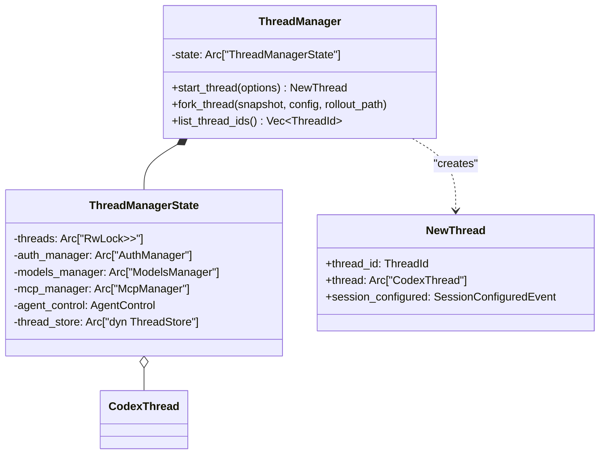
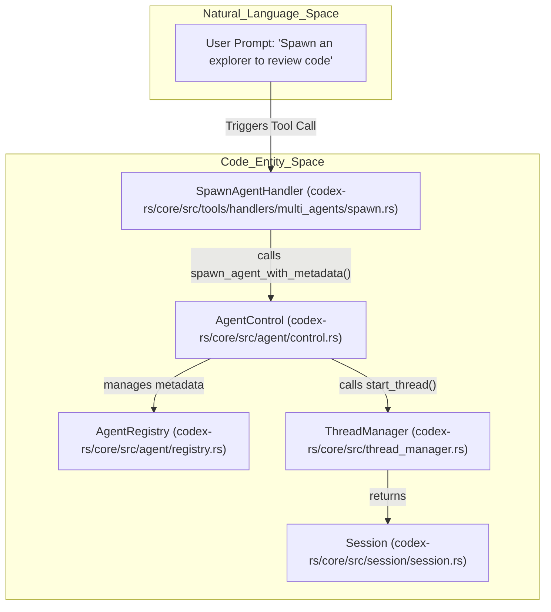
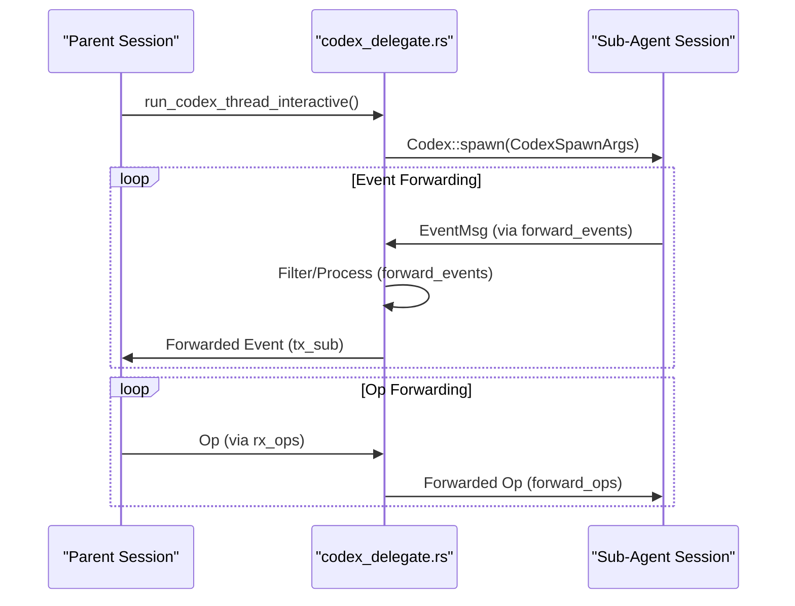

# Thread Management and Multi-Agent

Relevant source files

The following files were used as context for generating this wiki page:

- [codex-rs/core/src/agent/builtins/explorer.toml](codex-rs/core/src/agent/builtins/explorer.toml)
- [codex-rs/core/src/agent/control.rs](codex-rs/core/src/agent/control.rs)
- [codex-rs/core/src/agent/control_tests.rs](codex-rs/core/src/agent/control_tests.rs)
- [codex-rs/core/src/agent/role.rs](codex-rs/core/src/agent/role.rs)
- [codex-rs/core/src/agent/role_tests.rs](codex-rs/core/src/agent/role_tests.rs)
- [codex-rs/core/src/codex_delegate.rs](codex-rs/core/src/codex_delegate.rs)
- [codex-rs/core/src/prompt_debug.rs](codex-rs/core/src/prompt_debug.rs)
- [codex-rs/core/src/session/tests/guardian_tests.rs](codex-rs/core/src/session/tests/guardian_tests.rs)
- [codex-rs/core/src/state/service.rs](codex-rs/core/src/state/service.rs)
- [codex-rs/core/src/thread_manager.rs](codex-rs/core/src/thread_manager.rs)
- [codex-rs/core/src/thread_manager_tests.rs](codex-rs/core/src/thread_manager_tests.rs)
- [codex-rs/core/src/tools/handlers/multi_agents.rs](codex-rs/core/src/tools/handlers/multi_agents.rs)
- [codex-rs/core/src/tools/handlers/multi_agents/close_agent.rs](codex-rs/core/src/tools/handlers/multi_agents/close_agent.rs)
- [codex-rs/core/src/tools/handlers/multi_agents/resume_agent.rs](codex-rs/core/src/tools/handlers/multi_agents/resume_agent.rs)
- [codex-rs/core/src/tools/handlers/multi_agents/send_input.rs](codex-rs/core/src/tools/handlers/multi_agents/send_input.rs)
- [codex-rs/core/src/tools/handlers/multi_agents/spawn.rs](codex-rs/core/src/tools/handlers/multi_agents/spawn.rs)
- [codex-rs/core/src/tools/handlers/multi_agents/wait.rs](codex-rs/core/src/tools/handlers/multi_agents/wait.rs)
- [codex-rs/core/src/tools/handlers/multi_agents_common.rs](codex-rs/core/src/tools/handlers/multi_agents_common.rs)
- [codex-rs/core/src/tools/handlers/multi_agents_spec.rs](codex-rs/core/src/tools/handlers/multi_agents_spec.rs)
- [codex-rs/core/src/tools/handlers/multi_agents_spec_tests.rs](codex-rs/core/src/tools/handlers/multi_agents_spec_tests.rs)
- [codex-rs/core/src/tools/handlers/multi_agents_tests.rs](codex-rs/core/src/tools/handlers/multi_agents_tests.rs)
- [codex-rs/core/src/tools/handlers/multi_agents_v2.rs](codex-rs/core/src/tools/handlers/multi_agents_v2.rs)
- [codex-rs/core/src/tools/handlers/multi_agents_v2/message_tool.rs](codex-rs/core/src/tools/handlers/multi_agents_v2/message_tool.rs)
- [codex-rs/core/src/tools/handlers/multi_agents_v2/spawn.rs](codex-rs/core/src/tools/handlers/multi_agents_v2/spawn.rs)
- [codex-rs/core/tests/suite/subagent_notifications.rs](codex-rs/core/tests/suite/subagent_notifications.rs)
- [codex-rs/rollout-trace/README.md](codex-rs/rollout-trace/README.md)
- [codex-rs/rollout-trace/src/tool_dispatch.rs](codex-rs/rollout-trace/src/tool_dispatch.rs)

## Purpose and Scope

This document describes how Codex manages conversation threads and orchestrates multi-agent workflows. Thread management encompasses lifecycle operations (spawn, resume, fork) coordinated by `ThreadManager` and `ThreadManagerState`, while multi-agent support enables spawning specialized sub-agents for tasks like code review, history compaction, and collaborative problem solving. Each thread maintains independent state, and inter-agent communication is handled via `AgentControl` and specialized tool handlers.

## Thread Lifecycle and ThreadManager

The `ThreadManager` is the top-level owner of all active `CodexThread` instances. It manages their creation, persistence, and provides access to shared services like `AuthManager`, `ModelsManager`, and `McpManager`. [codex-rs/core/src/thread_manager.rs:172-175]()

### ThreadManager Architecture

The `ThreadManager` uses an internal `ThreadManagerState` wrapped in an `Arc` to allow safe sharing across threads and with `AgentControl`. [codex-rs/core/src/thread_manager.rs:172-173]()

Title: Thread Management Class Structure

Sources: [codex-rs/core/src/thread_manager.rs:112-116](), [codex-rs/core/src/thread_manager.rs:172-173]()

### Core Operations

| Operation | Implementation | Description |
| :--- | :--- | :--- |
| **Spawn** | `Codex::spawn` | Creates a fresh session from `CodexSpawnArgs`. [codex-rs/core/src/codex_delegate.rs:82-111]() |
| **Resume** | `InitialHistory::Resume` | Replays events from a rollout to reconstruct state. [codex-rs/core/src/thread_manager.rs:45-45]() |
| **Fork** | `InitialHistory::Forked` | Assigns a new `ThreadId` while inheriting parent history. [codex-rs/core/src/thread_manager.rs:46-46]() |

## Multi-Agent Architecture

Codex implements a hierarchical multi-agent system where a "parent" session can spawn "sub-agents" via `AgentControl`. This is primarily driven by the `multi_agents` tool handlers. [codex-rs/core/src/agent/control.rs:84-102]()

### AgentControl and Registry

`AgentControl` is the control-plane handle for multi-agent operations. It is held by each `Session` (via `SessionServices`) and provides the capability to spawn new agents and facilitate inter-agent communication. It is shared with every sub-agent spawned from a root to keep the registry scoped to that session tree. [codex-rs/core/src/agent/control.rs:84-102]()

Title: Multi-Agent Spawn Flow

Sources: [codex-rs/core/src/agent/control.rs:84-102](), [codex-rs/core/src/tools/handlers/multi_agents/spawn.rs:15-43]()

### Sub-Agent Roles and Configuration

When an agent is spawned, it can be assigned a specific "role" (e.g., `explorer`, `reviewer`). The `apply_role_to_config` function loads role-specific configurations and overlays them on the session config. [codex-rs/core/src/agent/role.rs:38-41]()

- **Role Resolution**: Uses `resolve_role_config` to find `AgentRoleConfig` from `config.toml` or built-in defaults. [codex-rs/core/src/agent/role.rs:119-127]()
- **Preservation Policy**: Ensures that the parent's `model_provider` and `service_tier` are preserved unless the role explicitly overrides them. [codex-rs/core/src/agent/role.rs:72-73]()
- **Layering**: Roles are inserted as high-precedence layers in the `ConfigLayerStack` via `build_next_config`. [codex-rs/core/src/agent/role.rs:132-154]()

## Inter-Agent Communication (Collab Tools)

Communication between agents is handled through a set of specialized tools. Modern "v2" implementations focus on task-based naming and improved turn management. [codex-rs/core/src/tools/handlers/multi_agents_v2.rs:1-12]()

| Tool | Handler | Description |
| :--- | :--- | :--- |
| `spawn_agent` | `SpawnAgentHandlerV2` | Spawns a sub-agent with a `task_name` and `message`. [codex-rs/core/src/tools/handlers/multi_agents_v2/spawn.rs:15-37]() |
| `send_message` | `SendMessageHandlerV2` | Queues a message on a target agent without triggering a turn. [codex-rs/core/src/tools/handlers/multi_agents_v2/message_tool.rs:1-15]() |
| `followup_task` | `FollowupTaskHandlerV2` | Sends a message and triggers a turn. [codex-rs/core/src/tools/handlers/multi_agents_v2/message_tool.rs:1-16]() |
| `wait_agent` | `WaitAgentHandlerV2` | Pauses parent execution until sub-agents reach a final state. [codex-rs/core/src/tools/handlers/multi_agents/wait.rs:15-23]() |
| `list_agents` | `ListAgentsHandlerV2` | Lists active sub-agents in the session tree. [codex-rs/core/src/tools/handlers/multi_agents_v2.rs:14-14]() |

### Sub-Agent Event Forwarding

When a sub-agent is running interactively, the `codex_delegate` module manages the bidirectional flow of operations and events, including filtering approvals to the parent. [codex-rs/core/src/codex_delegate.rs:68-77]()

Title: Sub-Agent Delegation Sequence

Sources: [codex-rs/core/src/codex_delegate.rs:82-111](), [codex-rs/core/src/codex_delegate.rs:141-150](), [codex-rs/core/src/codex_delegate.rs:154-156]()

## Thread State and Task Management

To support switching between threads and session resumption, Codex uses structured state storage and rollout tracking.

- **SessionServices**: Manages session-scoped state including `agent_control` and `thread_store`. [codex-rs/core/src/state/service.rs:41-85]()
- **Forking Snapshots**: Supports `TruncateBeforeNthUserMessage` or `Interrupted` modes to create coherent history forks. [codex-rs/core/src/thread_manager.rs:128-147]()
- **LiveAgent Registry**: Tracks the `LiveAgent` status and metadata (e.g., `thread_id`, `AgentStatus`) for all agents in a session tree. [codex-rs/core/src/agent/control.rs:71-75]()
- **Agent Graph Persistence**: Persistence of parent/child thread topology is supported by recording `DirectionalThreadSpawnEdgeStatus`. [codex-rs/core/src/agent/control.rs:35-35]()

Sources: [codex-rs/core/src/state/service.rs:41-85](), [codex-rs/core/src/thread_manager.rs:128-147](), [codex-rs/core/src/agent/control.rs:71-75](), [codex-rs/core/src/agent/control.rs:35-35]()
