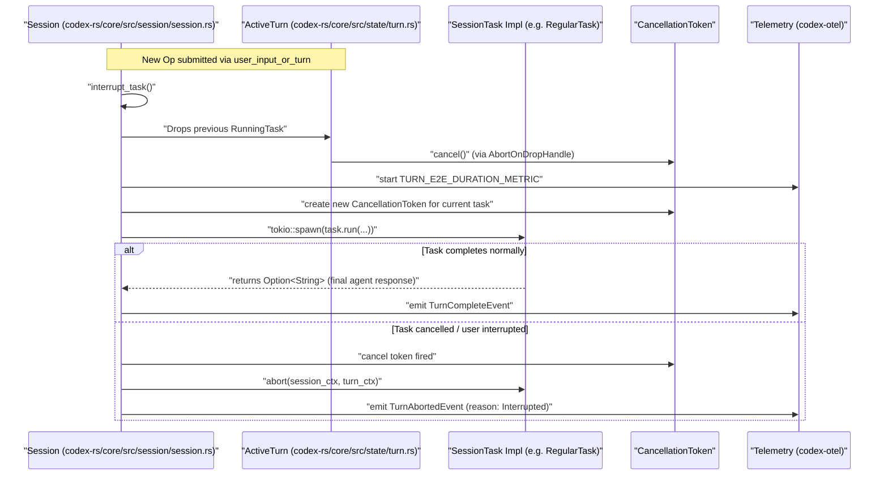
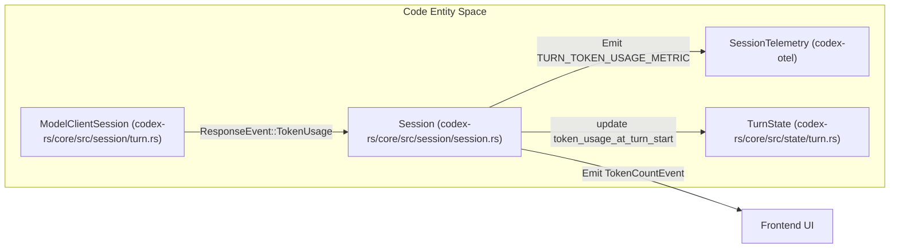
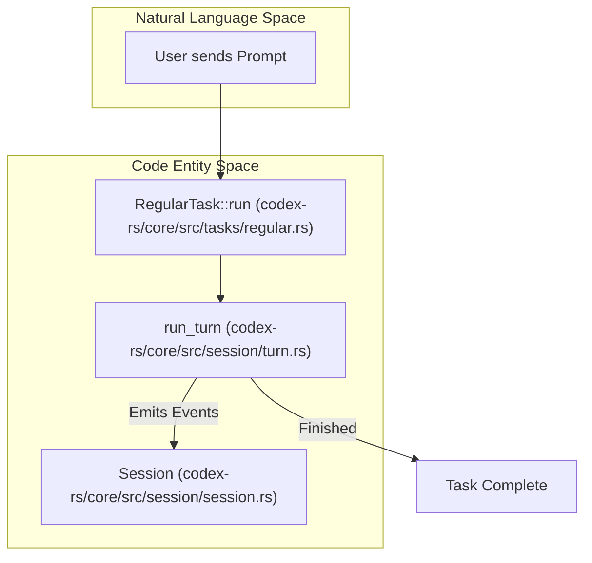
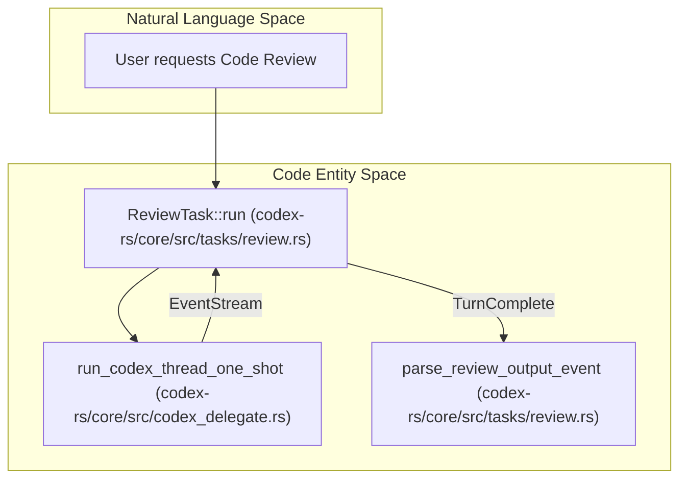

# Session Tasks and Turn State

<details>
<summary>Relevant source files</summary>

The following files were used as context for generating this wiki page:

- [codex-rs/app-server/tests/suite/v2/request_user_input.rs](codex-rs/app-server/tests/suite/v2/request_user_input.rs)
- [codex-rs/core/src/codex_thread.rs](codex-rs/core/src/codex_thread.rs)
- [codex-rs/core/src/session/handlers.rs](codex-rs/core/src/session/handlers.rs)
- [codex-rs/core/src/session/mod.rs](codex-rs/core/src/session/mod.rs)
- [codex-rs/core/src/session/review.rs](codex-rs/core/src/session/review.rs)
- [codex-rs/core/src/session/session.rs](codex-rs/core/src/session/session.rs)
- [codex-rs/core/src/session/tests.rs](codex-rs/core/src/session/tests.rs)
- [codex-rs/core/src/session/turn.rs](codex-rs/core/src/session/turn.rs)
- [codex-rs/core/src/session/turn_context.rs](codex-rs/core/src/session/turn_context.rs)
- [codex-rs/core/src/state/mod.rs](codex-rs/core/src/state/mod.rs)
- [codex-rs/core/src/state/turn.rs](codex-rs/core/src/state/turn.rs)
- [codex-rs/core/src/tasks/compact.rs](codex-rs/core/src/tasks/compact.rs)
- [codex-rs/core/src/tasks/mod.rs](codex-rs/core/src/tasks/mod.rs)
- [codex-rs/core/src/tasks/regular.rs](codex-rs/core/src/tasks/regular.rs)
- [codex-rs/core/src/tasks/review.rs](codex-rs/core/src/tasks/review.rs)
- [codex-rs/core/src/tools/handlers/plan.rs](codex-rs/core/src/tools/handlers/plan.rs)
- [codex-rs/core/src/tools/handlers/request_permissions.rs](codex-rs/core/src/tools/handlers/request_permissions.rs)
- [codex-rs/core/src/tools/handlers/request_user_input.rs](codex-rs/core/src/tools/handlers/request_user_input.rs)
- [codex-rs/core/src/tools/handlers/shell/shell_command.rs](codex-rs/core/src/tools/handlers/shell/shell_command.rs)
- [codex-rs/core/src/tools/handlers/test_sync.rs](codex-rs/core/src/tools/handlers/test_sync.rs)
- [codex-rs/core/src/tools/handlers/unified_exec/exec_command.rs](codex-rs/core/src/tools/handlers/unified_exec/exec_command.rs)
- [codex-rs/core/src/tools/handlers/unified_exec/write_stdin.rs](codex-rs/core/src/tools/handlers/unified_exec/write_stdin.rs)
- [codex-rs/core/tests/suite/agent_websocket.rs](codex-rs/core/tests/suite/agent_websocket.rs)
- [codex-rs/core/tests/suite/codex_delegate.rs](codex-rs/core/tests/suite/codex_delegate.rs)
- [codex-rs/core/tests/suite/request_user_input.rs](codex-rs/core/tests/suite/request_user_input.rs)
- [codex-rs/core/tests/suite/turn_state.rs](codex-rs/core/tests/suite/turn_state.rs)
- [codex-rs/core/tests/suite/websocket_fallback.rs](codex-rs/core/tests/suite/websocket_fallback.rs)
- [codex-rs/tools/src/tool_config.rs](codex-rs/tools/src/tool_config.rs)
- [codex-rs/tools/src/tool_config_tests.rs](codex-rs/tools/src/tool_config_tests.rs)

</details>


This page explains the `SessionTask` trait for defining asynchronous session tasks, the lifecycle of these tasks including spawning and aborting, the `TurnState` struct used to manage pending operations during a turn, and how token usage is tracked and exposed for telemetry and UI.

---

## Overview

In the Codex system, every AI interaction or complex workflow—such as a chat turn, a code review, or terminal command execution—is represented as a **Session Task**. These tasks are executed asynchronously on background Tokio tasks managed by the session. This design enables Codex to support multitasking, long-running operations, interruption, and cancellation while preserving a smooth user experience. [codex-rs/core/src/tasks/mod.rs:199-206]()

---

## SessionTask Trait and Lifecycle

The `SessionTask` trait offers a minimal interface to implement a unit of work driving a session turn. Each task instance is owned by a `Session` and runs asynchronously on background Tokio tasks. [codex-rs/core/src/tasks/mod.rs:199-206]()

### `SessionTask` Trait Definition

```rust
pub(crate) trait SessionTask: Send + Sync + 'static {
    /// Describes the type of work the task performs so the session can
    /// surface it in telemetry and UI.
    fn kind(&self) -> TaskKind;

    /// Returns the tracing name for a spawned task span.
    fn span_name(&self) -> &'static str;

    /// Executes the task until completion or cancellation.
    fn run(
        self: Arc<Self>,
        session: Arc<SessionTaskContext>,
        ctx: Arc<TurnContext>,
        input: Vec<TurnInput>,
        cancellation_token: CancellationToken,
    ) -> BoxFuture<'static, Option<String>>;

    /// Gives the task a chance to perform cleanup after an abort.
    fn abort(
        &self,
        _session: Arc<SessionTaskContext>,
        _ctx: Arc<TurnContext>,
    ) -> BoxFuture<'static, ()> {
        Box::pin(async {})
    }
}
```

- `kind()` identifies the task's purpose using the `TaskKind` enum (e.g., `Regular`, `Review`, `Compact`). [codex-rs/core/src/tasks/mod.rs:210-212]()
- `run(...)` executes the task asynchronously with full access to the `SessionTaskContext`, `TurnContext`, input, and a `CancellationToken`. [codex-rs/core/src/tasks/mod.rs:215-221]()
- `abort(...)` is called when the session requests cancellation, allowing for task-specific cleanup. [codex-rs/core/src/tasks/mod.rs:223-228]()

**Sources:** [codex-rs/core/src/tasks/mod.rs:207-230](), [codex-rs/core/src/state/turn.rs:65-70]() (for `TaskKind`)

---

### Task Lifecycle (Spawn and Abort)

Tasks are managed within the `Session`. When a new task is spawned (e.g., for a new user prompt), existing tasks are typically drained and aborted to maintain the session's state. [codex-rs/core/src/session/handlers.rs:62-64]()

The `ActiveTurn` struct manages the currently running `RunningTask` handle and its associated `TurnState`. [codex-rs/core/src/state/turn.rs:29-33]()

**Lifecycle Sequence:**



- When a new turn starts, any running tasks are cancelled by triggering their associated `CancellationToken`. [codex-rs/core/src/tasks/mod.rs:219-221]()
- The new task is spawned on Tokio with a fresh cancellation token and wrapped in an `AbortOnDropHandle`. [codex-rs/core/src/state/turn.rs:72-83]()
- Upon normal completion, the session emits a `TurnCompleteEvent`. [codex-rs/core/src/tasks/mod.rs:52]()
- If aborted (e.g., user interrupt), the task performs cleanup via `abort()`, and a `TurnAbortedEvent` is emitted. [codex-rs/core/src/tasks/mod.rs:50-51]()

**Sources:** [codex-rs/core/src/tasks/mod.rs:199-230](), [codex-rs/core/src/session/session.rs:39-40](), [codex-rs/core/src/state/turn.rs:72-83](), [codex-rs/core/src/session/handlers.rs:62-64]()

---

## Turn State and Pending Operations

### TurnContext and SessionTaskContext

- **`TurnContext`**: Encapsulates immutable parameters and environment for a specific agent turn, such as the unique `sub_id`, model details, and sandbox policies. [codex-rs/core/src/session/turn_context.rs:56-108]()
- **`SessionTaskContext`**: A thin wrapper that exposes parts of the `Session` that task runners need, such as the `AuthManager` and `SharedModelsManager`. [codex-rs/core/src/tasks/mod.rs:169-197]()

**Sources:** [codex-rs/core/src/tasks/mod.rs:169-197](), [codex-rs/core/src/session/turn_context.rs:56-108]()

---

### TurnState: Managing Pending Operations

The `TurnState` struct holds mutable state for the active turn, tracking asynchronous interactions that require external input or approval. It uses `oneshot` channels to bridge the gap between protocol events and the awaiting task logic. [codex-rs/core/src/state/turn.rs:86-100]()

| Component | Code Entity | Description |
|---|---|---|
| **Pending Approvals** | `pending_approvals` | Maps tool call IDs to `ReviewDecision` responders. [codex-rs/core/src/state/turn.rs:88]() |
| **Pending Permissions** | `pending_request_permissions` | Tracks requests for new sandbox permissions via `RequestPermissionsResponse`. [codex-rs/core/src/state/turn.rs:89]() |
| **Pending User Input** | `pending_user_input` | Tracks requests for user clarification. [codex-rs/core/src/state/turn.rs:90]() |
| **Pending Elicitations** | `pending_elicitations` | Tracks MCP server elicitation requests. [codex-rs/core/src/state/turn.rs:91]() |
| **Mailbox Phase** | `mailbox_delivery_phase` | Determines if new messages join the current or next turn. [codex-rs/core/src/state/turn.rs:94]() |

**Sources:** [codex-rs/core/src/state/turn.rs:86-100](), [codex-rs/core/src/state/turn.rs:35-54]()

---

## Token Usage Tracking

Codex tracks token consumption during turns to provide accurate usage counts for UI display, internal rate limits, and telemetry.

### Data Flow for Token Metrics



- `ModelClientSession` returns `TokenUsage` within response events during `run_turn`. [codex-rs/core/src/session/turn.rs:135-144]()
- `TurnState` initializes `token_usage_at_turn_start` to calculate delta usage for the specific turn. [codex-rs/core/src/state/turn.rs:99]()
- Telemetry emits the `TURN_TOKEN_USAGE_METRIC` counter, tagged with model and provider info. [codex-rs/core/src/tasks/mod.rs:44]()

**Sources:** [codex-rs/core/src/session/turn.rs:135-155](), [codex-rs/core/src/tasks/mod.rs:36-44](), [codex-rs/core/src/state/turn.rs:97-100]()

---

## Specialized Task Implementations

Codex provides several `SessionTask` implementations for different workflows:

| Task Type | Implementation | Role |
|---|---|---|
| `RegularTask` | [codex-rs/core/src/tasks/regular.rs]() | Standard chat turn with model interaction and tool execution. [codex-rs/core/src/tasks/mod.rs:58]() |
| `ReviewTask` | [codex-rs/core/src/tasks/review.rs]() | Sub-agent workflow for code review and analysis. [codex-rs/core/src/tasks/mod.rs:59]() |
| `UserShellCommandTask` | [codex-rs/core/src/tasks/user_shell.rs]() | Executes interactive shell commands directly for the user. [codex-rs/core/src/tasks/mod.rs:61]() |
| `CompactTask` | [codex-rs/core/src/tasks/compact.rs]() | Triggers history compaction and summarization. [codex-rs/core/src/tasks/mod.rs:57]() |

**Sources:** [codex-rs/core/src/tasks/mod.rs:56-62]()

### Example: RegularTask Implementation

`RegularTask` is the primary driver for standard agent turns. It manages the transition from session initialization to the main execution loop via `run_turn`. [codex-rs/core/src/tasks/regular.rs:18-89]()



**Sources:** [codex-rs/core/src/tasks/regular.rs:18-89](), [codex-rs/core/src/session/turn.rs:135-142]()

### Example: ReviewTask Implementation

`ReviewTask` triggers a specialized sub-agent workflow. It creates a `sub_agent_config` with restricted features (e.g., disabling web search) and delegates the analysis to a one-shot Codex thread. [codex-rs/core/src/tasks/review.rs:95-139]()



**Sources:** [codex-rs/core/src/tasks/review.rs:51-88](), [codex-rs/core/src/tasks/review.rs:195-203]()

---

### Sources
- [codex-rs/core/src/tasks/mod.rs:1-230]()
- [codex-rs/core/src/session/session.rs:23-44]()
- [codex-rs/core/src/session/turn.rs:135-160]()
- [codex-rs/core/src/session/turn_context.rs:56-108]()
- [codex-rs/core/src/state/turn.rs:1-100]()
- [codex-rs/core/src/tasks/regular.rs:18-89]()
- [codex-rs/core/src/tasks/review.rs:42-93]()
- [codex-rs/core/src/tasks/review.rs:95-139]()
- [codex-rs/core/src/session/handlers.rs:62-64]()
