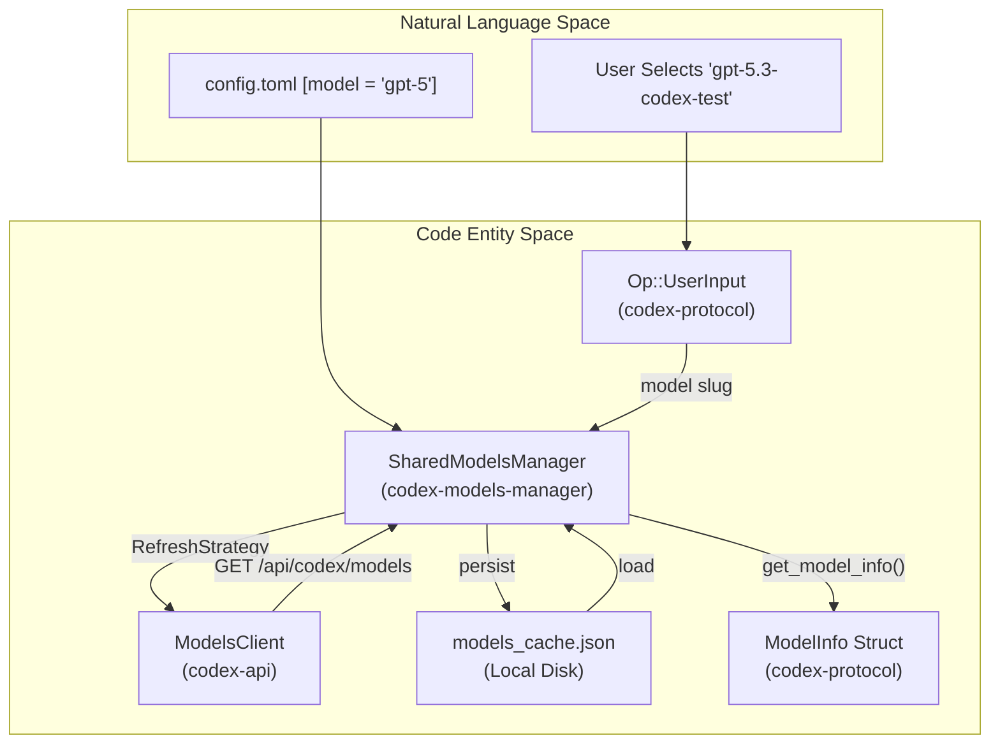
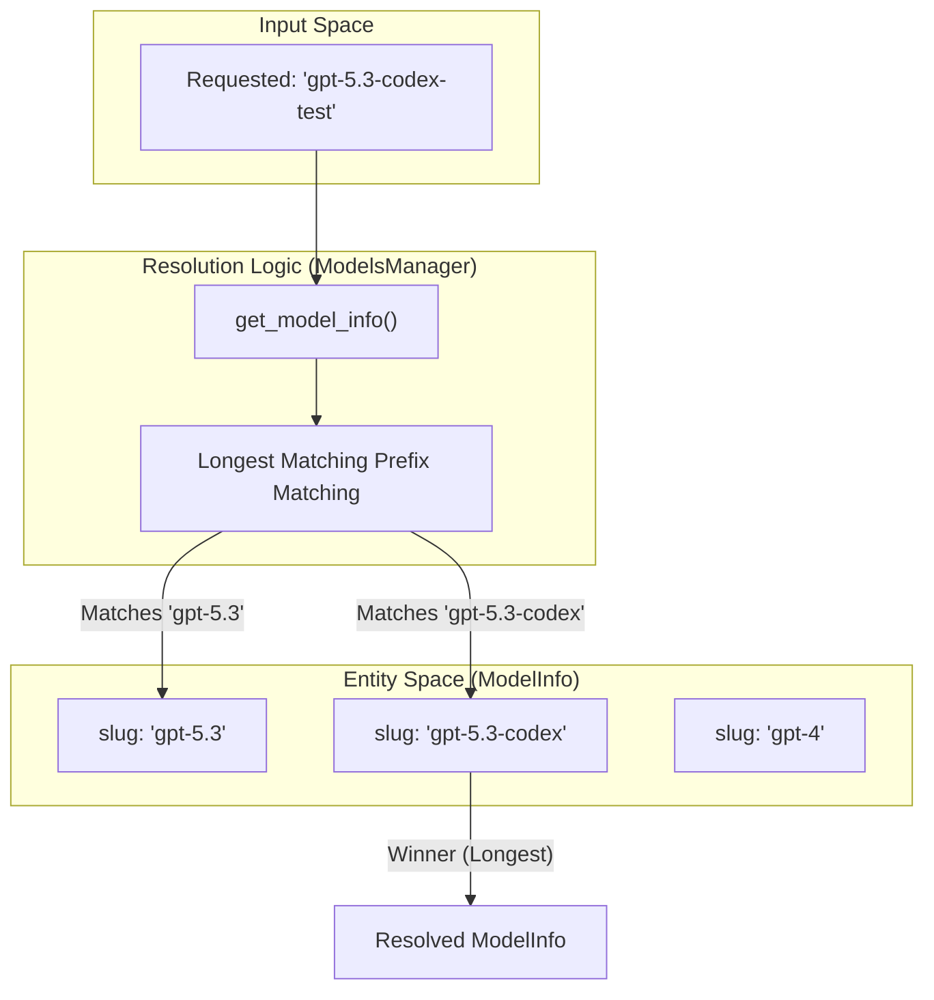

# Models Manager

Relevant source files

The following files were used as context for generating this wiki page:

- [codex-rs/app-server-protocol/schema/json/v2/ModelListResponse.json](codex-rs/app-server-protocol/schema/json/v2/ModelListResponse.json)
- [codex-rs/app-server-protocol/schema/typescript/v2/Model.ts](codex-rs/app-server-protocol/schema/typescript/v2/Model.ts)
- [codex-rs/app-server/src/models.rs](codex-rs/app-server/src/models.rs)
- [codex-rs/app-server/tests/common/models_cache.rs](codex-rs/app-server/tests/common/models_cache.rs)
- [codex-rs/app-server/tests/suite/v2/model_list.rs](codex-rs/app-server/tests/suite/v2/model_list.rs)
- [codex-rs/codex-api/tests/models_integration.rs](codex-rs/codex-api/tests/models_integration.rs)
- [codex-rs/core/tests/suite/model_switching.rs](codex-rs/core/tests/suite/model_switching.rs)
- [codex-rs/core/tests/suite/models_cache_ttl.rs](codex-rs/core/tests/suite/models_cache_ttl.rs)
- [codex-rs/core/tests/suite/personality.rs](codex-rs/core/tests/suite/personality.rs)
- [codex-rs/core/tests/suite/remote_models.rs](codex-rs/core/tests/suite/remote_models.rs)
- [codex-rs/core/tests/suite/rmcp_client.rs](codex-rs/core/tests/suite/rmcp_client.rs)
- [codex-rs/core/tests/suite/spawn_agent_description.rs](codex-rs/core/tests/suite/spawn_agent_description.rs)
- [codex-rs/core/tests/suite/truncation.rs](codex-rs/core/tests/suite/truncation.rs)
- [codex-rs/core/tests/suite/user_shell_cmd.rs](codex-rs/core/tests/suite/user_shell_cmd.rs)
- [codex-rs/core/tests/suite/view_image.rs](codex-rs/core/tests/suite/view_image.rs)
- [codex-rs/memories/write/Cargo.toml](codex-rs/memories/write/Cargo.toml)
- [codex-rs/memories/write/src/lib.rs](codex-rs/memories/write/src/lib.rs)
- [codex-rs/memories/write/src/phase1.rs](codex-rs/memories/write/src/phase1.rs)
- [codex-rs/memories/write/src/phase2.rs](codex-rs/memories/write/src/phase2.rs)
- [codex-rs/memories/write/src/runtime.rs](codex-rs/memories/write/src/runtime.rs)
- [codex-rs/memories/write/src/start.rs](codex-rs/memories/write/src/start.rs)
- [codex-rs/memories/write/src/startup_tests.rs](codex-rs/memories/write/src/startup_tests.rs)
- [codex-rs/model-provider-info/src/lib.rs](codex-rs/model-provider-info/src/lib.rs)
- [codex-rs/model-provider-info/src/model_provider_info_tests.rs](codex-rs/model-provider-info/src/model_provider_info_tests.rs)
- [codex-rs/model-provider/src/amazon_bedrock/catalog.rs](codex-rs/model-provider/src/amazon_bedrock/catalog.rs)
- [codex-rs/model-provider/src/amazon_bedrock/mod.rs](codex-rs/model-provider/src/amazon_bedrock/mod.rs)
- [codex-rs/model-provider/src/provider.rs](codex-rs/model-provider/src/provider.rs)
- [codex-rs/models-manager/src/model_info.rs](codex-rs/models-manager/src/model_info.rs)
- [codex-rs/protocol/src/openai_models.rs](codex-rs/protocol/src/openai_models.rs)
- [codex-rs/tui/src/chatwidget/snapshots/codex_tui__chatwidget__tests__model_selection_popup.snap](codex-rs/tui/src/chatwidget/snapshots/codex_tui__chatwidget__tests__model_selection_popup.snap)

The Models Manager is the subsystem within `codex-core` responsible for discovering, fetching remotely, caching with TTL, and resolving model metadata. It bridges the remote `/models` endpoint with caching layers and the rest of the agent system, making model capabilities available to prompt construction, tool configuration, and UI pickers. It also supports configuration overrides and collaboration mode presets.

This page documents the `ModelsManager` struct, refresh strategies for cache and remote fetch, slug resolution logic for matching model requests to `ModelInfo` entries, the caching mechanism including cache invalidation by TTL and client version, and collaboration mode presets used by the TUI and core agent system.

---

## Core Types

Model metadata types are defined primarily in [codex-rs/protocol/src/openai_models.rs:1-287](). These types are serialized across core, TUI, app-server, and SDK boundaries, so field defaults are used to preserve compatibility when older payloads omit newly introduced attributes [codex-rs/protocol/src/openai_models.rs:3-5]().

| Type | Purpose |
|-------|---------|
| `ModelInfo` | Full model metadata as returned by the `/models` endpoint, containing model name, description, reasoning levels, shell execution type, truncation policy, base instructions, and optional personality message templates [codex-rs/protocol/src/openai_models.rs:249-287](). |
| `ModelPreset` | A UI-friendly summary derived from model metadata, used for presenting models in pickers [codex-rs/protocol/src/openai_models.rs:196-234]().|
| `ModelsResponse` | Wrapper around a vector of `ModelInfo` for deserialization from model list endpoints [codex-rs/protocol/src/openai_models.rs:290-293](). |
| `ReasoningEffort` | Enum representing reasoning complexity levels: `None`, `Minimal`, `Low`, `Medium`, `High`, `XHigh` [codex-rs/protocol/src/openai_models.rs:40-50](). |
| `ReasoningEffortPreset` | Associates each reasoning effort level with a display description [codex-rs/protocol/src/openai_models.rs:165-171](). |
| `ConfigShellToolType` | Shell execution modes, such as `Default`, `Local`, `UnifiedExec`, `Disabled`, and `ShellCommand` [codex-rs/protocol/src/openai_models.rs:237-243](). |
| `ModelVisibility` | Model visibility control: `List` (visible in picker), `Hide`, or `None` [codex-rs/protocol/src/openai_models.rs:173-177](). |
| `TruncationPolicyConfig` | Defines token or byte limits to truncate tool outputs [codex-rs/protocol/src/openai_models.rs:221-226](). |
| `ModelUpgrade` | Recommended upgrade information for a model [codex-rs/protocol/src/openai_models.rs:174-180](). |

### Key `ModelInfo` Fields

| Field | Type | Description |
|-------|------|-------------|
| `slug` | `String` | Stable model identifier used in configuration and API requests. |
| `shell_type` | `ConfigShellToolType` | Determines the shell tool execution strategy the model supports [codex-rs/protocol/src/openai_models.rs:237-243](). |
| `truncation_policy` | `TruncationPolicyConfig` | Limits controlling the truncation behavior for tool outputs [codex-rs/protocol/src/openai_models.rs:221-226](). |
| `base_instructions` | `String` | System prompt or base instruction string for the model. |
| `context_window` | `Option<i64>` | Maximum token window supported by the model [codex-rs/protocol/src/openai_models.rs:279](). |
| `max_context_window` | `Option<i64>` | The absolute maximum context window the model can handle, used for clamping overrides [codex-rs/core/tests/suite/remote_models.rs:132](). |
| `input_modalities` | `Vec<InputModality>` | Input types supported, e.g., Text, Image [codex-rs/protocol/src/openai_models.rs:149-154](). |

Sources: [codex-rs/protocol/src/openai_models.rs:1-287](), [codex-rs/protocol/src/openai_models.rs:40-50](), [codex-rs/protocol/src/openai_models.rs:221-226](), [codex-rs/core/tests/suite/remote_models.rs:132]()

---

## Key Code Entities and Their Roles

### `ModelsManager` (`codex-models-manager`)
- Maintains an in-memory list of remote models fetched.
- Handles model list refresh based on a configurable `RefreshStrategy` [codex-rs/models-manager/src/manager.rs:33]().
- Performs longest prefix matching to resolve requested model slugs to `ModelInfo` [codex-rs/core/tests/suite/remote_models.rs:58-117]().
- Applies configuration overrides on resolved models (e.g. instructions, visibility).
- Triggers updates to the cache file on disk.

### `ModelsCacheManager`
- Responsible for reading/writing the `models_cache.json` file in the local Codex home directory [codex-rs/app-server/tests/common/models_cache.rs:67]().
- Validates cache freshness based on TTL and client version compatibility [codex-rs/app-server/tests/common/models_cache.rs:95-101]().
- Stores the last successful fetch time (`fetched_at`) and associated HTTP ETag [codex-rs/app-server/tests/common/models_cache.rs:97-100]().

### `ModelsClient` (`codex-api`)
- Handles network requests to the configured remote model provider API base URL [codex-rs/codex-api/tests/models_integration.rs:31-46]().
- Fetches model list from the `/api/codex/models` endpoint [codex-rs/codex-api/tests/models_integration.rs:109-117]().
- Supports `list_models` with client version headers [codex-rs/codex-api/tests/models_integration.rs:122-125]().

### `bundled_models_response()`
- Returns a fallback, stable instance of bundled model presets for offline/initial use [codex-rs/models-manager/src/manager.rs:7]().
- Used when network fetch or cache is unavailable or stale.

---

## ModelsManager Architecture and Data Flow

### Diagram: System Component Integration
This diagram bridges the "Natural Language Space" (where users select models by name) to the "Code Entity Space" (where `ModelInfo` is resolved and used by the agent).

Sources: [codex-rs/core/tests/suite/remote_models.rs:101-111](), [codex-rs/codex-api/tests/models_integration.rs:109-117](), [codex-rs/app-server/tests/common/models_cache.rs:67-105](), [codex-rs/protocol/src/openai_models.rs:196-197]()

---

## Refresh Strategies and Cache TTL

The model list refresh behavior is controlled by the `RefreshStrategy` enum [codex-rs/models-manager/src/manager.rs:33]():

| Strategy | Behavior |
|----------|----------|
| `Online` | Always perform network fetch, ignoring local cache. |
| `Offline` | Use only the local cache; never perform network requests. |
| `OnlineIfUncached` | Use local cached models if present and fresh; otherwise fetch online [codex-rs/core/tests/suite/remote_models.rs:107](). |

### Cache Freshness Rules
- The cache file `models_cache.json` contains a timestamp `fetched_at` which determines TTL freshness [codex-rs/app-server/tests/common/models_cache.rs:96-99]().
- The cache includes a `client_version` field storing the API client version that wrote the cache [codex-rs/app-server/tests/common/models_cache.rs:97-101]().
- When `ModelsManager` loads the cache, it verifies that the cache version matches the running binary's client version [codex-rs/app-server/tests/common/models_cache.rs:101]().
- ETag-based renewal allows the system to extend cache TTL if the server returns a `304 Not Modified` or provides a matching `X-Models-Etag` header [codex-rs/core/tests/suite/models_cache_ttl.rs:81-128]().

---

## Model Slug Resolution

When a model slug is requested, `ModelsManager` resolves it by searching the cached list for the best matching `ModelInfo` based on **longest matching slug prefix**.

### Diagram: Longest Prefix Resolution
This diagram shows how a specific user request maps to a concrete code entity (`ModelInfo`) even when an exact match is missing.

Sources: [codex-rs/core/tests/suite/remote_models.rs:58-117](), [codex-rs/core/tests/suite/remote_models.rs:109-113]()

---

## ModelInfo Resolution with Overrides

After resolving the base `ModelInfo`, the system applies runtime overrides and clamps values to safety limits:

1.  **Context Window Clamping**: If a user configures a `model_context_window` override, the system clamps this value to the `max_context_window` advertised by the model [codex-rs/core/tests/suite/remote_models.rs:123-184]().
2.  **Base Instructions**: If `config.base_instructions` is provided, it replaces the model's default instructions verbatim and disables personality templates [codex-rs/core/tests/suite/personality.rs:109-127]().
3.  **Personality**: If the `Personality` feature is enabled [codex-rs/core/tests/suite/personality.rs:96-98](), the manager uses `get_model_instructions(personality)` to inject personality-specific strings into the prompt [codex-rs/core/tests/suite/personality.rs:103-104](). This often involves replacing placeholders like `{{ personality }}` [codex-rs/protocol/src/openai_models.rs:34]().
4.  **Input Modalities**: Components check the resolved `ModelInfo.input_modalities` to ensure the model supports required types like `InputModality::Image` [codex-rs/protocol/src/openai_models.rs:149-154]().

Sources: [codex-rs/core/tests/suite/remote_models.rs:189-191](), [codex-rs/core/tests/suite/personality.rs:109-127](), [codex-rs/protocol/src/openai_models.rs:34](), [codex-rs/protocol/src/openai_models.rs:149-154]()

---

## Truncation Policies

`ModelsManager` provides models with `TruncationPolicyConfig` which determines how large tool outputs are handled. 

- **Modes**: Policies can be based on `Bytes` or `Tokens` [codex-rs/protocol/src/openai_models.rs:223-226]().
- **Enforcement**: If a tool output (e.g., from `shell_command`) exceeds these limits, it is truncated before being sent back to the model [codex-rs/core/tests/suite/truncation.rs:45-119]().
- **Formatting**: Truncated output typically includes a marker such as `…X chars truncated…` [codex-rs/core/tests/suite/truncation.rs:185]().

Sources: [codex-rs/protocol/src/openai_models.rs:223-226](), [codex-rs/core/tests/suite/truncation.rs:45-119](), [codex-rs/core/tests/suite/truncation.rs:185]()
