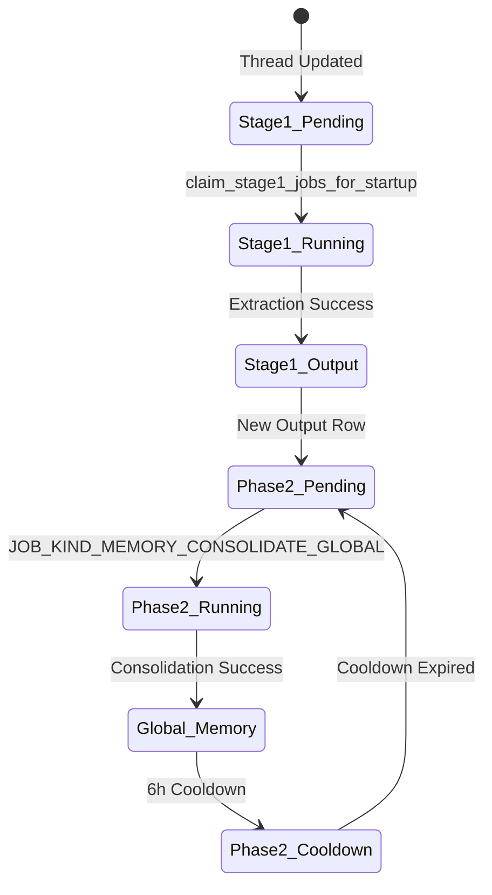

# Memories System

<details>
<summary>Relevant source files</summary>

The following files were used as context for generating this wiki page:

- [codex-rs/cli/src/state_db_recovery.rs](codex-rs/cli/src/state_db_recovery.rs)
- [codex-rs/core/tests/suite/sqlite_state.rs](codex-rs/core/tests/suite/sqlite_state.rs)
- [codex-rs/ext/memories/Cargo.toml](codex-rs/ext/memories/Cargo.toml)
- [codex-rs/ext/memories/src/backend.rs](codex-rs/ext/memories/src/backend.rs)
- [codex-rs/ext/memories/src/extension.rs](codex-rs/ext/memories/src/extension.rs)
- [codex-rs/ext/memories/src/lib.rs](codex-rs/ext/memories/src/lib.rs)
- [codex-rs/ext/memories/src/local.rs](codex-rs/ext/memories/src/local.rs)
- [codex-rs/ext/memories/src/local/ad_hoc_note.rs](codex-rs/ext/memories/src/local/ad_hoc_note.rs)
- [codex-rs/ext/memories/src/metrics.rs](codex-rs/ext/memories/src/metrics.rs)
- [codex-rs/ext/memories/src/tests.rs](codex-rs/ext/memories/src/tests.rs)
- [codex-rs/ext/memories/src/tools/ad_hoc_note.rs](codex-rs/ext/memories/src/tools/ad_hoc_note.rs)
- [codex-rs/ext/memories/src/tools/list.rs](codex-rs/ext/memories/src/tools/list.rs)
- [codex-rs/ext/memories/src/tools/mod.rs](codex-rs/ext/memories/src/tools/mod.rs)
- [codex-rs/ext/memories/src/tools/read.rs](codex-rs/ext/memories/src/tools/read.rs)
- [codex-rs/ext/memories/src/tools/search.rs](codex-rs/ext/memories/src/tools/search.rs)
- [codex-rs/memories/write/Cargo.toml](codex-rs/memories/write/Cargo.toml)
- [codex-rs/memories/write/src/lib.rs](codex-rs/memories/write/src/lib.rs)
- [codex-rs/memories/write/src/phase1.rs](codex-rs/memories/write/src/phase1.rs)
- [codex-rs/memories/write/src/phase2.rs](codex-rs/memories/write/src/phase2.rs)
- [codex-rs/memories/write/src/runtime.rs](codex-rs/memories/write/src/runtime.rs)
- [codex-rs/memories/write/src/start.rs](codex-rs/memories/write/src/start.rs)
- [codex-rs/memories/write/src/startup_tests.rs](codex-rs/memories/write/src/startup_tests.rs)
- [codex-rs/model-provider-info/src/lib.rs](codex-rs/model-provider-info/src/lib.rs)
- [codex-rs/model-provider-info/src/model_provider_info_tests.rs](codex-rs/model-provider-info/src/model_provider_info_tests.rs)
- [codex-rs/model-provider/src/amazon_bedrock/catalog.rs](codex-rs/model-provider/src/amazon_bedrock/catalog.rs)
- [codex-rs/model-provider/src/amazon_bedrock/mod.rs](codex-rs/model-provider/src/amazon_bedrock/mod.rs)
- [codex-rs/model-provider/src/provider.rs](codex-rs/model-provider/src/provider.rs)
- [codex-rs/rollout/src/metadata.rs](codex-rs/rollout/src/metadata.rs)
- [codex-rs/rollout/src/state_db.rs](codex-rs/rollout/src/state_db.rs)
- [codex-rs/rollout/src/state_db_tests.rs](codex-rs/rollout/src/state_db_tests.rs)
- [codex-rs/state/Cargo.toml](codex-rs/state/Cargo.toml)
- [codex-rs/state/migrations/0002_logs.sql](codex-rs/state/migrations/0002_logs.sql)
- [codex-rs/state/migrations/0010_logs_process_id.sql](codex-rs/state/migrations/0010_logs_process_id.sql)
- [codex-rs/state/migrations/0023_drop_logs.sql](codex-rs/state/migrations/0023_drop_logs.sql)
- [codex-rs/state/src/bin/logs_client.rs](codex-rs/state/src/bin/logs_client.rs)
- [codex-rs/state/src/lib.rs](codex-rs/state/src/lib.rs)
- [codex-rs/state/src/log_db.rs](codex-rs/state/src/log_db.rs)
- [codex-rs/state/src/log_db_filter_tests.rs](codex-rs/state/src/log_db_filter_tests.rs)
- [codex-rs/state/src/model/log.rs](codex-rs/state/src/model/log.rs)
- [codex-rs/state/src/model/memories.rs](codex-rs/state/src/model/memories.rs)
- [codex-rs/state/src/model/mod.rs](codex-rs/state/src/model/mod.rs)
- [codex-rs/state/src/model/thread_metadata.rs](codex-rs/state/src/model/thread_metadata.rs)
- [codex-rs/state/src/runtime.rs](codex-rs/state/src/runtime.rs)
- [codex-rs/state/src/runtime/agent_jobs.rs](codex-rs/state/src/runtime/agent_jobs.rs)
- [codex-rs/state/src/runtime/backfill.rs](codex-rs/state/src/runtime/backfill.rs)
- [codex-rs/state/src/runtime/goals.rs](codex-rs/state/src/runtime/goals.rs)
- [codex-rs/state/src/runtime/logs.rs](codex-rs/state/src/runtime/logs.rs)
- [codex-rs/state/src/runtime/memories.rs](codex-rs/state/src/runtime/memories.rs)
- [codex-rs/state/src/runtime/threads.rs](codex-rs/state/src/runtime/threads.rs)
- [codex-rs/thread-store/src/local/update_thread_metadata.rs](codex-rs/thread-store/src/local/update_thread_metadata.rs)
- [codex-rs/thread-store/src/thread_metadata_sync.rs](codex-rs/thread-store/src/thread_metadata_sync.rs)
- [codex-rs/tui/src/startup_error.rs](codex-rs/tui/src/startup_error.rs)

</details>


The Memories System is a multi-phase pipeline designed to extract, consolidate, and inject persistent knowledge from past conversation rollouts into the current agent context. It allows the agent to maintain long-term continuity, remember user preferences, and reuse proven workflows across different sessions.

## Architecture Overview

The system operates in two primary phases: **Startup Extraction (Phase 1)** and **Global Consolidation (Phase 2)**. These phases transition data from raw execution logs (rollouts) into a structured, searchable memory folder managed via the `MemoriesExtension`.

### Memory Pipeline Data Flow

The following diagram illustrates the flow from a completed rollout to injected context in a new session, highlighting the interaction between the core agent logic and the `StateRuntime` storage.

**Diagram: Memory Extraction and Consolidation Pipeline**
```mermaid
graph TD
    subgraph "codex-state (SQLite Storage)"
        [StateRuntime] --> [threads_table]
        [StateRuntime] --> [stage1_outputs_table]
        [StateRuntime] --> [jobs_table]
    end

    subgraph "Phase 1: Extraction (codex-core / memories-write)"
        [phase1::run] --> [claim_stage1_jobs_for_startup]
        [claim_stage1_jobs_for_startup] --> [Extraction_Agent]
        [Extraction_Agent] -- "GPT Summarization" --> [Stage1Output]
    end

    subgraph "Phase 2: Consolidation (codex-core / memories-write)"
        [phase2::run] --> [job::claim]
        [job::claim] --> [Consolidation_SubAgent]
        [Consolidation_SubAgent] -- "Markdown Generation" --> [FS_Sync]
    end

    subgraph "File System (codex_home/memories)"
        [rollout_jsonl] --> [phase1::run]
        [FS_Sync] --> [memory_summary.md]
        [FS_Sync] --> [skills_dir]
        [FS_Sync] --> [rollout_summaries_dir]
    end

    [Stage1Output] --> [stage1_outputs_table]
    [stage1_outputs_table] --> [phase2::run]
```
Sources: [codex-rs/state/src/runtime/memories.rs:18-22](), [codex-rs/state/src/runtime/memories.rs:144-148](), [codex-rs/state/src/runtime.rs:126-132]()

---

## Phase 1: Startup Extraction

Phase 1 identifies "stale" threads (those updated since their last memory extraction) and runs a lightweight agent to summarize them.

### Key Logic
1.  **Job Selection**: The system scans the `threads` table for active threads within an age window (`max_age_days`) that have been idle for a minimum duration (`min_rollout_idle_hours`) [codex-rs/state/src/runtime/memories.rs:163-165]().
2.  **Concurrency**: Extraction jobs are typically run in parallel, using the `claim_stage1_jobs_for_startup` method to obtain a batch of `Stage1JobClaim` objects [codex-rs/state/src/runtime/memories.rs:144-148]().
3.  **Staleness Check**: A thread is considered stale if `threads.updated_at_ms` is greater than the watermark in `stage1_outputs` or `jobs` [codex-rs/state/src/runtime/memories.rs:84-127]().
4.  **Extraction Output**: The result is a `Stage1Output` struct containing `raw_memory` (detailed markdown) and `rollout_summary` (compact recap) [codex-rs/state/src/lib.rs:45-47]().
5.  **Claim Outcomes**: Attempts to claim a job return a `Stage1JobClaimOutcome`, which handles states like `Claimed`, `SkippedUpToDate`, or `SkippedRunning` [codex-rs/state/src/lib.rs:46-46]().
6.  **Preferred Models**: Model selection for extraction defaults to `gpt-5.4-mini` unless overridden by the provider [codex-rs/model-provider/src/provider.rs:86-86](). For example, the Amazon Bedrock provider overrides this to `AMAZON_BEDROCK_GPT_5_4_MODEL_ID` [codex-rs/model-provider/src/amazon_bedrock/mod.rs:71-73]().

Sources: [codex-rs/state/src/runtime/memories.rs:144-218](), [codex-rs/state/src/runtime/memories.rs:84-127](), [codex-rs/state/src/lib.rs:45-47](), [codex-rs/model-provider/src/provider.rs:86-86](), [codex-rs/model-provider/src/amazon_bedrock/mod.rs:71-73]()

---

## Phase 2: Global Consolidation

Phase 2 merges individual stage-1 outputs into the global memory structure. This phase is governed by a global lock to prevent write contention.

### Implementation Details
*   **Global Lock**: Only one consolidation process can run at a time per `codex_home`, identified by the job kind `memory_consolidate_global` and the key `global` [codex-rs/state/src/runtime/memories.rs:19-20]().
*   **Cooldown Period**: Successful global consolidations trigger a cooldown (default 6 hours) during which subsequent claims will return `Phase2JobClaimOutcome::SkippedCooldown` [codex-rs/state/src/runtime/memories.rs:21-21]().
*   **Watermarking**: The system tracks `last_success_watermark` in the `jobs` table to ensure incremental processing of stage-1 outputs [codex-rs/state/src/runtime/memories.rs:109-124]().
*   **Consolidation Model**: Defaults to `gpt-5.4` [codex-rs/model-provider/src/provider.rs:90-90]().

**Diagram: Memory State Transitions**

Sources: [codex-rs/state/src/runtime/memories.rs:18-22](), [codex-rs/state/src/runtime/memories.rs:144-157](), [codex-rs/model-provider/src/provider.rs:90-90]()

---

## Storage and Persistence

The `StateRuntime` manages the SQLite persistence for metadata, goals, and the logs that inform memory extraction.

### Database Tables
The system utilizes primary SQLite databases located in `codex_home`.

| Table | Purpose |
| :--- | :--- |
| `threads` | Tracks thread lifecycle, `memory_mode`, and `updated_at_ms` [codex-rs/state/src/runtime/memories.rs:194-210](). |
| `stage1_outputs` | Stores `raw_memory` and `rollout_summary` for individual threads [codex-rs/state/src/runtime/memories.rs:66-74](). |
| `jobs` | Manages leases and retry state for `memory_stage1` and `memory_consolidate_global` [codex-rs/state/src/runtime/memories.rs:108-124](). |
| `logs` | Stores high-volume feedback and trace logs with per-thread partition caps [codex-rs/state/src/runtime/logs.rs:17-43](). |
| `thread_goals` | Persists agent objectives, status, and token usage [codex-rs/state/src/runtime/goals.rs:45-60](). |

### Runtime Initialization
The `StateRuntime` initializes the `memories_1.sqlite` database and applies migrations via the `runtime_memories_migrator` [codex-rs/state/src/runtime.rs:126-132](), [codex-rs/state/src/runtime.rs:186-190](). It also manages `state_5.sqlite`, `logs_2.sqlite`, and `goals_1.sqlite` [codex-rs/state/src/lib.rs:87-90]().

Sources: [codex-rs/state/src/runtime.rs:126-217](), [codex-rs/state/src/runtime/memories.rs:18-21](), [codex-rs/state/src/runtime/logs.rs:17-43](), [codex-rs/state/src/lib.rs:87-90](), [codex-rs/state/src/runtime/goals.rs:45-60]()

---

## Memories Extension and Tools

The system exposes consolidated memories and ad-hoc note-taking capabilities to the agent via the `MemoriesExtension` in the `codex-rs/ext/memories` crate.

### Tool Interface
The extension contributes several tools to the agent's environment when `dedicated_tools` is enabled in `MemoriesExtensionConfig` [codex-rs/ext/memories/src/extension.rs:93-111]():
*   **`add_ad_hoc_note`**: Allows the agent to create new markdown notes in the memory store [codex-rs/ext/memories/src/lib.rs:19-19]().
*   **`list`**: Lists available memory files [codex-rs/ext/memories/src/lib.rs:20-20]().
*   **`read`**: Reads specific memory content with token-limited output [codex-rs/ext/memories/src/lib.rs:21-21]().
*   **`search`**: Searches memory files for relevant content [codex-rs/ext/memories/src/lib.rs:22-22]().

### Context Injection
The `MemoriesExtension` also acts as a `ContextContributor`. It reads the `memory_summary.md` file from the `memories` directory and injects it into the prompt context [codex-rs/ext/memories/src/extension.rs:49-69]().

**Diagram: Extension Tool to Code Entity Mapping**
```mermaid
graph LR
    subgraph "Extension Registry"
        [MemoriesExtension] --> [ToolContributor]
        [MemoriesExtension] --> [ContextContributor]
    end

    subgraph "MemoriesExtension (extension.rs)"
        [ToolContributor] --> [tools::memory_tools]
        [ContextContributor] --> [build_memory_tool_developer_instructions]
    end

    subgraph "Tools (tools/mod.rs)"
        [tools::memory_tools] --> [ADD_AD_HOC_NOTE_TOOL_NAME]
        [tools::memory_tools] --> [LIST_TOOL_NAME]
        [tools::memory_tools] --> [READ_TOOL_NAME]
        [tools::memory_tools] --> [SEARCH_TOOL_NAME]
    end

    subgraph "Backend (local.rs)"
        [ADD_AD_HOC_NOTE_TOOL_NAME] --> [LocalMemoriesBackend::add_ad_hoc_note]
        [READ_TOOL_NAME] --> [LocalMemoriesBackend::read]
    end
```
Sources: [codex-rs/ext/memories/src/extension.rs:49-111](), [codex-rs/ext/memories/src/lib.rs:18-22](), [codex-rs/ext/memories/src/local.rs:24-27]()

---

## Context Usage and Citations

Memories are prioritized and tracked based on their utility in active conversations.

### Usage Tracking
When the agent utilizes a specific memory during a turn, the system records this usage to influence future prioritization:
*   **`record_stage1_output_usage`**: Increments the `usage_count` and updates the `last_usage` timestamp for the specified `thread_ids` in the `stage1_outputs` table [codex-rs/state/src/runtime/memories.rs:51-82]().
*   **Cleanup**: Users can reset the entire memory pipeline using `clear_memory_data`, which wipes all rows from `stage1_outputs` and resets associated `jobs` [codex-rs/state/src/runtime/memories.rs:43-45]().

### Logging and Debugging
Codex maintains a dedicated `logs_2.sqlite` database for tracing and feedback logs [codex-rs/state/src/lib.rs:87-87]().
*   **`LogDbLayer`**: A tracing subscriber layer that batches logs and sends them to a background queue [codex-rs/state/src/log_db.rs:94-110]().
*   **`insert_logs`**: The batch insertion function that persists `LogEntry` objects [codex-rs/state/src/runtime/logs.rs:11-47]().
*   **Partitioning**: Logs are pruned per-thread or per-process to a 10 MiB / 1,000 row limit to prevent unbounded database growth [codex-rs/state/src/runtime/logs.rs:49-141](), [codex-rs/state/src/runtime.rs:91-92]().
*   **CLI Tool**: The `codex-state-logs` binary allows developers to tail and filter these logs from the command line [codex-rs/state/src/bin/logs_client.rs:14-69]().

Sources: [codex-rs/state/src/runtime/memories.rs:43-82](), [codex-rs/state/src/runtime/logs.rs:11-141](), [codex-rs/state/src/log_db.rs:94-110](), [codex-rs/state/src/bin/logs_client.rs:14-69](), [codex-rs/state/src/lib.rs:87-87]()
