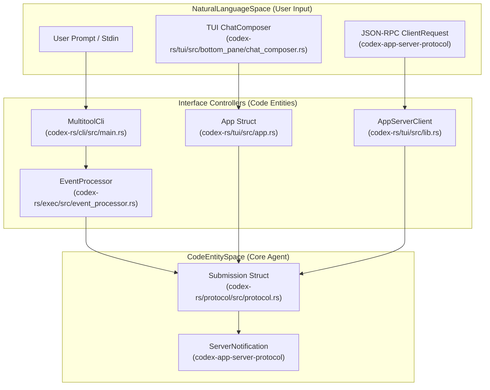
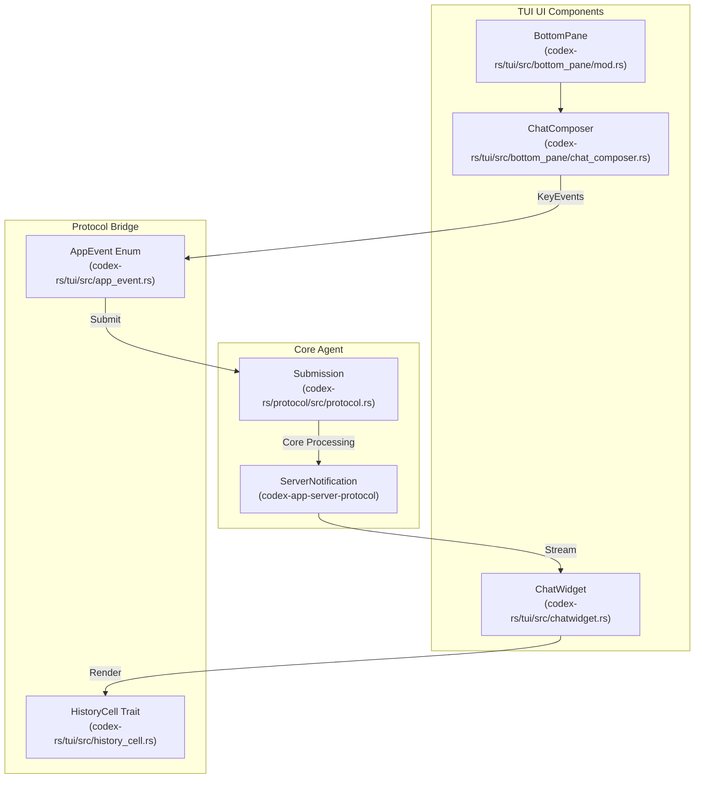

# User Interfaces

Relevant source files

The following files were used as context for generating this wiki page:

- [codex-rs/Cargo.lock](codex-rs/Cargo.lock)
- [codex-rs/Cargo.toml](codex-rs/Cargo.toml)
- [codex-rs/cli/Cargo.toml](codex-rs/cli/Cargo.toml)
- [codex-rs/cli/src/lib.rs](codex-rs/cli/src/lib.rs)
- [codex-rs/cli/src/main.rs](codex-rs/cli/src/main.rs)
- [codex-rs/core/Cargo.toml](codex-rs/core/Cargo.toml)
- [codex-rs/core/src/lib.rs](codex-rs/core/src/lib.rs)
- [codex-rs/exec/Cargo.toml](codex-rs/exec/Cargo.toml)
- [codex-rs/exec/src/cli.rs](codex-rs/exec/src/cli.rs)
- [codex-rs/exec/src/event_processor.rs](codex-rs/exec/src/event_processor.rs)
- [codex-rs/exec/src/event_processor_with_human_output.rs](codex-rs/exec/src/event_processor_with_human_output.rs)
- [codex-rs/exec/src/lib.rs](codex-rs/exec/src/lib.rs)
- [codex-rs/mcp-server/src/codex_tool_runner.rs](codex-rs/mcp-server/src/codex_tool_runner.rs)
- [codex-rs/protocol/src/protocol.rs](codex-rs/protocol/src/protocol.rs)
- [codex-rs/tui/Cargo.toml](codex-rs/tui/Cargo.toml)
- [codex-rs/tui/src/app.rs](codex-rs/tui/src/app.rs)
- [codex-rs/tui/src/app_event.rs](codex-rs/tui/src/app_event.rs)
- [codex-rs/tui/src/bottom_pane/chat_composer.rs](codex-rs/tui/src/bottom_pane/chat_composer.rs)
- [codex-rs/tui/src/bottom_pane/mod.rs](codex-rs/tui/src/bottom_pane/mod.rs)
- [codex-rs/tui/src/chatwidget.rs](codex-rs/tui/src/chatwidget.rs)
- [codex-rs/tui/src/chatwidget/slash_dispatch.rs](codex-rs/tui/src/chatwidget/slash_dispatch.rs)
- [codex-rs/tui/src/chatwidget/tests.rs](codex-rs/tui/src/chatwidget/tests.rs)
- [codex-rs/tui/src/chatwidget/tests/slash_commands.rs](codex-rs/tui/src/chatwidget/tests/slash_commands.rs)
- [codex-rs/tui/src/cli.rs](codex-rs/tui/src/cli.rs)
- [codex-rs/tui/src/lib.rs](codex-rs/tui/src/lib.rs)
- [codex-rs/tui/src/slash_command.rs](codex-rs/tui/src/slash_command.rs)

## Purpose and Scope

This document describes the user-facing interfaces through which users interact with Codex: the **Terminal User Interface (TUI)** for interactive sessions, **headless execution mode** (`codex exec`) for non-interactive automation, the **CLI entry point** that dispatches to different modes, and the **App Server** for IDE integrations. Each interface provides a different interaction model while sharing the same underlying core engine and protocol.

For configuration of these interfaces, see [Configuration System](#2.2). For the protocol layer that coordinates async communication across all interfaces, see [Protocol Layer (Submission/Event System)](#2.1).

---

## Execution Modes Overview

Codex supports several distinct execution modes, each optimized for different use cases. These modes bridge the "Natural Language Space" (user prompts) to the "Code Entity Space" (tool executions and file changes) via the `codex-protocol`.

### System Interface Mapping

The following diagram maps high-level user interfaces to the internal code entities that handle their execution.

**Execution Mode Characteristics:**

| Mode | Interactive | Output Format | Primary Use Case |
|------|-------------|---------------|------------------|
| TUI | Yes | Rich terminal UI | Human-driven development sessions |
| Exec | No | Plain text or JSONL | CI/CD, scripting, automation |
| Review | No | Plain text | Code review workflows |
| App Server | Yes (via IDE) | JSON-RPC | IDE integrations (VS Code, Cursor) |
| Cloud Tasks| Yes | TUI/CLI | Remote environment execution |

Sources: [codex-rs/cli/src/main.rs:103-118](), [codex-rs/tui/src/app.rs:1-4](), [codex-rs/protocol/src/protocol.rs:155-165]()

---

## Terminal User Interface (TUI)

The TUI is the primary interactive interface for Codex. It is built using `ratatui` and follows an event-driven architecture where the `App` struct coordinates between the UI widgets and the background agent threads.

### Component Hierarchy and Data Flow

The TUI maps user interactions to `Submission` entries and renders `ServerNotification` streams into `HistoryCell` units.

**Key TUI Components:**

| Component | File | Responsibility |
|-----------|------|----------------|
| `App` | [codex-rs/tui/src/app.rs:1-4]() | Top-level application state and high-level run loop coordination. |
| `ChatWidget` | [codex-rs/tui/src/chatwidget.rs:1-10]() | Consumes protocol events, manages `HistoryCell` units, and handles streaming active cells. |
| `BottomPane` | [codex-rs/tui/src/bottom_pane/mod.rs:1-12]() | Manages the interactive footer, input routing, and transient popup views. |
| `ChatComposer` | [codex-rs/tui/src/bottom_pane/chat_composer.rs:1-11]() | State machine for text input, slash command promotion, and large paste handling. |
| `HistoryCell` | [codex-rs/tui/src/app.rs:43-43]() | Trait defining how committed conversation items are rendered in the transcript. |

For details, see [Terminal User Interface (TUI)](#4.1).

---

## Headless Execution Mode (codex exec)

Headless mode allows running Codex commands from the CLI without a persistent UI. It is invoked via `codex exec` or `codex review`. It uses specialized processors to format agent progress for standard streams.

- **Non-interactive**: Primarily reads from CLI arguments or `stdin`. [codex-rs/cli/src/main.rs:122-124]()
- **Event Processing**: Uses `EventProcessorWithHumanOutput` to handle terminal output formatting for non-interactive users. [codex-rs/exec/src/lib.rs:101-101]()
- **Review Command**: Specifically tailored for code review delegation to sub-agents. [codex-rs/cli/src/main.rs:127-127]()

Sources: [codex-rs/cli/src/main.rs:121-127](), [codex-rs/exec/src/lib.rs:156-170]()

For details, see [Headless Execution Mode (codex exec)](#4.2).

---

## CLI Entry Points and Multitool Dispatch

The `codex` binary acts as a multitool that dispatches to different execution modes based on subcommands defined in the `MultitoolCli` struct. The entry point handles configuration loading, feature flag processing, and environment setup.

Sources: [codex-rs/cli/src/main.rs:103-118](), [codex-rs/cli/src/main.rs:120-209]()

For details, see [CLI Entry Points and Multitool Dispatch](#4.3).

---

## Session Resumption and Forking

Codex supports resuming existing threads or forking them to create independent conversation paths. The TUI manages this via specialized resumption logic.

- **Resume**: Restores a thread by ID or name, often using the `ResumeCommand`. [codex-rs/cli/src/main.rs:178-178]()
- **Fork**: Creates a new thread based on the current session state via `ForkCommand`. [codex-rs/cli/src/main.rs:189-190]()
- **State DB**: Uses `StateDbHandle` to manage persistent session state and history across the workspace. [codex-rs/tui/src/lib.rs:57-58]()

Sources: [codex-rs/cli/src/main.rs:178-191](), [codex-rs/tui/src/lib.rs:16-17]()

For details, see [Session Resumption and Forking](#4.4).

---

## App Server and IDE Integration

The App Server exposes Codex functionality to IDE clients via a JSON-RPC protocol. It facilitates communication through specialized clients like `InProcessAppServerClient` or `RemoteAppServerClient`.

Sources: [codex-rs/tui/src/lib.rs:23-31](), [codex-rs/tui/src/app.rs:86-90]()

For details, see [App Server and IDE Integration](#4.5).

---

## Cloud Tasks (codex cloud)

The `codex-cloud-tasks` crate provides a specialized interface for interacting with Codex Cloud. It allows users to submit tasks to remote environments and manage them via a dedicated CLI subcommand.

Sources: [codex-rs/cli/src/main.rs:192-194](), [codex-rs/Cargo.toml:25-27]()

For details, see [Cloud Tasks (codex cloud)](#4.6).

---

## Exec Server

The `codex-exec-server` crate provides a standalone JSON-RPC WebSocket server for spawning and controlling subprocesses. This allows Codex to manage remote or sandboxed execution environments via a standard wire protocol, managed by the `EnvironmentManager`.

Sources: [codex-rs/tui/src/lib.rs:46-47](), [codex-rs/tui/src/app.rs:141-141]()

For details, see [Exec Server](#4.7).

---

## Sources Summary

- **App Orchestration**: [codex-rs/tui/src/app.rs:1-4]()
- **TUI Core**: [codex-rs/tui/src/chatwidget.rs:1-10](), [codex-rs/tui/src/lib.rs:115-117]()
- **Input System**: [codex-rs/tui/src/bottom_pane/mod.rs:1-12](), [codex-rs/tui/src/bottom_pane/chat_composer.rs:1-11]()
- **CLI Dispatch**: [codex-rs/cli/src/main.rs:103-118](), [codex-rs/cli/src/main.rs:120-209]()
- **Session Persistence**: [codex-rs/tui/src/lib.rs:57-58](), [codex-rs/tui/src/lib.rs:170-180]()
- **App Server**: [codex-rs/tui/src/lib.rs:23-31]()
- **Protocol Submission**: [codex-rs/protocol/src/protocol.rs:155-165]()
