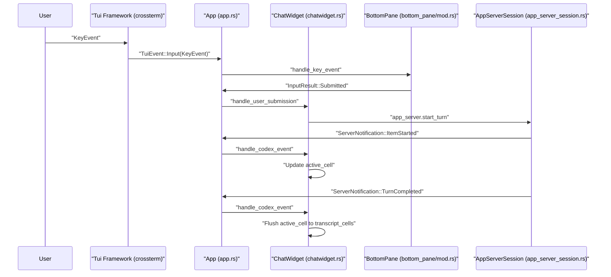

# Terminal User Interface (TUI)

<details>
<summary>Relevant source files</summary>

The following files were used as context for generating this wiki page:

- [codex-rs/exec/src/event_processor_with_human_output.rs](codex-rs/exec/src/event_processor_with_human_output.rs)
- [codex-rs/mcp-server/src/codex_tool_runner.rs](codex-rs/mcp-server/src/codex_tool_runner.rs)
- [codex-rs/protocol/src/protocol.rs](codex-rs/protocol/src/protocol.rs)
- [codex-rs/tui/src/app.rs](codex-rs/tui/src/app.rs)
- [codex-rs/tui/src/app/background_requests.rs](codex-rs/tui/src/app/background_requests.rs)
- [codex-rs/tui/src/app/config_persistence.rs](codex-rs/tui/src/app/config_persistence.rs)
- [codex-rs/tui/src/app/event_dispatch.rs](codex-rs/tui/src/app/event_dispatch.rs)
- [codex-rs/tui/src/app/session_lifecycle.rs](codex-rs/tui/src/app/session_lifecycle.rs)
- [codex-rs/tui/src/app/test_support.rs](codex-rs/tui/src/app/test_support.rs)
- [codex-rs/tui/src/app/tests.rs](codex-rs/tui/src/app/tests.rs)
- [codex-rs/tui/src/app/thread_events.rs](codex-rs/tui/src/app/thread_events.rs)
- [codex-rs/tui/src/app/thread_routing.rs](codex-rs/tui/src/app/thread_routing.rs)
- [codex-rs/tui/src/app/thread_session_state.rs](codex-rs/tui/src/app/thread_session_state.rs)
- [codex-rs/tui/src/app_event.rs](codex-rs/tui/src/app_event.rs)
- [codex-rs/tui/src/app_server_session.rs](codex-rs/tui/src/app_server_session.rs)
- [codex-rs/tui/src/bottom_pane/chat_composer.rs](codex-rs/tui/src/bottom_pane/chat_composer.rs)
- [codex-rs/tui/src/bottom_pane/mod.rs](codex-rs/tui/src/bottom_pane/mod.rs)
- [codex-rs/tui/src/chatwidget.rs](codex-rs/tui/src/chatwidget.rs)
- [codex-rs/tui/src/chatwidget/plugins.rs](codex-rs/tui/src/chatwidget/plugins.rs)
- [codex-rs/tui/src/chatwidget/slash_dispatch.rs](codex-rs/tui/src/chatwidget/slash_dispatch.rs)
- [codex-rs/tui/src/chatwidget/snapshots/codex_tui__chatwidget__tests__plugins_popup_curated_marketplace.snap](codex-rs/tui/src/chatwidget/snapshots/codex_tui__chatwidget__tests__plugins_popup_curated_marketplace.snap)
- [codex-rs/tui/src/chatwidget/snapshots/codex_tui__chatwidget__tests__plugins_popup_search_filtered.snap](codex-rs/tui/src/chatwidget/snapshots/codex_tui__chatwidget__tests__plugins_popup_search_filtered.snap)
- [codex-rs/tui/src/chatwidget/tests.rs](codex-rs/tui/src/chatwidget/tests.rs)
- [codex-rs/tui/src/chatwidget/tests/composer_submission.rs](codex-rs/tui/src/chatwidget/tests/composer_submission.rs)
- [codex-rs/tui/src/chatwidget/tests/exec_flow.rs](codex-rs/tui/src/chatwidget/tests/exec_flow.rs)
- [codex-rs/tui/src/chatwidget/tests/helpers.rs](codex-rs/tui/src/chatwidget/tests/helpers.rs)
- [codex-rs/tui/src/chatwidget/tests/history_replay.rs](codex-rs/tui/src/chatwidget/tests/history_replay.rs)
- [codex-rs/tui/src/chatwidget/tests/permissions.rs](codex-rs/tui/src/chatwidget/tests/permissions.rs)
- [codex-rs/tui/src/chatwidget/tests/plan_mode.rs](codex-rs/tui/src/chatwidget/tests/plan_mode.rs)
- [codex-rs/tui/src/chatwidget/tests/popups_and_settings.rs](codex-rs/tui/src/chatwidget/tests/popups_and_settings.rs)
- [codex-rs/tui/src/chatwidget/tests/review_mode.rs](codex-rs/tui/src/chatwidget/tests/review_mode.rs)
- [codex-rs/tui/src/chatwidget/tests/slash_commands.rs](codex-rs/tui/src/chatwidget/tests/slash_commands.rs)
- [codex-rs/tui/src/chatwidget/tests/status_and_layout.rs](codex-rs/tui/src/chatwidget/tests/status_and_layout.rs)
- [codex-rs/tui/src/custom_terminal.rs](codex-rs/tui/src/custom_terminal.rs)
- [codex-rs/tui/src/insert_history.rs](codex-rs/tui/src/insert_history.rs)
- [codex-rs/tui/src/render/highlight.rs](codex-rs/tui/src/render/highlight.rs)
- [codex-rs/tui/src/render/snapshots/codex_tui__render__highlight__tests__ansi_family_foreground_palette.snap](codex-rs/tui/src/render/snapshots/codex_tui__render__highlight__tests__ansi_family_foreground_palette.snap)
- [codex-rs/tui/src/shimmer.rs](codex-rs/tui/src/shimmer.rs)
- [codex-rs/tui/src/slash_command.rs](codex-rs/tui/src/slash_command.rs)
- [codex-rs/tui/src/snapshots/codex_tui__diff_render__tests__theme_scope_background_resolution.snap](codex-rs/tui/src/snapshots/codex_tui__diff_render__tests__theme_scope_background_resolution.snap)
- [codex-rs/tui/src/style.rs](codex-rs/tui/src/style.rs)
- [codex-rs/tui/src/terminal_palette.rs](codex-rs/tui/src/terminal_palette.rs)
- [codex-rs/tui/src/terminal_probe.rs](codex-rs/tui/src/terminal_probe.rs)
- [codex-rs/tui/src/theme_picker.rs](codex-rs/tui/src/theme_picker.rs)
- [codex-rs/tui/src/tui.rs](codex-rs/tui/src/tui.rs)

</details>


## Purpose and Scope

The Terminal User Interface (TUI) is the primary interactive component of Codex, implemented as a full-featured terminal application leveraging the `ratatui` rendering library [codex-rs/tui/src/tui.rs:68](). It provides users with real-time conversational display, input composition, approval workflows, multi-agent thread management, and various UI overlays.

This page offers a high-level overview of the TUI's architecture, component hierarchy, and its event-driven design. For deep dives into individual subsystems, consult the linked child pages:

- **[App Event Loop and Initialization](#4.1.1)** — Covers the `App` struct, main event loop, in-process app server client, and overall startup sequence.
- **[ChatWidget and Conversation Display](#4.1.2)** — Details `ChatWidget` rendering, the `HistoryCell` trait, handling of streaming active cells, and the transcript overlay.
- **[BottomPane and Input System](#4.1.3)** — Documents the bottom pane UI stack, `ChatComposer` text input, input event processing, and slash command mechanisms.
- **[Status Line and Footer Rendering](#4.1.4)** — Explains the `StatusIndicatorWidget`, task running animations, and interrupt hints.
- **[Interactive Overlays and Popups](#4.1.5)** — Describes approval overlays, selection popups, user input requests, and MCP elicitation forms.

The TUI integrates tightly with the Codex core backend through an event stream and command submission channel but maintains UI state independently to deliver a responsive user experience [codex-rs/tui/src/chatwidget.rs:1-10]().

---

## Component Hierarchy

### TUI Structural Overview

At its core, the TUI employs a layered widget architecture orchestrated by the top-level `App` struct [codex-rs/tui/src/app.rs:1-5](). The UI consists of conversational transcript display, input areas, status footers, and interactive overlays, all coordinated through an internal event bus.

Title: TUI Component Hierarchy
```mermaid
graph TB
    subgraph "MainEventLoop"
        [App] --> [TuiFramework]
        [App] --> [AppEventChannel]
        [App] -- "app.rs" --> [AppCoordinator]
    end
    
    subgraph "PrimaryUISurface"
        [ChatWidget] -- "chatwidget.rs" --> [TranscriptCells]
        [ChatWidget] --> [ActiveCell]
        [TranscriptCells] -- "Vec<Arc<dyn HistoryCell>>" --> [HistoryCells]
    end
    
    subgraph "BottomPaneStack"
        [BottomPane] -- "bottom_pane/mod.rs" --> [ChatComposer]
        [BottomPane] --> [ViewStack]
        [BottomPane] --> [StatusWidget]
        [ViewStack] -- "Vec<Box<dyn BottomPaneView>>" --> [Popups]
    end
    
    subgraph "HistoryCellImplementations"
        [HistoryCell] -- "trait" --> [UserHistoryCell]
        [HistoryCell] --> [AgentMessageCell]
        [HistoryCell] --> [ExecCell]
        [HistoryCell] --> [McpToolCallCell]
    end
    
    subgraph "ProtocolIntegration"
        [AppServerSession] -- "app_server_session.rs" --> [EventStream]
        [ChatWidget] --> [AppCommand]
    end
```

- **App (`app.rs`)** serves as the central coordinator, managing rendering, input routing, multi-threading, and the app-wide event bus [codex-rs/tui/src/app.rs:1-5]().
- **ChatWidget (`chatwidget.rs`)** holds the conversation history, including finalized transcript cells and the currently streaming cell [codex-rs/tui/src/chatwidget.rs:3-7](). It converts protocol events into incremental UI updates.
- **BottomPane (`bottom_pane/mod.rs`)** handles the interactive footer area containing the text input (via `ChatComposer`) and an overlay stack for transient popups or modals [codex-rs/tui/src/bottom_pane/mod.rs:1-5]().
- **HistoryCell (`history_cell.rs`)** defines the rendering interface for all transcript entries, supporting specialized display modes for different types of conversation content.

**Sources:** [codex-rs/tui/src/app.rs:1-5](), [codex-rs/tui/src/chatwidget.rs:1-22](), [codex-rs/tui/src/bottom_pane/mod.rs:1-15]()

---

## Event-Driven Architecture

The TUI is architected around two complementary event flows: user input and core protocol events. These converge in the main application loop, enabling responsive UI updates without blocking.

### Event Flow Sequence

Title: TUI Event Flow


- **Input Path:** User keyboard events are captured by the TUI framework (`crossterm`), propagated as `TuiEvent`s to `App`, and routed into the widget tree [codex-rs/tui/src/tui.rs:49-50](). The bottom pane and `ChatComposer` handle most input for text editing and slash commands [codex-rs/tui/src/bottom_pane/chat_composer.rs:12-18]().
- **Protocol Path:** Core backend events flow from `AppServerSession` to the `App`, which dispatches them to `ChatWidget` [codex-rs/tui/src/chatwidget.rs:3-4](). `ChatWidget` updates the conversation display, buffering output into active or committed cells.
- **AppEvent Bus:** Components broadcast `AppEvent`s as an internal coordination mechanism for actions like popup opening, configuration persistence, or quitting [codex-rs/tui/src/app_event.rs:1-9]().
- **Streaming Animation:** Output streaming is coordinated via specialized events and cache keys in `ChatWidget` to ensure the UI can refresh its cached tail without rebuilding on every draw [codex-rs/tui/src/chatwidget.rs:12-16]().

**Sources:** [codex-rs/tui/src/app_event.rs:1-10](), [codex-rs/tui/src/chatwidget.rs:1-20](), [codex-rs/tui/src/bottom_pane/chat_composer.rs:12-18](), [codex-rs/tui/src/tui.rs:49-50]()

---

## Main Components

### App

The main controller struct `App` orchestrates the entire terminal UI lifecycle [codex-rs/tui/src/app.rs:1-4]().

- Manages high-level run loops and coordinates focused app submodules [codex-rs/tui/src/app.rs:1-4]().
- Handles global application state, including thread management via `AppServerSession` [codex-rs/tui/src/app.rs:19-20]().
- Routes key events to the appropriate UI surfaces like `BottomPane` or `ChatWidget` [codex-rs/tui/src/bottom_pane/mod.rs:7-12]().

See **[App Event Loop and Initialization](#4.1.1)** for detailed descriptions.

**Sources:** [codex-rs/tui/src/app.rs:1-4](), [codex-rs/tui/src/bottom_pane/mod.rs:7-12]()

### ChatWidget

`ChatWidget` acts as the conversation view and state machine [codex-rs/tui/src/chatwidget.rs:3-4]().

- Consumes protocol events and builds/updates history cells [codex-rs/tui/src/chatwidget.rs:3-4]().
- Manages an `active_cell` that can mutate in place while streaming [codex-rs/tui/src/chatwidget.rs:6-8]().
- Handles slash-command acceptance after dispatch from the composer [codex-rs/tui/src/chatwidget.rs:29-31]().

See **[ChatWidget and Conversation Display](#4.1.2)** for detailed explanations.

**Sources:** [codex-rs/tui/src/chatwidget.rs:1-31]()

### BottomPane

The `BottomPane` manages the interactive footer beneath the main chat viewport [codex-rs/tui/src/bottom_pane/mod.rs:1-5]().

- Owns the `ChatComposer` for editable prompt input [codex-rs/tui/src/bottom_pane/mod.rs:3-4]().
- Maintains a stack of `BottomPaneView`s (popups/modals) that temporarily replace the composer [codex-rs/tui/src/bottom_pane/mod.rs:4-5]().
- Handles specific input routing, such as letting active views consume `Ctrl+C` to dismiss themselves [codex-rs/tui/src/bottom_pane/mod.rs:9-12]().

For details about input routing, composer's state machine, and popup management, refer to **[BottomPane and Input System](#4.1.3)**.

**Sources:** [codex-rs/tui/src/bottom_pane/mod.rs:1-15](), [codex-rs/tui/src/bottom_pane/chat_composer.rs:1-10]()

### HistoryCell System

The `HistoryCell` trait defines an abstraction for any displayable chunk of conversation history.

| Cell Type           | Description                                          | Location                               |
|---------------------|------------------------------------------------------|--------------------------------------|
| `UserHistoryCell`    | Displays user messages including attachments and mentions | [codex-rs/tui/src/chatwidget/tests.rs:21]() |
| `AgentMessageCell`   | Displays assistant messages with assistant markdown    | [codex-rs/tui/src/chatwidget.rs:100]() |
| `HistoryCell` trait  | Base trait for all history display items             | [codex-rs/tui/src/app.rs:43]() |

The overlay transcript display (`Ctrl+T`) appends a live tail from the `active_cell` to committed history [codex-rs/tui/src/chatwidget.rs:8-10]().

**Sources:** [codex-rs/tui/src/chatwidget.rs:1-10](), [codex-rs/tui/src/chatwidget/tests.rs:21](), [codex-rs/tui/src/app.rs:43]()

---

## Slash Commands

Slash commands provide quick access to common operations initiated by typing a `/` prefix in the input [codex-rs/tui/src/slash_command.rs:7-12]().

- Commands are enumerated in the `SlashCommand` enum [codex-rs/tui/src/slash_command.rs:12]().
- Examples include `/model` for selection, `/review` for diff analysis, and `/mcp` for tool inspection [codex-rs/tui/src/slash_command.rs:80-137]().
- Certain commands support inline arguments (e.g., `/review ...`, `/plan ...`) [codex-rs/tui/src/slash_command.rs:157-174]().
- Availability can be restricted during active tasks [codex-rs/tui/src/slash_command.rs:182-185]().

**Sources:** [codex-rs/tui/src/slash_command.rs:1-185]()

---

## Status and Footer

The bottom footer provides dynamic visual feedback about the system state.

- Displays a single "task running" indicator that drives spinners and interrupt hints [codex-rs/tui/src/chatwidget.rs:18-19]().
- Tracks lifecycles independently for agent turns and MCP server startup [codex-rs/tui/src/chatwidget.rs:20-22]().
- For preamble-capable models, it manages visibility of the status row to avoid duplicate progress indicators during commentary streaming [codex-rs/tui/src/chatwidget.rs:24-27]().

Refer to **[Status Line and Footer Rendering](#4.1.4)** for specific rendering details.

**Sources:** [codex-rs/tui/src/chatwidget.rs:18-28]()

---

## Bridging Natural Language to Code Entity Space

### Diagram: User Interaction to Code Entity Mapping

Title: User Interaction to Code Mapping
```mermaid
graph LR
    [UserInput] -- "Natural Language / Commands" --> [KeyEvent]
    [KeyEvent] -- "crossterm event" --> [AppStruct]
    [AppStruct] -- "codex-rs/tui/src/app.rs" --> [BottomPane]
    [BottomPane] -- "codex-rs/tui/src/bottom_pane/mod.rs" --> [ChatComposer]
    [ChatComposer] -- "codex-rs/tui/src/bottom_pane/chat_composer.rs" --> [SlashCommandEnum]
    [ChatComposer] -- "Submit Turn" --> [AppStruct]
    [AppStruct] --> [ChatWidget]
    [ChatWidget] -- "codex-rs/tui/src/chatwidget.rs" --> [AppServerSession]
    [AppServerSession] -- "codex-rs/tui/src/app_server_session.rs" --> [AppServer]
```

### Diagram: UI Component-Protocol Integration Detail

Title: UI-Protocol Integration
```mermaid
graph TD
    [UserInput] --> [AppMainLoop]
    [AppMainLoop] -- "app.rs" --> [BottomPane]
    [BottomPane] --> [AppEventBus]
    [AppMainLoop] --> [ChatWidget]
    [ChatWidget] --> [AppServerSession]
    [AppServerSession] -- "app_server_session.rs" --> [ServerNotification]
    [ServerNotification] -- "app-server-protocol" --> [AppMainLoop]
    [AppMainLoop] --> [ChatWidget]
    [ChatWidget] --> [HistoryCells]
    [ChatWidget] --> [ActiveCell]
    [AppEventBus] -- "app_event.rs" --> [AppMainLoop]
```

**Sources:** [codex-rs/tui/src/app.rs:1-10](), [codex-rs/tui/src/chatwidget.rs:1-30](), [codex-rs/tui/src/bottom_pane/mod.rs:1-15]()
