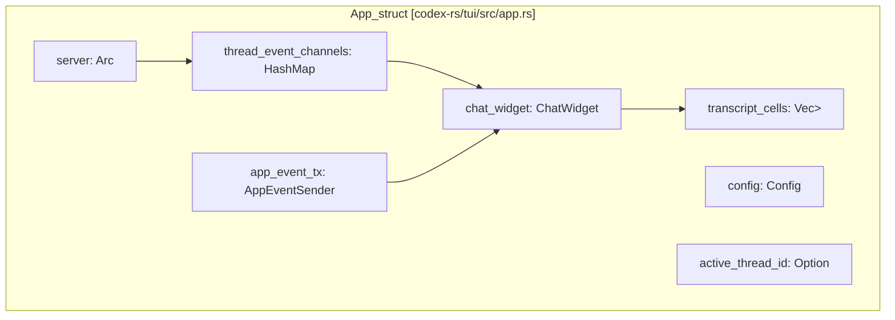
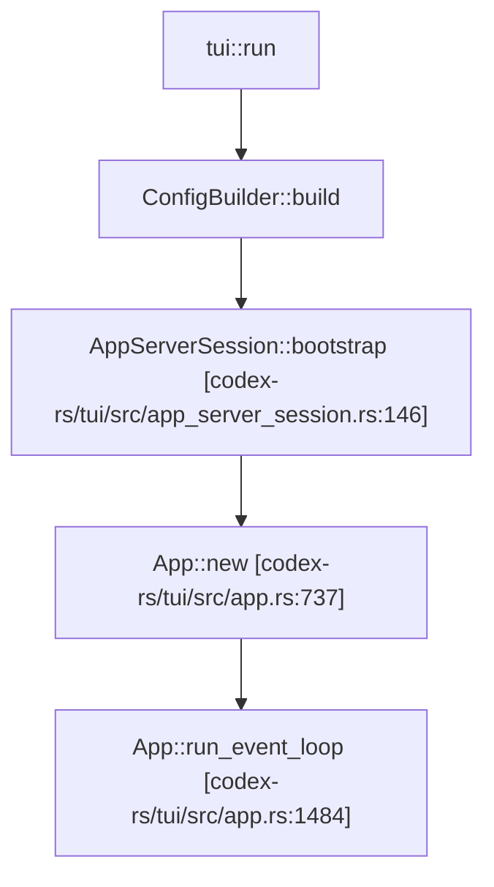
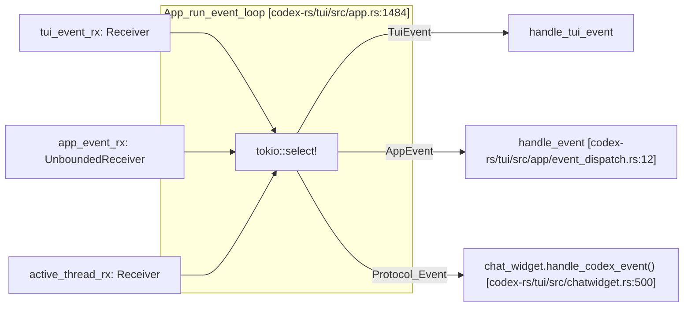
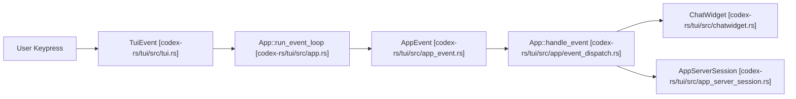
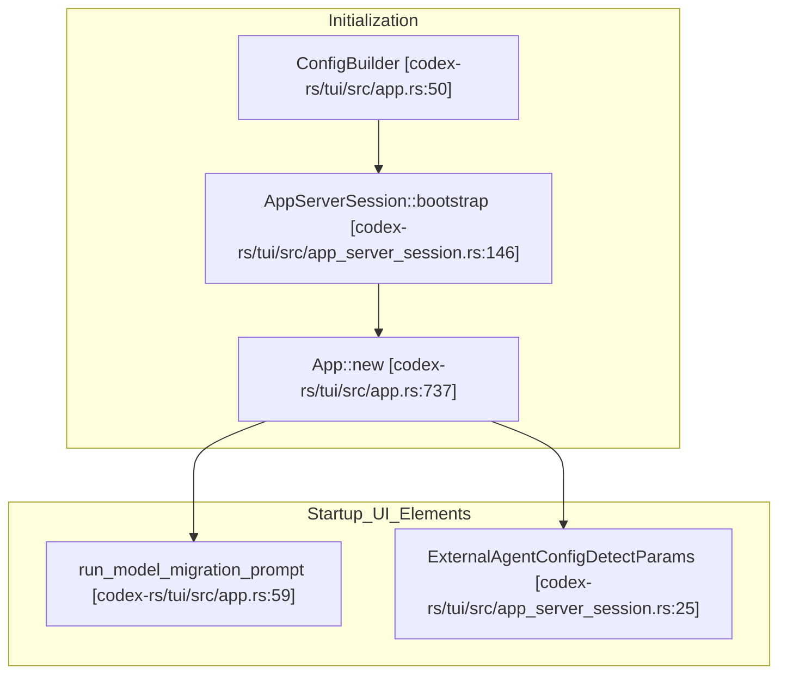

# App Event Loop and Initialization

Relevant source files

The following files were used as context for generating this wiki page:

- [codex-rs/exec/src/event_processor_with_human_output.rs](codex-rs/exec/src/event_processor_with_human_output.rs)
- [codex-rs/mcp-server/src/codex_tool_runner.rs](codex-rs/mcp-server/src/codex_tool_runner.rs)
- [codex-rs/protocol/src/protocol.rs](codex-rs/protocol/src/protocol.rs)
- [codex-rs/tui/src/app.rs](codex-rs/tui/src/app.rs)
- [codex-rs/tui/src/app/background_requests.rs](codex-rs/tui/src/app/background_requests.rs)
- [codex-rs/tui/src/app/config_persistence.rs](codex-rs/tui/src/app/config_persistence.rs)
- [codex-rs/tui/src/app/event_dispatch.rs](codex-rs/tui/src/app/event_dispatch.rs)
- [codex-rs/tui/src/app/session_lifecycle.rs](codex-rs/tui/src/app/session_lifecycle.rs)
- [codex-rs/tui/src/app/test_support.rs](codex-rs/tui/src/app/test_support.rs)
- [codex-rs/tui/src/app/tests.rs](codex-rs/tui/src/app/tests.rs)
- [codex-rs/tui/src/app/thread_events.rs](codex-rs/tui/src/app/thread_events.rs)
- [codex-rs/tui/src/app/thread_routing.rs](codex-rs/tui/src/app/thread_routing.rs)
- [codex-rs/tui/src/app/thread_session_state.rs](codex-rs/tui/src/app/thread_session_state.rs)
- [codex-rs/tui/src/app_event.rs](codex-rs/tui/src/app_event.rs)
- [codex-rs/tui/src/app_server_session.rs](codex-rs/tui/src/app_server_session.rs)
- [codex-rs/tui/src/bottom_pane/chat_composer.rs](codex-rs/tui/src/bottom_pane/chat_composer.rs)
- [codex-rs/tui/src/bottom_pane/mod.rs](codex-rs/tui/src/bottom_pane/mod.rs)
- [codex-rs/tui/src/chatwidget.rs](codex-rs/tui/src/chatwidget.rs)
- [codex-rs/tui/src/chatwidget/plugins.rs](codex-rs/tui/src/chatwidget/plugins.rs)
- [codex-rs/tui/src/chatwidget/slash_dispatch.rs](codex-rs/tui/src/chatwidget/slash_dispatch.rs)
- [codex-rs/tui/src/chatwidget/snapshots/codex_tui__chatwidget__tests__plugins_popup_curated_marketplace.snap](codex-rs/tui/src/chatwidget/snapshots/codex_tui__chatwidget__tests__plugins_popup_curated_marketplace.snap)
- [codex-rs/tui/src/chatwidget/snapshots/codex_tui__chatwidget__tests__plugins_popup_search_filtered.snap](codex-rs/tui/src/chatwidget/snapshots/codex_tui__chatwidget__tests__plugins_popup_search_filtered.snap)
- [codex-rs/tui/src/chatwidget/tests.rs](codex-rs/tui/src/chatwidget/tests.rs)
- [codex-rs/tui/src/chatwidget/tests/composer_submission.rs](codex-rs/tui/src/chatwidget/tests/composer_submission.rs)
- [codex-rs/tui/src/chatwidget/tests/exec_flow.rs](codex-rs/tui/src/chatwidget/tests/exec_flow.rs)
- [codex-rs/tui/src/chatwidget/tests/helpers.rs](codex-rs/tui/src/chatwidget/tests/helpers.rs)
- [codex-rs/tui/src/chatwidget/tests/history_replay.rs](codex-rs/tui/src/chatwidget/tests/history_replay.rs)
- [codex-rs/tui/src/chatwidget/tests/permissions.rs](codex-rs/tui/src/chatwidget/tests/permissions.rs)
- [codex-rs/tui/src/chatwidget/tests/plan_mode.rs](codex-rs/tui/src/chatwidget/tests/plan_mode.rs)
- [codex-rs/tui/src/chatwidget/tests/popups_and_settings.rs](codex-rs/tui/src/chatwidget/tests/popups_and_settings.rs)
- [codex-rs/tui/src/chatwidget/tests/review_mode.rs](codex-rs/tui/src/chatwidget/tests/review_mode.rs)
- [codex-rs/tui/src/chatwidget/tests/slash_commands.rs](codex-rs/tui/src/chatwidget/tests/slash_commands.rs)
- [codex-rs/tui/src/chatwidget/tests/status_and_layout.rs](codex-rs/tui/src/chatwidget/tests/status_and_layout.rs)
- [codex-rs/tui/src/slash_command.rs](codex-rs/tui/src/slash_command.rs)

## Purpose and Scope

This page documents the `App` struct's main event loop, initialization sequence, event dispatch mechanism, the `AppServerSession` facade used for UI-server communication, and the startup flow within the Terminal User Interface (TUI). The `App` is the top-level orchestrator managing the terminal UI, multiple conversation threads, and routing events between UI components and the agent core.

Details on chat surface rendering and protocol event handling are in [4.1.2 ChatWidget and Conversation Display](), and input handling and composer state are documented in [4.1.3 Bottom Pane and Input System]().

---

## The App Struct

The `App` struct serves as the core owner of the TUI state. It orchestrates rendering, manages multiple conversation threads, buffers and dispatches events, and routes all inter-component messages.

### Key Fields

| Field | Type | Role |
|-------|------|------|
| `server` | `Arc<dyn AppServerClient>` | Handles communication with the App Server backend; often implemented as an in-process client. [codex-rs/tui/src/app.rs:642-642]() |
| `app_event_tx` | `AppEventSender` | Unbounded async sender for internal UI-to-App communication. [codex-rs/tui/src/app.rs:645-645]() |
| `chat_widget` | `ChatWidget` | The main chat surface rendering the conversation UI for the active thread. [codex-rs/tui/src/app.rs:646-646]() |
| `config` | `Config` | Current resolved configuration state from layered sources. [codex-rs/tui/src/app.rs:647-647]() |
| `transcript_cells` | `Vec<Arc<dyn HistoryCell>>` | Collection of committed history cells displayed in transcript overlay. [codex-rs/tui/src/app.rs:652-652]() |
| `thread_event_channels` | `HashMap<ThreadId, ThreadEventChannel>` | Maps conversation threads to buffered event channels. [codex-rs/tui/src/app.rs:654-654]() |
| `active_thread_id` | `Option<ThreadId>` | Currently active/displayed conversation thread identifier. [codex-rs/tui/src/app.rs:655-655]() |

### Component Relationships Diagram

Title: "App Component Ownership and Data Flow"

Sources: [codex-rs/tui/src/app.rs:641-709](), [codex-rs/tui/src/app_event.rs:1-30]()

---

## AppEventSender and the AppEvent Message Bus

`AppEventSender` is a lightweight, cloneable wrapper around a Tokio unbounded sender channel used by UI components to asynchronously send messages to the `App` main loop.

### Key `AppEvent` Variants

The `AppEvent` enum is defined in `codex-rs/tui/src/app_event.rs`. Core variants include:

| Variant | Description | Typical Usage |
|---------|-------------|--------------|
| `SubmitThreadOp` | Forward an `AppCommand` to the agent core. | User input causes a request (e.g. send message). [codex-rs/tui/src/app_event.rs:166-169]() |
| `NewSession` | Request to shut down current session and start fresh. | Reset chat from UI command. [codex-rs/tui/src/app_event.rs:197-197]() |
| `Exit(ExitMode)` | Application exit request. | UI shutdown triggered by user or error. [codex-rs/tui/src/app_event.rs:315-315]() |
| `InsertHistoryCell` | Append a rendered history cell to the transcript. | Display finalized chat content. [codex-rs/tui/src/app_event.rs:275-275]() |
| `SelectAgentThread` | Switch focus to a different conversation thread. | Multi-agent/multi-thread navigation. [codex-rs/tui/src/app_event.rs:157-157]() |

Sources: [codex-rs/tui/src/app_event.rs:153-315](), [codex-rs/tui/src/app/event_dispatch.rs:12-18]()

---

## Initialization and Startup Flow

The TUI initialization includes loading configuration, handling startup warnings, and session selection.

### Startup Warnings and Prompts
Before the main loop, the app handles several diagnostic checks:
- **Model Migration**: If a model is deprecated, `run_model_migration_prompt` determines if a NUX or migration prompt is needed. [codex-rs/tui/src/app.rs:59-59]()
- **External Agent Config**: The system checks for legacy agent configs to import from other tools. [codex-rs/tui/src/app_server_session.rs:25-29]()
- **Startup Thread**: The app initializes a `StartupThreadStarted` event once the core is ready. [codex-rs/tui/src/app_event.rs:200-202]()

### Initialization Sequence Diagram

Title: "TUI Bootstrap and Startup Sequence"

Sources: [codex-rs/tui/src/app.rs:737-750](), [codex-rs/tui/src/app_server_session.rs:136-146]()

---

## Event Loop Architecture

The `App` drives the TUI with an asynchronous loop using `tokio::select!`.

### Event Sources

1. **Tui Input Events**: Terminal input events (keys, resize) from `crossterm`. [codex-rs/tui/src/app.rs:79-80]()
2. **Internal Application Events**: `AppEvent` messages from widgets. [codex-rs/tui/src/app.rs:9-10]()
3. **Protocol Events**: Stream of `ServerNotification` or `ServerRequest` messages from the `AppServerSession`. [codex-rs/tui/src/app.rs:119-120]()

### Event Loop Diagram: `run_event_loop`

Title: "Main Event Loop Dispatch Logic"

Sources: [codex-rs/tui/src/app.rs:1484-1520](), [codex-rs/tui/src/app/event_dispatch.rs:12-18]()

---

## InProcessAppServerClient and Session Facade

Communication with the agent core is abstracted through `AppServerSession`. [codex-rs/tui/src/app_server_session.rs:1-5]()

- **Typed RPC**: It wraps the `AppServerClient` to provide typed methods like `thread_start`, `thread_resume`, and `turn_start`. [codex-rs/tui/src/app_server_session.rs:100-111]()
- **In-Process Bridge**: In standard TUI usage, this often uses an `InProcessAppServerClient` which routes JSON-RPC calls directly to the embedded core via channels. [codex-rs/tui/src/app_server_session.rs:15-17]()
- **Event Translation**: The session facade handles the conversion of raw server notifications into UI-ready updates. [codex-rs/tui/src/app_server_session.rs:1-4]()

Sources: [codex-rs/tui/src/app_server_session.rs:1-130](), [codex-rs/tui/src/app.rs:19-22]()

---

# Summary Diagrams: Bridging Natural Language to Code Entities

### 1. Event Dispatch Pipeline

Title: "Natural Language to Code: Event Flow"

### 2. Startup and Configuration Loading

Title: "Natural Language to Code: Startup Flow"

Sources: [codex-rs/tui/src/app.rs:50-750](), [codex-rs/tui/src/app_server_session.rs:25-150]()
