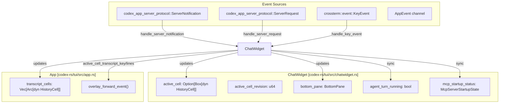
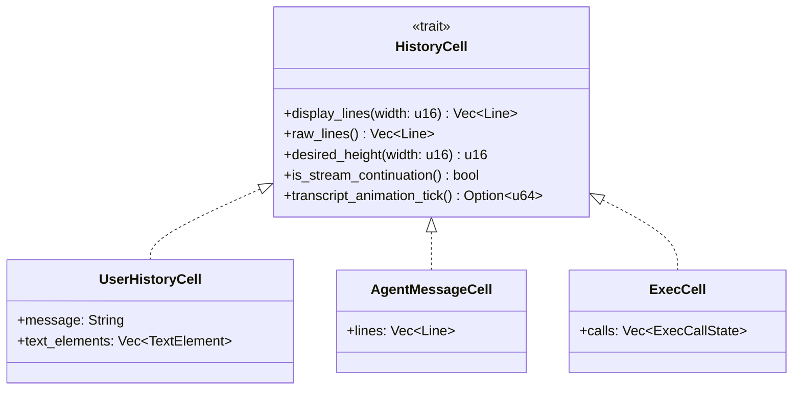
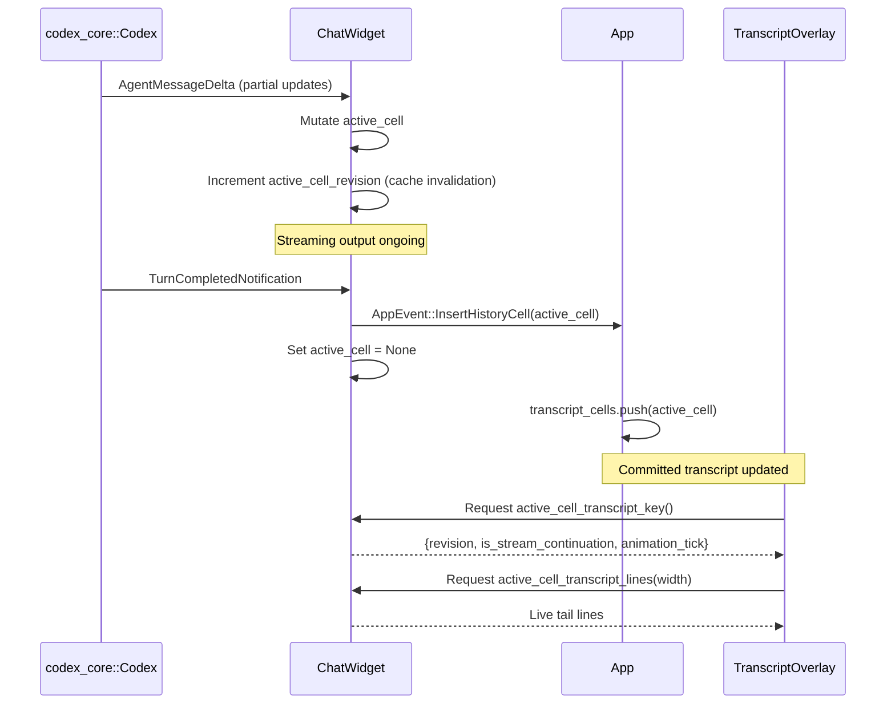
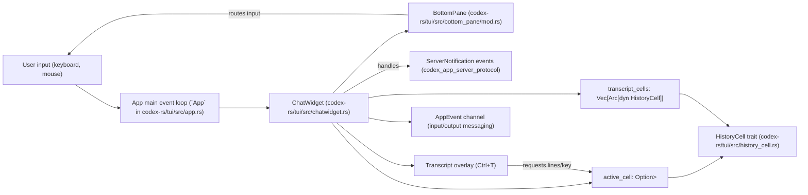
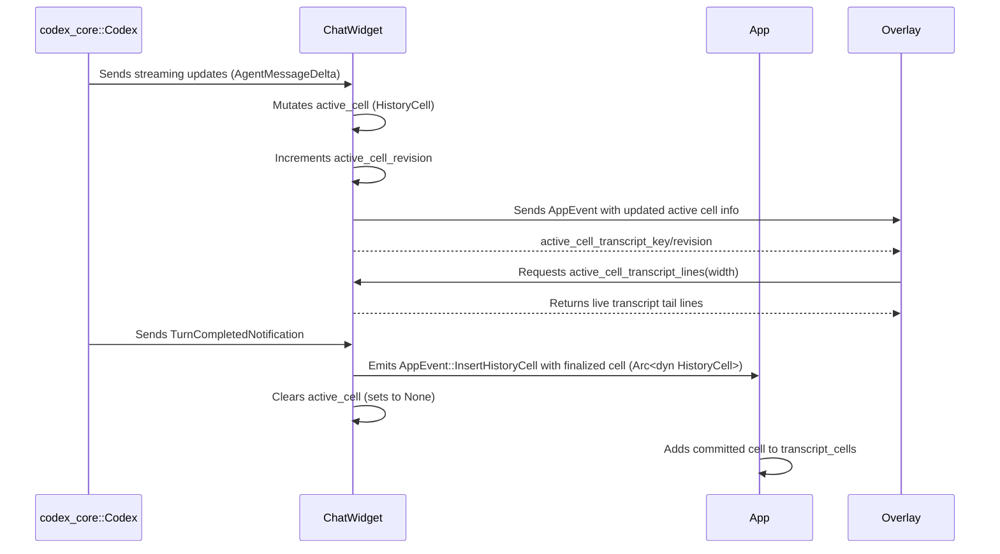

# ChatWidget and Conversation Display

<details>
<summary>Relevant source files</summary>

The following files were used as context for generating this wiki page:

- [codex-rs/exec/src/event_processor_with_human_output.rs](codex-rs/exec/src/event_processor_with_human_output.rs)
- [codex-rs/mcp-server/src/codex_tool_runner.rs](codex-rs/mcp-server/src/codex_tool_runner.rs)
- [codex-rs/protocol/src/protocol.rs](codex-rs/protocol/src/protocol.rs)
- [codex-rs/tui/src/app.rs](codex-rs/tui/src/app.rs)
- [codex-rs/tui/src/app_backtrack.rs](codex-rs/tui/src/app_backtrack.rs)
- [codex-rs/tui/src/app_event.rs](codex-rs/tui/src/app_event.rs)
- [codex-rs/tui/src/bottom_pane/chat_composer.rs](codex-rs/tui/src/bottom_pane/chat_composer.rs)
- [codex-rs/tui/src/bottom_pane/mod.rs](codex-rs/tui/src/bottom_pane/mod.rs)
- [codex-rs/tui/src/chatwidget.rs](codex-rs/tui/src/chatwidget.rs)
- [codex-rs/tui/src/chatwidget/slash_dispatch.rs](codex-rs/tui/src/chatwidget/slash_dispatch.rs)
- [codex-rs/tui/src/chatwidget/snapshots/codex_tui__chatwidget__tests__binary_size_ideal_response.snap](codex-rs/tui/src/chatwidget/snapshots/codex_tui__chatwidget__tests__binary_size_ideal_response.snap)
- [codex-rs/tui/src/chatwidget/snapshots/codex_tui__chatwidget__tests__unified_exec_unknown_end_with_active_exploring_cell.snap](codex-rs/tui/src/chatwidget/snapshots/codex_tui__chatwidget__tests__unified_exec_unknown_end_with_active_exploring_cell.snap)
- [codex-rs/tui/src/chatwidget/snapshots/codex_tui__chatwidget__tests__user_shell_ls_output.snap](codex-rs/tui/src/chatwidget/snapshots/codex_tui__chatwidget__tests__user_shell_ls_output.snap)
- [codex-rs/tui/src/chatwidget/tests.rs](codex-rs/tui/src/chatwidget/tests.rs)
- [codex-rs/tui/src/chatwidget/tests/slash_commands.rs](codex-rs/tui/src/chatwidget/tests/slash_commands.rs)
- [codex-rs/tui/src/exec_cell/model.rs](codex-rs/tui/src/exec_cell/model.rs)
- [codex-rs/tui/src/exec_cell/render.rs](codex-rs/tui/src/exec_cell/render.rs)
- [codex-rs/tui/src/history_cell/snapshots/codex_tui__history_cell__tests__raw_mode_toggle_transcript.snap](codex-rs/tui/src/history_cell/snapshots/codex_tui__history_cell__tests__raw_mode_toggle_transcript.snap)
- [codex-rs/tui/src/markdown.rs](codex-rs/tui/src/markdown.rs)
- [codex-rs/tui/src/markdown_render.rs](codex-rs/tui/src/markdown_render.rs)
- [codex-rs/tui/src/markdown_render_tests.rs](codex-rs/tui/src/markdown_render_tests.rs)
- [codex-rs/tui/src/markdown_stream.rs](codex-rs/tui/src/markdown_stream.rs)
- [codex-rs/tui/src/pager_overlay.rs](codex-rs/tui/src/pager_overlay.rs)
- [codex-rs/tui/src/slash_command.rs](codex-rs/tui/src/slash_command.rs)
- [codex-rs/tui/src/snapshots/codex_tui__markdown_render__markdown_render_tests__markdown_render_complex_snapshot.snap](codex-rs/tui/src/snapshots/codex_tui__markdown_render__markdown_render_tests__markdown_render_complex_snapshot.snap)
- [codex-rs/tui/src/snapshots/codex_tui__markdown_render__markdown_render_tests__markdown_render_file_link_snapshot.snap](codex-rs/tui/src/snapshots/codex_tui__markdown_render__markdown_render_tests__markdown_render_file_link_snapshot.snap)
- [codex-rs/tui/src/snapshots/codex_tui__markdown_render__markdown_render_tests__table_wraps_file_paths_before_collapsing_narrative_columns_snapshot.snap](codex-rs/tui/src/snapshots/codex_tui__markdown_render__markdown_render_tests__table_wraps_file_paths_before_collapsing_narrative_columns_snapshot.snap)
- [codex-rs/tui/src/snapshots/codex_tui__pager_overlay__tests__static_overlay_snapshot_basic.snap](codex-rs/tui/src/snapshots/codex_tui__pager_overlay__tests__static_overlay_snapshot_basic.snap)
- [codex-rs/tui/src/snapshots/codex_tui__pager_overlay__tests__transcript_overlay_snapshot_basic.snap](codex-rs/tui/src/snapshots/codex_tui__pager_overlay__tests__transcript_overlay_snapshot_basic.snap)
- [codex-rs/tui/src/status_indicator_widget.rs](codex-rs/tui/src/status_indicator_widget.rs)
- [codex-rs/tui/src/streaming/controller.rs](codex-rs/tui/src/streaming/controller.rs)
- [codex-rs/tui/src/streaming/mod.rs](codex-rs/tui/src/streaming/mod.rs)

</details>


## Purpose and Scope

This page documents the `ChatWidget` component within the Codex TUI. `ChatWidget` owns the conversation history display, manages rendering of committed and active cells, and orchestrates interaction with conversation events from the app server. It also coordinates the main chat viewport and the transcript overlay UI. Input and prompt editing are handled separately by the bottom pane, described in [BottomPane and Input System (4.1.3)](). The overall event loop and app initialization are covered in [App Event Loop and Initialization (4.1.1)]().

---

## ChatWidget Architecture

### Core Structure

`ChatWidget` encapsulates the comprehensive state and logic for displaying the chat conversation in the terminal UI. It processes incoming protocol events and updates both the committed history and the in-flight active cell, which is used to show streaming outputs such as partial agent responses or ongoing tool calls [codex-rs/tui/src/chatwidget.rs:1-10]().

Key responsibilities include:

- Maintaining **committed transcript cells** as finalized `HistoryCell`s. Each cell corresponds to a discrete transcript entry in the conversation [codex-rs/tui/src/chatwidget.rs:6-8]().
- Tracking the **active cell** during streaming output – a mutable `Box<dyn HistoryCell>` representing the currently in-progress turn or tool execution [codex-rs/tui/src/chatwidget.rs:6-10]().
- Processing incoming `ServerNotification` and `ServerRequest` events and updating UI state accordingly [codex-rs/tui/src/chatwidget.rs:113-115]().
- Managing synchronization of task running indicators for the bottom pane based on agent turn activity and MCP (Model Context Protocol) server startup status [codex-rs/tui/src/chatwidget.rs:18-23]().

#### Component Interaction Diagram



**Sources:** [codex-rs/tui/src/chatwidget.rs:1-23](), [codex-rs/tui/src/app.rs:1-10](), [codex-rs/tui/src/app.rs:30-33]()

### State Management

`ChatWidget` organizes its state into several concerns related to rendering and conversation management:

| Category           | Fields                                                  | Purpose                                                        |
|--------------------|---------------------------------------------------------|----------------------------------------------------------------|
| **Active Cell**    | `active_cell: Option<Box<dyn HistoryCell>>`, `active_cell_revision: u64` | Mutable in-flight transcript cell and cache invalidation revision for overlays [codex-rs/tui/src/chatwidget.rs:6-16](). |
| **Committed History** | `App.transcript_cells: Vec<Arc<dyn HistoryCell>>`      | Stored and rendered past conversation turns [codex-rs/tui/src/app.rs:124](). |
| **Input & Views**  | `bottom_pane: BottomPane`                                | Manages prompt input, slash commands, and transient view stack (popups/modals) [codex-rs/tui/src/bottom_pane/mod.rs:1-5](). |
| **Turn Lifecycle** | `agent_turn_running: bool`, `mcp_startup_status: McpServerStartupState` | Tracks whether an agent turn or MCP startup is active to drive UI indicators [codex-rs/tui/src/chatwidget.rs:18-23](). |

This separation supports clear lifecycle handling between streaming output, committed conversation history, and input interactions.

**Sources:** [codex-rs/tui/src/chatwidget.rs:1-27](), [codex-rs/tui/src/app.rs:124](), [codex-rs/tui/src/bottom_pane/mod.rs:1-5]()

---

## History Cell Management

### `HistoryCell` Trait

`HistoryCell` is the core abstraction representing a single renderable unit in the conversation display, whether a full committed message or a streaming in-progress cell. It exposes methods to generate display lines and height information for both the main chat viewport and the transcript overlay window.



**Key Methods:**

- `display_lines(width)`: Returns the logical viewport lines for the main chat area, handling text wrapping and formatting [codex-rs/tui/src/chatwidget.rs:3-10]().
- `raw_lines()`: Returns copy-friendly plain logical lines for raw scrollback mode.
- `desired_height(width)`: Calculates the view height in terminal rows after character wrapping.
- `is_stream_continuation()`: Indicates if the cell is still streaming and not final, affecting UI update behavior [codex-rs/tui/src/chatwidget.rs:14-16]().
- `transcript_animation_tick()`: Returns a tick count upon which time-dependent visual effects (like spinners) animate, used by the overlay cache logic [codex-rs/tui/src/chatwidget.rs:14-17]().

**Sources:** [codex-rs/tui/src/chatwidget.rs:1-17](), [codex-rs/tui/src/app.rs:43]()

### Cell Lifecycle

Cells progress through this lifecycle:

1. **Streaming Active Cell**: The active transcript cell is mutable, representing partial content during events such as continuous agent message generation or ongoing tool execution [codex-rs/tui/src/chatwidget.rs:6-10]().
2. **Committed History**: Once a turn or item finishes (`TurnCompletedNotification` or `ItemCompletedNotification`), the active cell is committed to the transcript as a finalized immutable history entry (`Arc<dyn HistoryCell>`) [codex-rs/tui/src/chatwidget.rs:6-10, 101, 125]().
3. **Transcript Overlay**: The overlay UI renders both committed history and a cached live tail derived from the active cell to show in-flight output in real time [codex-rs/tui/src/chatwidget.rs:8-17]().



**Sources:** [codex-rs/tui/src/chatwidget.rs:6-17](), [codex-rs/tui/src/app_event.rs:153-154]()

---

## Active Cell Streaming

### Streaming Model

The central concept for streaming is the `active_cell`, which is an optional boxed trait object representing the currently streaming content in the conversation viewport. This design enables:

- **In-place Mutation** of the active cell during streaming output, especially for complex constructs like `ExecCell` which aggregates multiple tool call outputs in a single UI block [codex-rs/tui/src/chatwidget.rs:6-10]().
- **Revision Tracking** through an internal counter `active_cell_revision` incremented with each mutation to trigger cache refreshes and overlay redraws [codex-rs/tui/src/chatwidget.rs:12-17]().
- **Integration with Commentary Output**: For models supporting preamble commentary, assistant output can include commentary before the final answer. Status rows are hidden during commentary streams to avoid duplicate progress indicators [codex-rs/tui/src/chatwidget.rs:25-28]().

**Sources:** [codex-rs/tui/src/chatwidget.rs:6-28]()

### Streaming and Cache Invalidation

The transcript overlay (`Ctrl+T`) leverages a **cached live tail** derived from the active cell for efficient incremental redraw without reprocessing the full cell text on every frame [codex-rs/tui/src/chatwidget.rs:8-17]().

An internal cache key tracks these parameters from the active cell:

- `revision`: Bumped each time the active cell mutates [codex-rs/tui/src/chatwidget.rs:14-15]().
- `is_stream_continuation`: Whether the cell is still streaming output.
- `animation_tick`: A time-dependent tick value for animations (e.g. spinner frames) [codex-rs/tui/src/chatwidget.rs:15-17]().

When an active cell's output includes dynamic visuals that change with time but not protocol events, the overlay detects these animation ticks to refresh its cached tail automatically, enabling smooth UI effects without protocol updates [codex-rs/tui/src/chatwidget.rs:14-17]().

**Sources:** [codex-rs/tui/src/chatwidget.rs:8-17]()

---

## Event Processing

### `handle_server_notification`

`ChatWidget` processes `ServerNotification` events, reflecting core protocol events conveying conversation and task state from the backend server. These events drive the lifecycle of history cells and the UI status indicators [codex-rs/tui/src/chatwidget.rs:113-115]().

Highlights of key notification types and their UI effects:

| Notification Variant                  | Handler Action                                                      |
|-------------------------------------|-------------------------------------------------------------------|
| `ItemStartedNotification`            | Creates/initializes a new `HistoryCell` for the item (message, tool call, etc.) [codex-rs/tui/src/chatwidget.rs:101]() |
| `ItemCompletedNotification`          | Marks current active cell as committed and finalizes it [codex-rs/tui/src/chatwidget.rs:100]() |
| `TurnCompletedNotification`          | Commits the turn result, resets running state [codex-rs/tui/src/chatwidget.rs:122]() |
| `McpServerStatusUpdatedNotification`| Updates MCP startup status affecting spinner and busy indicators [codex-rs/tui/src/chatwidget.rs:104]() |

This processing forms the basis of the UI's reactive updates to conversation progress, streaming output, and status indicators.

**Sources:** [codex-rs/tui/src/chatwidget.rs:100-125]()

---

## Transcript Overlay

The transcript overlay (`Ctrl+T`) shows a scrollable, combined view of the committed conversation history plus the live streaming tail of the active cell [codex-rs/tui/src/chatwidget.rs:8-10]().

Synchronization works as follows:

1. The overlay requests the **active cell's cached key** via `active_cell_transcript_key()` [codex-rs/tui/src/chatwidget.rs:12-14]().
2. If the key changes (revision, streaming status, animation tick), the overlay regenerates and caches the transcript tail lines from `active_cell_transcript_lines()` [codex-rs/tui/src/chatwidget.rs:14-17]().
3. The overlay renders these tail lines appended after the committed transcript history `HistoryCell`s.
4. This approach reduces costly full redraws and enables performant streaming display with dynamic animations (e.g., spinner) [codex-rs/tui/src/chatwidget.rs:15-17]().

Cells with time-dependent output, like `ExecCell` which shows tool execution spinners, provide animation ticks to support timed refresh of the overlay [codex-rs/tui/src/chatwidget.rs:14-17]().

**Sources:** [codex-rs/tui/src/chatwidget.rs:8-17]()

---

## Key Event Handling

`ChatWidget` arbitrates user keyboard input and coordinates command routing mainly as follows:

- **High-Level Actions:** Interrupt and Quit logic are handled here:
  - Interrupt keys (e.g., `Esc` or `Ctrl+C`) cause dispatch of `AppEvent::SubmitThreadOp` with `AppCommand::Interrupt` if an agent turn is running [codex-rs/tui/src/chatwidget.rs:18-23, 45](), [codex-rs/tui/src/app_event.rs:153-169](), [codex-rs/tui/src/status_indicator_widget.rs:103-106]().
  - Quit logic manages a `QUIT_SHORTCUT_TIMEOUT` hint, disabling single keys for accidental exits [codex-rs/tui/src/bottom_pane/mod.rs:153-160]().

- **Input Delegation:** All standard prompt and popup input routing is delegated to the `BottomPane`, which owns the `ChatComposer` input editor and manages transient view stack overlays [codex-rs/tui/src/bottom_pane/mod.rs:1-5]().

```mermaid
flowchart TD
    KeyEvent["User KeyEvent"] --> ChatWidget: handle_key_event()
    ChatWidget -->|Interrupt Command| AppEvent: SubmitThreadOp(::Interrupt)
    ChatWidget -->|Quit Command| QuitHintLifecycle
    ChatWidget -->|Delegates| BottomPane: Input routing & editing
```

**Sources:** [codex-rs/tui/src/chatwidget.rs:18-23](), [codex-rs/tui/src/bottom_pane/mod.rs:1-5, 153-160](), [codex-rs/tui/src/app_event.rs:153-169](), [codex-rs/tui/src/status_indicator_widget.rs:103-106]()

---

## Summary Diagram Bridging Natural Language to Code Entities



**Sources:** [codex-rs/tui/src/chatwidget.rs:1-23](), [codex-rs/tui/src/app.rs:1-10](), [codex-rs/tui/src/bottom_pane/mod.rs:1-5]()

---

## Detailed Data Flow for Active Cell Streaming and Overlay Updates



**Sources:** [codex-rs/tui/src/chatwidget.rs:6-23](), [codex-rs/tui/src/app.rs:124](), [codex-rs/tui/src/app_event.rs:153-169]()

---

# References and Sources

- [codex-rs/tui/src/chatwidget.rs:1-28, 100-125]()
- [codex-rs/tui/src/app.rs:1-10, 30-33, 43, 124]()
- [codex-rs/tui/src/bottom_pane/mod.rs:1-5, 153-160]()
- [codex-rs/tui/src/app_event.rs:153-169]()
- [codex-rs/tui/src/status_indicator_widget.rs:103-106]()
