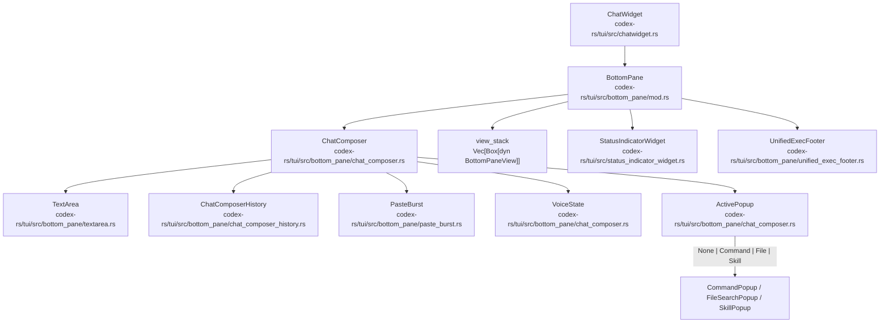
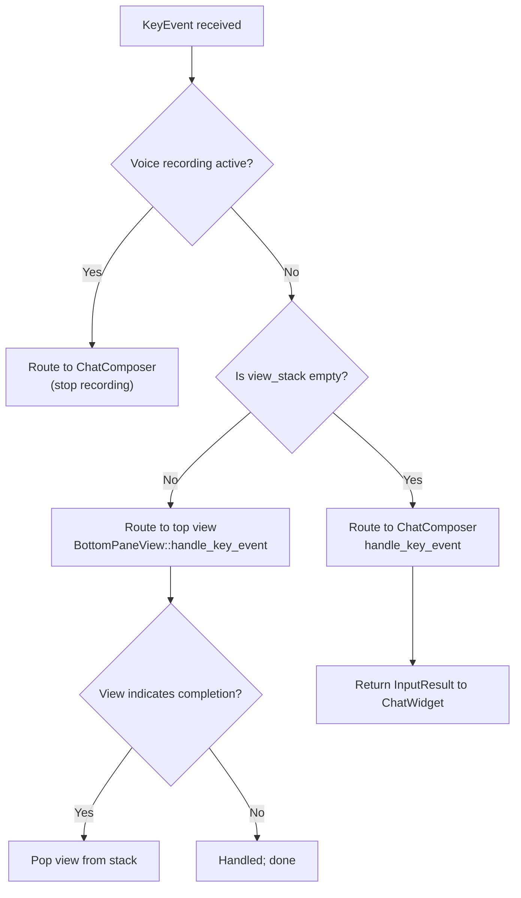
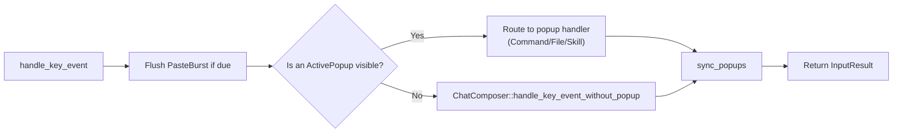
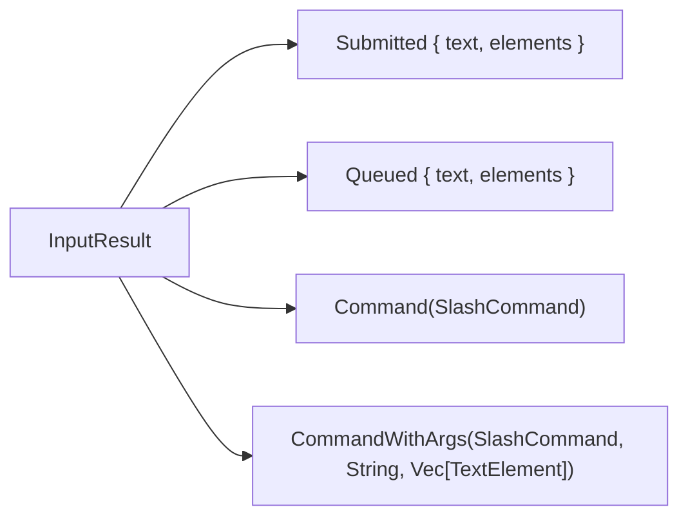
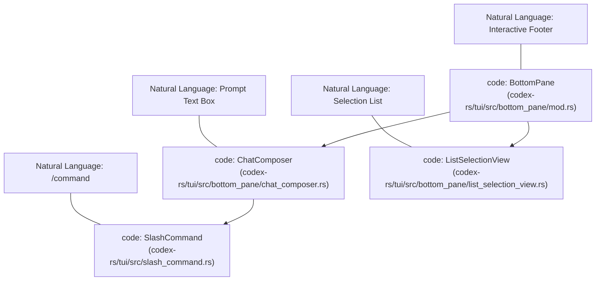
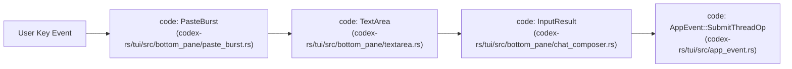

# BottomPane and Input System

Relevant source files

The following files were used as context for generating this wiki page:

- [codex-rs/config/src/tui_keymap.rs](codex-rs/config/src/tui_keymap.rs)
- [codex-rs/exec/src/event_processor_with_human_output.rs](codex-rs/exec/src/event_processor_with_human_output.rs)
- [codex-rs/mcp-server/src/codex_tool_runner.rs](codex-rs/mcp-server/src/codex_tool_runner.rs)
- [codex-rs/protocol/src/protocol.rs](codex-rs/protocol/src/protocol.rs)
- [codex-rs/tui/src/app.rs](codex-rs/tui/src/app.rs)
- [codex-rs/tui/src/app_event.rs](codex-rs/tui/src/app_event.rs)
- [codex-rs/tui/src/bottom_pane/bottom_pane_view.rs](codex-rs/tui/src/bottom_pane/bottom_pane_view.rs)
- [codex-rs/tui/src/bottom_pane/chat_composer.rs](codex-rs/tui/src/bottom_pane/chat_composer.rs)
- [codex-rs/tui/src/bottom_pane/command_popup.rs](codex-rs/tui/src/bottom_pane/command_popup.rs)
- [codex-rs/tui/src/bottom_pane/file_search_popup.rs](codex-rs/tui/src/bottom_pane/file_search_popup.rs)
- [codex-rs/tui/src/bottom_pane/list_selection_view.rs](codex-rs/tui/src/bottom_pane/list_selection_view.rs)
- [codex-rs/tui/src/bottom_pane/mod.rs](codex-rs/tui/src/bottom_pane/mod.rs)
- [codex-rs/tui/src/bottom_pane/selection_popup_common.rs](codex-rs/tui/src/bottom_pane/selection_popup_common.rs)
- [codex-rs/tui/src/bottom_pane/skill_popup.rs](codex-rs/tui/src/bottom_pane/skill_popup.rs)
- [codex-rs/tui/src/bottom_pane/snapshots/codex_tui__bottom_pane__chat_composer__tests__mention_popup_type_prefixes.snap](codex-rs/tui/src/bottom_pane/snapshots/codex_tui__bottom_pane__chat_composer__tests__mention_popup_type_prefixes.snap)
- [codex-rs/tui/src/bottom_pane/snapshots/codex_tui__bottom_pane__chat_composer__tests__plugin_mention_popup.snap](codex-rs/tui/src/bottom_pane/snapshots/codex_tui__bottom_pane__chat_composer__tests__plugin_mention_popup.snap)
- [codex-rs/tui/src/bottom_pane/textarea.rs](codex-rs/tui/src/bottom_pane/textarea.rs)
- [codex-rs/tui/src/chatwidget.rs](codex-rs/tui/src/chatwidget.rs)
- [codex-rs/tui/src/chatwidget/skills.rs](codex-rs/tui/src/chatwidget/skills.rs)
- [codex-rs/tui/src/chatwidget/slash_dispatch.rs](codex-rs/tui/src/chatwidget/slash_dispatch.rs)
- [codex-rs/tui/src/chatwidget/tests.rs](codex-rs/tui/src/chatwidget/tests.rs)
- [codex-rs/tui/src/chatwidget/tests/slash_commands.rs](codex-rs/tui/src/chatwidget/tests/slash_commands.rs)
- [codex-rs/tui/src/keymap.rs](codex-rs/tui/src/keymap.rs)
- [codex-rs/tui/src/keymap_setup.rs](codex-rs/tui/src/keymap_setup.rs)
- [codex-rs/tui/src/keymap_setup/actions.rs](codex-rs/tui/src/keymap_setup/actions.rs)
- [codex-rs/tui/src/keymap_setup/picker.rs](codex-rs/tui/src/keymap_setup/picker.rs)
- [codex-rs/tui/src/skills_helpers.rs](codex-rs/tui/src/skills_helpers.rs)
- [codex-rs/tui/src/slash_command.rs](codex-rs/tui/src/slash_command.rs)
- [codex-rs/tui/src/snapshots/codex_tui__keymap_setup__tests__keymap_action_menu.snap](codex-rs/tui/src/snapshots/codex_tui__keymap_setup__tests__keymap_action_menu.snap)
- [codex-rs/tui/src/snapshots/codex_tui__keymap_setup__tests__keymap_picker_custom.snap](codex-rs/tui/src/snapshots/codex_tui__keymap_setup__tests__keymap_picker_custom.snap)
- [codex-rs/tui/src/snapshots/codex_tui__keymap_setup__tests__keymap_picker_fast_mode_enabled.snap](codex-rs/tui/src/snapshots/codex_tui__keymap_setup__tests__keymap_picker_fast_mode_enabled.snap)
- [codex-rs/tui/src/snapshots/codex_tui__keymap_setup__tests__keymap_picker_first_actions.snap](codex-rs/tui/src/snapshots/codex_tui__keymap_setup__tests__keymap_picker_first_actions.snap)
- [codex-rs/tui/src/snapshots/codex_tui__keymap_setup__tests__keymap_picker_narrow.snap](codex-rs/tui/src/snapshots/codex_tui__keymap_setup__tests__keymap_picker_narrow.snap)
- [codex-rs/tui/src/snapshots/codex_tui__keymap_setup__tests__keymap_picker_wide.snap](codex-rs/tui/src/snapshots/codex_tui__keymap_setup__tests__keymap_picker_wide.snap)

This page covers the interactive input layer at the bottom of the Codex TUI: the `BottomPane` container, the `ChatComposer` text-input state machine, the `TextArea` editing buffer, the slash command handling system, and the `BottomPaneView` overlay stack. It documents how user intent is captured, processed through a sophisticated input pipeline (including paste-burst detection), and dispatched as operations to the agent.

---

## Component Hierarchy

The bottom pane is a composable stack. The `ChatWidget` owns one `BottomPane`, which in turn owns the `ChatComposer` and a view stack of transient overlays.

**Component ownership and key types diagram:**

Sources: [codex-rs/tui/src/bottom_pane/mod.rs:1-15](), [codex-rs/tui/src/bottom_pane/chat_composer.rs:1-133]()

---

## BottomPane

`BottomPane` is the primary container responsible for all footer-level interactions. It manages the lifecycle of the `ChatComposer` and coordinates the display of transient modal views via a stack-based architecture [codex-rs/tui/src/bottom_pane/mod.rs:1-5]().

### Core Fields

| Field | Type | Purpose |
| :--- | :--- | :--- |
| `composer` | `ChatComposer` | Persistent composer input area, retains draft even when other views overlay it [codex-rs/tui/src/bottom_pane/mod.rs:3-5](). |
| `view_stack` | `Vec<Box<dyn BottomPaneView>>` | Stack of transient overlay views (popups, modals) temporarily replacing the composer [codex-rs/tui/src/bottom_pane/mod.rs:4-5](). |
| `status` | `Option<StatusIndicatorWidget>` | Optional inline row for task running progress/status [codex-rs/tui/src/chatwidget.rs:19-23](). |
| `unified_exec_footer` | `UnifiedExecFooter` | Displays session-wide exec process summary and status [codex-rs/tui/src/bottom_pane/mod.rs:25-25](). |

### Input Key Routing in BottomPane

When a key event is received, `BottomPane` routes the event based on the following priority. It gives the active view the first chance to consume keys like `Ctrl+C` to dismiss itself [codex-rs/tui/src/bottom_pane/mod.rs:7-12]().

Sources: [codex-rs/tui/src/bottom_pane/mod.rs:7-15](), [codex-rs/tui/src/bottom_pane/mod.rs:153-160]()

---

## ChatComposer

The `ChatComposer` is the main input text state machine. Its responsibilities include editing the `TextArea` buffer, routing keys to active popups, and promoting typed slash commands into atomic elements [codex-rs/tui/src/bottom_pane/chat_composer.rs:1-10]().

### Key Event Routing and Paste Burst Detection

On some terminals (especially on Windows), pastes arrive as a rapid sequence of `KeyCode::Char` events rather than a single paste event. `ChatComposer` uses the `PasteBurst` state machine to buffer these sequences and prevent them from being misinterpreted as fast typing [codex-rs/tui/src/bottom_pane/chat_composer.rs:92-100]().

### ActivePopup State Machine

The composer manages the lifecycle of inline popups that appear as the user types special triggers [codex-rs/tui/src/bottom_pane/chat_composer.rs:6-7]():

| Trigger | Popup Type | Implementation |
| :--- | :--- | :--- |
| `/` | `Command` | `CommandPopup` [codex-rs/tui/src/bottom_pane/command_popup.rs:73-77]() |
| `@` | `File` | `FileSearchPopup` [codex-rs/tui/src/bottom_pane/file_search_popup.rs:1-5]() |
| `$` | `Skill` | `SkillPopup` [codex-rs/tui/src/bottom_pane/skill_popup.rs:1-5]() |

Sources: [codex-rs/tui/src/bottom_pane/chat_composer.rs:12-18](), [codex-rs/tui/src/bottom_pane/chat_composer.rs:92-114](), [codex-rs/tui/src/bottom_pane/command_popup.rs:36-40]()

---

## TextArea and Element System

The `TextArea` is the core editable buffer behind the TUI composer [codex-rs/tui/src/bottom_pane/textarea.rs:92-101](). It supports raw text and atomic `TextElement` placeholders (like `[Image #1]` or slash command tokens).

### Text Elements and Cursor Invariants

- **Atomic Movement**: Placeholder "elements" for attachments must move atomically with edits [codex-rs/tui/src/bottom_pane/textarea.rs:94-95]().
- **Range Tracking**: As text is inserted or deleted, the editor adjusts the byte ranges of all existing `TextElement`s to maintain alignment [codex-rs/tui/src/bottom_pane/textarea.rs:189-191]().
- **Kill Buffer**: `Ctrl+K` kills text to the end of the line, storing it in a single-entry kill buffer. This buffer is preserved even if the draft is cleared by a submission, allowing `Ctrl+Y` to restore it [codex-rs/tui/src/bottom_pane/textarea.rs:1-11]().

Sources: [codex-rs/tui/src/bottom_pane/textarea.rs:1-12](), [codex-rs/tui/src/bottom_pane/textarea.rs:174-182](), [codex-rs/tui/src/bottom_pane/textarea.rs:189-191]()

---

## Slash Command System

### SlashCommand Handling

The `SlashCommand` enum [codex-rs/tui/src/slash_command.rs:12-80]() defines the available commands. The `ChatComposer` promotes typed text into a `SlashCommand` element once the name is completed [codex-rs/tui/src/bottom_pane/chat_composer.rs:6-7]().

| Command | Description | Supports Args |
| :--- | :--- | :--- |
| `/model` | Choose model and reasoning effort | No [codex-rs/tui/src/slash_command.rs:157-174]() |
| `/review` | Review current changes | Yes [codex-rs/tui/src/slash_command.rs:159-159]() |
| `/plan` | Switch to Plan mode | Yes [codex-rs/tui/src/slash_command.rs:162-162]() |
| `/resume` | Resume a saved chat | Yes [codex-rs/tui/src/slash_command.rs:171-171]() |
| `/side` | Start ephemeral side conversation | Yes [codex-rs/tui/src/slash_command.rs:169-169]() |

### InputResult Dispatch

When a user submits input, `ChatComposer` returns an `InputResult` to the `ChatWidget` which then dispatches the appropriate `AppCommand` or `Op` [codex-rs/tui/src/bottom_pane/chat_composer.rs:39-44]().

Sources: [codex-rs/tui/src/slash_command.rs:84-147](), [codex-rs/tui/src/slash_command.rs:157-174](), [codex-rs/tui/src/bottom_pane/chat_composer.rs:30-44]()

---

## BottomPaneView Overlay Stack

`BottomPaneView` is a trait for transient overlays that temporarily replace the composer [codex-rs/tui/src/bottom_pane/mod.rs:3-5]().

### Common View Implementations

| View | Purpose | Source |
| :--- | :--- | :--- |
| `ApprovalOverlay` | Prompts for tool execution or patch application approval. | [codex-rs/tui/src/bottom_pane/mod.rs:69-70]() |
| `RequestUserInputOverlay` | Handles agent requests for specific user input. | [codex-rs/tui/src/bottom_pane/mod.rs:74-74]() |
| `McpServerElicitationOverlay` | Forms for MCP server OAuth or configuration. | [codex-rs/tui/src/bottom_pane/mod.rs:72-73]() |
| `SkillsToggleView` | Interface for enabling/disabling skills. | [codex-rs/tui/src/bottom_pane/mod.rs:131-131]() |
| `ListSelectionView` | Generic list picker used for themes, models, and history. | [codex-rs/tui/src/bottom_pane/mod.rs:112-112]() |

Sources: [codex-rs/tui/src/bottom_pane/mod.rs:65-76](), [codex-rs/tui/src/bottom_pane/mod.rs:112-137]()

---

## Bridging Natural Language Space to Code Entity Space

### UI-to-Code Association: Input Surface

### UI-to-Code Association: Input Pipeline

Sources: [codex-rs/tui/src/bottom_pane/chat_composer.rs:1-114](), [codex-rs/tui/src/app_event.rs:153-170]()
