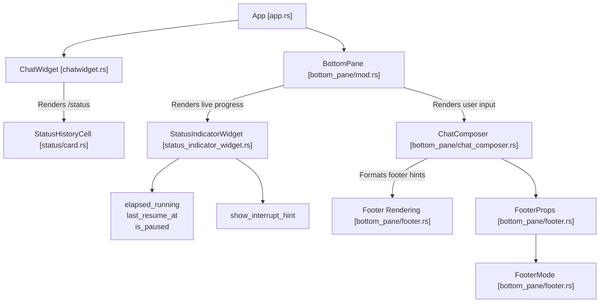
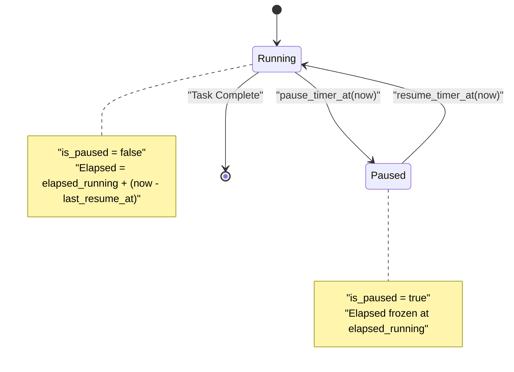
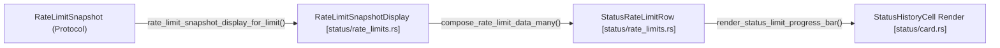
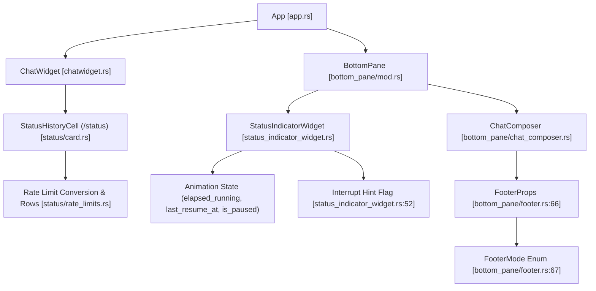

# Status Line and Footer Rendering

<details>
<summary>Relevant source files</summary>

The following files were used as context for generating this wiki page:

- [codex-rs/tui/src/app_backtrack.rs](codex-rs/tui/src/app_backtrack.rs)
- [codex-rs/tui/src/bottom_pane/chat_composer/footer_state.rs](codex-rs/tui/src/bottom_pane/chat_composer/footer_state.rs)
- [codex-rs/tui/src/bottom_pane/chat_composer/history_search.rs](codex-rs/tui/src/bottom_pane/chat_composer/history_search.rs)
- [codex-rs/tui/src/bottom_pane/footer.rs](codex-rs/tui/src/bottom_pane/footer.rs)
- [codex-rs/tui/src/bottom_pane/snapshots/codex_tui__bottom_pane__chat_composer__tests__footer_mode_ctrl_c_interrupt.snap](codex-rs/tui/src/bottom_pane/snapshots/codex_tui__bottom_pane__chat_composer__tests__footer_mode_ctrl_c_interrupt.snap)
- [codex-rs/tui/src/bottom_pane/snapshots/codex_tui__bottom_pane__chat_composer__tests__footer_mode_ctrl_c_quit.snap](codex-rs/tui/src/bottom_pane/snapshots/codex_tui__bottom_pane__chat_composer__tests__footer_mode_ctrl_c_quit.snap)
- [codex-rs/tui/src/bottom_pane/snapshots/codex_tui__bottom_pane__chat_composer__tests__footer_mode_ctrl_c_then_esc_hint.snap](codex-rs/tui/src/bottom_pane/snapshots/codex_tui__bottom_pane__chat_composer__tests__footer_mode_ctrl_c_then_esc_hint.snap)
- [codex-rs/tui/src/bottom_pane/snapshots/codex_tui__bottom_pane__chat_composer__tests__footer_mode_esc_hint_backtrack.snap](codex-rs/tui/src/bottom_pane/snapshots/codex_tui__bottom_pane__chat_composer__tests__footer_mode_esc_hint_backtrack.snap)
- [codex-rs/tui/src/bottom_pane/snapshots/codex_tui__bottom_pane__chat_composer__tests__footer_mode_esc_hint_from_overlay.snap](codex-rs/tui/src/bottom_pane/snapshots/codex_tui__bottom_pane__chat_composer__tests__footer_mode_esc_hint_from_overlay.snap)
- [codex-rs/tui/src/bottom_pane/snapshots/codex_tui__bottom_pane__chat_composer__tests__footer_mode_overlay_then_external_esc_hint.snap](codex-rs/tui/src/bottom_pane/snapshots/codex_tui__bottom_pane__chat_composer__tests__footer_mode_overlay_then_external_esc_hint.snap)
- [codex-rs/tui/src/bottom_pane/snapshots/codex_tui__bottom_pane__chat_composer__tests__footer_mode_shortcut_overlay.snap](codex-rs/tui/src/bottom_pane/snapshots/codex_tui__bottom_pane__chat_composer__tests__footer_mode_shortcut_overlay.snap)
- [codex-rs/tui/src/bottom_pane/snapshots/codex_tui__bottom_pane__chat_composer__tests__footer_mode_shortcut_overlay_queue_submissions.snap](codex-rs/tui/src/bottom_pane/snapshots/codex_tui__bottom_pane__chat_composer__tests__footer_mode_shortcut_overlay_queue_submissions.snap)
- [codex-rs/tui/src/bottom_pane/snapshots/codex_tui__bottom_pane__footer__tests__footer_ctrl_c_quit_idle.snap](codex-rs/tui/src/bottom_pane/snapshots/codex_tui__bottom_pane__footer__tests__footer_ctrl_c_quit_idle.snap)
- [codex-rs/tui/src/bottom_pane/snapshots/codex_tui__bottom_pane__footer__tests__footer_ctrl_c_quit_running.snap](codex-rs/tui/src/bottom_pane/snapshots/codex_tui__bottom_pane__footer__tests__footer_ctrl_c_quit_running.snap)
- [codex-rs/tui/src/bottom_pane/snapshots/codex_tui__bottom_pane__footer__tests__footer_shortcuts_collaboration_modes_enabled.snap](codex-rs/tui/src/bottom_pane/snapshots/codex_tui__bottom_pane__footer__tests__footer_shortcuts_collaboration_modes_enabled.snap)
- [codex-rs/tui/src/bottom_pane/snapshots/codex_tui__bottom_pane__footer__tests__footer_shortcuts_default.snap](codex-rs/tui/src/bottom_pane/snapshots/codex_tui__bottom_pane__footer__tests__footer_shortcuts_default.snap)
- [codex-rs/tui/src/bottom_pane/snapshots/codex_tui__bottom_pane__footer__tests__footer_shortcuts_running.snap](codex-rs/tui/src/bottom_pane/snapshots/codex_tui__bottom_pane__footer__tests__footer_shortcuts_running.snap)
- [codex-rs/tui/src/bottom_pane/snapshots/codex_tui__bottom_pane__footer__tests__footer_shortcuts_shift_and_esc.snap](codex-rs/tui/src/bottom_pane/snapshots/codex_tui__bottom_pane__footer__tests__footer_shortcuts_shift_and_esc.snap)
- [codex-rs/tui/src/chatwidget/input_flow.rs](codex-rs/tui/src/chatwidget/input_flow.rs)
- [codex-rs/tui/src/chatwidget/input_restore.rs](codex-rs/tui/src/chatwidget/input_restore.rs)
- [codex-rs/tui/src/chatwidget/input_submission.rs](codex-rs/tui/src/chatwidget/input_submission.rs)
- [codex-rs/tui/src/chatwidget/snapshots/codex_tui__chatwidget__tests__binary_size_ideal_response.snap](codex-rs/tui/src/chatwidget/snapshots/codex_tui__chatwidget__tests__binary_size_ideal_response.snap)
- [codex-rs/tui/src/chatwidget/snapshots/codex_tui__chatwidget__tests__unified_exec_unknown_end_with_active_exploring_cell.snap](codex-rs/tui/src/chatwidget/snapshots/codex_tui__chatwidget__tests__unified_exec_unknown_end_with_active_exploring_cell.snap)
- [codex-rs/tui/src/chatwidget/snapshots/codex_tui__chatwidget__tests__user_shell_ls_output.snap](codex-rs/tui/src/chatwidget/snapshots/codex_tui__chatwidget__tests__user_shell_ls_output.snap)
- [codex-rs/tui/src/exec_cell/model.rs](codex-rs/tui/src/exec_cell/model.rs)
- [codex-rs/tui/src/exec_cell/render.rs](codex-rs/tui/src/exec_cell/render.rs)
- [codex-rs/tui/src/pager_overlay.rs](codex-rs/tui/src/pager_overlay.rs)
- [codex-rs/tui/src/snapshots/codex_tui__pager_overlay__tests__static_overlay_snapshot_basic.snap](codex-rs/tui/src/snapshots/codex_tui__pager_overlay__tests__static_overlay_snapshot_basic.snap)
- [codex-rs/tui/src/snapshots/codex_tui__pager_overlay__tests__transcript_overlay_snapshot_basic.snap](codex-rs/tui/src/snapshots/codex_tui__pager_overlay__tests__transcript_overlay_snapshot_basic.snap)
- [codex-rs/tui/src/status/card.rs](codex-rs/tui/src/status/card.rs)
- [codex-rs/tui/src/status/rate_limits.rs](codex-rs/tui/src/status/rate_limits.rs)
- [codex-rs/tui/src/status/snapshots/codex_tui__status__tests__status_snapshot_includes_monthly_limit.snap](codex-rs/tui/src/status/snapshots/codex_tui__status__tests__status_snapshot_includes_monthly_limit.snap)
- [codex-rs/tui/src/status/snapshots/codex_tui__status__tests__status_snapshot_includes_reasoning_details.snap](codex-rs/tui/src/status/snapshots/codex_tui__status__tests__status_snapshot_includes_reasoning_details.snap)
- [codex-rs/tui/src/status/snapshots/codex_tui__status__tests__status_snapshot_shows_missing_limits_message.snap](codex-rs/tui/src/status/snapshots/codex_tui__status__tests__status_snapshot_shows_missing_limits_message.snap)
- [codex-rs/tui/src/status/snapshots/codex_tui__status__tests__status_snapshot_shows_stale_limits_message.snap](codex-rs/tui/src/status/snapshots/codex_tui__status__tests__status_snapshot_shows_stale_limits_message.snap)
- [codex-rs/tui/src/status/snapshots/codex_tui__status__tests__status_snapshot_truncates_in_narrow_terminal.snap](codex-rs/tui/src/status/snapshots/codex_tui__status__tests__status_snapshot_truncates_in_narrow_terminal.snap)
- [codex-rs/tui/src/status/tests.rs](codex-rs/tui/src/status/tests.rs)
- [codex-rs/tui/src/status_indicator_widget.rs](codex-rs/tui/src/status_indicator_widget.rs)

</details>


This page documents how the Codex terminal user interface (TUI) renders the status line—a configurable information strip—and the footer that shows contextual hints and shortcuts. It covers the implementation details of the `StatusIndicatorWidget`, which manages the live task status display, including spinner animations and interrupt hints, as well as the `/status` command output rendered by the `StatusHistoryCell`. The layout and data flow of these components within the bottom pane are also explained.

## Component Architecture

The status and footer rendering system in Codex TUI integrates several components and widgets working together:



**Explanation:**

- `App` serves as the main UI orchestrator.
- `ChatWidget` displays the primary chat transcript and handles rendering the multi-line `/status` output card through `StatusHistoryCell` [codex-rs/tui/src/status/card.rs:106-122]().
- `BottomPane` manages layered widgets below the transcript, including the live `StatusIndicatorWidget` shown above the text input composer [codex-rs/tui/src/status_indicator_widget.rs:1-5]().
- `StatusIndicatorWidget` shows ephemeral task status with animated spinner, elapsed timer, interrupt hint, and optional inline details [codex-rs/tui/src/status_indicator_widget.rs:45-61]().
- `ChatComposer` handles text input and user interaction, providing configuration for footer hints and modes.
- Footer rendering widgets consume `FooterProps` and a `FooterMode` selection to render instructional or contextual hints below the composer [codex-rs/tui/src/bottom_pane/footer.rs:1-20]().

**Sources:**
[codex-rs/tui/src/status_indicator_widget.rs:1-61](),
[codex-rs/tui/src/status/card.rs:106-122](),
[codex-rs/tui/src/bottom_pane/footer.rs:1-20]()

---

## StatusIndicatorWidget

The `StatusIndicatorWidget` provides the live status line displayed above the composer text input when an agent or tool task is running. It manages elapsed timing, spinner animations, interrupt hints, and optional detail lines [codex-rs/tui/src/status_indicator_widget.rs:45-61]().

### Key Fields and Responsibilities

| Field / Responsibility | Description |
| :--- | :--- |
| `header: String` | Animated header text left of elapsed time, defaults to `"Working"` [codex-rs/tui/src/status_indicator_widget.rs:47-48](). |
| `details: Option<String>` | Optional wrapped detail text shown below the header, prefixed with `"  └ "` [codex-rs/tui/src/status_indicator_widget.rs:35-36, 48](). |
| `inline_message: Option<String>` | Optional inline suffix rendered after elapsed time and interrupt hint [codex-rs/tui/src/status_indicator_widget.rs:50-51](). |
| `show_interrupt_hint: bool` | Whether to display the interrupt hint `(esc to interrupt)` [codex-rs/tui/src/status_indicator_widget.rs:52](). |
| `elapsed_running: Duration` | Accumulated active elapsed time tracking [codex-rs/tui/src/status_indicator_widget.rs:55](). |
| `last_resume_at: Instant` | Instant when the timer was last resumed [codex-rs/tui/src/status_indicator_widget.rs:56](). |
| `is_paused: bool` | Paused state to freeze elapsed tracking [codex-rs/tui/src/status_indicator_widget.rs:57](). |
| `app_event_tx: AppEventSender` | Used to send interrupt events to the app event loop [codex-rs/tui/src/status_indicator_widget.rs:58, 103-106](). |
| `frame_requester: FrameRequester` | Requests redraw frames for animation [codex-rs/tui/src/status_indicator_widget.rs:59](). |
| `animations_enabled: bool` | Whether to enable animated spinners and shimmer [codex-rs/tui/src/status_indicator_widget.rs:60](). |

### Elapsed Time Formatting

Elapsed seconds are formatted into a compact, human-friendly string by the function `fmt_elapsed_compact` [codex-rs/tui/src/status_indicator_widget.rs:65-78]():

- **Under 1 minute**: `"47s"`
- **Under 1 hour**: `"4m 07s"`
- **1 hour or more**: `"1h 02m 09s"`

### Timer State Machine

The widget manages a timer that accounts only for active working periods, pausing and resuming as needed. It uses `elapsed_running` to store accumulated running duration and `last_resume_at` to mark the last time it resumed.



- **Pause**: When `pause_timer_at` is called, it adds the duration since `last_resume_at` to `elapsed_running` and sets `is_paused = true` [codex-rs/tui/src/status_indicator_widget.rs:169-175]().
- **Resume**: When `resume_timer_at` is called, it updates `last_resume_at` to the current instant and sets `is_paused = false` [codex-rs/tui/src/status_indicator_widget.rs:177-184]().

### Interrupt and Details

- **Interrupt**: The widget exposes an `interrupt()` method that calls `self.app_event_tx.interrupt_and_restore_prompt_if_no_output()` to signal the core agent to stop [codex-rs/tui/src/status_indicator_widget.rs:103-106]().
- **Details**: The `update_details` method applies capitalization rules (via `StatusDetailsCapitalization`) and wraps the text to a configured `max_lines` (default 3) [codex-rs/tui/src/status_indicator_widget.rs:114-130, 35]().

**Sources:**
[codex-rs/tui/src/status_indicator_widget.rs:45-61, 65-78, 103-106, 114-130, 169-184]()

---

## The `/status` Command Output (`StatusHistoryCell`)

The chat UI supports a multi-line `/status` card rendered as a history cell. The `StatusHistoryCell` aggregates status data like model info, working directory, token usage, permissions, and rate limits for display [codex-rs/tui/src/status/card.rs:106-122]().

### Data Aggregation and Display

Fields in `StatusHistoryCell` include:
- `model_name` & `model_details`: Current model label and reasoning level [codex-rs/tui/src/status/card.rs:107-108]().
- `directory`: The current working directory path [codex-rs/tui/src/status/card.rs:109]().
- `permissions`: Human-readable summary of the active permission profile [codex-rs/tui/src/status/card.rs:110]().
- `token_usage`: Counts of total/input/output tokens consumed [codex-rs/tui/src/status/card.rs:120]().
- `rate_limit_state`: Snapshot data for usage limits [codex-rs/tui/src/status/card.rs:121]().

### Rate Limit Display

Rate limit information is presented as progress bars with labels such as `"5h limit"` or `"Weekly limit"`.



- **Staleness**: Snapshot data is considered stale if older than 15 minutes (`RATE_LIMIT_STALE_THRESHOLD_MINUTES`) [codex-rs/tui/src/status/rate_limits.rs:65]().
- **Progress Bars**: Rendered using 20 segments (`STATUS_LIMIT_BAR_SEGMENTS`) with `█` for filled and `░` for empty portions [codex-rs/tui/src/status/rate_limits.rs:23-25]().

**Sources:**
[codex-rs/tui/src/status/card.rs:106-122](),
[codex-rs/tui/src/status/rate_limits.rs:23-25, 65, 144-166]()

---

## Footer Rendering and Hints

The footer area below the composer renders transient hints, shortcut help, and context indicators using `FooterProps` [codex-rs/tui/src/bottom_pane/footer.rs:1-11]().

### Footer Layout and Collapse Rules
The footer applies width-based fallback rules via `single_line_footer_layout` to ensure the most critical information is visible on smaller terminals [codex-rs/tui/src/bottom_pane/footer.rs:21-36]():
1. **Fullest Hint**: Start with the fullest left-side hint + right-side context.
2. **Queue Priority**: If `queue_submissions` is active, the queue hint is prioritized over right-side context [codex-rs/tui/src/bottom_pane/footer.rs:28-30, 71]().
3. **Mode Cycle**: If space is tight, `? for shortcuts` is dropped before `(shift+tab to cycle)` [codex-rs/tui/src/bottom_pane/footer.rs:31-32]().
4. **Context Hiding**: If the mode cycle hint cannot fit, right-side context is also hidden to prevent layout churn [codex-rs/tui/src/bottom_pane/footer.rs:33-34]().

### Footer Modes
The footer transitions between several modes depending on user state [codex-rs/tui/src/bottom_pane/footer.rs:67]():
- `QuitShortcutReminder`: Renders when the user needs to press a key again to exit [codex-rs/tui/src/bottom_pane/footer.rs:74-77]().
- `StatusLine`: Renders the configured contextual row [codex-rs/tui/src/bottom_pane/footer.rs:13-14]().
- `ActiveAgentLabel`: Shows the active agent/thread label [codex-rs/tui/src/bottom_pane/footer.rs:81-86]().

**Sources:**
[codex-rs/tui/src/bottom_pane/footer.rs:1-86]()

---

# Diagrams Bridging Natural Language Concepts to Code Entities

```mermaid
graph LR
    "Live Task Status Display" --> "StatusIndicatorWidget [status_indicator_widget.rs]"
    "Spinner Animations" --> "StatusIndicatorWidget::elapsed_running,last_resume_at,is_paused [status_indicator_widget.rs]"
    "Interrupt Hint (esc to interrupt)" --> "StatusIndicatorWidget::show_interrupt_hint [status_indicator_widget.rs]"
    "Elapsed Time Formatting" --> "fmt_elapsed_compact() [status_indicator_widget.rs]"

    "Detailed /status Command Output" --> "StatusHistoryCell struct [status/card.rs]"
    "Rate Limit Bars" --> "StatusRateLimitRow, compose_rate_limit_data_many() [status/rate_limits.rs]"
    "RateLimitSnapshotDisplay" --> "rate_limit_snapshot_display_for_limit() [status/rate_limits.rs]"
```



**Sources:**
[codex-rs/tui/src/status_indicator_widget.rs:45-61](),
[codex-rs/tui/src/status/card.rs:106-122](),
[codex-rs/tui/src/status/rate_limits.rs:28-52](),
[codex-rs/tui/src/bottom_pane/footer.rs:66-67]()
