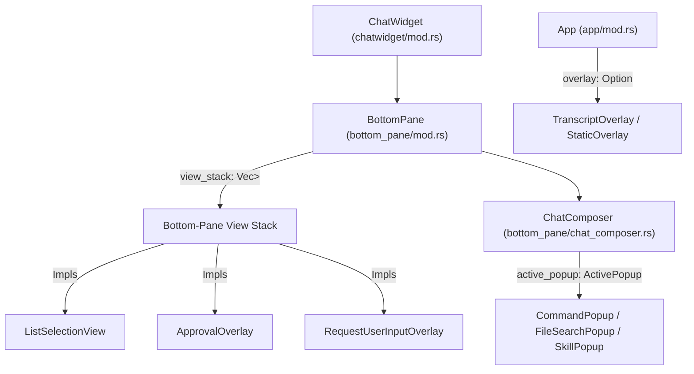
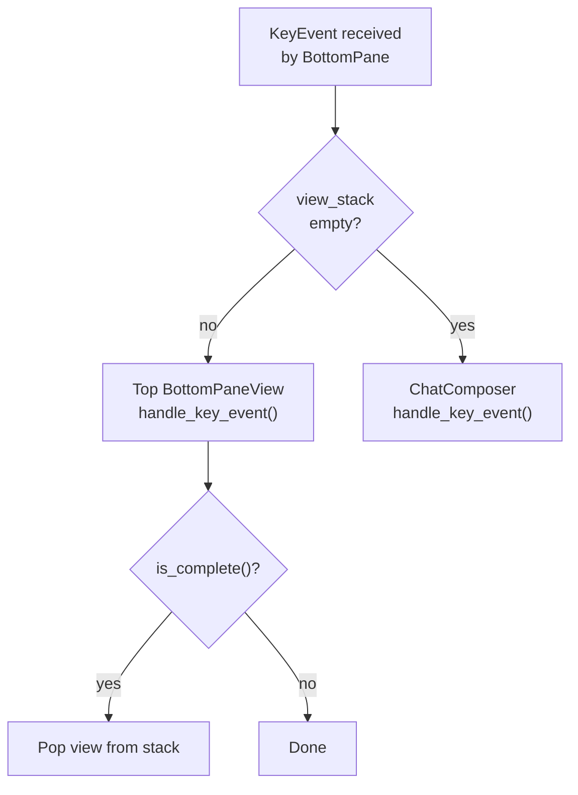
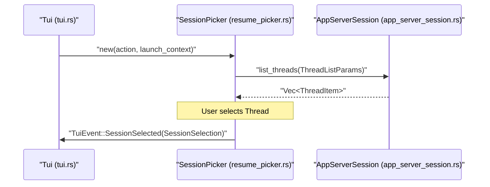
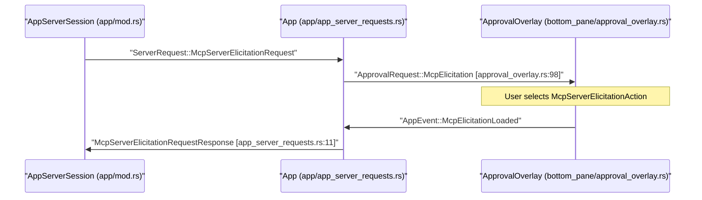

# Interactive Overlays and Popups

Relevant source files

The following files were used as context for generating this wiki page:

- [codex-rs/tui/src/bottom_pane/approval_overlay.rs](codex-rs/tui/src/bottom_pane/approval_overlay.rs)
- [codex-rs/tui/src/bottom_pane/multi_select_picker.rs](codex-rs/tui/src/bottom_pane/multi_select_picker.rs)
- [codex-rs/tui/src/bottom_pane/request_user_input/layout.rs](codex-rs/tui/src/bottom_pane/request_user_input/layout.rs)
- [codex-rs/tui/src/bottom_pane/request_user_input/mod.rs](codex-rs/tui/src/bottom_pane/request_user_input/mod.rs)
- [codex-rs/tui/src/bottom_pane/request_user_input/render.rs](codex-rs/tui/src/bottom_pane/request_user_input/render.rs)
- [codex-rs/tui/src/bottom_pane/request_user_input/snapshots/codex_tui__bottom_pane__request_user_input__tests__request_user_input_footer_wrap.snap](codex-rs/tui/src/bottom_pane/request_user_input/snapshots/codex_tui__bottom_pane__request_user_input__tests__request_user_input_footer_wrap.snap)
- [codex-rs/tui/src/bottom_pane/request_user_input/snapshots/codex_tui__bottom_pane__request_user_input__tests__request_user_input_freeform.snap](codex-rs/tui/src/bottom_pane/request_user_input/snapshots/codex_tui__bottom_pane__request_user_input__tests__request_user_input_freeform.snap)
- [codex-rs/tui/src/bottom_pane/request_user_input/snapshots/codex_tui__bottom_pane__request_user_input__tests__request_user_input_multi_question_first.snap](codex-rs/tui/src/bottom_pane/request_user_input/snapshots/codex_tui__bottom_pane__request_user_input__tests__request_user_input_multi_question_first.snap)
- [codex-rs/tui/src/bottom_pane/request_user_input/snapshots/codex_tui__bottom_pane__request_user_input__tests__request_user_input_multi_question_last.snap](codex-rs/tui/src/bottom_pane/request_user_input/snapshots/codex_tui__bottom_pane__request_user_input__tests__request_user_input_multi_question_last.snap)
- [codex-rs/tui/src/bottom_pane/request_user_input/snapshots/codex_tui__bottom_pane__request_user_input__tests__request_user_input_options.snap](codex-rs/tui/src/bottom_pane/request_user_input/snapshots/codex_tui__bottom_pane__request_user_input__tests__request_user_input_options.snap)
- [codex-rs/tui/src/bottom_pane/request_user_input/snapshots/codex_tui__bottom_pane__request_user_input__tests__request_user_input_options_notes_visible.snap](codex-rs/tui/src/bottom_pane/request_user_input/snapshots/codex_tui__bottom_pane__request_user_input__tests__request_user_input_options_notes_visible.snap)
- [codex-rs/tui/src/bottom_pane/request_user_input/snapshots/codex_tui__bottom_pane__request_user_input__tests__request_user_input_scrolling_options.snap](codex-rs/tui/src/bottom_pane/request_user_input/snapshots/codex_tui__bottom_pane__request_user_input__tests__request_user_input_scrolling_options.snap)
- [codex-rs/tui/src/bottom_pane/request_user_input/snapshots/codex_tui__bottom_pane__request_user_input__tests__request_user_input_tight_height.snap](codex-rs/tui/src/bottom_pane/request_user_input/snapshots/codex_tui__bottom_pane__request_user_input__tests__request_user_input_tight_height.snap)
- [codex-rs/tui/src/bottom_pane/request_user_input/snapshots/codex_tui__bottom_pane__request_user_input__tests__request_user_input_wrapped_options.snap](codex-rs/tui/src/bottom_pane/request_user_input/snapshots/codex_tui__bottom_pane__request_user_input__tests__request_user_input_wrapped_options.snap)
- [codex-rs/tui/src/bottom_pane/snapshots/codex_tui__bottom_pane__chat_composer__tests__slash_popup_res.snap](codex-rs/tui/src/bottom_pane/snapshots/codex_tui__bottom_pane__chat_composer__tests__slash_popup_res.snap)
- [codex-rs/tui/src/bottom_pane/snapshots/codex_tui__bottom_pane__tests__status_and_composer_fill_height_without_bottom_padding.snap](codex-rs/tui/src/bottom_pane/snapshots/codex_tui__bottom_pane__tests__status_and_composer_fill_height_without_bottom_padding.snap)
- [codex-rs/tui/src/chatwidget/snapshots/codex_tui__chatwidget__tests__approval_modal_exec.snap](codex-rs/tui/src/chatwidget/snapshots/codex_tui__chatwidget__tests__approval_modal_exec.snap)
- [codex-rs/tui/src/chatwidget/snapshots/codex_tui__chatwidget__tests__approval_modal_exec_no_reason.snap](codex-rs/tui/src/chatwidget/snapshots/codex_tui__chatwidget__tests__approval_modal_exec_no_reason.snap)
- [codex-rs/tui/src/chatwidget/snapshots/codex_tui__chatwidget__tests__approval_modal_patch.snap](codex-rs/tui/src/chatwidget/snapshots/codex_tui__chatwidget__tests__approval_modal_patch.snap)
- [codex-rs/tui/src/chatwidget/snapshots/codex_tui__chatwidget__tests__chat_small_idle_h3.snap](codex-rs/tui/src/chatwidget/snapshots/codex_tui__chatwidget__tests__chat_small_idle_h3.snap)
- [codex-rs/tui/src/chatwidget/snapshots/codex_tui__chatwidget__tests__chat_small_running_h2.snap](codex-rs/tui/src/chatwidget/snapshots/codex_tui__chatwidget__tests__chat_small_running_h2.snap)
- [codex-rs/tui/src/chatwidget/snapshots/codex_tui__chatwidget__tests__chat_small_running_h3.snap](codex-rs/tui/src/chatwidget/snapshots/codex_tui__chatwidget__tests__chat_small_running_h3.snap)
- [codex-rs/tui/src/chatwidget/snapshots/codex_tui__chatwidget__tests__exec_approval_modal_exec.snap](codex-rs/tui/src/chatwidget/snapshots/codex_tui__chatwidget__tests__exec_approval_modal_exec.snap)
- [codex-rs/tui/src/chatwidget/snapshots/codex_tui__chatwidget__tests__status_widget_and_approval_modal.snap](codex-rs/tui/src/chatwidget/snapshots/codex_tui__chatwidget__tests__status_widget_and_approval_modal.snap)
- [codex-rs/tui/src/chatwidget/snapshots/codex_tui__chatwidget__tests__unified_exec_begin_restores_working_status.snap](codex-rs/tui/src/chatwidget/snapshots/codex_tui__chatwidget__tests__unified_exec_begin_restores_working_status.snap)
- [codex-rs/tui/src/line_truncation.rs](codex-rs/tui/src/line_truncation.rs)
- [codex-rs/tui/src/resume_picker.rs](codex-rs/tui/src/resume_picker.rs)
- [codex-rs/tui/src/snapshots/codex_tui__resume_picker__tests__resume_picker_screen.snap](codex-rs/tui/src/snapshots/codex_tui__resume_picker__tests__resume_picker_screen.snap)
- [codex-rs/tui/src/snapshots/codex_tui__resume_picker__tests__resume_picker_table.snap](codex-rs/tui/src/snapshots/codex_tui__resume_picker__tests__resume_picker_table.snap)
- [codex-rs/tui/src/snapshots/codex_tui__resume_picker__tests__resume_picker_thread_names.snap](codex-rs/tui/src/snapshots/codex_tui__resume_picker__tests__resume_picker_thread_names.snap)
- [codex-rs/tui/src/snapshots/codex_tui__status_indicator_widget__tests__renders_truncated.snap](codex-rs/tui/src/snapshots/codex_tui__status_indicator_widget__tests__renders_truncated.snap)
- [codex-rs/tui/src/snapshots/codex_tui__status_indicator_widget__tests__renders_with_queued_messages.snap](codex-rs/tui/src/snapshots/codex_tui__status_indicator_widget__tests__renders_with_queued_messages.snap)
- [codex-rs/tui/src/snapshots/codex_tui__status_indicator_widget__tests__renders_with_working_header.snap](codex-rs/tui/src/snapshots/codex_tui__status_indicator_widget__tests__renders_with_working_header.snap)

This page documents the overlay and popup system in the Codex TUI: how each overlay type is structured, how keyboard input is intercepted and routed, and how overlays dispatch actions through the `AppEvent` message bus.

For general TUI layout and widget hierarchy, see [4.1](). For the `BottomPane` and input system that hosts many of these overlays, see [4.1.3](). For the `AppEvent` bus itself, see [4.1.1]().

---

## Overlay Architecture

The TUI has **three distinct overlay layers**, each at a different scope in the widget hierarchy:

**TUI Overlay Layers and Code Entities**

| Layer | Owner | Scope | Examples |
|---|---|---|---|
| Composer popups | `ChatComposer.active_popup` | Above text input | `CommandPopup`, `FileSearchPopup`, `SkillPopup` |
| Bottom-pane view stack | `BottomPane.view_stack` | Replaces composer | `ListSelectionView`, `ApprovalOverlay`, `RequestUserInputOverlay` |
| Full-screen overlay | `App.overlay` | Replaces entire screen | `TranscriptOverlay`, `StaticOverlay` |

Sources: [codex-rs/tui/src/bottom_pane/mod.rs:150-181](), [codex-rs/tui/src/bottom_pane/chat_composer.rs:349-409]()

---

## The `BottomPaneView` Trait

All bottom-pane views implement a common trait (`bottom_pane_view::BottomPaneView`) that enables the `BottomPane` to manage a polymorphic stack.

Key methods on the trait:
- `handle_key_event(key_event)` — processes input [codex-rs/tui/src/bottom_pane/bottom_pane_view.rs:21-21]().
- `on_ctrl_c() -> CancellationEvent` — returns `Handled` to dismiss the view on Ctrl+C [codex-rs/tui/src/bottom_pane/bottom_pane_view.rs:59-61]().
- `is_complete() -> bool` — signals the view should be popped off the stack [codex-rs/tui/src/bottom_pane/bottom_pane_view.rs:24-26]().
- `is_in_paste_burst() -> bool` — used to schedule deferred paste-burst timers [codex-rs/tui/src/bottom_pane/bottom_pane_view.rs:87-89]().
- `prefer_esc_to_handle_key_event() -> bool` — routes Esc to `handle_key_event` instead of `on_ctrl_c` [codex-rs/tui/src/bottom_pane/bottom_pane_view.rs:65-67]().
- `try_consume_approval_request()` — allows a view to intercept incoming agent requests [codex-rs/tui/src/bottom_pane/bottom_pane_view.rs:93-98]().

`BottomPane` routes every key event through its view stack:

1. If the view stack is non-empty, the top view gets the key first.
2. Esc may call `on_ctrl_c()` or `handle_key_event()` based on `prefer_esc_to_handle_key_event()`.
3. When `is_complete()` returns true, the view is popped from the stack.
4. If the stack is empty, input falls through to `ChatComposer`.

**View stack input routing**

Sources: [codex-rs/tui/src/bottom_pane/bottom_pane_view.rs:18-138]()

---

## Composer-Level Popups

These popups are managed inside `ChatComposer` and are rendered overlaid directly above the text input area. At most one can be active at a time, tracked by the `ActivePopup` enum.

### `CommandPopup`

File: [codex-rs/tui/src/bottom_pane/command_popup.rs]()

Shown when the user types `/` in the composer. Lists built-in slash commands and custom user prompts.

**Key types:**

| Type | Purpose |
|---|---|
| `CommandPopup` | Manages filtered list state and scroll [codex-rs/tui/src/bottom_pane/command_popup.rs:35-39]() |
| `CommandItem` | `Builtin(SlashCommand)` or `ServiceTier(ServiceTierCommand)` [codex-rs/tui/src/bottom_pane/command_popup.rs:30-34]() |
| `CommandPopupFlags` | Feature gates (collaboration, connectors, etc.) [codex-rs/tui/src/bottom_pane/command_popup.rs:42-54]() |

**Filtering logic**:
- `on_composer_text_change(text)` updates `command_filter` from the first token after `/` [codex-rs/tui/src/bottom_pane/command_popup.rs:99-117]().
- `filtered()` runs prefix and exact matching over builtins, returning `(CommandItem, Option<Vec<usize>>)` pairs where the `Vec<usize>` contains character positions to bold [codex-rs/tui/src/bottom_pane/command_popup.rs:143-164]().

Sources: [codex-rs/tui/src/bottom_pane/command_popup.rs:73-164]()

### `FileSearchPopup`

File: [codex-rs/tui/src/bottom_pane/file_search_popup.rs]()

Shown when the user types `@` in the composer. Displays file search results asynchronously.

State machine:
- `set_query(query)` puts the popup into `waiting = true` [codex-rs/tui/src/bottom_pane/file_search_popup.rs:43-52]().
- When results arrive, `set_matches(query, matches)` updates the visible list (only if `query == pending_query` to discard stale results) [codex-rs/tui/src/bottom_pane/file_search_popup.rs:67-78]().

Sources: [codex-rs/tui/src/bottom_pane/file_search_popup.rs:17-29]()

### `SkillPopup`

File: [codex-rs/tui/src/bottom_pane/skill_popup.rs]()

Shown when the user types `$` in the composer. Lists available skills and app connectors as `MentionItem`s.

`MentionItem` fields [codex-rs/tui/src/bottom_pane/skill_popup.rs:21-29]():

| Field | Purpose |
|---|---|
| `display_name` | Text shown in the popup row |
| `description` | Optional grey subtitle |
| `insert_text` | Text inserted into the composer on selection |
| `category_tag` | Right-side label (e.g. `skill`, `app`) |

Fuzzy matching is performed by `codex_utils_fuzzy_match::fuzzy_match` [codex-rs/tui/src/bottom_pane/skill_popup.rs:130-156]().

---

## Bottom-Pane View Stack

These overlays replace the `ChatComposer` entirely and are managed by `BottomPane.view_stack`.

### `ListSelectionView`

File: [codex-rs/tui/src/bottom_pane/list_selection_view.rs]()

The generic selection popup used for model pickers, theme selection, and many other interactive choices.

**`SelectionViewParams`** (construction-time config) [codex-rs/tui/src/bottom_pane/list_selection_view.rs:160-180]():

| Field | Purpose |
|---|---|
| `title` / `subtitle` | Header text |
| `items: Vec<SelectionItem>` | Row data |
| `is_searchable` | Enables a search/filter text input |
| `col_width_mode: ColumnWidthMode` | `AutoVisible`, `AutoAllRows`, or `Fixed` column widths |
| `row_display` | `Wrapped` or `SingleLine` [codex-rs/tui/src/bottom_pane/list_selection_view.rs:173]() |

**`SelectionItem`** (per-row model) [codex-rs/tui/src/bottom_pane/list_selection_view.rs:131-147]():

| Field | Purpose |
|---|---|
| `name` | Display text |
| `display_shortcut` | Key binding shown on the right |
| `actions: Vec<SelectionAction>` | Closures called on `AppEventSender` when item is accepted |

Sources: [codex-rs/tui/src/bottom_pane/list_selection_view.rs:130-180]()

### `ApprovalOverlay`

File: [codex-rs/tui/src/bottom_pane/approval_overlay.rs]()

The `ApprovalOverlay` is the primary mechanism for human-in-the-loop safety. It intercepts critical operations that require explicit user consent.

**`ApprovalRequest` variants** [codex-rs/tui/src/bottom_pane/approval_overlay.rs:72-105]():
- `Exec`: Requests permission to run a shell command [codex-rs/tui/src/bottom_pane/approval_overlay.rs:73-82]().
- `Permissions`: Requests access to specific system capabilities via `RequestPermissionProfile` [codex-rs/tui/src/bottom_pane/approval_overlay.rs:83-89]().
- `ApplyPatch`: Requests approval to apply file changes (diffs) [codex-rs/tui/src/bottom_pane/approval_overlay.rs:90-97]().
- `McpElicitation`: For external MCP servers that need user confirmation [codex-rs/tui/src/bottom_pane/approval_overlay.rs:98-104]().

The overlay renders details (like the command string or a unified diff) and a selection list of options. It manages a queue of pending requests [codex-rs/tui/src/bottom_pane/approval_overlay.rs:158-159]().

### `RequestUserInputOverlay`

File: [codex-rs/tui/src/bottom_pane/request_user_input/mod.rs]()

A multi-question state machine for complex elicitation, typically triggered by the `ToolRequestUserInput` server request.

- **Answer State**: Each question can have a selected option and/or freeform notes [codex-rs/tui/src/bottom_pane/request_user_input/mod.rs:97-106]().
- **Focus Switching**: Users can toggle focus between `Options` and `Notes` [codex-rs/tui/src/bottom_pane/request_user_input/mod.rs:66-69]().
- **Composer Integration**: Uses an internal `ChatComposer` configured for plain text to capture freeform input [codex-rs/tui/src/bottom_pane/request_user_input/mod.rs:178-185]().
- **Layout Management**: Implements `layout_sections` to compute areas for progress, questions, options, and notes, collapsing sections as space shrinks [codex-rs/tui/src/bottom_pane/request_user_input/layout.rs:19-60]().

Sources: [codex-rs/tui/src/bottom_pane/request_user_input/mod.rs:130-203](), [codex-rs/tui/src/bottom_pane/request_user_input/layout.rs:19-60]()

---

## Session Resumption Picker

The `SessionPicker` is a full-screen interactive view used at startup or during session switching to resume or fork previous threads.

**Session Picker Data Flow**

**Key Features**:
- **Filtering**: Supports filtering by Current Working Directory (CWD) or showing all sessions [codex-rs/tui/src/resume_picker.rs:163-184]().
- **Pagination**: Implements lazy pagination with `PAGE_SIZE = 25` [codex-rs/tui/src/resume_picker.rs:66-67]().
- **Visual Density**: Supports `Comfortable` and `Dense` view modes [codex-rs/tui/src/resume_picker.rs:209-240]().

Sources: [codex-rs/tui/src/resume_picker.rs:66-241]()

---

## MCP Elicitation Views

When an MCP server requires additional information from the user, it issues an elicitation request. The TUI handles this via the `ApprovalOverlay`.

**MCP Elicitation Flow and Protocol Mapping**

Sources: [codex-rs/tui/src/bottom_pane/approval_overlay.rs:98-104](), [codex-rs/tui/src/app/app_server_requests.rs:120-129]()

---

## Skills and Manage Skills Overlays

Skills are managed via specialized views or selection lists.

**Skills Management Lifecycle**:
1. **Trigger**: `open_manage_skills_popup()` initializes the skill state [codex-rs/tui/src/chatwidget/skills.rs:66-76]().
2. **Display**: `SkillsToggleView` is shown in the bottom pane [codex-rs/tui/src/chatwidget/skills.rs:97-102]().
3. **Toggle**: Selecting a skill updates its state via `update_skill_enabled()` [codex-rs/tui/src/chatwidget/skills.rs:105-112]().
4. **Closing**: When the view is closed, `handle_manage_skills_closed()` summarizes changes [codex-rs/tui/src/chatwidget/skills.rs:114-145]().

| Component | Role |
|---|---|
| `SkillsToggleView` | The bottom-pane view for enabling/disabling skills [codex-rs/tui/src/chatwidget/skills.rs:97](). |
| `SkillsToggleItem` | Data model for a single skill in the toggle list [codex-rs/tui/src/chatwidget/skills.rs:87-93](). |
| `MentionItem` | Used in the `SkillPopup` for inserting skill references via `$` [codex-rs/tui/src/bottom_pane/skill_popup.rs:21](). |

Sources: [codex-rs/tui/src/chatwidget/skills.rs:66-145](), [codex-rs/tui/src/bottom_pane/skill_popup.rs:21-37]()

---

## Rendering Primitives Shared by Popups

Most popups delegate row rendering to helpers in `bottom_pane/selection_popup_common.rs`.

| Helper | Purpose |
|---|---|
| `render_menu_surface(area, buf)` | Paints shared background; returns inset content rect [codex-rs/tui/src/bottom_pane/selection_popup_common.rs:99-107]() |
| `render_rows_with_col_width_mode(...)` | Renders `Vec<GenericDisplayRow>` with specific column layout [codex-rs/tui/src/bottom_pane/selection_popup_common.rs:218-228](). |
| `measure_rows_height_with_col_width_mode(...)` | Calculates required height given viewport and scroll state [codex-rs/tui/src/bottom_pane/selection_popup_common.rs:288-296](). |

Sources: [codex-rs/tui/src/bottom_pane/selection_popup_common.rs:29-296]()
