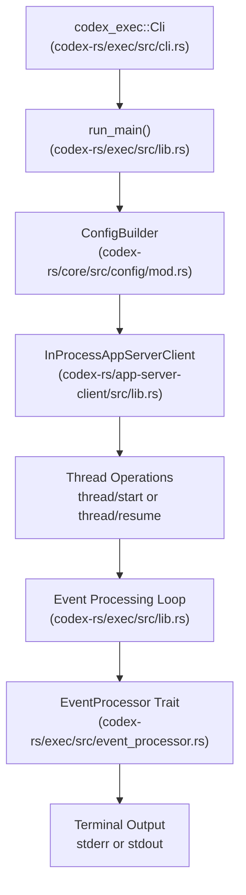
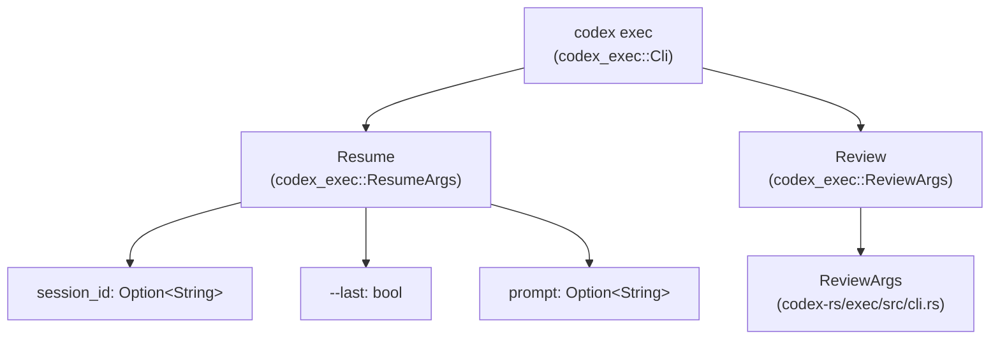
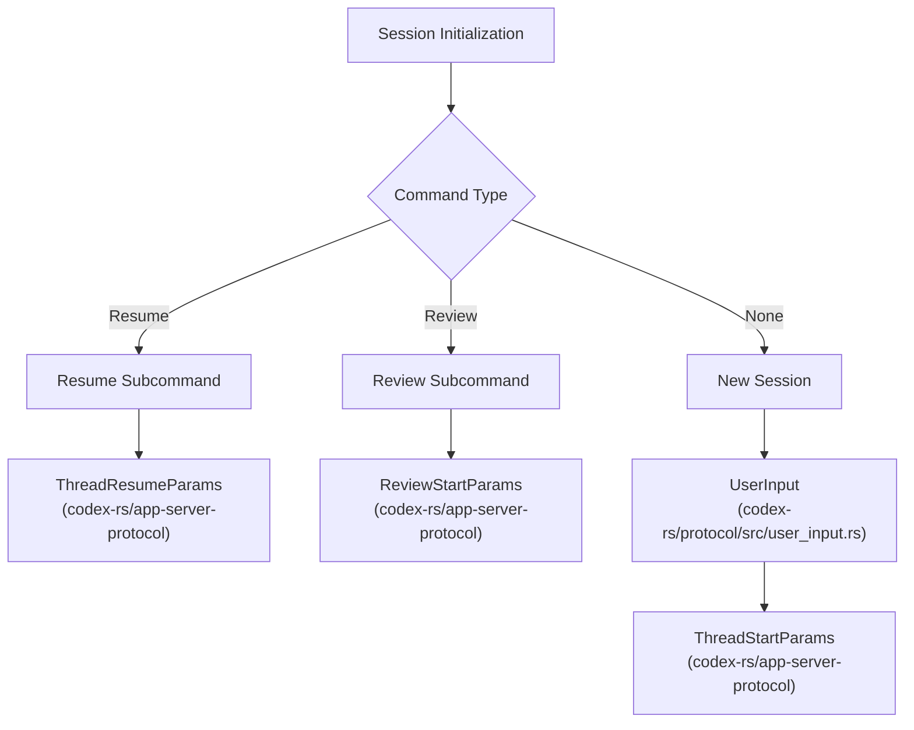
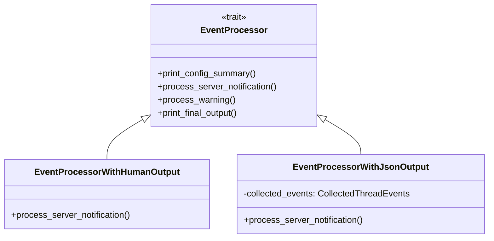

# Headless Execution Mode (codex exec)

Relevant source files

The following files were used as context for generating this wiki page:

- [codex-rs/Cargo.lock](codex-rs/Cargo.lock)
- [codex-rs/Cargo.toml](codex-rs/Cargo.toml)
- [codex-rs/cli/Cargo.toml](codex-rs/cli/Cargo.toml)
- [codex-rs/cli/src/lib.rs](codex-rs/cli/src/lib.rs)
- [codex-rs/cli/src/main.rs](codex-rs/cli/src/main.rs)
- [codex-rs/core/Cargo.toml](codex-rs/core/Cargo.toml)
- [codex-rs/core/src/lib.rs](codex-rs/core/src/lib.rs)
- [codex-rs/exec/Cargo.toml](codex-rs/exec/Cargo.toml)
- [codex-rs/exec/src/cli.rs](codex-rs/exec/src/cli.rs)
- [codex-rs/exec/src/event_processor.rs](codex-rs/exec/src/event_processor.rs)
- [codex-rs/exec/src/event_processor_with_jsonl_output.rs](codex-rs/exec/src/event_processor_with_jsonl_output.rs)
- [codex-rs/exec/src/exec_events.rs](codex-rs/exec/src/exec_events.rs)
- [codex-rs/exec/src/lib.rs](codex-rs/exec/src/lib.rs)
- [codex-rs/exec/tests/event_processor_with_json_output.rs](codex-rs/exec/tests/event_processor_with_json_output.rs)
- [codex-rs/exec/tests/suite/add_dir.rs](codex-rs/exec/tests/suite/add_dir.rs)
- [codex-rs/tui/Cargo.toml](codex-rs/tui/Cargo.toml)
- [codex-rs/tui/src/cli.rs](codex-rs/tui/src/cli.rs)
- [codex-rs/tui/src/lib.rs](codex-rs/tui/src/lib.rs)
- [sdk/typescript/README.md](sdk/typescript/README.md)
- [sdk/typescript/eslint.config.js](sdk/typescript/eslint.config.js)
- [sdk/typescript/samples/basic_streaming.ts](sdk/typescript/samples/basic_streaming.ts)
- [sdk/typescript/src/codex.ts](sdk/typescript/src/codex.ts)
- [sdk/typescript/src/codexOptions.ts](sdk/typescript/src/codexOptions.ts)
- [sdk/typescript/src/events.ts](sdk/typescript/src/events.ts)
- [sdk/typescript/src/exec.ts](sdk/typescript/src/exec.ts)
- [sdk/typescript/src/index.ts](sdk/typescript/src/index.ts)
- [sdk/typescript/src/items.ts](sdk/typescript/src/items.ts)
- [sdk/typescript/src/thread.ts](sdk/typescript/src/thread.ts)
- [sdk/typescript/src/threadOptions.ts](sdk/typescript/src/threadOptions.ts)
- [sdk/typescript/src/turnOptions.ts](sdk/typescript/src/turnOptions.ts)
- [sdk/typescript/tests/abort.test.ts](sdk/typescript/tests/abort.test.ts)
- [sdk/typescript/tests/codexExecSpy.ts](sdk/typescript/tests/codexExecSpy.ts)
- [sdk/typescript/tests/exec.test.ts](sdk/typescript/tests/exec.test.ts)
- [sdk/typescript/tests/responsesProxy.ts](sdk/typescript/tests/responsesProxy.ts)
- [sdk/typescript/tests/run.test.ts](sdk/typescript/tests/run.test.ts)
- [sdk/typescript/tests/runStreamed.test.ts](sdk/typescript/tests/runStreamed.test.ts)

The headless execution mode (`codex exec`) is a non-interactive command-line interface for running Codex programmatically or in automation workflows. Unlike the interactive TUI (see [Terminal User Interface (TUI)](#4.1)), exec mode runs a single session to completion without user interaction, emits events to stdout/stderr, and exits when the agent determines the task is complete. It also supports resuming previous sessions and running code reviews non-interactively.

For information about the interactive terminal UI, see [Terminal User Interface (TUI)](#4.1). For app server integration with IDEs, see [App Server and IDE Integration](#4.5).

---

## Architecture Overview

The exec mode uses the same core engine as the TUI and app server but wraps it in a non-interactive event processor. The execution logic initializes an `InProcessAppServerClient` (which manages a `ThreadManager` internally) and processes events in a loop until the session completes.

### Execution Mode Architecture

**Sources**: [codex-rs/exec/src/lib.rs:13-21](), [codex-rs/exec/src/cli.rs:14-17](), [codex-rs/exec/src/event_processor.rs:13-29]()

---

## Command-Line Interface

### Basic Usage

The `Cli` struct in `codex-rs/exec/src/cli.rs` defines the non-interactive interface using `clap`.

| Argument | Type | Description |
|----------|------|-------------|
| `prompt` | `Option<String>` | Task instructions (positional or `-` for stdin) [codex-rs/exec/src/cli.rs:81-86]() |
| `--image, -i` | `Vec<PathBuf>` | Image attachments for prompt (in `ResumeArgs`) [codex-rs/exec/src/cli.rs:192-200]() |
| `--model` | `Option<String>` | Override model selection (global) [codex-rs/exec/src/cli.rs:158]() |
| `--output-schema` | `Option<PathBuf>` | JSON Schema for model response shape [codex-rs/exec/src/cli.rs:52-54]() |
| `--json` | `bool` | Print events to stdout as JSONL [codex-rs/exec/src/cli.rs:63-70]() |
| `--output-last-message, -o` | `Option<PathBuf>` | Write final agent message to file [codex-rs/exec/src/cli.rs:72-79]() |
| `--ephemeral` | `bool` | Run without persisting session files to disk [codex-rs/exec/src/cli.rs:30-32]() |

**Sources**: [codex-rs/exec/src/cli.rs:14-86]()

### Subcommands

The exec mode supports subcommands defined in the `Command` enum:

**Sources**: [codex-rs/exec/src/cli.rs:166-172](), [codex-rs/exec/src/cli.rs:207-227]()

---

## Execution Flow

The `run_main` function (invoked via `codex-rs/exec/src/lib.rs`) orchestrates the following steps:

1.  **Parse CLI arguments**: Extract `Cli` struct from command line using `Parser` [codex-rs/exec/src/cli.rs:14]().
2.  **Load configuration**: Merge `config.toml`, environment variables, and CLI overrides [codex-rs/exec/src/lib.rs:62-66]().
3.  **Validate exec policy**: Check for policy warnings with `check_execpolicy_for_warnings` [codex-rs/exec/src/lib.rs:61]().
4.  **Enforce login restrictions**: Verify authentication requirements via `enforce_login_restrictions` [codex-rs/exec/src/lib.rs:77]().
5.  **Initialize client**: Create `InProcessAppServerClient` with `DEFAULT_IN_PROCESS_CHANNEL_CAPACITY` [codex-rs/exec/src/lib.rs:16-21]().

### Session Initialization

The initialization logic determines the session type (New, Resume, or Review) and makes the corresponding API call to the in-process server.

**Sources**: [codex-rs/exec/src/lib.rs:162-170](), [codex-rs/exec/src/lib.rs:28-45]()

---

## Event Processing

### Event Processor Trait

The `EventProcessor` trait in `codex-rs/exec/src/event_processor.rs` defines the interface for handling events emitted by the in-process app server [codex-rs/exec/src/event_processor.rs:13-29]().

**Sources**: [codex-rs/exec/src/event_processor.rs:13-29](), [codex-rs/exec/src/event_processor_with_human_output.rs:9](), [codex-rs/exec/src/event_processor_with_jsonl_output.rs:104]()

### Output Modes

1.  **`EventProcessorWithHumanOutput`**: Formats output for terminal users. It writes message deltas and tool results to stderr to keep stdout clean for final messages [codex-rs/exec/src/lib.rs:1-5](). For details, see [Exec Mode Event Processing](#4.2.1).
2.  **`EventProcessorWithJsonOutput`**: Serializes `ThreadEvent` objects as JSONL to stdout [codex-rs/exec/src/lib.rs:3](). It maps internal `ServerNotification` types to public `ThreadEvent` schemas like `ThreadStarted`, `TurnStarted`, and `TurnCompleted` [codex-rs/exec/src/exec_events.rs:127-135]().

### Approval Handling

Because exec mode is non-interactive, **approval requests cause immediate failure** unless policies are set to auto-approve. If a `ServerRequest::NeedApprovalRequest` is received, the processor handles the elicitation response. For details, see [Exec Mode Event Processing](#4.2.1).

---

## Session Management

### Resuming and Reviewing

- **Resuming**: Uses `ResumeArgs` to restart the session based on a session ID or the `--last` flag [codex-rs/exec/src/cli.rs:207-227](). Resuming appends to existing rollout files.
- **Reviewing**: Constructs a `ReviewStartParams` which triggers a sub-agent specialized for code analysis [codex-rs/exec/src/lib.rs:28-30]().

For details on session persistence and sub-agent delegation, see [Resume and Review Commands](#4.2.2).

### Core Event Mapping

The `EventProcessorWithJsonOutput` maps `ServerNotification` variants to `ThreadEvent` variants.

| Core Event (`ServerNotification`) | Exec Event (`ThreadEvent`) |
|-------------------------|---------------------------|
| `TurnStarted`           | `TurnStarted`             |
| `TurnCompleted`         | `TurnCompleted`           |
| `TurnFailed`            | `TurnFailed`              |

**Sources**: [codex-rs/exec/src/exec_events.rs:127-135](), [codex-rs/exec/src/event_processor_with_jsonl_output.rs:144-200]()
