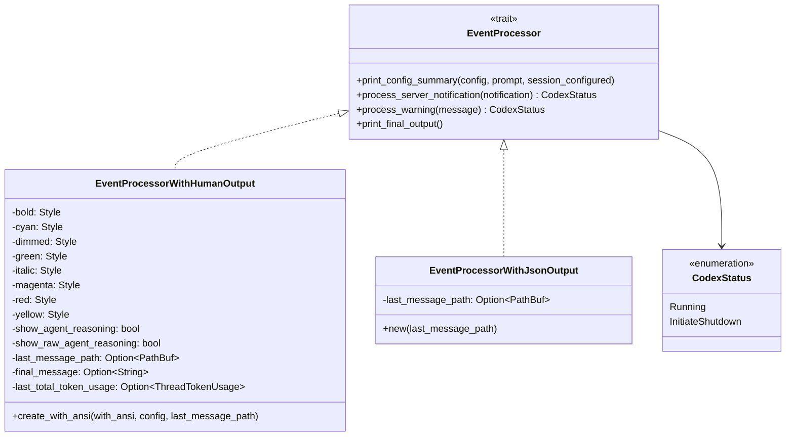
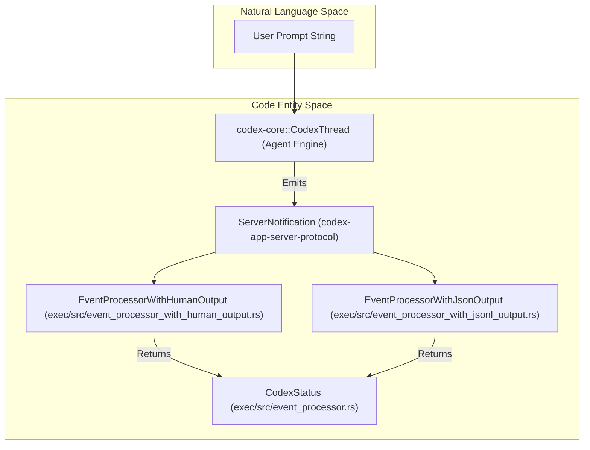
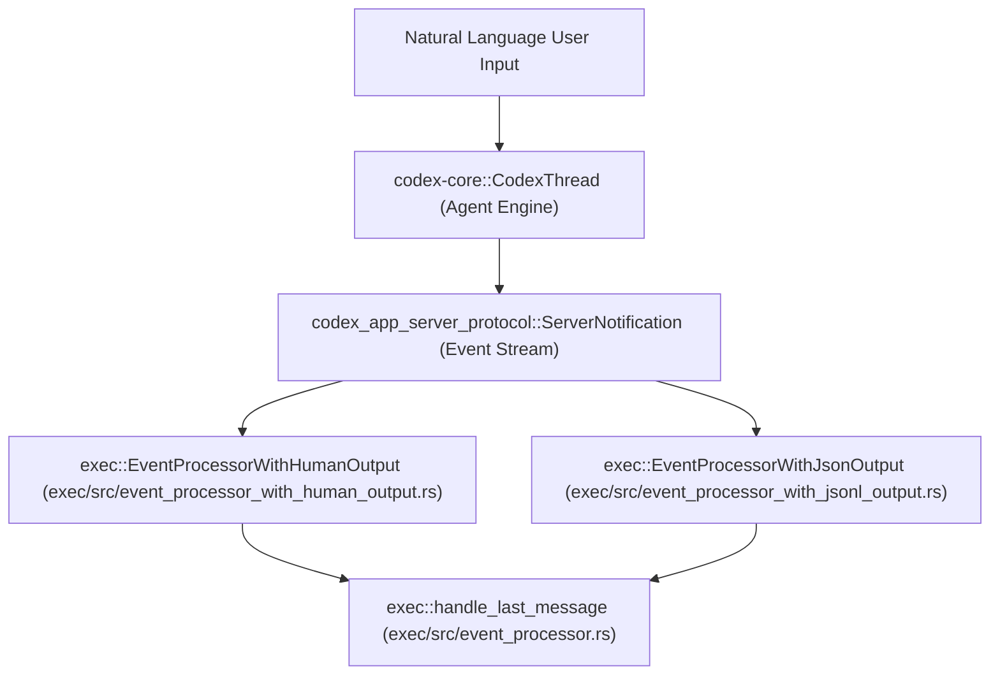

# Exec Mode Event Processing

Relevant source files

The following files were used as context for generating this wiki page:

- [codex-rs/Cargo.lock](codex-rs/Cargo.lock)
- [codex-rs/Cargo.toml](codex-rs/Cargo.toml)
- [codex-rs/cli/Cargo.toml](codex-rs/cli/Cargo.toml)
- [codex-rs/cli/src/lib.rs](codex-rs/cli/src/lib.rs)
- [codex-rs/cli/src/main.rs](codex-rs/cli/src/main.rs)
- [codex-rs/core/Cargo.toml](codex-rs/core/Cargo.toml)
- [codex-rs/core/src/lib.rs](codex-rs/core/src/lib.rs)
- [codex-rs/exec/Cargo.toml](codex-rs/exec/Cargo.toml)
- [codex-rs/exec/src/cli.rs](codex-rs/exec/src/cli.rs)
- [codex-rs/exec/src/event_processor.rs](codex-rs/exec/src/event_processor.rs)
- [codex-rs/exec/src/event_processor_with_jsonl_output.rs](codex-rs/exec/src/event_processor_with_jsonl_output.rs)
- [codex-rs/exec/src/exec_events.rs](codex-rs/exec/src/exec_events.rs)
- [codex-rs/exec/src/lib.rs](codex-rs/exec/src/lib.rs)
- [codex-rs/exec/tests/event_processor_with_json_output.rs](codex-rs/exec/tests/event_processor_with_json_output.rs)
- [codex-rs/exec/tests/suite/add_dir.rs](codex-rs/exec/tests/suite/add_dir.rs)
- [codex-rs/tui/Cargo.toml](codex-rs/tui/Cargo.toml)
- [codex-rs/tui/src/cli.rs](codex-rs/tui/src/cli.rs)
- [codex-rs/tui/src/lib.rs](codex-rs/tui/src/lib.rs)
- [sdk/typescript/README.md](sdk/typescript/README.md)
- [sdk/typescript/eslint.config.js](sdk/typescript/eslint.config.js)
- [sdk/typescript/samples/basic_streaming.ts](sdk/typescript/samples/basic_streaming.ts)
- [sdk/typescript/src/codex.ts](sdk/typescript/src/codex.ts)
- [sdk/typescript/src/codexOptions.ts](sdk/typescript/src/codexOptions.ts)
- [sdk/typescript/src/events.ts](sdk/typescript/src/events.ts)
- [sdk/typescript/src/exec.ts](sdk/typescript/src/exec.ts)
- [sdk/typescript/src/index.ts](sdk/typescript/src/index.ts)
- [sdk/typescript/src/items.ts](sdk/typescript/src/items.ts)
- [sdk/typescript/src/thread.ts](sdk/typescript/src/thread.ts)
- [sdk/typescript/src/threadOptions.ts](sdk/typescript/src/threadOptions.ts)
- [sdk/typescript/src/turnOptions.ts](sdk/typescript/src/turnOptions.ts)
- [sdk/typescript/tests/abort.test.ts](sdk/typescript/tests/abort.test.ts)
- [sdk/typescript/tests/codexExecSpy.ts](sdk/typescript/tests/codexExecSpy.ts)
- [sdk/typescript/tests/exec.test.ts](sdk/typescript/tests/exec.test.ts)
- [sdk/typescript/tests/responsesProxy.ts](sdk/typescript/tests/responsesProxy.ts)
- [sdk/typescript/tests/run.test.ts](sdk/typescript/tests/run.test.ts)
- [sdk/typescript/tests/runStreamed.test.ts](sdk/typescript/tests/runStreamed.test.ts)

## Purpose and Scope

This page documents the `Exec Mode` event processing within the Codex codebase, focusing on the `EventProcessorWithHumanOutput` struct, terminal output formatting, and approval handling. Exec Mode supports running Codex non-interactive sessions via `codex exec`, providing formatted output for terminal displays or machine-readable JSON/JSONL output streams.

The event processor translates internal protocol events emitted by the core engine into human-readable terminal output or structured JSON events. It also manages session lifecycle notifications and final message persistence.

**Sources:**
[codex-rs/exec/src/event_processor_with_human_output.rs:23-65]()
[codex-rs/exec/src/event_processor_with_human_output.rs:67-212]()
[codex-rs/exec/src/event_processor.rs:1-40]()

---

## EventProcessor Architecture

The exec mode event processing system uses a trait-based design pattern supporting multiple output formats. The core processing trait is `EventProcessor` [codex-rs/exec/src/event_processor.rs:13-29](), which requires implementations to process server notifications and optionally emit formatted output.

### Core Trait and Implementations

- **EventProcessorWithHumanOutput**: Implements terminal-oriented event rendering with ANSI styles [codex-rs/exec/src/event_processor_with_human_output.rs:23-65]().
- **EventProcessorWithJsonOutput**: Provides machine-readable JSON event serialization, typically used for integration with other tools [codex-rs/exec/src/event_processor_with_jsonl_output.rs:17-40]().
- **CodexStatus**: An enum returned by the processor to signal whether the main loop should continue (`Running`) or stop (`InitiateShutdown`) [codex-rs/exec/src/event_processor.rs:8-11]().

**Sources:**
[codex-rs/exec/src/event_processor_with_human_output.rs:23-65]()
[codex-rs/exec/src/event_processor.rs:8-21]()
[codex-rs/exec/src/event_processor_with_jsonl_output.rs:17-40]()

---

### Event Data Flow in Exec Mode

This diagram illustrates how user prompts progress through the core engine and event processor layers, producing output in either human-readable or JSON formats.

- The core engine executes the prompt and emits a stream of `ServerNotification`s [codex-rs/exec/src/lib.rs:31-32]().
- These notifications are dispatched to an event processor instance via `process_server_notification` [codex-rs/exec/src/event_processor.rs:23-23]().
- The processors return a `CodexStatus` indicating if execution continues or shutdown is initiated [codex-rs/exec/src/event_processor.rs:8-11]().

**Sources:**
[codex-rs/exec/src/event_processor_with_human_output.rs:67-101]()
[codex-rs/exec/src/event_processor_with_jsonl_output.rs:42-70]()
[codex-rs/exec/src/lib.rs:31-32]()
[codex-rs/exec/src/event_processor.rs:8-23]()

---

## EventProcessorWithHumanOutput — Terminal Formatting

`EventProcessorWithHumanOutput` is the default processor for CLI runs. It uses the `owo-colors` crate to provide conditional ANSI escape codes [codex-rs/exec/src/event_processor_with_human_output.rs:47-56]().

### ANSI Styling and Configuration

Styles are applied to differentiate roles and operation statuses [codex-rs/exec/src/event_processor_with_human_output.rs:49-56]():

| Style Field | Usage in Terminal |
| :--- | :--- |
| `bold` | Command strings, MCP tool names, and headers. |
| `italic` | Source labels like "exec" and "codex". |
| `dimmed` | Reasoning text, file paths, and "started" status labels. |
| `magenta` | Role headers (Codex/Exec labels). |
| `red` | Exit codes for failed commands. |
| `green` | Success indicators for completed items. |
| `cyan` | MCP server and tool identifiers. |
| `yellow` | Declined operation statuses. |

**Sources:**
[codex-rs/exec/src/event_processor_with_human_output.rs:42-65]()
[codex-rs/exec/src/event_processor_with_human_output.rs:67-95]()

---

### Event Rendering Details

The processor maps each `ThreadItem` notification from `codex-app-server-protocol` to a terminal display format.

#### Item Started Rendering
When an item (command, tool call, search) starts, the processor prints a header describing the action and its context [codex-rs/exec/src/event_processor_with_human_output.rs:67-96]().

- **Command Execution**: Prints "exec" in magenta followed by the command string and working directory [codex-rs/exec/src/event_processor_with_human_output.rs:69-76]().
- **MCP Tool Call**: Prints "mcp:" in bold with the server/tool name in cyan [codex-rs/exec/src/event_processor_with_human_output.rs:77-84]().

#### Item Completed Rendering
Upon completion, the processor outputs the final status, including exit codes, durations, and any aggregated output [codex-rs/exec/src/event_processor_with_human_output.rs:98-212]().

- **Agent Message**: Renders the final text response from the model [codex-rs/exec/src/event_processor_with_human_output.rs:100-108]().
- **Command Execution**: Displays "succeeded" (green) or "exited [code]" (red) along with the execution duration [codex-rs/exec/src/event_processor_with_human_output.rs:120-163]().
- **File Changes**: Summarizes the status of patch applications (completed, failed, or declined) and lists affected file paths [codex-rs/exec/src/event_processor_with_human_output.rs:164-177]().

**Sources:**
[codex-rs/exec/src/event_processor_with_human_output.rs:67-212]()

---

## Approval Handling in Exec Mode

While the TUI provides interactive overlays for approvals [codex-rs/tui/src/lib.rs:33-33](), Exec Mode handles approvals via the `EventProcessor` logic and core session configuration.

- **Approval Presets**: The system uses `codex-utils-approval-presets` to determine how much friction to apply to tool calls [codex-rs/tui/src/lib.rs:58-58]().
- **Sync with Protocol**: Exec mode responds to `AskForApproval` requests emitted by the core engine [codex-rs/exec/src/lib.rs:88-88]().
- **MCP Tool Approvals**: Approvals for MCP tool calls are managed within the tool execution loop, ensuring the agent pauses if user consent is required via `McpServerElicitationAction` [codex-rs/exec/src/lib.rs:25-26]().

**Sources:**
[codex-rs/tui/src/lib.rs:33-58]()
[codex-rs/exec/src/lib.rs:25-88]()

---

## Last Message Persistence

The `EventProcessor` can optionally persist the last full agent message to a file path [codex-rs/exec/src/event_processor.rs:31-40](). This is handled by `handle_last_message`, which writes the raw text to a specified `output_file` [codex-rs/exec/src/event_processor.rs:31-40]().

This mechanism allows external automation to capture the result of a `codex exec` run without parsing stdout/stderr. The implementation uses `std::fs::write` to commit the message to disk [codex-rs/exec/src/event_processor.rs:44-44]().

**Sources:**
[codex-rs/exec/src/event_processor.rs:31-48]()
[codex-rs/exec/src/event_processor_with_human_output.rs:34-36]()

---

## Bridging Natural Language to Code Entities

This diagram connects common system components between natural language prompts and internal code representations relevant to exec mode event processing:

**Sources:**
[codex-rs/exec/src/event_processor.rs:1-40]()
[codex-rs/exec/src/event_processor_with_human_output.rs:23-65]()
[codex-rs/exec/src/event_processor_with_jsonl_output.rs:17-40]()
