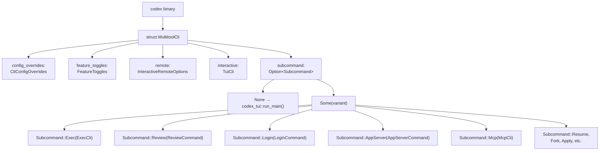
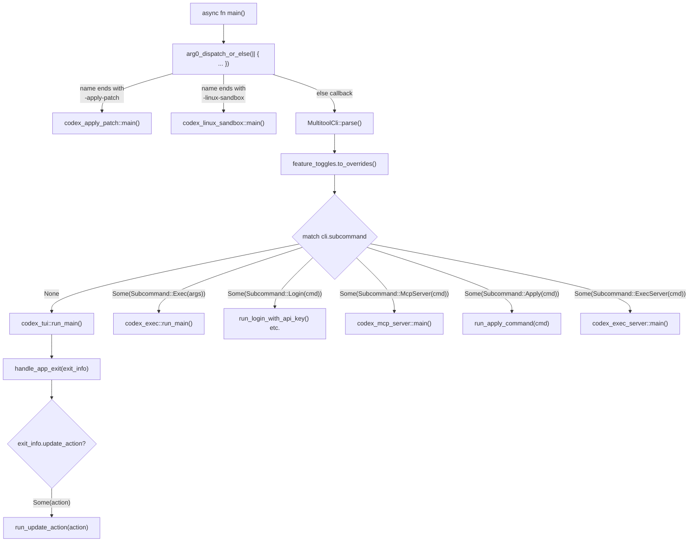
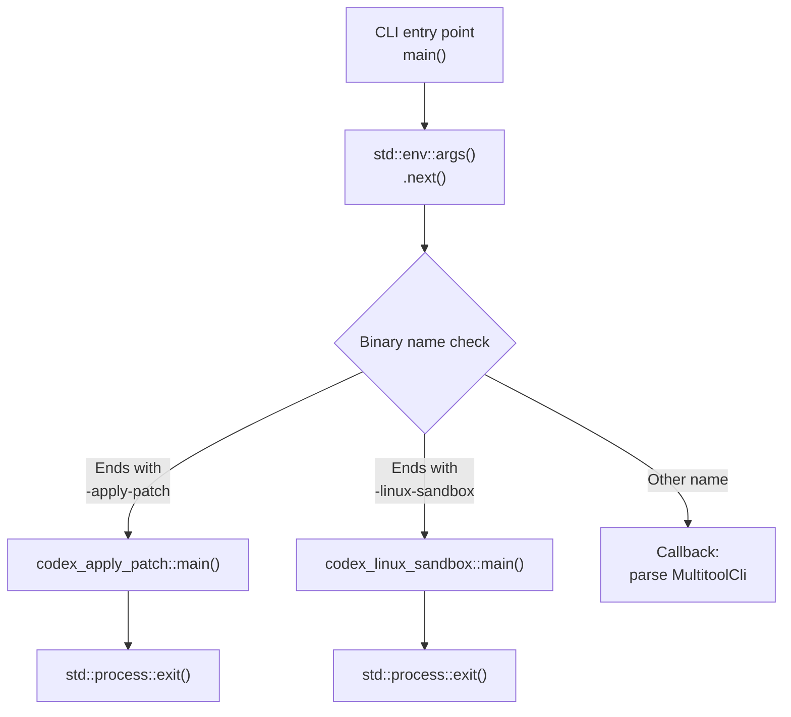

# CLI Entry Points and Multitool Dispatch

Relevant source files

The following files were used as context for generating this wiki page:

- [codex-rs/Cargo.lock](codex-rs/Cargo.lock)
- [codex-rs/Cargo.toml](codex-rs/Cargo.toml)
- [codex-rs/cli/Cargo.toml](codex-rs/cli/Cargo.toml)
- [codex-rs/cli/src/lib.rs](codex-rs/cli/src/lib.rs)
- [codex-rs/cli/src/main.rs](codex-rs/cli/src/main.rs)
- [codex-rs/core/Cargo.toml](codex-rs/core/Cargo.toml)
- [codex-rs/core/src/lib.rs](codex-rs/core/src/lib.rs)
- [codex-rs/exec/Cargo.toml](codex-rs/exec/Cargo.toml)
- [codex-rs/exec/src/cli.rs](codex-rs/exec/src/cli.rs)
- [codex-rs/exec/src/event_processor.rs](codex-rs/exec/src/event_processor.rs)
- [codex-rs/exec/src/lib.rs](codex-rs/exec/src/lib.rs)
- [codex-rs/exec/src/main.rs](codex-rs/exec/src/main.rs)
- [codex-rs/mcp-server/Cargo.toml](codex-rs/mcp-server/Cargo.toml)
- [codex-rs/mcp-server/src/codex_tool_config.rs](codex-rs/mcp-server/src/codex_tool_config.rs)
- [codex-rs/mcp-server/src/lib.rs](codex-rs/mcp-server/src/lib.rs)
- [codex-rs/mcp-server/src/main.rs](codex-rs/mcp-server/src/main.rs)
- [codex-rs/mcp-server/src/message_processor.rs](codex-rs/mcp-server/src/message_processor.rs)
- [codex-rs/mcp-server/src/outgoing_message.rs](codex-rs/mcp-server/src/outgoing_message.rs)
- [codex-rs/mcp-server/tests/common/mcp_process.rs](codex-rs/mcp-server/tests/common/mcp_process.rs)
- [codex-rs/mcp-server/tests/suite/mod.rs](codex-rs/mcp-server/tests/suite/mod.rs)
- [codex-rs/tui/Cargo.toml](codex-rs/tui/Cargo.toml)
- [codex-rs/tui/src/cli.rs](codex-rs/tui/src/cli.rs)
- [codex-rs/tui/src/lib.rs](codex-rs/tui/src/lib.rs)
- [codex-rs/tui/src/main.rs](codex-rs/tui/src/main.rs)

## Purpose and Scope

This page documents the **CLI entry point architecture** in the Codex binary, specifically how the `codex` executable acts as a **multitool dispatcher** that routes invocations to different execution modes (TUI, Exec, App Server, etc.) based on command-line arguments and binary name. The dispatch mechanism uses a `clap`-based parser with subcommand routing and an **arg0 dispatch** system for specialized binary invocations.

For details on the **TUI mode** itself, see [4.1](). For **Exec mode** implementation, see [4.2](). For **App Server** protocol handling, see [4.5](). This page focuses solely on the routing layer that selects which mode to invoke.

---

## MultitoolCli Structure and Subcommand Hierarchy

The `codex` binary uses a single `MultitoolCli` parser that defines the top-level command structure. When no subcommand is provided, the CLI defaults to **interactive TUI mode**. The parser structure is defined in [codex-rs/cli/src/main.rs:90-117]().

**Diagram: MultitoolCli Structure and Field Composition**

**Sources**: [codex-rs/cli/src/main.rs:90-117](), [codex-rs/cli/src/main.rs:119-209]()

The `#[clap(subcommand_negates_reqs = true)]` attribute on `MultitoolCli` [codex-rs/cli/src/main.rs:95-95]() means that when a subcommand is present, top-level interactive arguments are not validated, allowing different argument requirements depending on invocation mode. The `interactive: TuiCli` field is flattened via `#[clap(flatten)]` [codex-rs/cli/src/main.rs:113-113](), making TUI-specific flags available at the top level when no subcommand is specified.

---

## Subcommand Routing Table

The following table maps each subcommand to its implementation crate and primary use case:

| Subcommand | Enum Variant | Struct | Crate | Purpose |
|------------|--------------|--------|-------|---------|
| *(none)* | N/A | `TuiCli` | `codex-tui` | Interactive terminal UI (default mode) |
| `exec` | `Subcommand::Exec` | `ExecCli` | `codex-exec` | Headless, non-interactive execution |
| `review` | `Subcommand::Review` | `ReviewCommand` | `codex-cli` | Code review mode (delegates to exec) |
| `login` | `Subcommand::Login` | `LoginCommand` | `codex-cli` | Authenticate with ChatGPT or API key |
| `logout` | `Subcommand::Logout` | `LogoutCommand` | `codex-cli` | Remove stored credentials |
| `mcp` | `Subcommand::Mcp` | `McpCli` | `codex-cli` | Manage external MCP servers |
| `mcp-server` | `Subcommand::McpServer` | `McpServerCommand` | `codex-cli` | Run Codex as an MCP server (stdio) |
| `app-server` | `Subcommand::AppServer` | `AppServerCommand` | `codex-cli` | JSON-RPC 2.0 server for IDE integration |
| `app` | `Subcommand::App` | `app_cmd::AppCommand` | `codex-cli` | Launch Codex desktop app (macOS/Windows) |
| `apply` | `Subcommand::Apply` | `ApplyCommand` | `codex-chatgpt` | Apply agent-generated diffs to working tree |
| `resume` | `Subcommand::Resume` | `ResumeCommand` | `codex-cli` | Resume a previous session (TUI picker) |
| `fork` | `Subcommand::Fork` | `ForkCommand` | `codex-cli` | Fork a previous session |
| `sandbox` | `Subcommand::Sandbox` | `HostSandboxArgs` | `codex-cli` | Test sandbox execution directly |
| `completion` | `Subcommand::Completion` | `CompletionCommand` | `codex-cli` | Generate shell completion scripts |
| `features` | `Subcommand::Features` | `FeaturesCli` | `codex-cli` | Inspect feature flags |
| `cloud` | `Subcommand::Cloud` | `CloudTasksCli` | `codex-cloud-tasks` | Browse and apply Codex Cloud tasks |
| `debug` | `Subcommand::Debug` | `DebugCommand` | `codex-cli` | Debugging utilities |
| `exec-server` | `Subcommand::ExecServer` | `ExecServerCommand` | `codex-cli` | Run the standalone exec-server service |
| `stdio-to-uds` | `Subcommand::StdioToUds` | `StdioToUdsCommand` | `codex-cli` | Relay stdio to a Unix domain socket |
| `responses-api-proxy` | `Subcommand::ResponsesApiProxy` | `ResponsesApiProxyArgs` | `codex-cli` | Run the responses API proxy |

**Sources**: [codex-rs/cli/src/main.rs:121-209]()

---

## Dispatch Flow and Main Function

The `main` function orchestrates the dispatch logic. The entry point uses the `#[tokio::main]` attribute to provide async runtime support for all modes.

**Diagram: Main Function Dispatch Flow**

**Sources**: [codex-rs/cli/src/main.rs:9-10](), [codex-rs/cli/src/main.rs:90-117]()

### Key Dispatch Points

1.  **Arg0 dispatch**: The `arg0_dispatch_or_else()` function from `codex-arg0` checks the binary name (`std::env::args().next()`) before parsing CLI args. If it matches a specialized pattern (e.g., ending in `-apply-patch` or `-linux-sandbox`), the handler runs immediately and exits [codex-rs/cli/src/main.rs:9-10]().

2.  **MultitoolCli parsing**: If not arg0-dispatched, `MultitoolCli::parse()` uses `clap` to parse all arguments and flags [codex-rs/cli/src/main.rs:3-3]().

3.  **Subcommand match**: A large `match` statement on `cli.subcommand` routes execution to the appropriate handler function or crate entry point [codex-rs/cli/src/main.rs:115-117]().

---

## Arg0 Dispatch for Specialized Binaries

The **arg0 dispatch** mechanism allows the same binary to be invoked under different names to trigger specialized behavior. This is implemented in the `codex-arg0` crate via the `arg0_dispatch_or_else` function [codex-rs/cli/src/main.rs:9-10]().

### Specialized Binary Names

| Binary Name Pattern | Handler Function | Crate | Purpose |
|---------------------|-----------------|-------|---------|
| `*-apply-patch` | `codex_apply_patch::main()` | `codex-apply-patch` | Apply patches from stdin to filesystem |
| `*-linux-sandbox` | `codex_linux_sandbox::main()` | `codex-linux-sandbox` | Run commands under Landlock+seccomp on Linux |

The pattern matching is **suffix-based**: any binary name ending with `-apply-patch` or `-linux-sandbox` triggers the respective handler [codex-rs/arg0/src/lib.rs]().

### Arg0 Dispatch Flow

**Sources**: [codex-rs/cli/src/main.rs:9-10]()

---

## Default Mode Selection: TUI When No Subcommand

When no subcommand is provided, the CLI defaults to **TUI mode**. The `TuiCli` struct is flattened into `MultitoolCli` via `#[clap(flatten)]` [codex-rs/cli/src/main.rs:113-113](), so TUI-specific arguments are available at the top level.

### Resume and Fork as TUI Variants

The `resume` [codex-rs/cli/src/main.rs:177-177]() and `fork` [codex-rs/cli/src/main.rs:185-185]() subcommands are specialized TUI invocations. The main function maps these subcommands into a `TuiCli` struct with specific flags set and then launches the TUI.

**Sources**: [codex-rs/cli/src/main.rs:177-186](), [codex-rs/tui/src/cli.rs:1-76]()

---

## Common CLI Infrastructure

### CliConfigOverrides

All modes share the `CliConfigOverrides` struct from `codex-utils-cli`, which provides the `-c key=value` syntax for overriding `config.toml` values at runtime [codex-rs/cli/src/main.rs:103-104]().

### FeatureToggles

The `FeatureToggles` struct [codex-rs/cli/src/main.rs:106-107]() provides flags to enable or disable features. These are validated against known features defined in `codex-features` [codex-rs/cli/src/main.rs:74-76]().

**Sources**: [codex-rs/cli/src/main.rs:74-76](), [codex-rs/cli/src/main.rs:103-107]()

---

## Exit Handling and Update Actions

After TUI or Exec mode completes, control returns to the main function. In the TUI, exit info is returned as `AppExitInfo` [codex-rs/tui/src/lib.rs:21-21](). This structure includes:

1.  **ExitReason**: Why the app closed (e.g., user quit, fatal error) [codex-rs/tui/src/lib.rs:22-22]().
2.  **UpdateAction**: If the user requested an update during the session, this contains the version/action to perform [codex-rs/tui/src/lib.rs:203-204]().
3.  **Token usage summary**: Tracking how many tokens were consumed via `TokenUsage` [codex-rs/tui/src/lib.rs:76-76]().

**Sources**: [codex-rs/tui/src/lib.rs:21-22](), [codex-rs/tui/src/lib.rs:76-76](), [codex-rs/tui/src/lib.rs:203-204]()

---

## Summary of Entry Point Responsibilities

The CLI entry point layer provides:

1.  **Unified binary interface**: Single `codex` executable with subcommand-based mode selection [codex-rs/cli/src/main.rs:115-117]().
2.  **Arg0 dispatch**: Specialized behavior when invoked under different names [codex-rs/cli/src/main.rs:9-10]().
3.  **Default to TUI**: Interactive mode is the default experience [codex-rs/cli/src/main.rs:113-113]().
4.  **Config override propagation**: `-c` and feature flags are forwarded to all modes [codex-rs/cli/src/main.rs:103-107]().
5.  **Resume Hinting**: Logic to suggest previous sessions via `resume_hint` [codex-rs/cli/src/main.rs:39-39]().

**Sources**: [codex-rs/cli/src/main.rs:9-10](), [codex-rs/cli/src/main.rs:113-117]()
