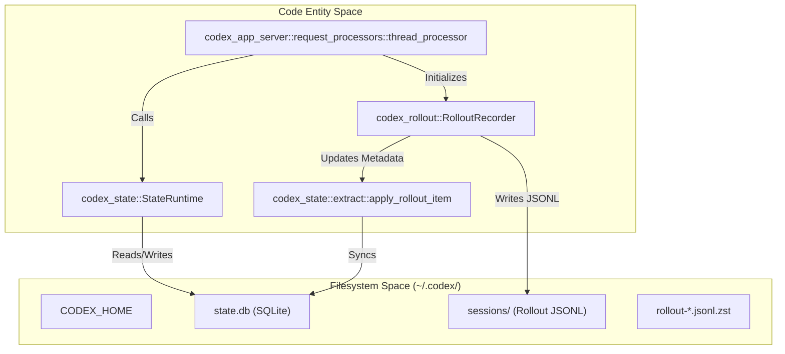
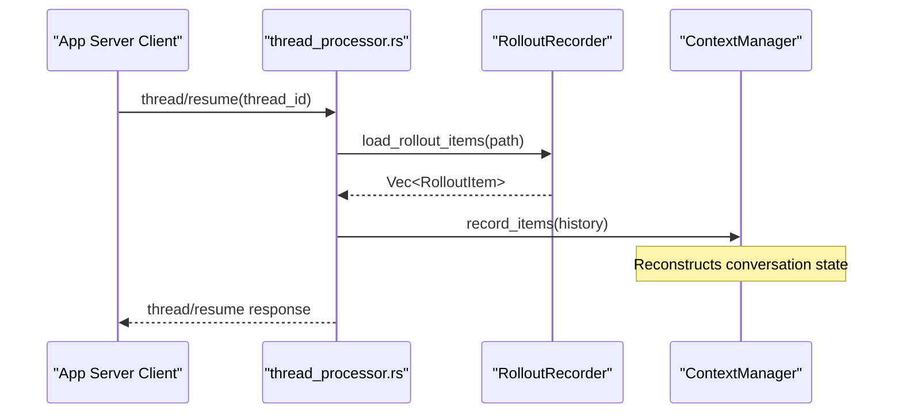

# Session Resumption and Forking

Relevant source files

The following files were used as context for generating this wiki page:

- [codex-rs/app-server-protocol/src/protocol/v2/thread.rs](codex-rs/app-server-protocol/src/protocol/v2/thread.rs)
- [codex-rs/app-server/src/request_processors.rs](codex-rs/app-server/src/request_processors.rs)
- [codex-rs/app-server/src/request_processors/thread_lifecycle.rs](codex-rs/app-server/src/request_processors/thread_lifecycle.rs)
- [codex-rs/app-server/src/request_processors/thread_processor.rs](codex-rs/app-server/src/request_processors/thread_processor.rs)
- [codex-rs/app-server/src/request_processors/turn_processor.rs](codex-rs/app-server/src/request_processors/turn_processor.rs)
- [codex-rs/app-server/tests/suite/v2/thread_fork.rs](codex-rs/app-server/tests/suite/v2/thread_fork.rs)
- [codex-rs/app-server/tests/suite/v2/thread_resume.rs](codex-rs/app-server/tests/suite/v2/thread_resume.rs)
- [codex-rs/app-server/tests/suite/v2/thread_start.rs](codex-rs/app-server/tests/suite/v2/thread_start.rs)
- [codex-rs/app-server/tests/suite/v2/turn_start.rs](codex-rs/app-server/tests/suite/v2/turn_start.rs)
- [codex-rs/core/src/context/environment_context.rs](codex-rs/core/src/context/environment_context.rs)
- [codex-rs/core/src/context/environment_context_tests.rs](codex-rs/core/src/context/environment_context_tests.rs)
- [codex-rs/core/src/context_manager/history.rs](codex-rs/core/src/context_manager/history.rs)
- [codex-rs/core/src/context_manager/history_tests.rs](codex-rs/core/src/context_manager/history_tests.rs)
- [codex-rs/core/src/context_manager/mod.rs](codex-rs/core/src/context_manager/mod.rs)
- [codex-rs/core/src/context_manager/normalize.rs](codex-rs/core/src/context_manager/normalize.rs)
- [codex-rs/core/src/session/rollout_reconstruction_tests.rs](codex-rs/core/src/session/rollout_reconstruction_tests.rs)
- [codex-rs/core/tests/suite/resume_warning.rs](codex-rs/core/tests/suite/resume_warning.rs)
- [codex-rs/rollout-trace/src/protocol_event.rs](codex-rs/rollout-trace/src/protocol_event.rs)
- [codex-rs/rollout/Cargo.toml](codex-rs/rollout/Cargo.toml)
- [codex-rs/rollout/src/compression.rs](codex-rs/rollout/src/compression.rs)
- [codex-rs/rollout/src/compression_tests.rs](codex-rs/rollout/src/compression_tests.rs)
- [codex-rs/rollout/src/lib.rs](codex-rs/rollout/src/lib.rs)
- [codex-rs/rollout/src/list.rs](codex-rs/rollout/src/list.rs)
- [codex-rs/rollout/src/policy.rs](codex-rs/rollout/src/policy.rs)
- [codex-rs/rollout/src/recorder.rs](codex-rs/rollout/src/recorder.rs)
- [codex-rs/rollout/src/recorder_tests.rs](codex-rs/rollout/src/recorder_tests.rs)
- [codex-rs/rollout/src/search.rs](codex-rs/rollout/src/search.rs)
- [codex-rs/state/src/extract.rs](codex-rs/state/src/extract.rs)
- [codex-rs/thread-store/src/local/archive_thread.rs](codex-rs/thread-store/src/local/archive_thread.rs)
- [codex-rs/thread-store/src/local/list_threads.rs](codex-rs/thread-store/src/local/list_threads.rs)
- [codex-rs/thread-store/src/local/search_threads.rs](codex-rs/thread-store/src/local/search_threads.rs)
- [codex-rs/thread-store/src/local/test_support.rs](codex-rs/thread-store/src/local/test_support.rs)
- [codex-rs/thread-store/src/local/unarchive_thread.rs](codex-rs/thread-store/src/local/unarchive_thread.rs)
- [codex-rs/tui/src/chatwidget/snapshots/codex_tui__chatwidget__tests__image_generation_call_history_snapshot.snap](codex-rs/tui/src/chatwidget/snapshots/codex_tui__chatwidget__tests__image_generation_call_history_snapshot.snap)

## Purpose and Scope

This document describes how Codex manages session continuity through resumption and forking. **Resumption** allows users to continue a previous conversation thread by replaying persisted events from disk. **Forking** creates a new thread branching from a parent thread's history, enabling divergent exploration without mutating the original session. These mechanisms rely on the **Rollout System**, which persists session events as JSONL files and indexes them via a local SQLite database for efficient retrieval and state restoration.

---

## Core Data Structures

### Session Identification and Metadata
The `ThreadId` uniquely identifies each session. Metadata for these threads is managed and indexed for fast retrieval via the `codex-state` and `codex-rollout` crates.

| Component | Code Entity | Purpose |
|-----------|--------------|---------|
| `ThreadId` | `codex_protocol::ThreadId` | Unique identifier used for file naming and database keys [codex-rs/app-server/tests/suite/v2/thread_resume.rs:56](). |
| `SessionMeta` | `codex_protocol::protocol::SessionMeta` | Contains core metadata like `cwd`, `originator`, and `model_provider` [codex-rs/rollout/src/recorder.rs:59](). |
| `RolloutItem` | `codex_protocol::protocol::RolloutItem` | The fundamental unit of persistence in the rollout file [codex-rs/rollout/src/recorder.rs:57](). |
| `ThreadMetadata` | `codex_state::model::ThreadMetadata` | SQLite-backed record of thread state, including git info and token usage [codex-rs/state/src/extract.rs:1](). |

**Sources:** [codex-rs/app-server/tests/suite/v2/thread_resume.rs:56-76](), [codex-rs/rollout/src/recorder.rs:57-62](), [codex-rs/state/src/extract.rs:1-10]()

---

## Thread Storage and Persistence

**Diagram: Thread Storage and Metadata Synchronization**

Threads are stored in two coordinated layers:
1. **Rollout Files**: JSONL files containing the full sequence of `RolloutItem` entries. These are materialized only after the first user message [codex-rs/app-server/tests/suite/v2/thread_start.rs:110-112](). The `RolloutRecorder` manages background writes to these files [codex-rs/rollout/src/recorder.rs:75-79]().
2. **State DB**: A SQLite database managed by `StateRuntime` that tracks thread metadata (e.g., `git_sha`, `title`, `model`) to provide a high-level index [codex-rs/state/src/extract.rs:45-71](). The `apply_rollout_item` function extracts searchable information from raw rollout items into the database [codex-rs/state/src/extract.rs:15-30]().

**Sources:** [codex-rs/app-server/tests/suite/v2/thread_start.rs:110-112](), [codex-rs/rollout/src/recorder.rs:75-110](), [codex-rs/state/src/extract.rs:15-112]()

---

## Resumption and Event Replay

Session resumption allows a user to pick up an existing thread. The system locates the rollout file on disk and replays it to restore the agent's state.

### App Server Resume (v2 Protocol)
The App Server handles resumption via the `thread/resume` endpoint. The server validates that the requested `thread_id` has a materialized rollout file before proceeding [codex-rs/app-server/tests/suite/v2/thread_resume.rs:148-174]().

**Diagram: Resumption and State Restoration**

### History Restoration and Mismatch Detection
During resumption, the system verifies that any configuration overrides (model, personality, etc.) match the active session state. Mismatches are logged via `collect_resume_override_mismatches` [codex-rs/app-server/src/request_processors/thread_processor.rs:20-59](). If the resumed model differs from the current configuration, a `WarningEvent` is emitted [codex-rs/core/tests/suite/resume_warning.rs:117-125]().

### Context Reconstruction
The `ContextManager` handles the ingestion of resumed history, applying `TruncationPolicy` to ensure the restored state fits within the model's context window [codex-rs/core/src/context_manager/history.rs:91-105]().

**Sources:** [codex-rs/app-server/tests/suite/v2/thread_resume.rs:148-174](), [codex-rs/app-server/src/request_processors/thread_processor.rs:20-59](), [codex-rs/core/tests/suite/resume_warning.rs:117-125](), [codex-rs/core/src/context_manager/history.rs:91-105]()

---

## Forking and Snapshots

Forking creates a new thread branching from a parent thread. This is useful for exploring alternative solutions without modifying the original conversation.

### Forking Implementation
When `thread/fork` is called, the system:
1. Generates a new `ThreadId` and `sessionId` [codex-rs/app-server/tests/suite/v2/thread_fork.rs:164-165]().
2. Sets the `forked_from_id` metadata to the parent's ID [codex-rs/app-server/tests/suite/v2/thread_fork.rs:166]().
3. Ensures the parent rollout remains unmutated [codex-rs/app-server/tests/suite/v2/thread_fork.rs:159-162]().
4. The forked thread includes the turns from the parent but is initialized as a distinct entity with its own rollout path [codex-rs/app-server/tests/suite/v2/thread_fork.rs:170-172]().

### State Metadata Persistence
When a thread is forked, the `RolloutRecorder` is initialized with `RolloutRecorderParams::Create`, explicitly passing the `forked_from_id` to the new `SessionMeta` [codex-rs/rollout/src/recorder.rs:85-92]().

**Sources:** [codex-rs/app-server/tests/suite/v2/thread_fork.rs:159-172](), [codex-rs/rollout/src/recorder.rs:83-92]()

---

## External Agent Session Migration

Codex supports importing histories and state from external environments and ensuring consistency across sessions.

### Personality Migration
The system includes logic for `personality_migration`, using the `PERSONALITY_MIGRATION_FILENAME` to handle agent persona transitions [codex-rs/app-server/tests/suite/v2/turn_start.rs:66]().

### Rollout Backfilling
When the system starts, it may perform a "backfill" operation to sync the SQLite `StateDb` with existing rollout files found in the `sessions/` directory [codex-rs/rollout/src/recorder_tests.rs:72-132](). This ensures that threads migrated from other instances or external tools are correctly indexed for search and resumption [codex-rs/rollout/src/recorder_tests.rs:134-143]().

### Legacy Support
The `RolloutRecorder` includes logic to handle legacy rollout formats, such as skipping `ghost_snapshot` lines while preserving critical audit trails like `guardian_assessment` entries during replay [codex-rs/rollout/src/recorder_tests.rs:148-223]().

**Sources:** [codex-rs/app-server/tests/suite/v2/turn_start.rs:66](), [codex-rs/rollout/src/recorder_tests.rs:72-223]()
