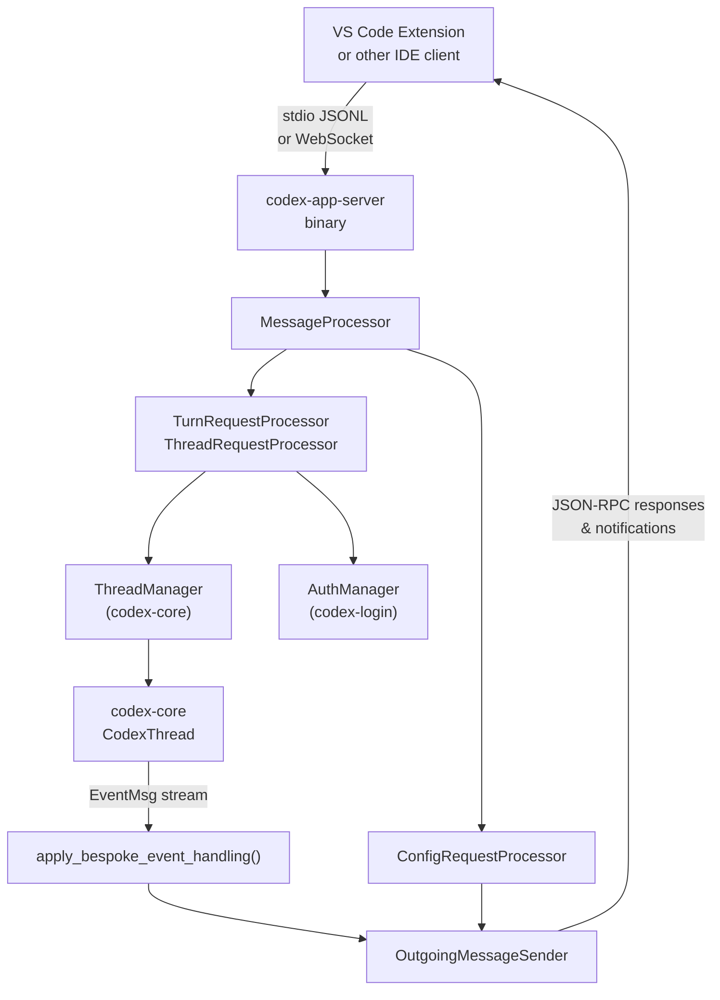
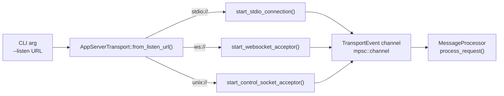
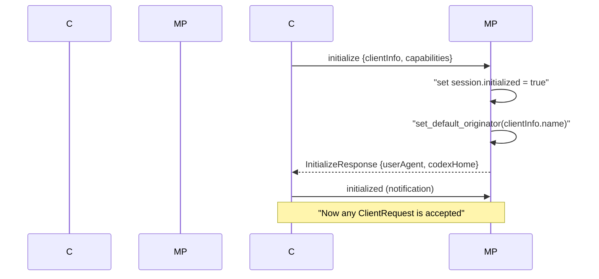
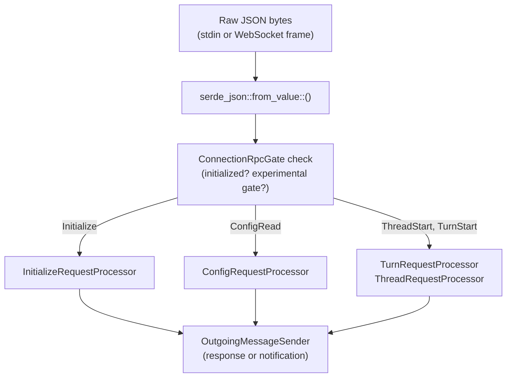
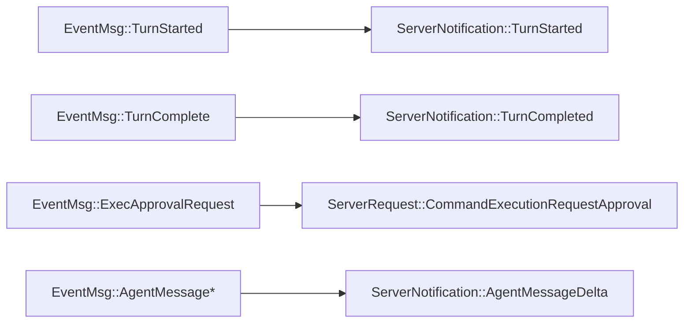

# App Server and IDE Integration

Relevant source files

The following files were used as context for generating this wiki page:

- [codex-rs/app-server-client/Cargo.toml](codex-rs/app-server-client/Cargo.toml)
- [codex-rs/app-server-client/src/lib.rs](codex-rs/app-server-client/src/lib.rs)
- [codex-rs/app-server-client/src/remote.rs](codex-rs/app-server-client/src/remote.rs)
- [codex-rs/app-server-protocol/schema/json/ClientRequest.json](codex-rs/app-server-protocol/schema/json/ClientRequest.json)
- [codex-rs/app-server-protocol/schema/json/ServerNotification.json](codex-rs/app-server-protocol/schema/json/ServerNotification.json)
- [codex-rs/app-server-protocol/schema/json/codex_app_server_protocol.schemas.json](codex-rs/app-server-protocol/schema/json/codex_app_server_protocol.schemas.json)
- [codex-rs/app-server-protocol/schema/json/codex_app_server_protocol.v2.schemas.json](codex-rs/app-server-protocol/schema/json/codex_app_server_protocol.v2.schemas.json)
- [codex-rs/app-server-protocol/schema/typescript/ClientRequest.ts](codex-rs/app-server-protocol/schema/typescript/ClientRequest.ts)
- [codex-rs/app-server-protocol/schema/typescript/ServerNotification.ts](codex-rs/app-server-protocol/schema/typescript/ServerNotification.ts)
- [codex-rs/app-server-protocol/schema/typescript/v2/index.ts](codex-rs/app-server-protocol/schema/typescript/v2/index.ts)
- [codex-rs/app-server-protocol/src/protocol/common.rs](codex-rs/app-server-protocol/src/protocol/common.rs)
- [codex-rs/app-server/Cargo.toml](codex-rs/app-server/Cargo.toml)
- [codex-rs/app-server/README.md](codex-rs/app-server/README.md)
- [codex-rs/app-server/src/bespoke_event_handling.rs](codex-rs/app-server/src/bespoke_event_handling.rs)
- [codex-rs/app-server/src/extensions.rs](codex-rs/app-server/src/extensions.rs)
- [codex-rs/app-server/src/in_process.rs](codex-rs/app-server/src/in_process.rs)
- [codex-rs/app-server/src/lib.rs](codex-rs/app-server/src/lib.rs)
- [codex-rs/app-server/src/main.rs](codex-rs/app-server/src/main.rs)
- [codex-rs/app-server/src/mcp_refresh.rs](codex-rs/app-server/src/mcp_refresh.rs)
- [codex-rs/app-server/src/message_processor.rs](codex-rs/app-server/src/message_processor.rs)
- [codex-rs/app-server/src/outgoing_message.rs](codex-rs/app-server/src/outgoing_message.rs)
- [codex-rs/app-server/src/transport.rs](codex-rs/app-server/src/transport.rs)
- [codex-rs/app-server/tests/suite/v2/connection_handling_websocket.rs](codex-rs/app-server/tests/suite/v2/connection_handling_websocket.rs)

The `codex-app-server` crate ([codex-rs/app-server/src/lib.rs]()) is the interface Codex exposes for rich external clients such as the VS Code extension. It runs as a subprocess that communicates over a JSON-RPC 2.0 channel, providing access to all Codex agent capabilities without requiring consumers to embed Rust directly. This page covers the server binary, its transport layer, the JSON-RPC message protocol, and the runtime pipeline that translates client requests into `codex-core` operations and streams events back.

For information about the core Op/Event system that the app server delegates to, see page 2.1 (Protocol Layer). For the `ThreadManager` and session lifecycle that back these APIs, see page 3.1 (Codex Interface and Session Lifecycle). Detailed sub-pages cover specific subsystems:
- [CodexMessageProcessor and Request Handling](#4.5.1) — Document request routing, initialization handshake, and OutgoingMessageSender bidirectional communication.
- [Thread and Turn Management API](#4.5.2) — Explain thread/* and turn/* endpoints, thread status tracking, and subscription management.
- [Event Translation and Streaming](#4.5.3) — Document apply_bespoke_event_handling, event-to-notification translation, and server request patterns.
- [Config API and Layer System](#4.5.4) — Explain config/read and config/write endpoints, profile scoping, and ConfigEditsBuilder.
- [Authentication Modes and Account Management](#4.5.5) — Document auth modes (API key, ChatGPT, custom), login/logout flows, and account info retrieval.

---

## Architecture Overview

**High-level component diagram**

Sources: [codex-rs/app-server/src/lib.rs:23-27](), [codex-rs/app-server/src/message_processor.rs:165-177](), [codex-rs/app-server/src/bespoke_event_handling.rs:135-145]()

---

## Transport Layer

The server supports several transport modes, configured with `--listen <url>` [codex-rs/app-server/README.md:24-29]():

| Transport | Listen URL | Format | Status |
|---|---|---|---|
| stdio | `stdio://` (default) | Newline-delimited JSON (JSONL) | Stable |
| WebSocket | `ws://IP:PORT` | One JSON-RPC message per text frame | Experimental |
| Unix Socket | `unix://` | WebSocket frames over `.sock` | Stable |

The transport implementation handles bidirectional communication using JSON-RPC 2.0 messages [codex-rs/app-server/README.md:20-23](). While stdio is the standard for IDE subprocesses, the unix socket transport is used for local control-plane clients via `codex app-server proxy` [codex-rs/app-server/README.md:39-42]().

**Transport dispatch diagram**

Sources: [codex-rs/app-server/src/lib.rs:34-42](), [codex-rs/app-server/src/transport.rs:1-100](), [codex-rs/app-server/README.md:24-30]()

Backpressure is enforced with bounded queues. When ingress is saturated, new requests are rejected with JSON-RPC error code `-32001` [codex-rs/app-server/README.md:49-54]().

The outbound path uses a dedicated router task. Messages are placed in an `OutgoingEnvelope` and routed per-connection via `OutgoingMessageSender` [codex-rs/app-server/src/outgoing_message.rs:84-93]().

---

## Protocol

The protocol follows JSON-RPC 2.0 with the `"jsonrpc":"2.0"` header typically omitted on the wire [codex-rs/app-server/README.md:22-23]().

| Direction | Kind | Description |
|---|---|---|
| Client → Server | `ClientRequest` | Method call with `id`, `method`, `params` |
| Client → Server | `ClientNotification` | Client notification with `method` (e.g., `initialized`) |
| Server → Client | `JSONRPCResponse` / `JSONRPCError` | Reply to a `ClientRequest` |
| Server → Client | `ServerNotification` | Push event (e.g., `item/started`) |
| Server → Client | `ServerRequest` | Server-initiated call (e.g., `chatgpt/authTokens/refresh`) |

`ClientRequest` is a discriminated union tagged on `method` defined via the `client_request_definitions!` macro [codex-rs/app-server-protocol/src/protocol/common.rs:181-201]().

**Key protocol types diagram**

```mermaid
flowchart TD
    ClientRequest["ClientRequest\n(tagged union on method)"]
    Initialize["Initialize"]
    ThreadStart["Thread/start => 'thread/start'"]
    TurnStart["Turn/start => 'turn/start'"]
    ConfigRead["Config/read => 'config/read'"]
    
    ServerNotification["ServerNotification"]
    TurnStartedNotif["TurnStarted"]
    ItemStartedNotif["ItemStarted"]
    ItemCompletedNotif["ItemCompleted"]
    TurnCompletedNotif["TurnCompleted"]
    
    ServerRequest["ServerRequestPayload"]
    AuthRefresh["ChatgptAuthTokensRefresh"]
    CmdApproval["CommandExecutionRequestApproval"]
    
    ClientRequest --> Initialize
    ClientRequest --> ThreadStart
    ClientRequest --> TurnStart
    ClientRequest --> ConfigRead
    
    ServerNotification --> TurnStartedNotif
    ServerNotification --> ItemStartedNotif
    ServerNotification --> ItemCompletedNotif
    ServerNotification --> TurnCompletedNotif
    
    ServerRequest --> AuthRefresh
    ServerRequest --> CmdApproval
```

Sources: [codex-rs/app-server-protocol/src/protocol/common.rs:181-201](), [codex-rs/app-server/src/message_processor.rs:165-177](), [codex-rs/app-server/src/bespoke_event_handling.rs:51-82]()

**Schema generation**: Clients can extract TypeScript types with `codex app-server generate-ts` and JSON Schema with `codex app-server generate-json-schema` [codex-rs/app-server/README.md:57-62]().

---

## Initialization Handshake

Every connection must complete a handshake before sending other requests [codex-rs/app-server/README.md:76-85]().

Sources: [codex-rs/app-server/src/message_processor.rs:165-177](), [codex-rs/app-server/README.md:83-89]()

Key fields in `InitializeParams`:
- `clientInfo.name`: Used to identify the client for upstream services [codex-rs/app-server/README.md:91-94]().
- `capabilities.optOutNotificationMethods`: Suppress specific notification types for this connection [codex-rs/app-server/README.md:86-88]().

---

## Message Processing Pipeline

**Request routing through layers**

Sources: [codex-rs/app-server/src/message_processor.rs:165-177](), [codex-rs/app-server/src/message_processor.rs:19-38](), [codex-rs/app-server/src/lib.rs:81-102]()

The `MessageProcessor` struct owns specialized API handlers including `ThreadRequestProcessor`, `ConfigRequestProcessor`, `FsRequestProcessor`, and `McpRequestProcessor` [codex-rs/app-server/src/message_processor.rs:165-177]().

---

## Core Primitives

The API exposes three top-level primitives for user interaction [codex-rs/app-server/README.md:64-73]():

| Entity | Description | Key Code Reference |
|---|---|---|
| **Thread** | A conversation session containing multiple turns | `codex_app_server_protocol::v2::ThreadId` [codex-rs/app-server-protocol/schema/json/codex_app_server_protocol.schemas.json:42]() |
| **Turn** | One interaction (User prompt → Agent response) | `codex_app_server_protocol::Turn` [codex-rs/app-server/src/bespoke_event_handling.rs:72]() |
| **Item** | Atomic units (messages, tool calls, reasoning) | `codex_app_server_protocol::ThreadItem` [codex-rs/app-server/src/bespoke_event_handling.rs:54]() |

---

## Event Translation and Streaming

The `apply_bespoke_event_handling` function in [codex-rs/app-server/src/bespoke_event_handling.rs:135]() translates `codex-core` events into JSON-RPC notifications.

**EventMsg → ServerNotification mapping**

Sources: [codex-rs/app-server/src/bespoke_event_handling.rs:51-82](), [codex-rs/app-server/src/bespoke_event_handling.rs:135-145]()

---

## Graceful Restart

The server implements a graceful shutdown mechanism to ensure active turns finish before the process exits [codex-rs/app-server/src/lib.rs:161-166]().

1. **Signal Received**: `ShutdownState` transitions to `requested = true` [codex-rs/app-server/src/lib.rs:212]().
2. **Drain Phase**: The server stops accepting new connections but waits for `running_turn_count == 0` [codex-rs/app-server/src/lib.rs:224-230]().
3. **Forced Exit**: A second signal or a timeout forces immediate termination [codex-rs/app-server/src/lib.rs:213-215]().

Sources: [codex-rs/app-server/src/lib.rs:161-240]()
