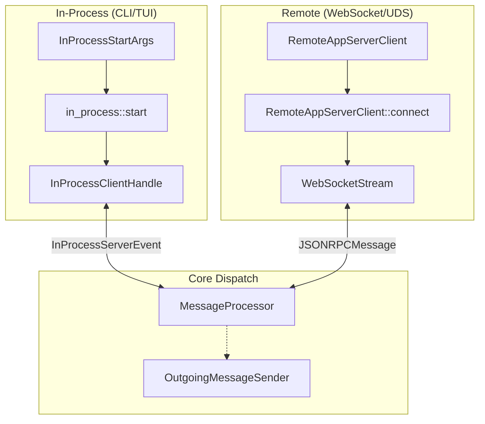

# CodexMessageProcessor and Request Handling

Relevant source files

The following files were used as context for generating this wiki page:

- [codex-rs/app-server-client/Cargo.toml](codex-rs/app-server-client/Cargo.toml)
- [codex-rs/app-server-client/src/lib.rs](codex-rs/app-server-client/src/lib.rs)
- [codex-rs/app-server-client/src/remote.rs](codex-rs/app-server-client/src/remote.rs)
- [codex-rs/app-server/Cargo.toml](codex-rs/app-server/Cargo.toml)
- [codex-rs/app-server/src/extensions.rs](codex-rs/app-server/src/extensions.rs)
- [codex-rs/app-server/src/in_process.rs](codex-rs/app-server/src/in_process.rs)
- [codex-rs/app-server/src/lib.rs](codex-rs/app-server/src/lib.rs)
- [codex-rs/app-server/src/main.rs](codex-rs/app-server/src/main.rs)
- [codex-rs/app-server/src/mcp_refresh.rs](codex-rs/app-server/src/mcp_refresh.rs)
- [codex-rs/app-server/src/message_processor.rs](codex-rs/app-server/src/message_processor.rs)
- [codex-rs/app-server/src/outgoing_message.rs](codex-rs/app-server/src/outgoing_message.rs)
- [codex-rs/app-server/src/transport.rs](codex-rs/app-server/src/transport.rs)
- [codex-rs/app-server/tests/suite/v2/connection_handling_websocket.rs](codex-rs/app-server/tests/suite/v2/connection_handling_websocket.rs)

This page documents the request handling architecture of the Codex app-server, centered around the `MessageProcessor`. It covers the full pipeline from incoming JSON-RPC bytes to domain handler invocation, including initialization handshakes, bidirectional communication via `OutgoingMessageSender`, and event translation.

## Request Pipeline and Architecture

Incoming requests pass through a multi-layered processing architecture. The `MessageProcessor` acts as the primary connection-scoped entry point, while domain-specific logic is delegated to specialized request processors.

**Diagram: Request Routing and Component Association**

```mermaid
flowchart TD
    subgraph "Transport Layer"
        T["AppServerTransport\n(stdio/WebSocket/Unix)"]
    end

    subgraph "Routing Layer"
        MP["MessageProcessor\nmessage_processor.rs"]
    end

    subgraph "Request Processors"
        IRP["InitializeRequestProcessor"]
        TRP["ThreadRequestProcessor"]
        TURN["TurnRequestProcessor"]
        CRP["ConfigRequestProcessor"]
        ERP["EnvironmentRequestProcessor"]
        ARP["AccountRequestProcessor"]
        APP["AppsRequestProcessor"]
        CAT["CatalogRequestProcessor"]
        CMD["CommandExecRequestProcessor"]
        EXT["ExternalAgentConfigRequestProcessor"]
        FB["FeedbackRequestProcessor"]
        FS["FsRequestProcessor"]
        GIT["GitRequestProcessor"]
        MCP["McpRequestProcessor"]
        MPL["MarketplaceRequestProcessor"]
        PLG["PluginRequestProcessor"]
        PROC["ProcessExecRequestProcessor"]
        REM["RemoteControlRequestProcessor"]
        SRCH["SearchRequestProcessor"]
        THG["ThreadGoalRequestProcessor"]
        WIN["WindowsSandboxRequestProcessor"]
    end

    T --> |"JSONRPCRequest"| MP
    MP --> |"initialize"| IRP
    MP --> |"thread/*"| TRP
    MP --> |"turn/*"| TURN
    MP --> |"config/*"| CRP
    MP --> |"environment/*"| ERP
    MP --> |"account/*"| ARP
    MP --> |"apps/*"| APP
    MP --> |"catalog/*"| CAT
    MP --> |"command_exec/*"| CMD
    MP --> |"external_agent_config/*"| EXT
    MP --> |"feedback/*"| FB
    MP --> |"fs/*"| FS
    MP --> |"git/*"| GIT
    MP --> |"mcp/*"| MCP
    MP --> |"marketplace/*"| MPL
    MP --> |"plugin/*"| PLG
    MP --> |"process_exec/*"| PROC
    MP --> |"remote_control/*"| REM
    MP --> |"search/*"| SRCH
    MP --> |"thread_goal/*"| THG
    MP --> |"windows_sandbox/*"| WIN

    IRP -.-> OMS["OutgoingMessageSender\noutgoing_message.rs"]
    TRP -.-> TM["ThreadManager\ncodex-core"]
    TURN -.-> TM
    CRP -.-> CM["ConfigManager\nconfig_manager.rs"]
    ERP -.-> EM["EnvironmentManager\ncodex-exec-server"]
```

Sources: [codex-rs/app-server/src/message_processor.rs:165-219](), [codex-rs/app-server/src/lib.rs:25-26]()

---

## `MessageProcessor` and Initialization

`MessageProcessor` is the per-connection entry point. It manages the lifecycle of a single client session, enforcing a strict initialization handshake before allowing other operations.

### Initialization Handshake
Clients must send an `initialize` request immediately upon connecting. The server enforces the following state machine:
1.  **Handshake Requirement**: Any request sent before `initialize` results in a `Not initialized` error. The `MessageProcessor` checks the `ConnectionSessionState` to ensure the connection is initialized before processing most requests [codex-rs/app-server/src/message_processor.rs:165-219]().
2.  **Capability Negotiation**: The client provides `InitializeParams`, which includes `ClientInfo` and `InitializeCapabilities` (e.g., experimental API opt-in, notification filters) [codex-rs/app-server-protocol/src/lib.rs:35-40]().
3.  **State Tracking**: Connection state, including whether the client is initialized and which experimental APIs are enabled, is tracked via `Arc<AtomicBool>` flags [codex-rs/app-server/src/transport.rs:35-56]().

**Key Initialization Fields:**
| Field | Purpose |
| :--- | :--- |
| `experimental_api` | Opts into features marked as experimental [codex-rs/app-server-protocol/src/lib.rs:39-39](). |
| `opt_out_notification_methods` | Suppresses specific notification types for this connection [codex-rs/app-server/src/transport.rs:38-38](). |

Sources: [codex-rs/app-server/src/message_processor.rs:165-219](), [codex-rs/app-server/src/transport.rs:35-56](), [codex-rs/app-server-protocol/src/lib.rs:35-40]()

---

## Bidirectional Communication

The app-server uses a bidirectional communication model. While the client initiates requests, the server can send asynchronous notifications or requests (e.g., for authentication refresh) back to the client.

### `OutgoingMessageSender`
The `OutgoingMessageSender` is responsible for routing messages from the server to one or more client connections. It manages pending requests and their associated callbacks [codex-rs/app-server/src/outgoing_message.rs:96-105]().

*   **Request/Response**: Supports sending `ServerRequestPayload` and waiting for a `ClientRequestResult` via a `oneshot` channel [codex-rs/app-server/src/outgoing_message.rs:133-144]().
*   **Notifications**: Dispatches `ServerNotification` messages to clients [codex-rs/app-server/src/outgoing_message.rs:160-170]().
*   **Scoping**: `ThreadScopedOutgoingMessageSender` wraps the global sender to filter messages to only those connections associated with a specific `ThreadId` [codex-rs/app-server/src/outgoing_message.rs:108-112]().

### External Auth Refresh Bridge
A concrete example of server-to-client requests is the `ExternalAuthRefreshBridge`. This struct implements the `ExternalAuth` trait from `codex-login` [codex-rs/app-server/src/message_processor.rs:111-163](). When `codex-core` requires a fresh token (e.g., for ChatGPT auth), it calls `refresh`, which triggers a `ChatgptAuthTokensRefresh` request to the client via the app-server protocol [codex-rs/app-server/src/message_processor.rs:120-128](). The `OutgoingMessageSender` then sends this request and waits for a response from the client, with a timeout [codex-rs/app-server/src/message_processor.rs:130-152]().

Sources: [codex-rs/app-server/src/outgoing_message.rs:96-105](), [codex-rs/app-server/src/message_processor.rs:94-163]()

---

## In-Process vs. Remote Handling

Codex supports both a remote app-server (via WebSocket/Unix sockets) and an in-process host for local embedders like the CLI and TUI.

**Diagram: Transport and Routing Logic**

Sources: [codex-rs/app-server/src/in_process.rs:118-151](), [codex-rs/app-server-client/src/remote.rs:163-182]()

### `InProcessClientHandle`
The in-process runtime host avoids process boundaries while preserving protocol semantics. It uses bounded in-memory channels instead of sockets [codex-rs/app-server/src/in_process.rs:1-40](). It allows for:
*   Sending typed `ClientRequest` values [codex-rs/app-server/src/in_process.rs:71-71]().
*   Consuming `InProcessServerEvent` which includes notifications and server requests [codex-rs/app-server/src/in_process.rs:158-167]().

---

## Concurrency and Backpressure

The app-server implements several mechanisms to handle high load and slow clients:

1.  **Bounded Channels**: Internal communication uses bounded `mpsc` channels with a default `CHANNEL_CAPACITY` (typically 1024) [codex-rs/app-server/src/transport.rs:16-16]().
2.  **Slow Client Disconnection**: If a connection's outbound queue fills up, the server automatically disconnects the client to prevent backpressure from affecting other connections [codex-rs/app-server/src/transport.rs:153-158]().
3.  **Lossless Event Tier**: Certain notifications (e.g., `TurnCompleted`, `AgentMessageDelta`, `ItemCompleted`) form a "lossless tier". These must be delivered to prevent state corruption in the UI [codex-rs/app-server-client/src/lib.rs:165-174]().
4.  **Shutdown Logic**: During graceful shutdown, the server uses a `CancellationToken` to signal disconnection and waits for a drain period [codex-rs/app-server/src/lib.rs:144-158](). The `ShutdownState` struct manages the transition between requested and forced shutdown [codex-rs/app-server/src/lib.rs:160-165]().

Sources: [codex-rs/app-server/src/lib.rs:144-165](), [codex-rs/app-server/src/transport.rs:130-168](), [codex-rs/app-server/src/in_process.rs:104-111](), [codex-rs/app-server-client/src/lib.rs:165-174]()
