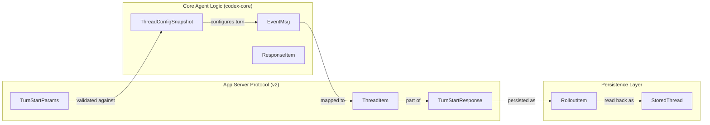

# Thread and Turn Management API

<details>
<summary>Relevant source files</summary>

The following files were used as context for generating this wiki page:

- [codex-rs/app-server-protocol/src/protocol/v2/thread.rs](codex-rs/app-server-protocol/src/protocol/v2/thread.rs)
- [codex-rs/app-server/src/request_processors.rs](codex-rs/app-server/src/request_processors.rs)
- [codex-rs/app-server/src/request_processors/thread_lifecycle.rs](codex-rs/app-server/src/request_processors/thread_lifecycle.rs)
- [codex-rs/app-server/src/request_processors/thread_processor.rs](codex-rs/app-server/src/request_processors/thread_processor.rs)
- [codex-rs/app-server/src/request_processors/thread_processor_tests.rs](codex-rs/app-server/src/request_processors/thread_processor_tests.rs)
- [codex-rs/app-server/src/request_processors/turn_processor.rs](codex-rs/app-server/src/request_processors/turn_processor.rs)
- [codex-rs/app-server/tests/suite/conversation_summary.rs](codex-rs/app-server/tests/suite/conversation_summary.rs)
- [codex-rs/app-server/tests/suite/v2/remote_thread_store.rs](codex-rs/app-server/tests/suite/v2/remote_thread_store.rs)
- [codex-rs/app-server/tests/suite/v2/thread_fork.rs](codex-rs/app-server/tests/suite/v2/thread_fork.rs)
- [codex-rs/app-server/tests/suite/v2/thread_read.rs](codex-rs/app-server/tests/suite/v2/thread_read.rs)
- [codex-rs/app-server/tests/suite/v2/thread_resume.rs](codex-rs/app-server/tests/suite/v2/thread_resume.rs)
- [codex-rs/app-server/tests/suite/v2/thread_start.rs](codex-rs/app-server/tests/suite/v2/thread_start.rs)
- [codex-rs/app-server/tests/suite/v2/thread_unarchive.rs](codex-rs/app-server/tests/suite/v2/thread_unarchive.rs)
- [codex-rs/app-server/tests/suite/v2/turn_start.rs](codex-rs/app-server/tests/suite/v2/turn_start.rs)
- [codex-rs/thread-store/src/in_memory.rs](codex-rs/thread-store/src/in_memory.rs)
- [codex-rs/thread-store/src/lib.rs](codex-rs/thread-store/src/lib.rs)
- [codex-rs/thread-store/src/local/helpers.rs](codex-rs/thread-store/src/local/helpers.rs)
- [codex-rs/thread-store/src/local/mod.rs](codex-rs/thread-store/src/local/mod.rs)
- [codex-rs/thread-store/src/local/read_thread.rs](codex-rs/thread-store/src/local/read_thread.rs)
- [codex-rs/thread-store/src/store.rs](codex-rs/thread-store/src/store.rs)
- [codex-rs/thread-store/src/types.rs](codex-rs/thread-store/src/types.rs)

</details>


This page documents the full lifecycle API for threads and turns exposed by the `codex-app-server` JSON-RPC 2.0 interface. It covers the request/call routing for `thread/*` and `turn/*` methods, the notifications they emit, thread status tracking, and subscription management.

---

## Core Data Model

The API exposes three top-level primitives representing an interaction between a user and Codex:

| Object | Description |
|--------|-------------|
| **Thread** | A conversation between a user and the Codex agent. Each thread contains multiple turns [codex-rs/app-server-protocol/src/protocol/v2/thread.rs:6-9](). |
| **Turn** | One turn of the conversation, typically starting with a user message and finishing with an agent message [codex-rs/app-server-protocol/src/protocol/v2/thread.rs:9-9](). |
| **Item** | Represents user inputs and agent outputs (e.g., message, reasoning, shell command, file edit) persisted as context [codex-rs/app-server-protocol/src/protocol/v2/thread.rs:7-7](). |

### Thread and Turn Status Tracking
Threads and turns are tracked via status enums defined in the protocol layer.

**Thread Status Variants (`ThreadStatus`):**
- `idle`: The thread is loaded and ready for new turns [codex-rs/app-server/tests/suite/v2/thread_start.rs:105-105]().
- `active`: The thread is currently executing a turn [codex-rs/app-server/src/request_processors/thread_lifecycle.rs:42-42]().
- `notLoaded`: The thread exists on disk but is not currently active in memory [codex-rs/app-server/tests/suite/v2/thread_read.rs:132-132]().

**Turn Status Variants (`TurnStatus`):**
- `inProgress`: The model or tools are currently executing [codex-rs/app-server/tests/suite/v2/thread_fork.rs:29-29]().
- `completed`: The turn finished successfully [codex-rs/app-server/tests/suite/v2/turn_start.rs:48-48]().
- `interrupted`: The turn was stopped, often during a fork or manual interrupt [codex-rs/app-server/tests/suite/v2/thread_fork.rs:184-184]().

Sources: [codex-rs/app-server/tests/suite/v2/thread_start.rs:105-105](), [codex-rs/app-server/tests/suite/v2/thread_fork.rs:184-184](), [codex-rs/app-server/src/request_processors/thread_lifecycle.rs:42-42](), [codex-rs/app-server/tests/suite/v2/thread_fork.rs:29-29](), [codex-rs/app-server/tests/suite/v2/turn_start.rs:48-48](), [codex-rs/app-server/tests/suite/v2/thread_read.rs:132-132]()

---

## Request/Response Architecture

The app server uses a central processor to route incoming JSON-RPC requests to specific thread and turn handlers.

**CodexMessageProcessor Dispatch Flow:**

```mermaid
graph TD
    [ClientConnection] -->|"JSON-RPC Request"| [MessageProcessor]
    [MessageProcessor] -->|"Dispatch"| [CodexMessageProcessor]
    
    subgraph "Thread Lifecycle Endpoints"
        [thread/start]
        [thread/resume]
        [thread/fork]
        [thread/list]
        [thread/read]
    end
    
    subgraph "Turn Lifecycle Endpoints"
        [turn/start]
        [turn/steer]
        [turn/interrupt]
    end
    
    [CodexMessageProcessor] --> [thread/start]
    [CodexMessageProcessor] --> [thread/resume]
    [CodexMessageProcessor] --> [thread/fork]
    [CodexMessageProcessor] --> [thread/list]
    [CodexMessageProcessor] --> [turn/start]
    [CodexMessageProcessor] --> [turn/steer]
```

Sources: [codex-rs/app-server/src/request_processors.rs:39-45](), [codex-rs/app-server/src/request_processors/thread_processor.rs:1-5](), [codex-rs/app-server/src/request_processors/turn_processor.rs:98-150]()

**Data Flow (Natural Language Space to Code Entity Space):**



Sources: [codex-rs/app-server/src/request_processors/thread_processor.rs:20-21](), [codex-rs/app-server/src/request_processors/turn_processor.rs:105-121](), [codex-rs/app-server/src/request_processors.rs:1-2](), [codex-rs/thread-store/src/local/read_thread.rs:21-25]()

---

## Thread Lifecycle

### `thread/start`
Creates a fresh conversation. It initializes thread metadata but does not materialize a rollout file on disk until the first user message is sent [codex-rs/app-server/tests/suite/v2/thread_start.rs:109-112]().

**Key Params (`ThreadStartParams`):**
- `model`: Optional model override (e.g., "gpt-5.2") [codex-rs/app-server/tests/suite/v2/thread_start.rs:69-69]().
- `thread_source`: Identifies the originator (e.g., `User`) [codex-rs/app-server/tests/suite/v2/thread_start.rs:70-70]().
- `cwd`: The working directory for the thread [codex-rs/app-server-protocol/src/protocol/v2/thread.rs:111-111]().

### `thread/resume`
Continues an existing conversation. It requires a valid `thread_id` and an existing rollout file; otherwise, it returns an error [codex-rs/app-server/tests/suite/v2/thread_resume.rs:148-170](). The system checks for configuration mismatches (model, cwd, sandbox policy) between the request and the active thread state [codex-rs/app-server/src/request_processors/thread_processor.rs:24-117]().

### `thread/fork`
Creates a new thread branched from an existing one. The original rollout file remains immutable [codex-rs/app-server/tests/suite/v2/thread_fork.rs:158-162](). The forked thread inherits history but receives a new unique ID [codex-rs/app-server/tests/suite/v2/thread_fork.rs:164-165]().

### `thread/list` and `thread/read`
- `thread/list`: Retrieves a paginated list of threads, supporting filters for `archived` status, `cwd`, and `search_term` [codex-rs/app-server/src/request_processors/thread_processor.rs:11-18]().
- `thread/read`: Returns a summary of a single thread, with an option to include the full turn history [codex-rs/app-server/tests/suite/v2/thread_read.rs:110-112]().

Sources: [codex-rs/app-server/tests/suite/v2/thread_start.rs:66-112](), [codex-rs/app-server/tests/suite/v2/thread_resume.rs:148-170](), [codex-rs/app-server/src/request_processors/thread_processor.rs:11-147](), [codex-rs/app-server/tests/suite/v2/thread_read.rs:83-135]()

---

## Turn and Rollback Management

### `turn/start`
Submits user input to a specific thread. Inputs can include `text` and `LocalImage` content [codex-rs/app-server/tests/suite/v2/turn_start.rs:154-157](). The `TurnRequestProcessor` handles normalization of collaboration modes and workspace roots [codex-rs/app-server/src/request_processors/turn_processor.rs:27-48]().

### `turn/steer`
Allows the user to steer an active turn by providing feedback or additional instructions while the agent is executing [codex-rs/app-server/src/request_processors/turn_processor.rs:134-142]().

### `turn/interrupt`
Aborts the current execution of a turn [codex-rs/app-server/src/request_processors/turn_processor.rs:144-152]().

### History Replay and Injection
- **History Replay**: Reconstruction of thread state during resume or fork is handled by replaying persisted items. For forked threads, the system ensures the inherited context is preserved [codex-rs/app-server/tests/suite/v2/thread_fork.rs:178-185]().
- **Item Injection**: The `thread/injectItems` endpoint allows programmatic insertion of items (like system notifications or tool results) directly into the thread history [codex-rs/app-server/src/request_processors/turn_processor.rs:115-122]().

Sources: [codex-rs/app-server/src/request_processors/turn_processor.rs:27-152](), [codex-rs/app-server/tests/suite/v2/turn_start.rs:154-157](), [codex-rs/app-server/tests/suite/v2/thread_fork.rs:178-185]()

---

## State and Subscription Management

### Thread Status Tracking
The server maintains per-conversation state to track active turns and handle interrupts.

- **`resolve_thread_status`**: Determines the current status of a thread (Idle, Active, NotLoaded) [codex-rs/app-server/src/request_processors.rs:16-16]().
- **`ThreadWatchManager`**: Manages the broadcasting of thread status changes to connected clients [codex-rs/app-server/src/request_processors.rs:15-15]().

### Thread Lifecycle Management
Threads are automatically managed by the lifecycle processors to ensure resources are released when no longer needed.

- **`ensure_conversation_listener`**: Ensures a background listener task is attached to a thread when a client interacts with it [codex-rs/app-server/src/request_processors/thread_lifecycle.rs:137-137]().
- **`SkillsWatcher`**: Monitors skill directories and emits notifications when local `.codex/skills` are modified [codex-rs/app-server/src/request_processors.rs:14-14]().

### Event Translation
The `apply_bespoke_event_handling` function handles the translation of core agent events (from `codex-core`) into protocol-specific notifications like `item/started` and `item/completed` [codex-rs/app-server/src/request_processors.rs:1-2]().

Sources: [codex-rs/app-server/src/request_processors.rs:1-16](), [codex-rs/app-server/src/request_processors/thread_lifecycle.rs:137-137](), [codex-rs/app-server/src/request_processors/turn_processor.rs:105-121]()
