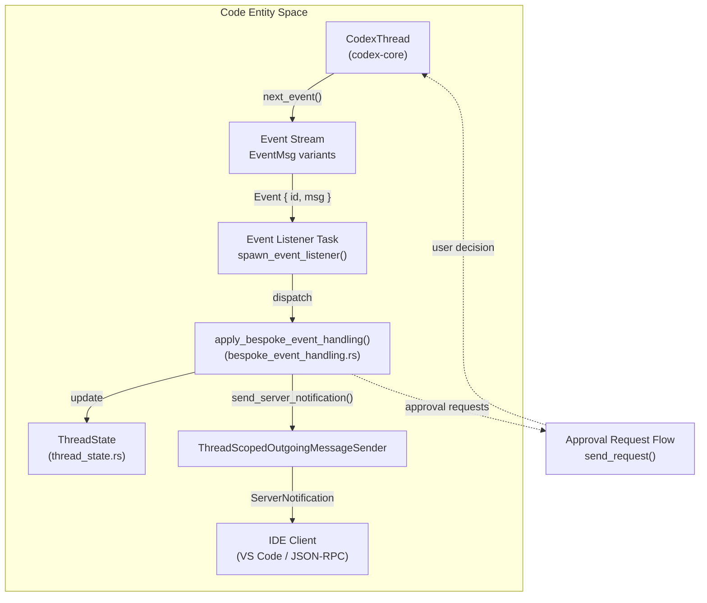
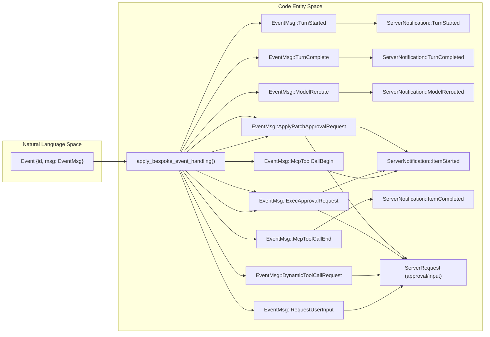
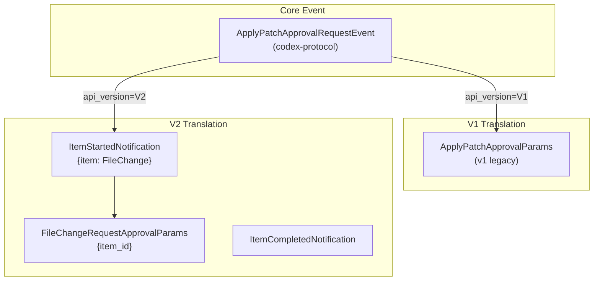
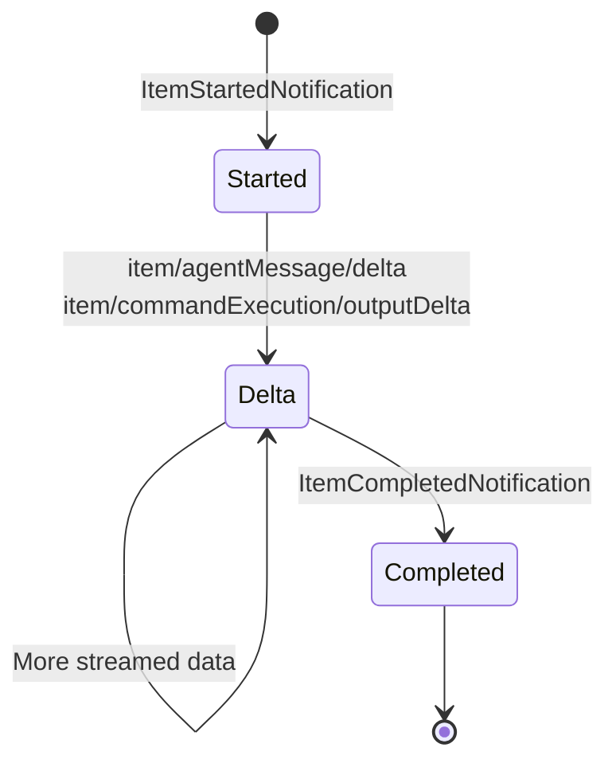
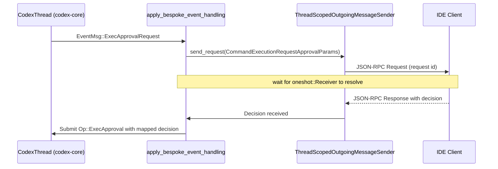
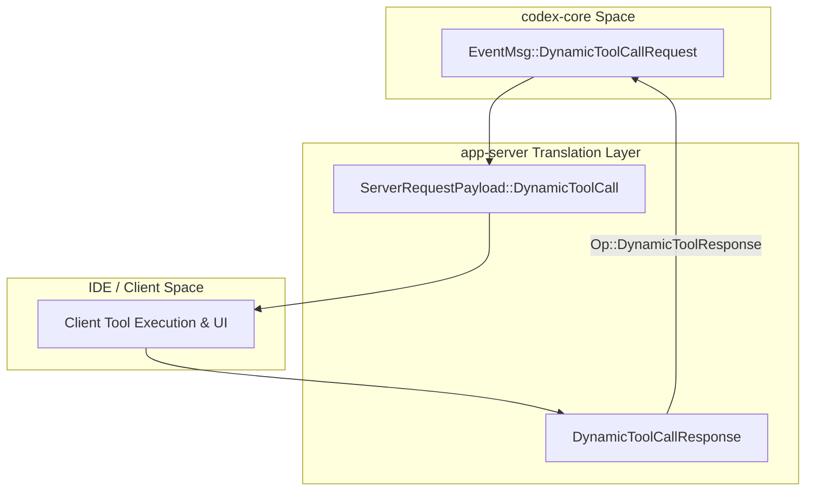
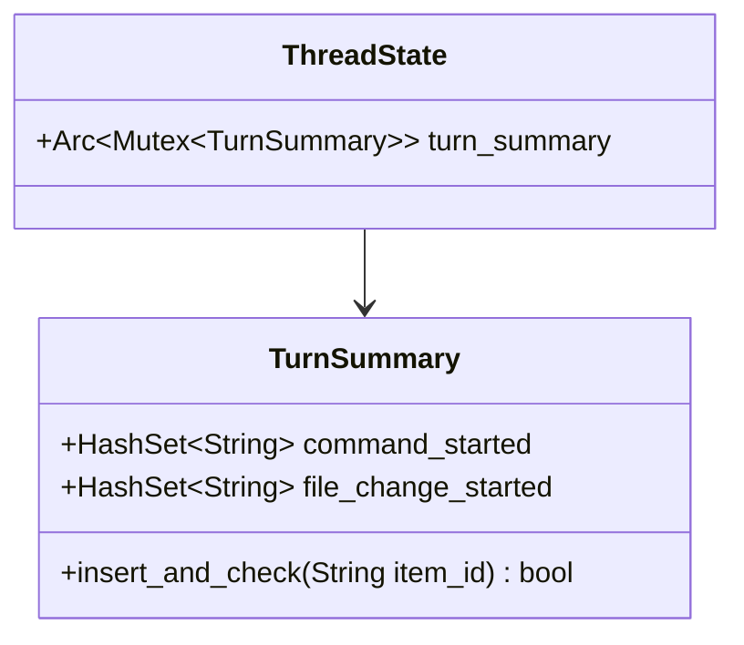
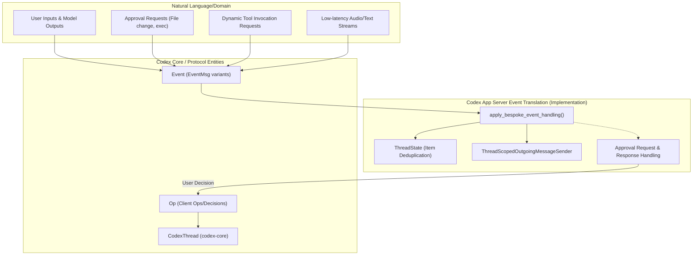

# Event Translation and Streaming

Relevant source files

The following files were used as context for generating this wiki page:

- [codex-rs/app-server-client/Cargo.toml](codex-rs/app-server-client/Cargo.toml)
- [codex-rs/app-server-client/src/lib.rs](codex-rs/app-server-client/src/lib.rs)
- [codex-rs/app-server-client/src/remote.rs](codex-rs/app-server-client/src/remote.rs)
- [codex-rs/app-server-protocol/schema/json/ClientRequest.json](codex-rs/app-server-protocol/schema/json/ClientRequest.json)
- [codex-rs/app-server-protocol/schema/json/ServerNotification.json](codex-rs/app-server-protocol/schema/json/ServerNotification.json)
- [codex-rs/app-server-protocol/schema/json/codex_app_server_protocol.schemas.json](codex-rs/app-server-protocol/schema/json/codex_app_server_protocol.schemas.json)
- [codex-rs/app-server-protocol/schema/json/codex_app_server_protocol.v2.schemas.json](codex-rs/app-server-protocol/schema/json/codex_app_server_protocol.v2.schemas.json)
- [codex-rs/app-server-protocol/schema/typescript/ClientRequest.ts](codex-rs/app-server-protocol/schema/typescript/ClientRequest.ts)
- [codex-rs/app-server-protocol/schema/typescript/ServerNotification.ts](codex-rs/app-server-protocol/schema/typescript/ServerNotification.ts)
- [codex-rs/app-server-protocol/schema/typescript/v2/index.ts](codex-rs/app-server-protocol/schema/typescript/v2/index.ts)
- [codex-rs/app-server-protocol/src/protocol/common.rs](codex-rs/app-server-protocol/src/protocol/common.rs)
- [codex-rs/app-server/Cargo.toml](codex-rs/app-server/Cargo.toml)
- [codex-rs/app-server/README.md](codex-rs/app-server/README.md)
- [codex-rs/app-server/src/bespoke_event_handling.rs](codex-rs/app-server/src/bespoke_event_handling.rs)
- [codex-rs/app-server/src/extensions.rs](codex-rs/app-server/src/extensions.rs)
- [codex-rs/app-server/src/in_process.rs](codex-rs/app-server/src/in_process.rs)
- [codex-rs/app-server/src/lib.rs](codex-rs/app-server/src/lib.rs)
- [codex-rs/app-server/src/main.rs](codex-rs/app-server/src/main.rs)
- [codex-rs/app-server/src/mcp_refresh.rs](codex-rs/app-server/src/mcp_refresh.rs)
- [codex-rs/app-server/src/message_processor.rs](codex-rs/app-server/src/message_processor.rs)
- [codex-rs/app-server/src/outgoing_message.rs](codex-rs/app-server/src/outgoing_message.rs)
- [codex-rs/app-server/src/transport.rs](codex-rs/app-server/src/transport.rs)
- [codex-rs/app-server/tests/suite/v2/connection_handling_websocket.rs](codex-rs/app-server/tests/suite/v2/connection_handling_websocket.rs)

## Purpose and Scope

This page documents the event translation system within `codex-app-server`. This system bridges the internal event model of the core agent (`codex-protocol`) with the client-facing JSON-RPC protocol (`codex-app-server-protocol`). During conversation threads—comprising model calls, tool executions, and other side-effects—the core emits various events. The app server translates these core events into structured notifications and requests suitable for IDE clients such as the Codex VS Code extension.

For complementary documentation on request handling and thread management, see [Thread and Turn Management API (4.5.2)](). For the architectural overview of message processing, see [CodexMessageProcessor and Request Handling (4.5.1)]().

---

## Overview of Event Translation Flow

The event translation layer acts as a pipeline between the core agent thread (`CodexThread`) and outgoing messages to clients. It listens for events emitted by the thread, processes them via bespoke handlers, updates internal server-side thread state, and emits JSON-RPC notifications or server-requests.

**Explanation:**

- The `CodexThread` [codex-rs/app-server/src/bespoke_event_handling.rs:87]() produces an asynchronous stream of `Event` objects [codex-rs/app-server/src/bespoke_event_handling.rs:96]().
- The event listener task pulls each event and dispatches it to `apply_bespoke_event_handling` [codex-rs/app-server/src/bespoke_event_handling.rs:135-138]().
- This function interprets event messages (`EventMsg`), performs state updates with `ThreadState`, and sends corresponding notifications or requests via the `ThreadScopedOutgoingMessageSender` [codex-rs/app-server/src/bespoke_event_handling.rs:141-145]().
- For events requiring user intervention (e.g., command approval), the system initiates an approval request cycle [codex-rs/app-server/src/bespoke_event_handling.rs:390-435]().

**Sources:** [codex-rs/app-server/src/bespoke_event_handling.rs:133-145](), [codex-rs/app-server/README.md:79-82]()

---

## Core Translation Function: `apply_bespoke_event_handling`

The `apply_bespoke_event_handling` async function in `bespoke_event_handling.rs` is the central dispatch point for translating core events into app-server protocol messages. It performs pattern matching on the `EventMsg` enum to generate structured notifications and, where necessary, issue server requests awaiting user input.

**Key `EventMsg` to Server Message Mappings:**

| `EventMsg` Variant                | Server Message(s)                  | Protocol Version | Notes                                               |
|---------------------------------|----------------------------------|------------------|-----------------------------------------------------|
| `TurnStarted`                   | `TurnStartedNotification`         | V2               | Emits snapshot of turn start [codex-rs/app-server/src/bespoke_event_handling.rs:351-365]() |
| `TurnComplete`                  | `TurnCompletedNotification`       | V1/V2            | Finalizes turn [codex-rs/app-server/src/bespoke_event_handling.rs:366-382]() |
| `ModelReroute`                  | `ModelReroutedNotification`       | V2               | Notifies client about model switching [codex-rs/app-server/src/bespoke_event_handling.rs:307-314]() |
| `ApplyPatchApprovalRequest`     | `ItemStartedNotification` + Server Request | V1/V2            | Triggers UI for file change approval [codex-rs/app-server/src/bespoke_event_handling.rs:182-205]() |
| `ExecApprovalRequest`           | `ItemStartedNotification` + Server Request | V1/V2            | Triggers command execution approval [codex-rs/app-server/src/bespoke_event_handling.rs:141-181]() |
| `McpToolCallBegin`              | `ItemStartedNotification`         | V2               | Represents start of MCP tool call [codex-rs/app-server/src/bespoke_event_handling.rs:271-282]() |
| `McpToolCallEnd`                | `ItemCompletedNotification`       | V2               | Marks MCP tool call completion [codex-rs/app-server/src/bespoke_event_handling.rs:283-293]() |
| `DynamicToolCallRequest`        | Server Request                    | V2               | Client tool execution negotiation [codex-rs/app-server/src/bespoke_event_handling.rs:315-349]() |
| `RequestUserInput`              | Server Request                    | V2               | For interactive user input [codex-rs/app-server/src/bespoke_event_handling.rs:436-449]() |

**Sources:** [codex-rs/app-server/src/bespoke_event_handling.rs:133-450](), [codex-rs/app-server-protocol/src/protocol/common.rs:181-201]()

---

## API Version Handling and Item Lifecycle Differences

The app server supports two protocol versions for client communication. Version 2 introduces an explicit Item lifecycle (Started -> Delta* -> Completed) which allows for more granular UI updates in the client [codex-rs/app-server/README.md:80-81]().

### V1 vs V2 Translation Example for File Changes

The V2 API decouples item lifecycle events from approvals, which are associated with explicit item IDs, enabling richer client-side streaming and UI affordances [codex-rs/app-server/src/bespoke_event_handling.rs:182-205]().

**Sources:** [codex-rs/app-server/src/bespoke_event_handling.rs:133-199](), [codex-rs/app-server-protocol/schema/json/codex_app_server_protocol.schemas.json:34-72]()

---

## Item Lifecycle Pattern (V2 Protocol)

In V2, each conceptual "Item" (such as agent messages, commands, or file changes) follows a well-defined lifecycle, allowing clients to render progress incrementally.

| Item Type        | Started Event (`item/started`) | Delta Events (streaming intermediate data)         | Completed Event (`item/completed`)   |
|------------------|-------------------------------|----------------------------------------------------|-------------------------------------|
| AgentMessage     | `item/started` [codex-rs/app-server/src/bespoke_event_handling.rs:36]() | `item/agentMessage/delta` [codex-rs/app-server-protocol/schema/json/codex_app_server_protocol.v2.schemas.json:141-162]() | `item/completed` [codex-rs/app-server/src/bespoke_event_handling.rs:35]() |
| CommandExecution | `item/started` [codex-rs/app-server/src/bespoke_event_handling.rs:36]() | `item/commandExecution/outputDelta` [codex-rs/app-server-protocol/schema/typescript/v2/index.ts:66]() | `item/completed` [codex-rs/app-server/src/bespoke_event_handling.rs:35]() |

**Sources:** [codex-rs/app-server/src/bespoke_event_handling.rs:35-36](), [codex-rs/app-server-protocol/schema/json/codex_app_server_protocol.v2.schemas.json:141-162]()

---

## Approval Request and Server Request Patterns

Certain events require explicit human approval before proceeding. These generate `ServerRequestPayload` objects sent to the client [codex-rs/app-server/src/bespoke_event_handling.rs:390-435]().

### Approval Cycle

Approval decisions use the `CommandExecutionApprovalDecision` enum [codex-rs/app-server/src/bespoke_event_handling.rs:18](), mapped by the server into core `ReviewDecision` [codex-rs/app-server/src/bespoke_event_handling.rs:410-430]():

| Client Decision             | Core `ReviewDecision`            |
|----------------------------|---------------------------------|
| `Accept`                   | `Approved` [codex-rs/app-server/src/bespoke_event_handling.rs:101]() |
| `AcceptForSession`          | `ApprovedForSession`            |
| `Decline`                  | `Denied`                       |
| `Cancel`                   | `Abort`                        |

**Sources:** [codex-rs/app-server/src/bespoke_event_handling.rs:390-435](), [codex-rs/app-server-protocol/schema/json/codex_app_server_protocol.schemas.json:18-85]()

---

## Dynamic Tool Call Handling

Dynamic tool calls allow the agent to trigger tool execution hosted outside the core, typically on the client side. The core emits a `DynamicToolCallRequest` event which the server translates into a `ServerRequestPayload::DynamicToolCall` [codex-rs/app-server/src/bespoke_event_handling.rs:315-349]().

**Sources:** [codex-rs/app-server/src/bespoke_event_handling.rs:315-349](), [codex-rs/app-server-protocol/schema/json/codex_app_server_protocol.schemas.json:24-25]()

---

## Thread State and Item Deduplication

To prevent duplicate `ItemStartedNotification` events, the app server maintains per-thread state tracking which items have already been announced via `TurnSummary` [codex-rs/app-server/src/bespoke_event_handling.rs:153-159]().

- `TurnSummary` [codex-rs/app-server/src/thread_state.rs:10]() keeps track of item IDs that have already emitted a "started" notification.
- The deduplication logic is essential for handling event replays during session resumption [codex-rs/app-server/src/bespoke_event_handling.rs:155-160]().

**Sources:** [codex-rs/app-server/src/thread_state.rs:9-11](), [codex-rs/app-server/src/bespoke_event_handling.rs:153-159]()

---

## Realtime Conversation Streaming

The app server supports low-latency realtime conversation streams via `RealtimeEvent` types [codex-rs/app-server/src/bespoke_event_handling.rs:206-261]().

| Core Event Subtype             | Server Notification                     |
|-------------------------------|---------------------------------------|
| `Started`                     | `ThreadRealtimeStartedNotification` [codex-rs/app-server/src/bespoke_event_handling.rs:60]() |
| `OutputAudioDelta`            | `ThreadRealtimeOutputAudioDeltaNotification` [codex-rs/app-server/src/bespoke_event_handling.rs:58]() |
| `ItemAdded`                   | `ThreadRealtimeItemAddedNotification` [codex-rs/app-server/src/bespoke_event_handling.rs:57]() |
| `Error`                      | `ThreadRealtimeErrorNotification` [codex-rs/app-server/src/bespoke_event_handling.rs:56]() |
| `Closed`                     | `ThreadRealtimeClosedNotification` [codex-rs/app-server/src/bespoke_event_handling.rs:55]() |

**Sources:** [codex-rs/app-server/src/bespoke_event_handling.rs:206-261](), [codex-rs/app-server/src/bespoke_event_handling.rs:55-62]()

---

# Summary Diagram: Natural Language to Code Entity Bridging

---

# Key Implementation Artifacts

| Artifact                        | Description                                         | Location & Lines                             |
|--------------------------------|-----------------------------------------------------|----------------------------------------------|
| `apply_bespoke_event_handling` | Main core event dispatcher converting events to notifications/requests | [codex-rs/app-server/src/bespoke_event_handling.rs:135-450]() |
| `ThreadState`                  | Tracks per-thread event state for item deduplication | [codex-rs/app-server/src/thread_state.rs:9-11]() |
| `ThreadScopedOutgoingMessageSender` | Outbound stream for sending notifications/requests to clients | [codex-rs/app-server/src/outgoing_message.rs:108-112]() |
| `EventMsg`                     | Enum defining core event variants to be translated | [codex-rs/app-server/src/bespoke_event_handling.rs:97]() |

**Sources:**

- [codex-rs/app-server/src/bespoke_event_handling.rs:1-450]()  
- [codex-rs/app-server/src/thread_state.rs:1-11]()  
- [codex-rs/app-server/src/outgoing_message.rs:108-208]()
- [codex-rs/app-server-protocol/schema/json/codex_app_server_protocol.v2.schemas.json:141-162]()
