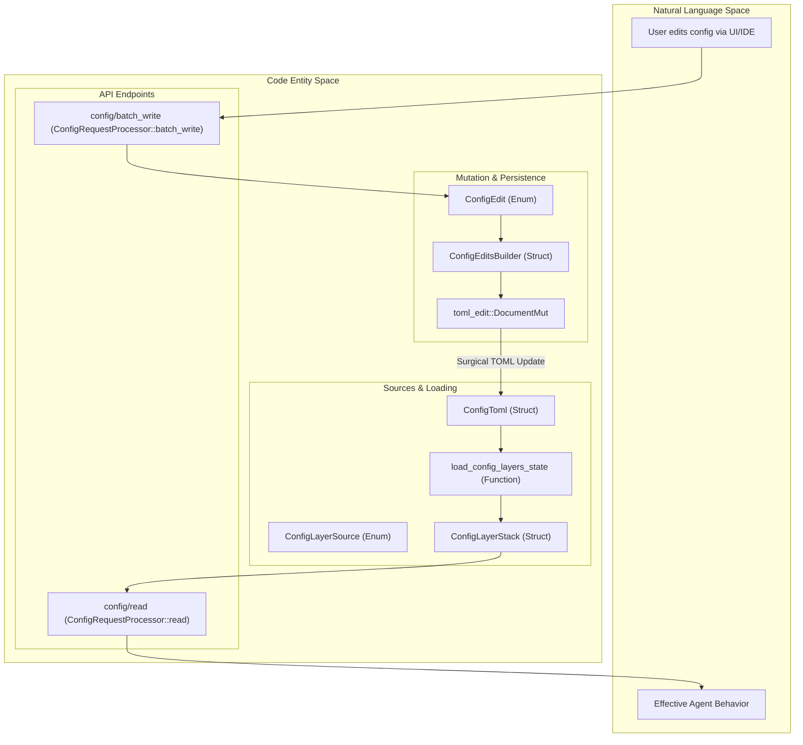
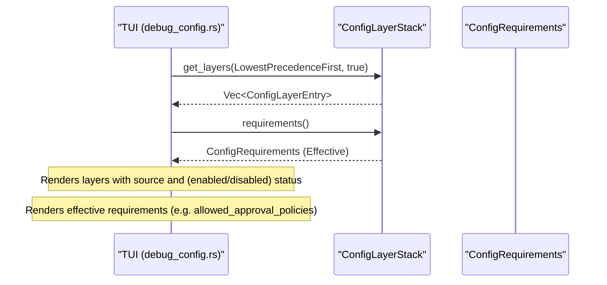

# Config API and Layer System

Relevant source files

The following files were used as context for generating this wiki page:

- [codex-rs/app-server-protocol/schema/json/v2/ConfigRequirementsReadResponse.json](codex-rs/app-server-protocol/schema/json/v2/ConfigRequirementsReadResponse.json)
- [codex-rs/app-server-protocol/schema/typescript/v2/ConfigRequirements.ts](codex-rs/app-server-protocol/schema/typescript/v2/ConfigRequirements.ts)
- [codex-rs/app-server-protocol/src/protocol/v2/config.rs](codex-rs/app-server-protocol/src/protocol/v2/config.rs)
- [codex-rs/app-server-protocol/src/protocol/v2/tests.rs](codex-rs/app-server-protocol/src/protocol/v2/tests.rs)
- [codex-rs/app-server/src/request_processors/config_processor.rs](codex-rs/app-server/src/request_processors/config_processor.rs)
- [codex-rs/config/src/config_requirements.rs](codex-rs/config/src/config_requirements.rs)
- [codex-rs/config/src/lib.rs](codex-rs/config/src/lib.rs)
- [codex-rs/config/src/types.rs](codex-rs/config/src/types.rs)
- [codex-rs/config/src/types_tests.rs](codex-rs/config/src/types_tests.rs)
- [codex-rs/core/src/config/config_loader_tests.rs](codex-rs/core/src/config/config_loader_tests.rs)
- [codex-rs/core/src/config/edit.rs](codex-rs/core/src/config/edit.rs)
- [codex-rs/tui/src/debug_config.rs](codex-rs/tui/src/debug_config.rs)

## Purpose and Scope

This page documents the configuration API exposed by the app-server and the layered configuration system that underpins Codex's runtime behavior. The Config API provides JSON-RPC endpoints for reading and writing configuration values, while the layer system determines how settings from multiple sources (MDM, system files, user files, project files, and session flags) are merged with precedence rules.

Sources: [codex-rs/app-server-protocol/src/protocol/v2/config.rs:26-82](), [codex-rs/config/src/loader/mod.rs:92-112]()

---

## System Overview

The Codex configuration system operates on two distinct planes:

1.  **Layer System (Load-time)**: Merges configuration from multiple sources. Each source is assigned a precedence level; higher precedence layers override lower ones (e.g., `SessionFlags` override `User` config) [codex-rs/app-server-protocol/src/protocol/v2/config.rs:103-120](). The core logic is managed by `ConfigLayerStack` and `ConfigLayerSource` [codex-rs/config/src/lib.rs:139-141]().
2.  **Config API (Runtime)**: Provides JSON-RPC endpoints (`config/read`, `config/write`) for inspecting effective configuration and persisting changes to the user's `config.toml` via the `ConfigEditsBuilder` engine [codex-rs/app-server/src/request_processors/config_processor.rs:80-138]().

### Configuration Data Flow

The following diagram bridges the Natural Language Space (User Config) to the Code Entity Space (structs and enums).

Sources: [codex-rs/config/src/lib.rs:109-141](), [codex-rs/app-server/src/request_processors/config_processor.rs:80-138](), [codex-rs/app-server-protocol/src/protocol/v2/config.rs:26-104](), [codex-rs/core/src/config/edit.rs:31-77]()

---

## Configuration Layer System

### Layer Sources and Precedence

The `ConfigLayerSource` enum defines the origin of configuration data. Precedence is critical for resolving conflicts when the same key exists in multiple layers [codex-rs/app-server-protocol/src/protocol/v2/config.rs:28-97]().

| Source Type | Precedence | Description |
| :--- | :--- | :--- |
| `Mdm` | 0 | Managed preferences delivered by MDM (macOS only) [codex-rs/app-server-protocol/src/protocol/v2/config.rs:104](). |
| `System` | 10 | Managed config file (e.g., `managed_config.toml`) [codex-rs/app-server-protocol/src/protocol/v2/config.rs:105](). |
| `EnterpriseManaged` | 15 | Cloud-delivered enterprise configuration bundle [codex-rs/app-server-protocol/src/protocol/v2/config.rs:106](). |
| `User` | 20 | The user's primary config at `$CODEX_HOME/config.toml` [codex-rs/app-server-protocol/src/protocol/v2/config.rs:111](). |
| `User (Profile)` | 21 | A specific profile-v2 layered on top of base user config [codex-rs/app-server-protocol/src/protocol/v2/config.rs:108-109](). |
| `Project` | 25 | Config found in `.codex/` folders within the workspace tree [codex-rs/app-server-protocol/src/protocol/v2/config.rs:114](). |
| `SessionFlags` | 30 | Runtime overrides supplied via CLI arguments (`-c`) [codex-rs/app-server-protocol/src/protocol/v2/config.rs:115](). |
| `LegacyManaged...` | 40-50 | Legacy compatibility layers [codex-rs/app-server-protocol/src/protocol/v2/config.rs:116-117](). |

Sources: [codex-rs/app-server-protocol/src/protocol/v2/config.rs:99-120]()

### Requirements System
Codex enforces **Requirements** (e.g., `ConfigRequirements`), which are mandatory policies that cannot be overridden by user or project config [codex-rs/config/src/config_requirements.rs:144-165](). These include allowed sandbox modes, approval policies, and network constraints [codex-rs/config/src/config_requirements.rs:145-165]().

Requirements are composed from sources like `RequirementSource::MdmManagedPreferences`, `RequirementSource::SystemRequirementsToml`, or `RequirementSource::EnterpriseManaged` [codex-rs/config/src/config_requirements.rs:26-50]().

Sources: [codex-rs/config/src/config_requirements.rs:26-165](), [codex-rs/config/src/lib.rs:57-79]()

---

## Config API Endpoints

### config/read Implementation

The `config/read` endpoint, handled by `ConfigRequestProcessor::read`, returns the effective merged configuration along with metadata about origins and layers [codex-rs/app-server/src/request_processors/config_processor.rs:80-107]().

*   **Experimental Features**: The processor injects enablement status for features like `memories`, `tool_suggest`, and `remote_control` by checking the `codex_features` registry against the current config [codex-rs/app-server/src/request_processors/config_processor.rs:87-106]().
*   **Requirements**: The `config_requirements_read` endpoint returns the mandatory `ConfigRequirements` currently in effect [codex-rs/app-server/src/request_processors/config_processor.rs:109-120]().

Sources: [codex-rs/app-server/src/request_processors/config_processor.rs:80-120](), [codex-rs/app-server/src/request_processors/config_processor.rs:48-55]()

### config/write and ConfigEditsBuilder

Configuration persistence is managed by `ConfigEditsBuilder` and the `ConfigEdit` enum. These mutations are applied surgically to the TOML document to preserve user formatting [codex-rs/config/src/lib.rs:109](), [codex-rs/core/src/config/edit.rs:29-31]().

**Common Mutations (`ConfigEdit` variants):**
*   **`SetModel`**: Updates model selection and reasoning effort [codex-rs/core/src/config/edit.rs:33-36]().
*   **`ReplaceMcpServers`**: Replaces the entire `[mcp_servers]` table [codex-rs/core/src/config/edit.rs:59-60]().
*   **`SetPath` / `ClearPath`**: Generic dotted-path mutations for keys like `[tui].theme` [codex-rs/core/src/config/edit.rs:71-77]().
*   **`SetProjectTrustLevel`**: Configures the trust level for a specific project path [codex-rs/core/src/config/edit.rs:67-69]().

Sources: [codex-rs/core/src/config/edit.rs:31-77](), [codex-rs/app-server/src/request_processors/config_processor.rs:122-138]()

---

## Debugging and TUI Integration

The TUI provides a `/debug-config` command to visualize the current configuration stack and active requirements.

Sources: [codex-rs/tui/src/debug_config.rs:83-116](), [codex-rs/tui/src/debug_config.rs:120-160]()

---

## Key Structures

| Structure | Role |
| :--- | :--- |
| `ConfigLayerStack` | Manages the ordered list of configuration layers and their requirements [codex-rs/config/src/state.rs:140-141](). |
| `ConfigRequirements` | Normalized mandatory policies (sandbox, network, feature requirements) derived from requirements layers [codex-rs/config/src/config_requirements.rs:144-165](). |
| `ConfigLayerSource` | Identifies the origin and precedence of a configuration layer [codex-rs/app-server-protocol/src/protocol/v2/config.rs:28-97](). |
| `ConfigEdit` | Discrete mutations supported by the persistence engine (e.g., `SetModel`, `SetPath`) [codex-rs/core/src/config/edit.rs:31-77](). |
| `ConstrainedWithSource<T>` | Wraps a value with its mandatory constraint status and the `RequirementSource` that enforced it [codex-rs/config/src/config_requirements.rs:116-119](). |

Sources: [codex-rs/config/src/config_requirements.rs:116-165](), [codex-rs/app-server-protocol/src/protocol/v2/config.rs:28-97](), [codex-rs/config/src/lib.rs:109-141](), [codex-rs/core/src/config/edit.rs:31-77]()
