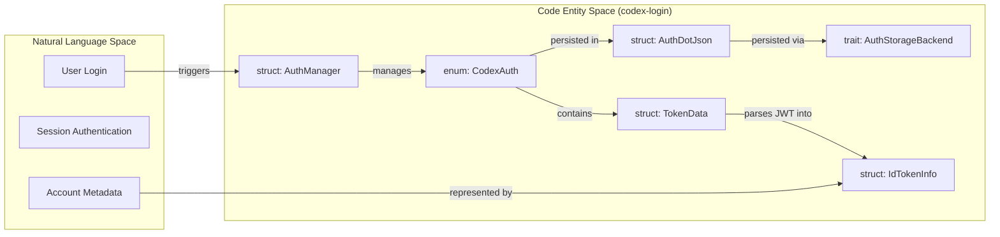
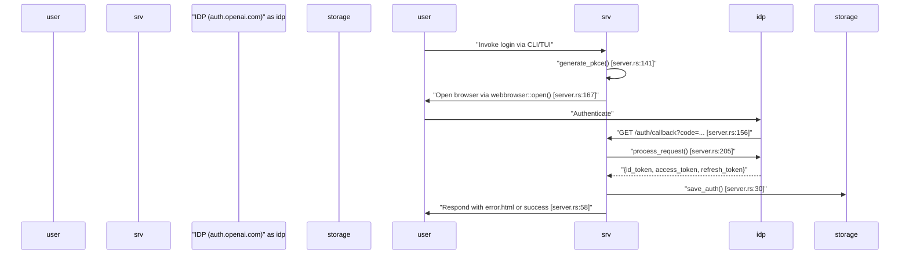
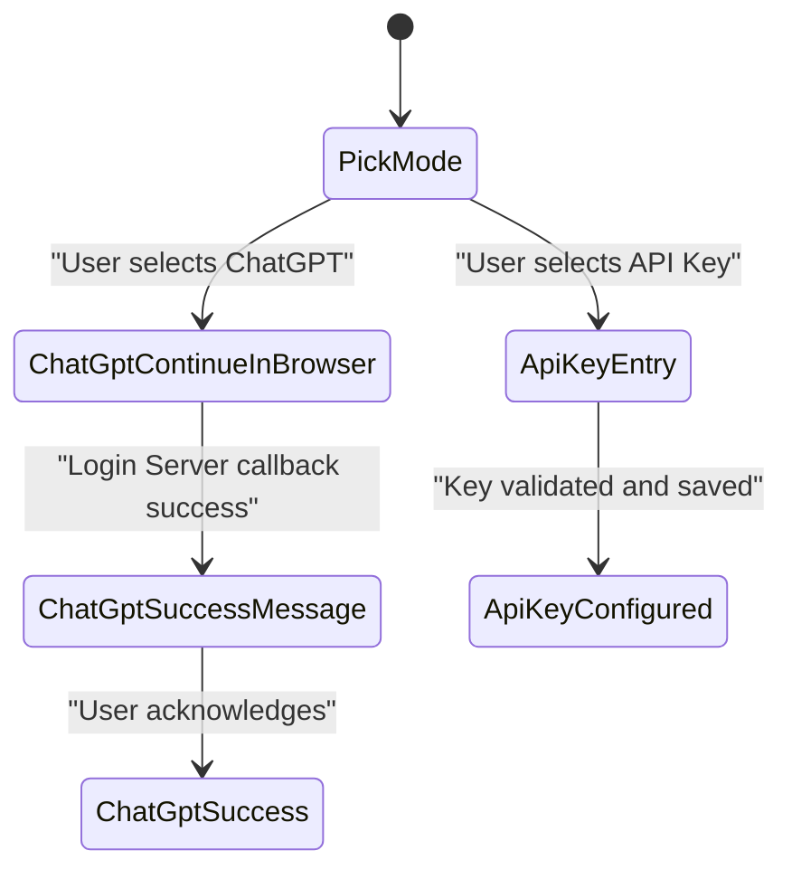

# Authentication Modes and Account Management

Relevant source files

The following files were used as context for generating this wiki page:

- [codex-rs/agent-identity/Cargo.toml](codex-rs/agent-identity/Cargo.toml)
- [codex-rs/agent-identity/src/lib.rs](codex-rs/agent-identity/src/lib.rs)
- [codex-rs/app-server-protocol/schema/json/v2/GetAccountTokenUsageResponse.json](codex-rs/app-server-protocol/schema/json/v2/GetAccountTokenUsageResponse.json)
- [codex-rs/app-server-protocol/schema/typescript/v2/AccountTokenUsageDailyBucket.ts](codex-rs/app-server-protocol/schema/typescript/v2/AccountTokenUsageDailyBucket.ts)
- [codex-rs/app-server-protocol/schema/typescript/v2/AccountTokenUsageSummary.ts](codex-rs/app-server-protocol/schema/typescript/v2/AccountTokenUsageSummary.ts)
- [codex-rs/app-server-protocol/schema/typescript/v2/GetAccountTokenUsageResponse.ts](codex-rs/app-server-protocol/schema/typescript/v2/GetAccountTokenUsageResponse.ts)
- [codex-rs/app-server-protocol/src/protocol/v2/account.rs](codex-rs/app-server-protocol/src/protocol/v2/account.rs)
- [codex-rs/app-server/tests/common/auth_fixtures.rs](codex-rs/app-server/tests/common/auth_fixtures.rs)
- [codex-rs/app-server/tests/suite/v2/rate_limits.rs](codex-rs/app-server/tests/suite/v2/rate_limits.rs)
- [codex-rs/backend-client/src/client.rs](codex-rs/backend-client/src/client.rs)
- [codex-rs/backend-client/src/lib.rs](codex-rs/backend-client/src/lib.rs)
- [codex-rs/backend-client/src/types.rs](codex-rs/backend-client/src/types.rs)
- [codex-rs/cli/src/login.rs](codex-rs/cli/src/login.rs)
- [codex-rs/cli/tests/login.rs](codex-rs/cli/tests/login.rs)
- [codex-rs/login/BUILD.bazel](codex-rs/login/BUILD.bazel)
- [codex-rs/login/Cargo.toml](codex-rs/login/Cargo.toml)
- [codex-rs/login/src/assets/error.html](codex-rs/login/src/assets/error.html)
- [codex-rs/login/src/auth/agent_identity.rs](codex-rs/login/src/auth/agent_identity.rs)
- [codex-rs/login/src/auth/auth_tests.rs](codex-rs/login/src/auth/auth_tests.rs)
- [codex-rs/login/src/auth/manager.rs](codex-rs/login/src/auth/manager.rs)
- [codex-rs/login/src/auth/mod.rs](codex-rs/login/src/auth/mod.rs)
- [codex-rs/login/src/auth/revoke.rs](codex-rs/login/src/auth/revoke.rs)
- [codex-rs/login/src/auth/storage.rs](codex-rs/login/src/auth/storage.rs)
- [codex-rs/login/src/auth/storage_tests.rs](codex-rs/login/src/auth/storage_tests.rs)
- [codex-rs/login/src/lib.rs](codex-rs/login/src/lib.rs)
- [codex-rs/login/src/server.rs](codex-rs/login/src/server.rs)
- [codex-rs/login/tests/suite/auth_refresh.rs](codex-rs/login/tests/suite/auth_refresh.rs)
- [codex-rs/login/tests/suite/login_server_e2e.rs](codex-rs/login/tests/suite/login_server_e2e.rs)
- [codex-rs/login/tests/suite/logout.rs](codex-rs/login/tests/suite/logout.rs)
- [codex-rs/login/tests/suite/mod.rs](codex-rs/login/tests/suite/mod.rs)
- [codex-rs/model-provider/src/auth.rs](codex-rs/model-provider/src/auth.rs)
- [codex-rs/models-manager/src/manager.rs](codex-rs/models-manager/src/manager.rs)
- [codex-rs/models-manager/src/manager_tests.rs](codex-rs/models-manager/src/manager_tests.rs)
- [codex-rs/tui/src/config_update.rs](codex-rs/tui/src/config_update.rs)
- [codex-rs/tui/src/local_chatgpt_auth.rs](codex-rs/tui/src/local_chatgpt_auth.rs)
- [codex-rs/tui/src/onboarding/auth.rs](codex-rs/tui/src/onboarding/auth.rs)
- [codex-rs/tui/src/onboarding/mod.rs](codex-rs/tui/src/onboarding/mod.rs)
- [codex-rs/tui/src/onboarding/onboarding_screen.rs](codex-rs/tui/src/onboarding/onboarding_screen.rs)
- [codex-rs/tui/src/onboarding/trust_directory.rs](codex-rs/tui/src/onboarding/trust_directory.rs)
- [codex-rs/tui/src/onboarding/welcome.rs](codex-rs/tui/src/onboarding/welcome.rs)

This page documents how Codex authenticates users, stores credentials, refreshes tokens, and manages login state at runtime. It covers the `CodexAuth` and `AuthManager` types in `codex-login`, the OAuth/PKCE browser login server, the device-code flow, API key auth, and the TUI onboarding screen that guides first-time users through sign-in.

---

## Auth Modes

Codex supports several authentication modes, represented by the `AuthMode` enum in the app-server protocol:

[codex-rs/login/src/server.rs:39-39]()

| `AuthMode` variant | Description |
|---|---|
| `ApiKey` | A raw OpenAI API key is used. Usage is typically billed per-token. |
| `Chatgpt` | An OAuth access token obtained from a ChatGPT account is used. Rate limits and billing follow the user's ChatGPT plan. |
| `AgentIdentity` | Uses a machine-to-machine identity for automated or enterprise environments. |
| `PersonalAccessToken` | Uses a long-lived personal access token for authentication. |
| `BedrockApiKey` | Uses AWS Bedrock API keys for model access. |

The `CodexAuth` enum (defined in `codex-login`) holds the concrete auth payload for these modes:

[codex-rs/login/src/auth/manager.rs:55-62]()

| `CodexAuth` variant | Description |
|---|---|
| `ApiKey(ApiKeyAuth)` | Holds the raw API key string. |
| `Chatgpt(ChatgptAuth)` | Holds OAuth tokens and a reference to the storage backend for stateful persistence. |
| `ChatgptAuthTokens` | Specifically holds token state for the ChatGPT flow without a direct storage reference. |
| `AgentIdentity(AgentIdentityAuth)` | Holds credentials for the Agent Identity flow. |
| `PersonalAccessToken(...)` | Holds a Personal Access Token. |
| `BedrockApiKey(...)` | Holds Bedrock-specific API credentials. |

**Auth Mode and Entity Mapping**

The following diagram bridges the natural language concepts of "Login" to the specific code entities in the `codex-login` crate.

Sources: [codex-rs/login/src/auth/manager.rs:55-62](), [codex-rs/login/src/auth/manager.rs:31-33](), [codex-rs/login/src/token_data.rs:11-25]()

---

## Token Storage: `AuthDotJson` and `TokenData`

Credentials are serialized to an `AuthDotJson` struct and persisted. The default location is typically `auth.json` within the `codex_home` directory.

### `TokenData` Structure
The `TokenData` struct handles the flat info parsed from JWTs:
[codex-rs/login/src/token_data.rs:11-25]()

| Field | Type | Purpose |
|---|---|---|
| `id_token` | `IdTokenInfo` | Parsed subset of claims (email, plan type, user ID). |
| `access_token` | `String` | The active JWT used for API requests. |
| `refresh_token` | `String` | Token used to obtain a new access token when expired. |
| `account_id` | `Option<String>` | The ChatGPT organization/workspace identifier. |

### `AuthCredentialsStoreMode`
Controls the persistence strategy for these credentials:
[codex-rs/login/src/lib.rs:10-10]()

| Mode | Behavior |
|---|---|
| `File` | Reads/writes `auth.json` on disk via `FileAuthStorage`. [codex-rs/login/src/auth/auth_tests.rs:82-88]() |
| `Ephemeral` | Stores credentials in process memory only. |
| `Keyring` | Uses platform-specific secure storage via `codex-keyring-store`. [codex-rs/login/Cargo.toml:18-18]() |

Sources: [codex-rs/login/src/token_data.rs:11-25](), [codex-rs/login/src/auth/manager.rs:35-37](), [codex-rs/login/src/auth/auth_tests.rs:82-88]()

---

## ChatGPT Browser Login Flow (PKCE)

The browser-based ChatGPT login lives in `codex-rs/login/src/server.rs`. It is used both from the CLI (`codex login`) and from the TUI onboarding screen.

**Sequence: Browser Login Implementation**

Key implementation details:
- **Port**: Defaults to `1455` [codex-rs/login/src/server.rs:55-55]().
- **PKCE**: Uses `generate_pkce()` to create a code challenge and verifier [codex-rs/login/src/server.rs:141-141]().
- **Server**: Uses `tiny_http::Server` to listen for the local callback [codex-rs/login/src/server.rs:48-48]().
- **Shutdown**: A `ShutdownHandle` is provided to signal the loop to exit [codex-rs/login/src/server.rs:128-137]().

Sources: [codex-rs/login/src/server.rs:1-206]()

---

## Device Code Login

For headless or remote environments, Codex supports the OAuth device code flow.

### Flow Steps:
1. **Request Code**: `request_device_code()` contacts the issuer to get a `user_code` and `verification_url` [codex-rs/login/src/lib.rs:13-13]().
2. **User Interaction**: The user is prompted with the URL and code. The TUI displays this in `ContinueWithDeviceCodeState` [codex-rs/tui/src/onboarding/auth.rs:128-133]().
3. **Completion**: `complete_device_code_login()` exchanges the resulting authorization code for tokens and persists them [codex-rs/login/src/lib.rs:12-12]().

Sources: [codex-rs/login/src/lib.rs:11-14](), [codex-rs/tui/src/onboarding/auth.rs:128-172]()

---

## TUI Onboarding Screen

The `OnboardingScreen` guides users through initial setup, including authentication and directory trust.

[codex-rs/tui/src/onboarding/onboarding_screen.rs:77-82]()

### `AuthModeWidget` State Machine
The `AuthModeWidget` manages the interactive sign-in UI using the `SignInState` enum:
[codex-rs/tui/src/onboarding/auth.rs:77-86]()

### Keyboard Handling
- **Navigation**: `MOVE_UP`/`MOVE_DOWN` to move between options [codex-rs/tui/src/onboarding/auth.rs:180-187]().
- **Selection**: `CONFIRM` to confirm the highlighted mode [codex-rs/tui/src/onboarding/auth.rs:200-212]().
- **Direct Input**: `SELECT_FIRST`, `SELECT_SECOND`, `SELECT_THIRD` keys for quick selection of auth modes [codex-rs/tui/src/onboarding/auth.rs:188-199]().

### Directory Trust
Before proceeding, users must decide whether to trust the current working directory. Trusting a directory allows Codex to load project-local config, hooks, and execution policies.
[codex-rs/tui/src/onboarding/trust_directory.rs:69-79]()

Sources: [codex-rs/tui/src/onboarding/auth.rs:77-212](), [codex-rs/tui/src/onboarding/onboarding_screen.rs:55-59](), [codex-rs/tui/src/onboarding/trust_directory.rs:165-179]()

---

## CLI Entry Points

The `codex-cli` provides direct commands for account management:

| Command | Function | Description |
|---|---|---|
| `codex login` | `run_login_with_chatgpt()` | Initiates the local browser server flow [codex-rs/cli/src/login.rs:134-162](). |
| `codex login --device-auth` | `run_device_code_login()` | Initiates the headless device code flow [codex-rs/cli/src/login.rs:19-19](). |
| `codex login --with-api-key` | `run_login_with_api_key()` | Reads an API key from stdin and saves it [codex-rs/cli/src/login.rs:164-191](). |
| `codex logout` | `logout()` | Removes stored credentials from `auth.json` [codex-rs/login/src/lib.rs:43-43](). |

### Logging and Observability
Direct CLI login flows use `init_login_file_logging()` to create a `codex-login.log` artifact. This is separate from the TUI logging to ensure one-shot commands remain lightweight while still being diagnosable.
[codex-rs/cli/src/login.rs:49-108]()

Sources: [codex-rs/cli/src/login.rs:1-191](), [codex-rs/login/src/lib.rs:41-47]()
