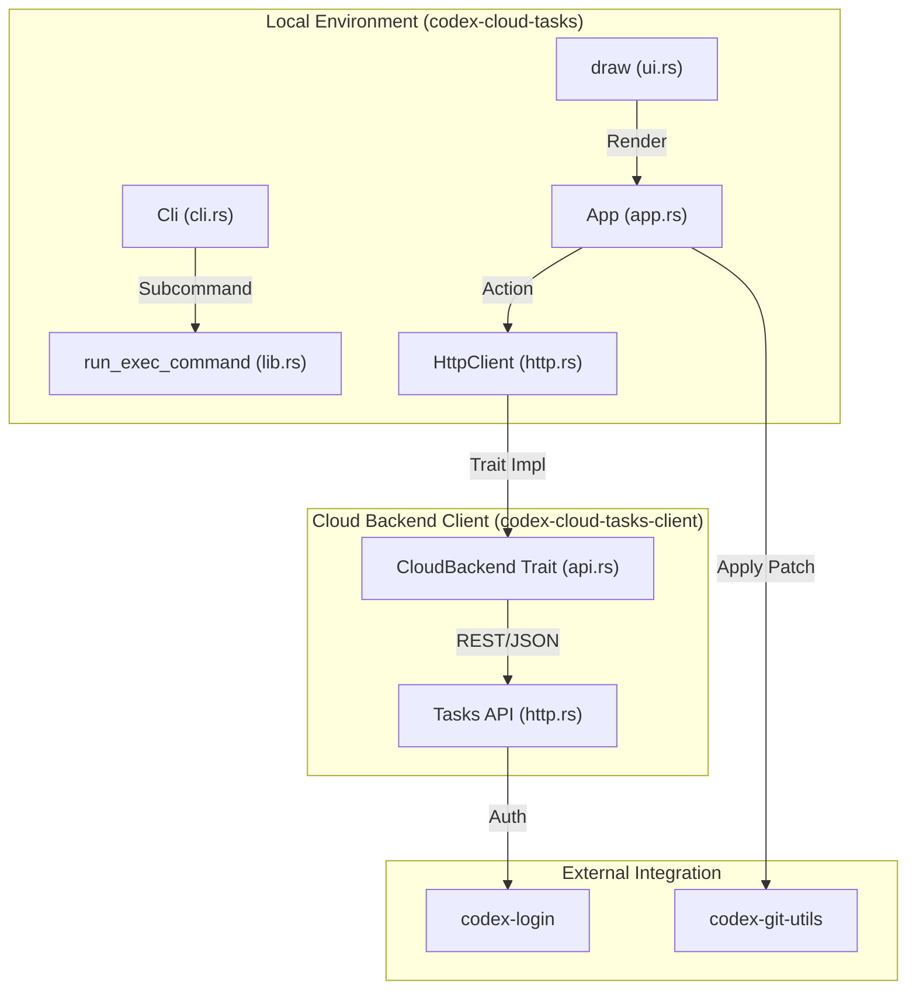
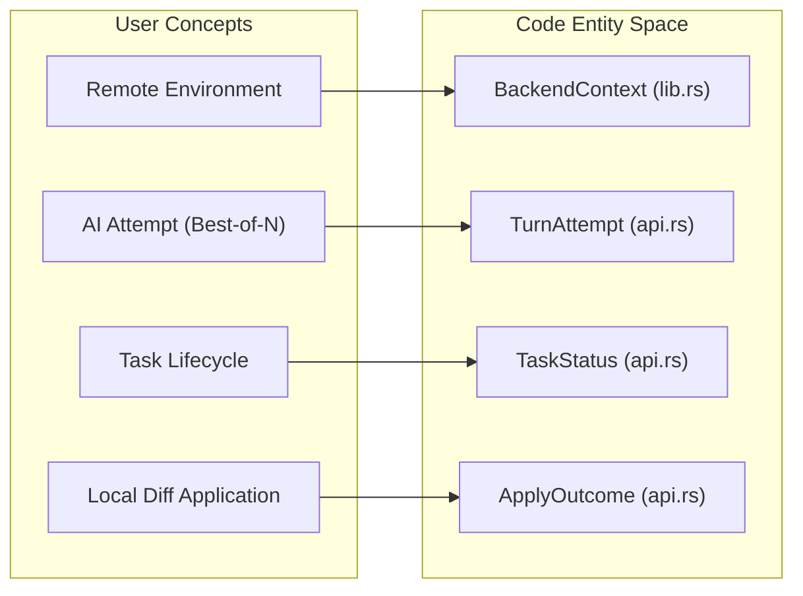

# Cloud Tasks (codex cloud)

Relevant source files

The following files were used as context for generating this wiki page:

- [codex-rs/cloud-tasks-client/BUILD.bazel](codex-rs/cloud-tasks-client/BUILD.bazel)
- [codex-rs/cloud-tasks-client/Cargo.toml](codex-rs/cloud-tasks-client/Cargo.toml)
- [codex-rs/cloud-tasks-client/src/api.rs](codex-rs/cloud-tasks-client/src/api.rs)
- [codex-rs/cloud-tasks-client/src/http.rs](codex-rs/cloud-tasks-client/src/http.rs)
- [codex-rs/cloud-tasks-client/src/lib.rs](codex-rs/cloud-tasks-client/src/lib.rs)
- [codex-rs/cloud-tasks-mock-client/BUILD.bazel](codex-rs/cloud-tasks-mock-client/BUILD.bazel)
- [codex-rs/cloud-tasks-mock-client/Cargo.toml](codex-rs/cloud-tasks-mock-client/Cargo.toml)
- [codex-rs/cloud-tasks-mock-client/src/lib.rs](codex-rs/cloud-tasks-mock-client/src/lib.rs)
- [codex-rs/cloud-tasks-mock-client/src/mock.rs](codex-rs/cloud-tasks-mock-client/src/mock.rs)
- [codex-rs/cloud-tasks/Cargo.toml](codex-rs/cloud-tasks/Cargo.toml)
- [codex-rs/cloud-tasks/src/app.rs](codex-rs/cloud-tasks/src/app.rs)
- [codex-rs/cloud-tasks/src/cli.rs](codex-rs/cloud-tasks/src/cli.rs)
- [codex-rs/cloud-tasks/src/lib.rs](codex-rs/cloud-tasks/src/lib.rs)
- [codex-rs/cloud-tasks/src/ui.rs](codex-rs/cloud-tasks/src/ui.rs)
- [codex-rs/cloud-tasks/src/util.rs](codex-rs/cloud-tasks/src/util.rs)
- [codex-rs/cloud-tasks/tests/env_filter.rs](codex-rs/cloud-tasks/tests/env_filter.rs)
- [codex-rs/tui/src/chatwidget/snapshots/codex_tui__chatwidget__tests__exploring_step1_start_ls.snap](codex-rs/tui/src/chatwidget/snapshots/codex_tui__chatwidget__tests__exploring_step1_start_ls.snap)
- [codex-rs/tui/src/chatwidget/snapshots/codex_tui__chatwidget__tests__exploring_step3_start_cat_foo.snap](codex-rs/tui/src/chatwidget/snapshots/codex_tui__chatwidget__tests__exploring_step3_start_cat_foo.snap)

The `codex-cloud-tasks` crate provides the implementation for the `codex cloud` subcommand, offering a Terminal User Interface (TUI) and Command Line Interface (CLI) for interacting with Codex Cloud. It enables users to submit tasks to remote environments, browse task history, monitor execution status, and apply generated diffs to their local workspace [codex-rs/cloud-tasks/src/lib.rs:1-8]().

## Architecture and Data Flow

The system is built around a `CloudBackend` abstraction, allowing the application to switch between a live `HttpClient` and a `MockClient` for testing [codex-rs/cloud-tasks/src/lib.rs:38-60]().

### Cloud Task Interaction Diagram
This diagram illustrates the flow from a user command through the backend client to the Codex Cloud API.

Sources: [codex-rs/cloud-tasks/src/lib.rs:157-180](), [codex-rs/cloud-tasks-client/src/http.rs:64-127](), [codex-rs/cloud-tasks/src/cli.rs:15-27](), [codex-rs/cloud-tasks-client/src/api.rs:133-170]()

### Component Mapping: Natural Language to Code Entities
This diagram maps user-facing concepts to the internal Rust structs and traits used for cloud task management.

Sources: [codex-rs/cloud-tasks/src/lib.rs:38-41](), [codex-rs/cloud-tasks-client/src/api.rs:64-71](), [codex-rs/cloud-tasks-client/src/api.rs:26-31](), [codex-rs/cloud-tasks-client/src/api.rs:82-90]()

## Backend Abstraction (CloudBackend)

The `CloudBackend` trait (defined in `codex-cloud-tasks-client`) decouples the UI and CLI from the network implementation [codex-rs/cloud-tasks-client/src/api.rs:133-170]().

### HttpClient Implementation
The `HttpClient` handles authentication and request routing to the ChatGPT backend [codex-rs/cloud-tasks-client/src/http.rs:24-27]().
*   **Authentication**: It uses `codex-login` to load credentials [codex-rs/cloud-tasks/src/lib.rs:71-75](). It extracts ChatGPT account IDs to inject them into headers via `with_chatgpt_account_id` [codex-rs/cloud-tasks-client/src/http.rs:46-49]().
*   **Path Normalization**: The `normalize_base_url` utility ensures that ChatGPT hostnames include the `/backend-api` suffix for routing to internal "WHAM" paths [codex-rs/cloud-tasks/src/util.rs:30-42]().
*   **API Organization**: Internally organized into specialized sub-clients for `Tasks`, `Attempts`, and `Apply` logic [codex-rs/cloud-tasks-client/src/http.rs:51-61]().

### Mock Backend
For development and testing, setting `CODEX_CLOUD_TASKS_MODE=mock` swaps the implementation for a `MockClient` [codex-rs/cloud-tasks/src/lib.rs:44-60](). This allows testing the TUI without active network credentials or cloud environment availability. The mock backend can simulate different task lists based on environment filters [codex-rs/cloud-tasks/tests/env_filter.rs:5-39]().

Sources: [codex-rs/cloud-tasks/src/lib.rs:43-107](), [codex-rs/cloud-tasks-client/src/http.rs:24-62](), [codex-rs/cloud-tasks/src/util.rs:30-42](), [codex-rs/cloud-tasks/tests/env_filter.rs:5-39]()

## CLI Commands

The `codex cloud` command supports several non-interactive subcommands via the `Cli` struct [codex-rs/cloud-tasks/src/cli.rs:5-13]().

| Command | Struct | Description |
| :--- | :--- | :--- |
| `exec` | `ExecCommand` | Submits a new task to the cloud and returns the browser-friendly task URL [codex-rs/cloud-tasks/src/cli.rs:30-50](). |
| `list` | `ListCommand` | Lists tasks with optional environment filtering, pagination support, and JSON output [codex-rs/cloud-tasks/src/cli.rs:82-98](). |
| `status`| `StatusCommand` | Checks the current execution status (e.g., Pending, Ready, Applied) of a task [codex-rs/cloud-tasks/src/cli.rs:75-79](). |
| `apply` | `ApplyCommand` | Fetches the diff for a task and applies it locally to the current workspace [codex-rs/cloud-tasks/src/cli.rs:101-109](). |
| `diff`  | `DiffCommand`  | Displays the unified diff for a cloud task directly in the terminal [codex-rs/cloud-tasks/src/cli.rs:112-120](). |

### Execution Logic
The `run_exec_command` function orchestrates the submission flow:
1.  **Backend Init**: Initializes the `BackendContext` with a user-agent suffix [codex-rs/cloud-tasks/src/lib.rs:164]().
2.  **Environment Resolution**: Resolves the target environment ID using `resolve_environment_id`, which lists available environments for the workspace [codex-rs/cloud-tasks/src/lib.rs:182-225]().
3.  **Git Ref Resolution**: Determines the branch to use in the cloud. It defaults to the current local branch or "main" if Git info is unavailable [codex-rs/cloud-tasks/src/lib.rs:129-155]().
4.  **Task Creation**: Calls `CloudBackend::create_task` and prints the task URL generated by `util::task_url` [codex-rs/cloud-tasks/src/lib.rs:168-178]().

Sources: [codex-rs/cloud-tasks/src/cli.rs:15-27](), [codex-rs/cloud-tasks/src/lib.rs:157-180](), [codex-rs/cloud-tasks/src/util.rs:81-93]()

## Terminal User Interface (TUI)

The TUI provides a rich interface for browsing tasks, viewing diffs, and submitting new requests. It is managed by the `App` struct [codex-rs/cloud-tasks/src/app.rs:47-75]().

### UI Components and Rendering
The `draw` function in `ui.rs` manages the main layout and modal overlays [codex-rs/cloud-tasks/src/ui.rs:28-57]().
*   **Task List**: Renders a list of `TaskSummary` items with status indicators and relative timestamps [codex-rs/cloud-tasks/src/ui.rs:176-214]().
*   **New Task Page**: A specialized view for composing prompts, selecting environments, and configuring "Best-of-N" attempts [codex-rs/cloud-tasks/src/ui.rs:104-174]().
*   **Diff Overlay**: A full-screen overlay for inspecting task diffs and assistant messages [codex-rs/cloud-tasks/src/ui.rs:45-47]().
*   **Modals**: Support for environment selection (`EnvModalState`), attempt selection (`BestOfModalState`), and application results (`ApplyModalState`) [codex-rs/cloud-tasks/src/app.rs:14-40]().

### Best-of-N and Attempts
Codex Cloud supports multiple assistant attempts for a single task [codex-rs/cloud-tasks/src/cli.rs:39-45]().
*   The TUI allows users to cycle through attempts using `step_attempt` within the `DiffOverlay` [codex-rs/cloud-tasks/src/app.rs:229-243]().
*   The `AttemptView` struct stores specific data for each attempt, including status, diff lines, and text output [codex-rs/cloud-tasks/src/app.rs:153-161]().

Sources: [codex-rs/cloud-tasks/src/ui.rs:28-57](), [codex-rs/cloud-tasks/src/app.rs:47-101](), [codex-rs/cloud-tasks/src/app.rs:136-150]()

## Local Patch Application

Applying a cloud task diff involves fetching the patch data and utilizing `codex-git-utils` for filesystem modification [codex-rs/cloud-tasks-client/src/http.rs:19-21]().

1.  **Backend Interaction**: The `HttpClient` implements `apply_task` and `apply_task_preflight` [codex-rs/cloud-tasks-client/src/http.rs:99-113]().
2.  **Git Integration**: The actual application logic delegates to `codex_git_utils::apply_git_patch` using an `ApplyGitRequest` [codex-rs/cloud-tasks-client/src/http.rs:20-21]().
3.  **Attempt Selection**: Users can specify which attempt (1-based index) to apply locally via the `--attempt` flag in CLI or via the TUI apply modal [codex-rs/cloud-tasks/src/cli.rs:107-108](), [codex-rs/cloud-tasks/src/app.rs:32-40]().

Sources: [codex-rs/cloud-tasks-client/src/http.rs:99-113](), [codex-rs/cloud-tasks/src/cli.rs:101-109](), [codex-rs/cloud-tasks-client/src/http.rs:19-21]()
