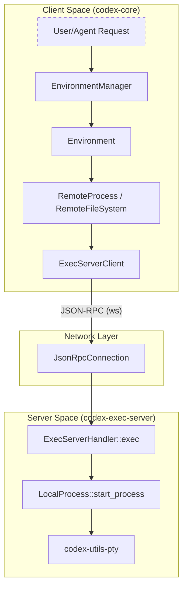
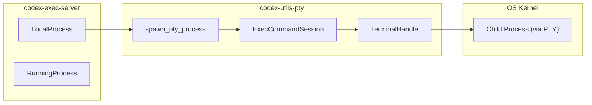

# Exec Server

Relevant source files

The following files were used as context for generating this wiki page:

- [codex-rs/app-server/src/config_manager.rs](codex-rs/app-server/src/config_manager.rs)
- [codex-rs/app-server/src/config_manager_service.rs](codex-rs/app-server/src/config_manager_service.rs)
- [codex-rs/app-server/src/config_manager_service_tests.rs](codex-rs/app-server/src/config_manager_service_tests.rs)
- [codex-rs/config/src/loader/mod.rs](codex-rs/config/src/loader/mod.rs)
- [codex-rs/config/src/loader/tests.rs](codex-rs/config/src/loader/tests.rs)
- [codex-rs/config/src/state.rs](codex-rs/config/src/state.rs)
- [codex-rs/core/src/environment_selection.rs](codex-rs/core/src/environment_selection.rs)
- [codex-rs/core/src/unified_exec/mod_tests.rs](codex-rs/core/src/unified_exec/mod_tests.rs)
- [codex-rs/core/src/unified_exec/process_tests.rs](codex-rs/core/src/unified_exec/process_tests.rs)
- [codex-rs/core/tests/suite/remote_env.rs](codex-rs/core/tests/suite/remote_env.rs)
- [codex-rs/exec-server/Cargo.toml](codex-rs/exec-server/Cargo.toml)
- [codex-rs/exec-server/README.md](codex-rs/exec-server/README.md)
- [codex-rs/exec-server/src/client.rs](codex-rs/exec-server/src/client.rs)
- [codex-rs/exec-server/src/client_api.rs](codex-rs/exec-server/src/client_api.rs)
- [codex-rs/exec-server/src/client_transport.rs](codex-rs/exec-server/src/client_transport.rs)
- [codex-rs/exec-server/src/connection.rs](codex-rs/exec-server/src/connection.rs)
- [codex-rs/exec-server/src/environment.rs](codex-rs/exec-server/src/environment.rs)
- [codex-rs/exec-server/src/environment_path.rs](codex-rs/exec-server/src/environment_path.rs)
- [codex-rs/exec-server/src/environment_provider.rs](codex-rs/exec-server/src/environment_provider.rs)
- [codex-rs/exec-server/src/environment_toml.rs](codex-rs/exec-server/src/environment_toml.rs)
- [codex-rs/exec-server/src/fs_helper.rs](codex-rs/exec-server/src/fs_helper.rs)
- [codex-rs/exec-server/src/fs_sandbox.rs](codex-rs/exec-server/src/fs_sandbox.rs)
- [codex-rs/exec-server/src/lib.rs](codex-rs/exec-server/src/lib.rs)
- [codex-rs/exec-server/src/local_file_system.rs](codex-rs/exec-server/src/local_file_system.rs)
- [codex-rs/exec-server/src/local_process.rs](codex-rs/exec-server/src/local_process.rs)
- [codex-rs/exec-server/src/process.rs](codex-rs/exec-server/src/process.rs)
- [codex-rs/exec-server/src/protocol.rs](codex-rs/exec-server/src/protocol.rs)
- [codex-rs/exec-server/src/relay.rs](codex-rs/exec-server/src/relay.rs)
- [codex-rs/exec-server/src/remote.rs](codex-rs/exec-server/src/remote.rs)
- [codex-rs/exec-server/src/remote_file_system.rs](codex-rs/exec-server/src/remote_file_system.rs)
- [codex-rs/exec-server/src/remote_process.rs](codex-rs/exec-server/src/remote_process.rs)
- [codex-rs/exec-server/src/rpc.rs](codex-rs/exec-server/src/rpc.rs)
- [codex-rs/exec-server/src/sandboxed_file_system.rs](codex-rs/exec-server/src/sandboxed_file_system.rs)
- [codex-rs/exec-server/src/server.rs](codex-rs/exec-server/src/server.rs)
- [codex-rs/exec-server/src/server/file_system_handler.rs](codex-rs/exec-server/src/server/file_system_handler.rs)
- [codex-rs/exec-server/src/server/handler.rs](codex-rs/exec-server/src/server/handler.rs)
- [codex-rs/exec-server/src/server/handler/tests.rs](codex-rs/exec-server/src/server/handler/tests.rs)
- [codex-rs/exec-server/src/server/process_handler.rs](codex-rs/exec-server/src/server/process_handler.rs)
- [codex-rs/exec-server/src/server/processor.rs](codex-rs/exec-server/src/server/processor.rs)
- [codex-rs/exec-server/src/server/registry.rs](codex-rs/exec-server/src/server/registry.rs)
- [codex-rs/exec-server/src/server/transport.rs](codex-rs/exec-server/src/server/transport.rs)
- [codex-rs/exec-server/src/server/transport_tests.rs](codex-rs/exec-server/src/server/transport_tests.rs)
- [codex-rs/exec-server/tests/common/exec_server.rs](codex-rs/exec-server/tests/common/exec_server.rs)
- [codex-rs/exec-server/tests/common/mod.rs](codex-rs/exec-server/tests/common/mod.rs)
- [codex-rs/exec-server/tests/exec_process.rs](codex-rs/exec-server/tests/exec_process.rs)
- [codex-rs/exec-server/tests/file_system.rs](codex-rs/exec-server/tests/file_system.rs)
- [codex-rs/exec-server/tests/initialize.rs](codex-rs/exec-server/tests/initialize.rs)
- [codex-rs/exec-server/tests/process.rs](codex-rs/exec-server/tests/process.rs)
- [codex-rs/exec-server/tests/relay.rs](codex-rs/exec-server/tests/relay.rs)
- [codex-rs/exec-server/tests/websocket.rs](codex-rs/exec-server/tests/websocket.rs)

The `codex-exec-server` crate provides a standalone JSON-RPC WebSocket server designed to manage subprocess execution and filesystem operations. It acts as a bridge between a Codex session and a potentially remote or sandboxed execution environment. By leveraging `codex-utils-pty`, it supports both interactive PTY-based sessions and non-interactive piped execution across different operating systems [codex-rs/exec-server/Cargo.toml:21-26]().

## Overview and Architecture

The Exec Server decouples the Codex agent's logic from the environment where code is executed. This is essential for supporting remote execution environments (e.g., cloud-based sandboxes) or local execution with strict security boundaries.

### Key Components
- **`ExecServerClient`**: The primary interface for clients to interact with a remote execution server via WebSockets [codex-rs/exec-server/src/lib.rs:27-27]().
- **`EnvironmentManager`**: A shared registry that manages the lifecycle of execution environments, creating local or remote `Environment` instances based on `CODEX_EXEC_SERVER_URL` or an `environments.toml` configuration [codex-rs/exec-server/src/environment.rs:41-46]().
- **`ExecBackend`**: A trait that abstracts the process of spawning and managing subprocesses, implemented by `LocalProcess` and `RemoteProcess` [codex-rs/exec-server/src/lib.rs:54-55]().
- **`ExecutorFileSystem`**: A trait providing filesystem operations (read, write, metadata), implemented locally or via RPC for remote servers [codex-rs/exec-server/src/lib.rs:36-36]().

### Natural Language to Code Entity Mapping: Execution Flow
The following diagram maps the conceptual "Run Command" request to the specific code entities involved in the dispatch and execution.

**Execution Dispatch Path**

**Sources:** [codex-rs/exec-server/src/environment.rs:148-156](), [codex-rs/exec-server/src/client.rs:163-172](), [codex-rs/exec-server/src/local_process.rs:149-152]().

## Wire Protocol and Handshake

Communication with the server occurs over WebSockets using a JSON-RPC 2.0 compatible protocol managed by `JsonRpcConnection` [codex-rs/exec-server/src/connection.rs:222-228]().

### 1. Initialize Handshake
Before any commands are executed, the client must send an `initialize` request. This establishes client identity and allows for session resumption [codex-rs/exec-server/src/protocol.rs:13-14]().
- **Request**: `InitializeParams` containing `client_name` and optional `resume_session_id` [codex-rs/exec-server/src/protocol.rs:55-61]().
- **Response**: `InitializeResponse` containing a unique `session_id` [codex-rs/exec-server/src/protocol.rs:63-67]().

### 2. Process Management RPCs
| Method | Params | Description |
| :--- | :--- | :--- |
| `process/start` | `ExecParams` | Spawns a new process (PTY or Pipe) [codex-rs/exec-server/src/protocol.rs:15-15](). |
| `process/read` | `ReadParams` | Long-polls for output from a specific process [codex-rs/exec-server/src/protocol.rs:16-16](). |
| `process/write` | `WriteParams` | Writes data to the `stdin` of a running process [codex-rs/exec-server/src/protocol.rs:17-17](). |
| `process/terminate` | `TerminateParams` | Kills a running process [codex-rs/exec-server/src/protocol.rs:19-19](). |

### 3. Notifications (Server to Client)
The server can stream process events back to the client:
- `process/output`: Contains `ExecOutputDeltaNotification` with raw bytes from `stdout` or `stderr` [codex-rs/exec-server/src/protocol.rs:20-20]().
- `process/exited`: Sent when the process terminates, including the exit code [codex-rs/exec-server/src/protocol.rs:21-21]().
- `process/closed`: Sent when the output streams are fully drained [codex-rs/exec-server/src/protocol.rs:22-22]().

**Sources:** [codex-rs/exec-server/src/protocol.rs:13-35](), [codex-rs/exec-server/src/local_process.rs:28-33]().

## Subprocess Execution (codex-utils-pty)

The `codex-exec-server` relies on `codex-utils-pty` for the low-level heavy lifting of process spawning.

### Execution Modes
1. **PTY Mode**: Used for interactive tools. Provides a full terminal environment via `codex-utils-pty` [codex-rs/exec-server/src/protocol.rs:97-97]().
2. **Pipe Mode**: Used for non-interactive commands. Captures `stdout` and `stderr` via standard OS pipes [codex-rs/exec-server/src/protocol.rs:99-100]().

**Entity Mapping: PTY Lifecycle**

**Sources:** [codex-rs/exec-server/src/local_process.rs:170-179](), [codex-rs/exec-server/src/connection.rs:145-150]().

## Filesystem RPCs

The server provides a comprehensive set of filesystem operations via the `ExecutorFileSystem` trait, allowing the Codex agent to manipulate the workspace even if it is running on a different machine.

| RPC Method | Parameters | Description |
| :--- | :--- | :--- |
| `fs/readFile` | `FsReadFileParams` | Reads file contents [codex-rs/exec-server/src/protocol.rs:24-24](). |
| `fs/writeFile` | `FsWriteFileParams` | Writes data to a file [codex-rs/exec-server/src/protocol.rs:25-25](). |
| `fs/createDirectory` | `FsCreateDirectoryParams` | Creates directories [codex-rs/exec-server/src/protocol.rs:26-26](). |
| `fs/getMetadata` | `FsGetMetadataParams` | Retrieves file metadata [codex-rs/exec-server/src/protocol.rs:27-27](). |
| `fs/readDirectory` | `FsReadDirectoryParams` | Lists directory contents [codex-rs/exec-server/src/protocol.rs:31-31](). |
| `fs/remove` | `FsRemoveParams` | Deletes files or directories [codex-rs/exec-server/src/protocol.rs:32-32](). |

**Sources:** [codex-rs/exec-server/src/protocol.rs:24-33](), [codex-rs/exec-server/src/client.rs:47-56]().

## Implementation Details

### Environment Selection
The `EnvironmentManager` determines the available backends by checking the `CODEX_EXEC_SERVER_URL` environment variable or `environments.toml` [codex-rs/exec-server/src/environment.rs:30-35]().
- **Local**: Uses `LocalProcess` and `LocalFileSystem` [codex-rs/exec-server/src/environment.rs:154-159]().
- **Remote**: Uses `RemoteProcess` and `RemoteFileSystem` which communicate via an `ExecServerClient` [codex-rs/exec-server/src/environment.rs:43-45]().

### Sandboxing Integration
The `FileSystemSandboxRunner` manages the execution of filesystem operations within a restricted environment [codex-rs/exec-server/src/fs_sandbox.rs:43-46](). It uses a `SandboxManager` to select and transform the execution request based on the `FileSystemSandboxContext` [codex-rs/exec-server/src/fs_sandbox.rs:88-96](). This context includes the `PermissionProfile` (e.g., `ReadOnly` or `Restricted`) and the target `WindowsSandboxLevel` [codex-rs/exec-server/src/fs_sandbox.rs:114-115]().

### ExecServerClient Implementation
The `ExecServerClient` uses an internal `RpcClient` to manage the JSON-RPC request-response lifecycle over a WebSocket [codex-rs/exec-server/src/client.rs:169-171](). It maintains a registry of active `sessions` (using `ArcSwap` for thread-safe access) to route incoming `process/output` notifications to the correct process-specific event log [codex-rs/exec-server/src/client.rs:175-178]().

### Remote Relay and Reliability
The server supports a relay mechanism for communication over unreliable networks or through rendezvous points.
- **Relay Protocols**: Implemented in `relay` and `relay_proto` modules [codex-rs/exec-server/src/lib.rs:17-18]().
- **Reliability**: The client implementation includes ordering logic in `OrderedSessionEvents` to handle out-of-order notifications (output, exit, closed) that might arrive from different server tasks [codex-rs/exec-server/src/client.rs:153-160]().

**Sources:** [codex-rs/exec-server/src/environment.rs:89-166](), [codex-rs/exec-server/src/fs_sandbox.rs:43-118](), [codex-rs/exec-server/src/client.rs:163-190]().
