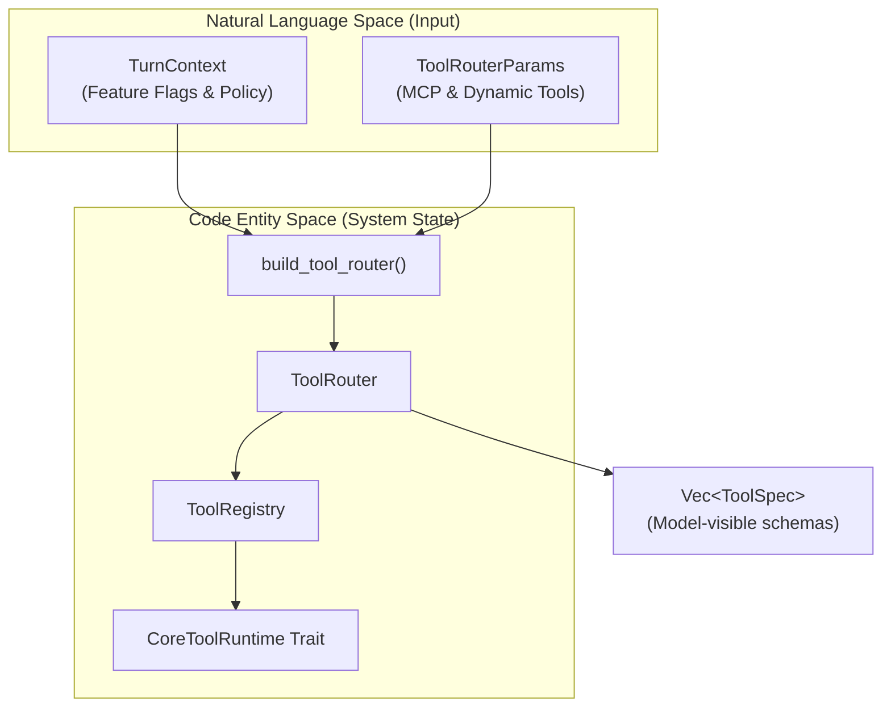
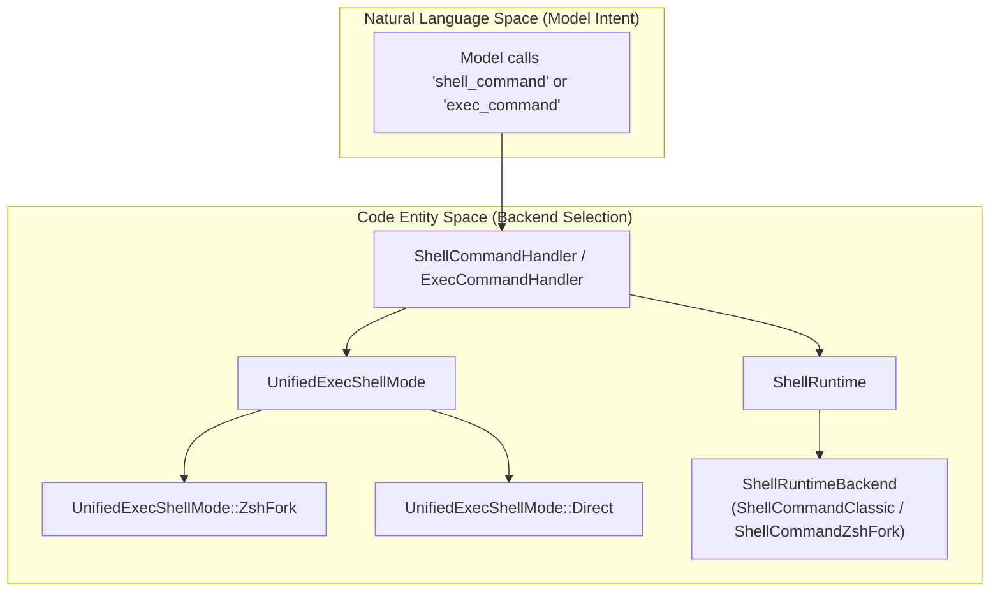

# Tool System

Relevant source files

The following files were used as context for generating this wiki page:

- [codex-rs/core/src/tools/events.rs](codex-rs/core/src/tools/events.rs)
- [codex-rs/core/src/tools/handlers/apply_patch.rs](codex-rs/core/src/tools/handlers/apply_patch.rs)
- [codex-rs/core/src/tools/handlers/shell.rs](codex-rs/core/src/tools/handlers/shell.rs)
- [codex-rs/core/src/tools/handlers/unified_exec.rs](codex-rs/core/src/tools/handlers/unified_exec.rs)
- [codex-rs/core/src/tools/handlers/view_image.rs](codex-rs/core/src/tools/handlers/view_image.rs)
- [codex-rs/core/src/tools/network_approval.rs](codex-rs/core/src/tools/network_approval.rs)
- [codex-rs/core/src/tools/orchestrator.rs](codex-rs/core/src/tools/orchestrator.rs)
- [codex-rs/core/src/tools/runtimes/apply_patch.rs](codex-rs/core/src/tools/runtimes/apply_patch.rs)
- [codex-rs/core/src/tools/runtimes/mod.rs](codex-rs/core/src/tools/runtimes/mod.rs)
- [codex-rs/core/src/tools/runtimes/mod_tests.rs](codex-rs/core/src/tools/runtimes/mod_tests.rs)
- [codex-rs/core/src/tools/runtimes/shell.rs](codex-rs/core/src/tools/runtimes/shell.rs)
- [codex-rs/core/src/tools/runtimes/unified_exec.rs](codex-rs/core/src/tools/runtimes/unified_exec.rs)
- [codex-rs/core/src/tools/sandboxing.rs](codex-rs/core/src/tools/sandboxing.rs)
- [codex-rs/core/src/turn_diff_tracker.rs](codex-rs/core/src/turn_diff_tracker.rs)
- [codex-rs/core/src/turn_diff_tracker_tests.rs](codex-rs/core/src/turn_diff_tracker_tests.rs)
- [codex-rs/core/src/unified_exec/mod.rs](codex-rs/core/src/unified_exec/mod.rs)
- [codex-rs/core/src/unified_exec/process_manager.rs](codex-rs/core/src/unified_exec/process_manager.rs)
- [codex-rs/core/tests/suite/unified_exec.rs](codex-rs/core/tests/suite/unified_exec.rs)
- [codex-rs/tools/Cargo.toml](codex-rs/tools/Cargo.toml)
- [codex-rs/tools/README.md](codex-rs/tools/README.md)
- [codex-rs/tools/src/dynamic_tool.rs](codex-rs/tools/src/dynamic_tool.rs)
- [codex-rs/tools/src/dynamic_tool_tests.rs](codex-rs/tools/src/dynamic_tool_tests.rs)
- [codex-rs/tools/src/json_schema.rs](codex-rs/tools/src/json_schema.rs)
- [codex-rs/tools/src/json_schema_tests.rs](codex-rs/tools/src/json_schema_tests.rs)
- [codex-rs/tools/src/lib.rs](codex-rs/tools/src/lib.rs)
- [codex-rs/tools/src/mcp_tool.rs](codex-rs/tools/src/mcp_tool.rs)
- [codex-rs/tools/src/mcp_tool_tests.rs](codex-rs/tools/src/mcp_tool_tests.rs)
- [codex-rs/tools/src/tool_definition.rs](codex-rs/tools/src/tool_definition.rs)
- [codex-rs/tools/src/tool_definition_tests.rs](codex-rs/tools/src/tool_definition_tests.rs)
- [codex-rs/tools/tests/fixtures/json_schema_policy/google_calendar.json](codex-rs/tools/tests/fixtures/json_schema_policy/google_calendar.json)
- [codex-rs/tools/tests/fixtures/json_schema_policy/google_drive.json](codex-rs/tools/tests/fixtures/json_schema_policy/google_drive.json)
- [codex-rs/tools/tests/fixtures/json_schema_policy/microsoft_outlook_email.json](codex-rs/tools/tests/fixtures/json_schema_policy/microsoft_outlook_email.json)
- [codex-rs/tools/tests/fixtures/json_schema_policy/notion.json](codex-rs/tools/tests/fixtures/json_schema_policy/notion.json)
- [codex-rs/tools/tests/fixtures/json_schema_policy/oversized_notion_create_page_input_schema.json](codex-rs/tools/tests/fixtures/json_schema_policy/oversized_notion_create_page_input_schema.json)
- [codex-rs/tools/tests/fixtures/json_schema_policy/slack.json](codex-rs/tools/tests/fixtures/json_schema_policy/slack.json)
- [codex-rs/tools/tests/json_schema_policy_fixtures.rs](codex-rs/tools/tests/json_schema_policy_fixtures.rs)

## Purpose and Scope

The Tool System manages the registration, configuration, orchestration, and execution of tools that the model can invoke during a conversation turn. It provides a unified framework for:

- **Tool registration and routing** based on feature flags and model capabilities via `ToolRouter` [codex-rs/core/src/tools/router.rs:34-37]() and `ToolRegistry` [codex-rs/core/src/tools/registry.rs:21748]().
- **Tool specification** using `ToolSpec` and `JsonSchema` for function parameters [codex-rs/tools/src/lib.rs:105-106]().
- **Tool orchestration** including parallel execution management and cancellation via `ToolCallRuntime` [codex-rs/core/src/tools/parallel.rs:31-37]().
- **Tool execution** through various handlers (Shell, Unified Exec, `apply_patch`, MCP, etc.) implementing the `CoreToolRuntime` trait [codex-rs/core/src/tools/registry.rs:48-51]().
- **Discovery and Dynamic Loading** of tools from MCP servers and plugin marketplaces via `ToolSearchHandler` [codex-rs/core/src/tools/handlers/tool_search.rs:23-27]() and `DynamicToolHandler` [codex-rs/core/src/tools/spec_plan.rs:10]().
- **Hook Integration** for intercepting tool lifecycles (Pre/Post tool use) to allow input rewriting or additional context injection [codex-rs/core/src/tools/registry.rs:69-112]().

For details on the tool registry, see [Tool Registry and Configuration](#5.1). For details on the PTY-backed interactive process system, see [Unified Exec Process Management](#5.3).

---

## Tool Registry and Configuration

The `ToolRouter` serves as the primary entry point for tool dispatch. It is constructed from `ToolRouterParams` which determines tool availability based on session parameters, MCP tools, and dynamic tools [codex-rs/core/src/tools/router.rs:39-45](). The `ToolRegistry` stores the mapping of `ToolName` to `CoreToolRuntime` executors [codex-rs/core/src/tools/registry.rs:48-51]().

**Diagram: Tool Configuration and Dispatch Flow**

Sources: [codex-rs/core/src/tools/router.rs:34-57](), [codex-rs/core/src/tools/spec_plan.rs:153-159](), [codex-rs/core/src/tools/registry.rs:48-51]()

### Parallel Execution
The system supports parallel tool calls. The `ToolRouter` checks if a tool supports parallelism via `tool_supports_parallel` [codex-rs/core/src/tools/router.rs:83-87](). Execution is managed by `ToolCallRuntime`, which uses a `RwLock` to coordinate access between parallel and sequential tools [codex-rs/core/src/tools/parallel.rs:115-119]().

For details, see [Tool Registry and Configuration](#5.1).

---

## Shell Execution Tools

Codex supports multiple shell execution backends. The `ShellCommandHandler` manages standard command execution [codex-rs/core/src/tools/handlers/shell.rs:32](), while `ExecCommandHandler` handles interactive sessions via the Unified Exec system [codex-rs/core/src/tools/handlers/unified_exec.rs:23](). Selection is influenced by `ShellCommandBackendConfig` [codex-rs/tools/src/lib.rs:71]().

**Diagram: Shell Tool Selection Logic**

Sources: [codex-rs/core/src/tools/handlers/shell.rs:32-58](), [codex-rs/core/src/tools/runtimes/shell.rs:74-86](), [codex-rs/tools/src/lib.rs:71-80]()

For details, see [Shell Execution Tools](#5.2).

---

## Unified Exec Process Management

The `UnifiedExecProcessManager` orchestrates interactive PTY (Pseudo-Terminal) sessions. This system allows the model to start a process and subsequently interact with it via `write_stdin` [codex-rs/core/src/unified_exec/mod.rs:133-136]().

### Process Management
- **Lifecycle**: Managed via `UnifiedExecProcessManager` and a `ProcessStore` which tracks active `UnifiedExecProcess` entries [codex-rs/core/src/unified_exec/mod.rs:121-131]().
- **Orchestration**: Uses the `ToolOrchestrator` to handle approvals and platform-specific sandboxing before spawning [codex-rs/core/src/unified_exec/mod.rs:5-10]().
- **Pruning**: Implements LRU pruning via `MAX_UNIFIED_EXEC_PROCESSES` to maintain system resources [codex-rs/core/src/unified_exec/mod.rs:72]().

Sources: [codex-rs/core/src/unified_exec/mod.rs:1-165](), [codex-rs/core/src/unified_exec/process_manager.rs:169-183](), [codex-rs/core/src/tools/runtimes/unified_exec.rs:96-100]()

For details, see [Unified Exec Process Management](#5.3).

---

## Apply Patch System

The `apply_patch` system is a specialized tool for file modifications.
- **Handlers**: Managed by `ApplyPatchHandler` which processes both freeform and structured patches [codex-rs/core/src/tools/handlers/apply_patch.rs:60-62]().
- **Streaming**: Supports `ApplyPatchArgumentDiffConsumer` to emit `PatchApplyUpdated` protocol events while the model is still streaming the patch content [codex-rs/core/src/tools/handlers/apply_patch.rs:71-83]().
- **Runtime**: The `ApplyPatchRuntime` executes verified patches under the orchestrator, ensuring sandboxing is enforced via `FileSystemSandboxContext` [codex-rs/core/src/tools/runtimes/apply_patch.rs:58-60]().

Sources: [codex-rs/core/src/tools/handlers/apply_patch.rs:1-135](), [codex-rs/core/src/tools/runtimes/apply_patch.rs:89-106]()

For details, see [Apply Patch System](#5.4).

---

## Tool Orchestration and Approval

The tool system centralizes logic for safety, specifically handling permissions and lifecycle hooks.

1. **Orchestration**: `ToolOrchestrator` handles the complex flow of checking approvals, selecting sandboxes, and retrying on denial [codex-rs/core/src/unified_exec/mod.rs:5-10]().
2. **Approvals**: The `Approvable` trait allows runtimes like `ShellRuntime` and `UnifiedExecRuntime` to define `ApprovalKey`s and trigger async approval requests [codex-rs/core/src/tools/runtimes/shell.rs:123-149]().
3. **Guardian Integration**: Runtimes can delegate review to the `Guardian` sub-agent via `review_approval_request` [codex-rs/core/src/tools/runtimes/unified_exec.rs:163-178]().

Sources: [codex-rs/core/src/tools/runtimes/shell.rs:123-187](), [codex-rs/core/src/tools/runtimes/unified_exec.rs:134-180](), [codex-rs/core/src/tools/orchestrator.rs:1-20]()

For details, see [Tool Orchestration and Approval](#5.5).

---

## Tool Event Emission and Output

Tool execution progress and results are communicated back to the session via the `ToolEmitter` [codex-rs/core/src/tools/events.rs:122]().

- **Event Lifecycle**: Emitters handle `Begin`, `Success`, and `Failure` stages [codex-rs/core/src/tools/events.rs:54-61]().
- **Unified Exec Watcher**: Uses `async_watcher` to monitor PTY output and process exit, emitting events like `ExecCommandEnd` [codex-rs/core/src/unified_exec/process_manager.rs:42-45]().
- **Output Truncation**: Policies like `TruncationPolicy` ensure that massive tool outputs do not exceed token budgets [codex-rs/core/src/unified_exec/mod.rs:69-71]().

Sources: [codex-rs/core/src/tools/events.rs:1-200](), [codex-rs/core/src/unified_exec/process_manager.rs:42-52](), [codex-rs/core/src/unified_exec/mod.rs:69-71]()

For details, see [Tool Event Emission and Output](#5.7).

---

## Skills and Plugins

The tool system is extensible via external protocols and discovery:
- **MCP**: External tools are integrated via the Model Context Protocol, using `mcp_tool_to_responses_api_tool` to bridge model calls [codex-rs/tools/src/lib.rs:63]().
- **Tool Search**: The `TOOL_SEARCH_TOOL_NAME` allows the model to find relevant tools from a large registry [codex-rs/tools/src/lib.rs:91]().
- **Plugins**: Managed via `REQUEST_PLUGIN_INSTALL_TOOL_NAME` and `LIST_AVAILABLE_PLUGINS_TO_INSTALL_TOOL_NAME` [codex-rs/tools/src/lib.rs:86-88]().

Sources: [codex-rs/tools/src/lib.rs:1-107](), [codex-rs/core/src/tools/handlers/view_image.rs:70-76]()

For details, see [Skills System](#5.9), [Plugins System](#5.11), and [Model Context Protocol (MCP)](#6).
